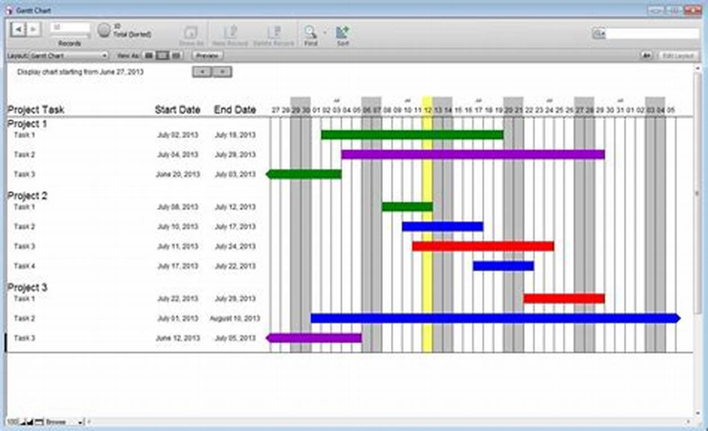
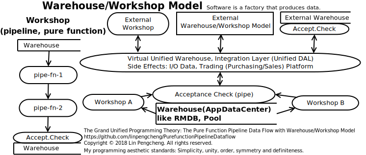
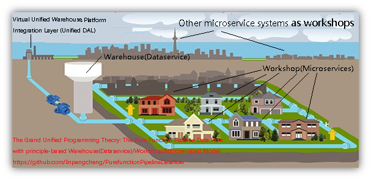
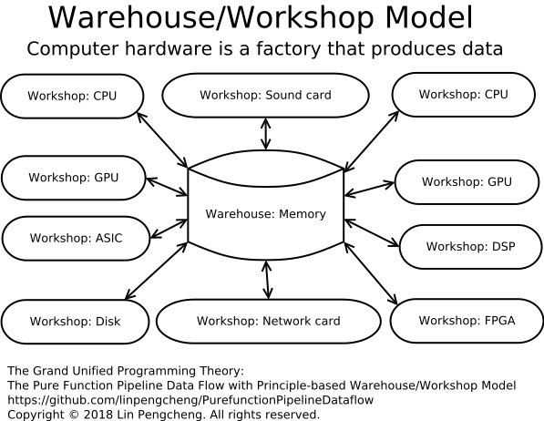
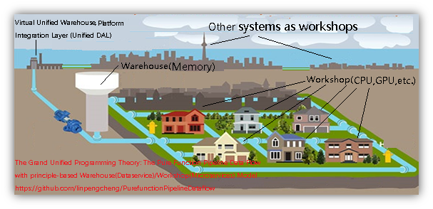
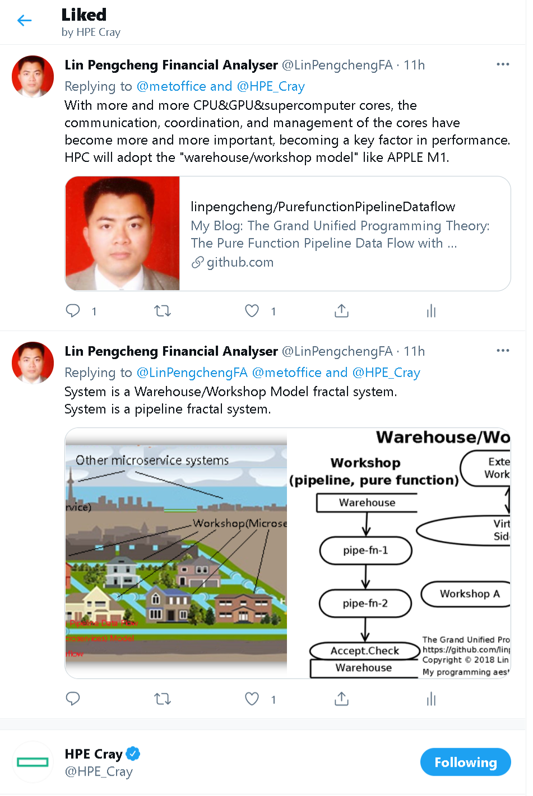
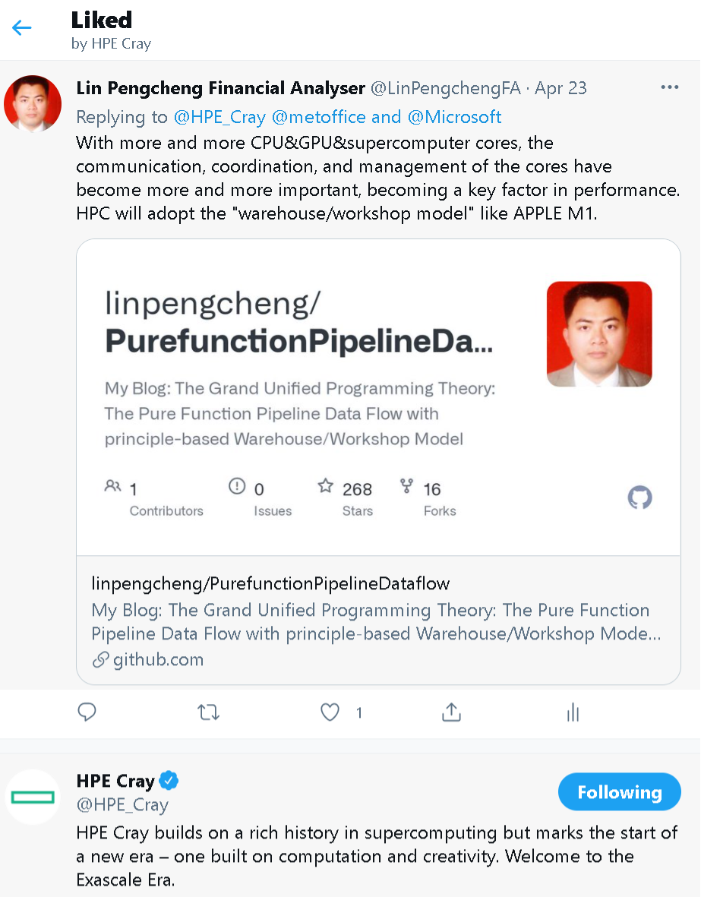
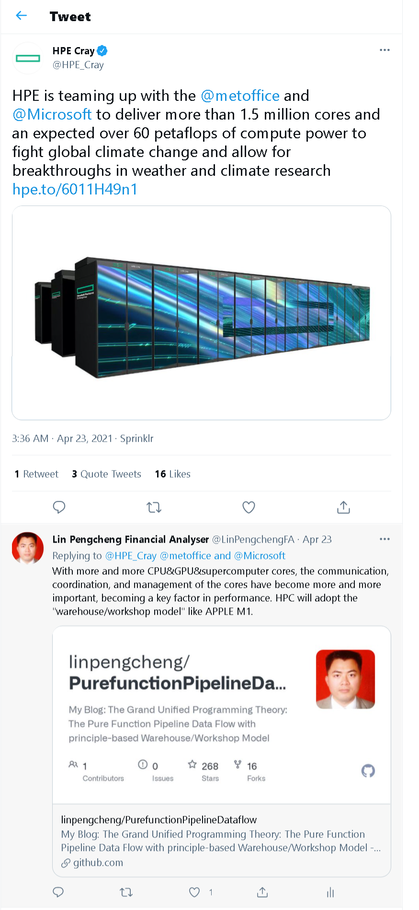
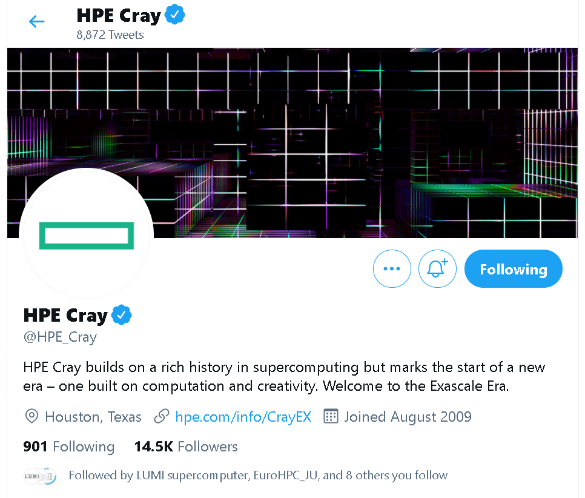

[goto Chinese edition (中文版)](./Readme_Chinese.md)

# The Grand Unified Programming Theory: The Pure Function Pipeline Data Flow with Principle-based Warehouse/Workshop Model

Copyright © 2018 Lin Pengcheng. All rights reserved.

It's a `Arctic Code Vault Repository` in the [`2020 GitHub Archive Program`.](https://archiveprogram.github.com/)

## Table of Contents
- [Key innovative ideas (for TL;DR)](#Key-innovative-ideas)
- [My and Other People's Related Views](#My-and-Other-Peoples-Related-Views)
- [Summary](#Summary)
- [5 basic pure function pipeline data flow components](#Five-basic-pure-function-pipeline-data-flow-components)
  - [1. Pipeline Component (forward flow)](#1-Pipeline-Component)
  - [2. Conditional Branch](#2-Conditional-Branch)
  - [3. Feedback circuit (reflow, whirlpool, recursive)](#3-Feedback-Circuit)
  - [4. Shunt (concurrent, parallel)](#4-Shunt)
  - [5. Confluence(reduce)](#5-Confluence)
- [Code Example](#Code-example)
- [Classical Model](#Classical-Model)
- [Warehouse/Workshop Model](#Warehouse-Workshop-Model)
  - [Overview of the model](#Overview-of-the-model)
  - [10 Principles of the model](#Principles-of-the-model)
    - [Division of tasks](#Division-of-tasks)
    - [Single Leader and Unified Scheduling](#Single-Leader-and-Unified-Scheduling)
    - [Empowerment and Management by Objective](#Empowerment-and-Management-by-Objective)
    - [Single form (pipeline fractal system)](#Single-form)
    - [Concentration and decentralization](#Concentration-and-decentralization)
    - [Level chain](#Level-chain)
    - [Definiteness](#Definiteness)
    - [Order](#Order)
    - [Standardization](#Standardization)
    - [Exception handling](#Exception-handling)
  - [Framework code of the model](#Framework-code-of-the-model)
  - [Everything is unified](#Everything-is-unified)
    - [The unification of `programming technology` and `system architecture`](#The-unification-of-programming-technology-and-system-architecture)
    - [The unification of `single-threaded`, `multi-threaded`, `asynchronous` and `distributed`](#The-unification-of-single-threaded-and-multi-threaded-and-asynchronous-and-distributed)
      - [async/await, Project Loom fiber, Gantt Chart, and Scientific Management](#async)
      - [The unification of `Microservice` and `Intelligent-thread`](#The-unification-of-Microservice-and-Intelligent-thread)
    - [The unification with `Information System Integration Model`](#The-unification-with-Information-System-Integration-Model)
    - [The unification with `Microkernel Architecture`](#The-unification-with-Microkernel-Architecture)
    - [The unification with `AOP`](#The-unification-with-AOP)
    - [The unification with `Event-driven Architecture`](#The-unification-with-Event-driven-Architecture)
    - [The unification with `Computer Hardware Architecture`](#The-unification-with-Computer-Hardware-Architecture)
      - [Intro](#Intro)
      - [The out-of-order execution technology of modern CPUs is a mistake on February 16, 2021](#The-out-of-order-execution-technology-of-modern-CPUs-is-a-mistake-on-February-16-2021)
      - [Follower Case: Apple M1 chip](#Follower-Case-Apple-M1-chip)
      - [Why my "warehouse/workshop model" can achieve high performance and low power consumption (take Apple M1 chip, Intel AVX-512, Qualcomm as examples)](./doc/why_wwmodel_fast_en.md)
      - [Forecast on 2021-01-19](#Forecast-on-2021-01-19)
      - [HPE Cray Supercomputer likes it at twitter in 2021-04](#HPE-Cray-Supercomputer-likes-it-at-twitter-in-2021-04)
    - [The unification with `Integrated Circuit System`](#The-unification-with-Integrated-Circuit-System)    
    - [The unification with `Programming Language Platform`](#The-unification-with-Programming-Language-Platform)    
    - [The unification with `Clojure Web Application Model`](#The-unification-with-Clojure-Web-Application-Model)    
    - [The unification with `Lifecycle Management`](#The-unification-with-Lifecycle-Management)
    - [The unification with `classic AI, modern AI, and explainable AI technology`](#The-unification-with-classic-AI-and-modern-AI-and-explainable-AI-technology)
      - [Explainable AI System use the law model and the Warehouse/Workshop Model on 2021-04-30](#Explainable-AI-System)
      - [Robots and transformers on 2021-02-02](#Robots-and-transformers)
    - [The unification with `energy system`](#The-unification-with-energy-system)
    - [The unification with `modern economic and social operating system`](#The-unification-with-modern-economic-and-social-operating-system)
    - [The unification with `Other Models`](#The-unification-with-Other-Models)    
  - [Warehouse/Workshop Model Summary](#Warehouse-Workshop-Model-Summary)    
- [The difference between it and others](#The-difference-between-it-and-others)
  - [Disadvantages of FP and OO](#Disadvantages-of-FP-and-OO)
  - [The difference between it, Data-oriented, Data-driven](#The-difference-between-it-Data-oriented-Data-driven)
  - [The difference between it and Microsoft Azure DataFactory/DataPipelines Architecture](#The-difference-between-it-and-Microsoft-Azure-DataFactory-DataPipelines-Architecture)
  - [The difference between it and Flow-based programming (FBP)](#The-difference-between-it-and-Flow-based-programming)
  - [The difference between it and middleware](#The-difference-between-it-and-middleware)
  - [The difference between it and Rx](#The-difference-between-it-and-Rx)
  - [The difference between it and traditional unix-like pipe operator in FP language](#The-difference-between-it-and-traditional-unix-like-pipe-operator-in-FP-language)
- [Basic quality control](#Basic-quality-control)
- [Programming Aesthetics](#Programming-Aesthetics)
- [Tao](#Tao)
- [Killer Application](#Killer-Application)
  - [Software Design and Develop Automation (SDDA)](#Software-Design-and-Develop-Automation)
  - [Computer Hardware Architecture, Follower: Apple M1 chip](#Follower-Case-Apple-M1-chip)
  - [Explainable AI System use the law model and the Warehouse/Workshop Model](#Explainable-AI-System)
  - [Robots and transformers on 2021-02-02](#Robots-and-transformers)
- [Great Historical Significance](#Great-Historical-Significance)
- [Postscript](#Postscript)
  - [Imagination](#Imagination)
  - [Ever-changing](#Ever-changing)
  - [Simplicity](#Simplicity)
  - [The easiest way to learn](#The-easiest-way-to-learn)
  - [Principles-based are better than rules-based](#Principles-based-are-better-than-rules-based)
  - [Eating your own dog food](#Eating-your-own-dog-food)
  - [Computer science is essentially a management science, and vice versa.](#Computer-science-is-management-science)
  - [Clojure officially advocates pipeline programming in 2021](#Clojure-officially-advocates-pipeline-programming-in-2021)
  - [End message](#End-message)
- Appendix:
  - [(Chinese) Simplicity and Unity ---- Grand Unified Theory, Lisp(Clojure) and Pure Function Pipeline Dataflow](doc/Simplicity_and_Unity.md)
  - [Clojure is a FP based on RMDB.](doc/Clojure_is_FP_based_on_RMDB.md)
  - [Everything is RMDB.](doc/Everything_is_RMDB.md)
  - [Implement relational data model and programming based on hash-map (NoSQL)](doc/relational_model_on_hashmap.md)
  - [Markdown Literate Programming that don't break the syntax of any programming language](doc/markdown_literary_programming.md)
  - [Other Articles Table of Contents](#Other-Articles-Table-of-Contents)

----

## Key innovative ideas

- [Software and hardware are factories that manufacture data, 
  so they have the same "warehouse/workshop model" and management methods 
  as the manufacturing industry.](#Warehouse-Workshop-Model)

- [Software and hardware are a unified architecture: "warehouse/workshop model".](#The-unification-with-Computer-Hardware-Architecture)
  - From a static point of view, it is a star.
  - From the perspective of dynamic runtime, it is a dynamic tree Gantt chart, like a rushing river system. 
  - the "Warehouse/Workshop Model" will surely replace the "von Neumann architecture" 
    and become the first architecture in the computer field, 
    and it is the first architecture to achieve a unified software and hardware.
    - [Follower: Apple M1 chip](#Follower-Case-Apple-M1-chip)
    - [HPE Cray Supercomputer likes it twice at twitter in 2021-04](#HPE-Cray-Supercomputer-likes-it-at-twitter-in-2021-04)

- [The scheduler (scheduling function) dynamically plans the order of completion of tasks 
  according to the Gantt chart algorithm, and calls the workshop to complete the assigned tasks. 
  This approach is the most efficient, and there is no resource competition and transaction conflict.](#Single-Leader-and-Unified-Scheduling)

- [From the perspective of system architecture, it is a warehouse/workshop model fractal system.](#Overview-of-the-model)
  - [10 Principles of the model](#Principles-of-the-model)

- [From the component point of view, it is a pure function pipeline fractal system.](#Single-form)
  - [5 basic pure function pipeline data flow components](#Five-basic-pure-function-pipeline-data-flow-components)
  - [An interconnected pipeline world based on a fully standardized data interface .](#Standardization)
  - [Like EDA, it is integrated and automated that the design and development of software and hardware.](#Software-Design-and-Develop-Automation)

- [5 Aesthetics: In the IT field, only it and binary system fully comply with these 5 aesthetics.](#Programming-Aesthetics)

- [The unification with `classic AI, modern AI, explainable AI, and law model`](#The-unification-with-classic-AI-and-modern-AI-and-explainable-AI-technology)

- [Basic quality control: Like the manufacturing industry, Non-IT professionals can also perform basic quality control.](#Basic-quality-control)
  
## My and Other Peoples Related Views

```
Keep it Simple and Unified.
        ---- Lin Pengcheng

NASA’s 10 rules for writing mission-critical code: 
1.Restrict all code to very simple control flow constructs.
        ---- Gerard J. Holzmann, NASA JPL lead scientist.
        
Minimize control flow complexity and "area under ifs", 
favoring consistent execution paths and times over "optimally" avoiding unnecessary work.
        ---- John Carmack

Clojure Aphorism: A tangled web of mutation means any change to 
your code potentially occurs in the large. 
        ---- The Joy of Clojure (2nd Edition, Chapter 10)
        
Bad programmers worry about the code. 
Good programmers worry about data structures and their relationships.
        ---- Linus Torvalds
        
Data dominates. If you’ve chosen the right data structures and organized things well, 
the algorithms will almost always be self-evident. 
Data structures, not algorithms, are central to programming. 
        ---- Rob Pike
        
It’s better to have 100 functions operate on one data structure 
than 10 functions on 10 data structures.        
        ---- Alan Perlis
             the first recipient of the Turing Award (1966)
             A founding father of Computer Science as a separate discipline
             
Show me your flowcharts and conceal your tables, 
and I shall continue to be mystified. Show me your tables, 
and I won’t usually need your flowcharts; they’ll be obvious.
        ---- Fred Brooks, Turing Award (1999), The Mythical Man-Month
           
Even the simplest procedural logic is hard for humans to verify, 
but quite complex data structures are fairly easy to model and reason about. 
...
Data is more tractable than program logic. It follows that where you see a choice 
between complexity in data structures and complexity in code, choose the former. 
More: in evolving a design, you should actively seek ways to shift complexity from code to data.
        ---- Eric Steven Raymond, The Art of Unix Programming, Basics of the Unix Philosophy
        
Metaphors for a Richer Understanding of Software Development.
        ---- The most valuable chapter of "Code Complete": Chapter 2
        
Principles-based are better than rules-based.
        ----International Accounting Standards        
```

## Summary

Using the input and output characteristics of pure functions, pure functions are used as pipelines.
Dataflow is formed by a series of pure functions in series.
A dataflow code block as a function, equivalent to an integrated circuit element (or board)。
A complete integrated system is formed by serial or parallel dataflow.

Can also be said, Data and logic are strictly separated, 
Element level separation of data and logic, data stream processing.

```clojure
(defn f [[evens odds total amax amin] x]
  (let [[evens odds] (cond 
                       (even? x) [(inc evens ) odds]
                       (odd? x)  [evens (inc odds)]
                       :else     [evens odds])
        total (+ total x)
        amax  (max amax x)
        amin  (min amin x)]   
     [evens odds total amax amin]))

(reduce f [0 0 0 ##-Inf ##Inf] [5 6 8 -3 -9 11 156 6 7])

;;[4 5 187 156 -9]
```

For me, programming is the process of designing a data model that is simple and fluent in manipulation. 
More than 80% functions of my project is `->>` threading macro code block, 
each step is simple, verifiable, replaceable, testable, pluggable, extensible,
and easy to implement multithreading. 
The clojure threading macro provides language-level support for PurefunctionPipeline&Dataflow.

The sea sails by the helmsman and the programming moves toward the data. Initial state, final state, 
the shortest linear distance between two points. Simplicity is the root of fast, stable and reliable. 

```
Those who are good at war have no surprising victory, no reputation for wisdom, no honor for courage.
        ---- Sun Wu, The Art of War
             Famous Chinese military and politician, 
             sage of military science, 
             ancestor of Eastern military science
```

The design philosophy of industrial pipeline and pure function pipeline data flow is the same. 
In essence, they are: "Towards the goal, Step by step, every step moves forward to the final goal 
until the final goal is reached." Therefore, its success is inevitable, not surprising, the process is a simple repetition.
After using this method proficiently, it is a simple and repeated boring technique. 
This is the simplicity and repetition pursued by large industrial production lines.

## Five basic pure function pipeline data flow components

### 1 Pipeline Component

Pipeline Component (forward flow)

Pipe functions are pure functions. 
A `->>` block function is equivalent to 
an integrated circuit component (or board). 

- Side effects
  - Most of the functions in a `->>` block are pure functions.
  - A data flow has at most two functions with side effects 
    and only at the beginning and the end.
  - In the `warehouse/workshop model`, the side effects are 
    handled by the dedicated IO department 
    (purchasing department, sales department). 
    Therefore, all workshops (pipes) are pure functions, 
    only interact with the warehouse 
    and are scheduled by the warehouse.  
    
- Parameter
  - Check and standardize the data at the entrance, 
    and then run at the extreme speed, which is simple, 
    smooth, stable and efficient.
  - In Clojure language, it is recommended to design the 
    function as a hash-map type single parameter function 
    as much as possible.
    - Like most functions of the R language, 
      many named parameters with default values can be 
      designed, which has strong scalability.
    - Clojure has many core functions for operating hash-map, 
      which is very convenient.  
    - It is not necessary to write parentheses when using 
      the `->>` macro. In this way, Clojure becomes the 
      programming language with the fewest parentheses :-)
    - Parameter formation, verification, transformation 
      and function call integration, one-stop data flow processing.  
    - Clojure is easy to deconstruct, and it is as convenient 
      to use as multi-parameter functions.
    - See also: [Principles: Concentration and decentralization](#Concentration-and-decentralization)

```clojure
(defn f [x]
  (->> x
       f1
       f2))
```

```clojure
(defn f [{:keys [x y] :as m}]
  (->> x
       (f1 y ,)
       f2))
```

```clojure

; R language style functions: 
; - multiple named parameters
; - the parameters can be out of order when calling the function
; - most of the parameters have default values

(def ^:pravite defa-opt-map {:a 0 :b 9})

(defn f [opt-map]
  (let [opt-map (merge defa-opt-map opt-map)
        {:keys [a b c]} opt-map]
    ; doing something
    [a b c opt-map]))

(f {:a 3 :c 15})
;=> [3 9 15 {:a 3, :b 9, :c 15}]  

;opt-map can provide both unix and windows 
;style parameters at the same time, and the 
;performance loss is negligible.
;dos style copy
(def ^:private defa-opt-map
  {:src  ""   :dest ""
   :A    nil  :B    nil
   :D    nil  :L    nil
   :V    nil  :N    nil  
   :Y    nil  :Z    nil
   :target nil})
(defn copy 
  ([opt-map]
    (->> (merge defa-opt-map opt-map)
         ;do sth.
         ))
  ([src dest]
    (->> (assoc defa-opt-map 
                :src src 
                :dest dest)
         copy)))

```

### 2 Conditional Branch

A (cond) or (if) block as a function.

```clojure
(defn f [x]
  (cond
    (= x 1) (f1)
    (= x 2) (f2)
    :else   (f3)))
```
```clojure
(defn f2 [x y]
  (-> (> x 2)
      (and , (< y 6))
      (if , 25 30)))
```
```clojure
(defn path-combine [s1 s2]
  (cond
    (string/starts-with? s2 "/") 
      s2
    (not (string/ends-with? s1 "/"))
      (-> (string/split s1 #"[\\/]")
          butlast
          (#(string/join "/" %))
          (str , "/")
          (path-combine , s2)) 
    :else  
      (-> (string/join "/" [s1 s2])
          (string/replace ,  #"[\\/]+" "/")))) 
```

### 3 Feedback Circuit

Feedback circuit (reflow, whirlpool, recursive): 
A tail recursive function is equivalent to a feedback circuit. 

Note: The map is batch processing. it can be regarded as similar to a queue of tourists. 
Repeating the ticket checking action at the entrance is a forward action, 
not feedback or reflow.

```clojure
(defn f [i]
  (if-not (zero? i)
    (f1)
    (-> i dec recur)))
```

### 4 Shunt

Shunt（concurrent，parallel）,
For example: data partitioning, parallel processing

```clojure
(->> data
     (partition n ,)
     (pmap f ,))
```
```clojure
(->> [pipe-f1 pipe-f2 pipe-f3]
     (pmap #(% data) ,))
```

### 5 Confluence

Confluence（reduce）: reduce the result of the shunt

```clojure
(->> data
     (partition n ,)
     (pmap f1 ,)
     (reduce f2 ,))   
```

## Code example

### Code example 01

```clojure
;Traditional expression, chaotic logic, unreadable.
(if (and (> x1 x2)
         (or (< x3 x4) 
             (and (or (> y1 y2) 
                      (< y3 y4))
                  (not= x5 x6)))
         (keyword? x7)) 
  :t
  :f)

;Pure Function Pipeline Dataflow
;Unrestricted expression, just read in order. 
;Closer to the order of execution of the machine.
(->  (> y1 y2)
     (or  , (< y3 y4))
     (and , (not= x5 x6))
     (or  , (< x3 x4))
     (and , (> x1 x2))
     (and , (keyword? x7))       
     (if  , :t :f))
```

### Code example 02

```clojure
(def data
  {:a [[:b :c :d]
       [:e :f :g]
       [:h :i :j]]
   :k [[:l :m :n]
       [:o :p :q]
       [:r :s :t]]})

(defn f1 [[k v]]
  (let [[h & t] v
        f   (fn [x] (mapv #(vector :td %) x))
        tds (map #(->> % f (into [:tr] ,)) t)]
     (->> (f h)
          (into [:tr [:td {:rowspan (count v)} k]] ,)
          (conj tds ,))))

(->> data
     (reduce #(->> %2 f1 (into %1 ,)) [:tbody] ,)
     (conj [:table] ,)
     hiccup/html)
     
; hiccup DSL

[:table 
  [:tbody 
    [:tr [:td {:rowspan 3} :a] 
         [:td :b] 
         [:td :c] 
         [:td :d]] 
    [:tr [:td :e] 
         [:td :f] 
         [:td :g]] 
    [:tr [:td :h] 
         [:td :i] 
         [:td :j]] 
    [:tr [:td {:rowspan 3} :k] 
         [:td :l] 
         [:td :m] 
         [:td :n]] 
    [:tr [:td :o] 
         [:td :p] 
         [:td :q]] 
    [:tr [:td :r] 
         [:td :s]
         [:td :t]]]]     
```

HTML Table:

<table>
    <tbody>
       <tr><td rowspan=3>a</td>
           <td>b</td>
           <td>c</td>
           <td>d</td></tr>
       <tr><td>e</td>
           <td>f</td>
           <td>g</td></tr>
       <tr><td>h</td>
           <td>i</td>
           <td>j</td></tr>
       <tr><td rowspan=3>k</td>
            <td>l</td>
            <td>m</td>
            <td>n</td></tr>
       <tr><td>o</td>
            <td>p</td>
            <td>q</td></tr>
       <tr><td>r</td>
            <td>s</td>
            <td>t</td></tr>
    </tbody>
</table>

### Code example 03

See also: 
- [Implement relational data model and programming based on hash-map (NoSQL)](doc/relational_model_on_hashmap.md)
- [Babashka Script: Notepad++ Markdown Literary Programming with live preview for Clojure that don't break the syntax of any programming language](https://github.com/linpengcheng/ClojureBoxNpp/blob/master/Notepad++/tools/clj/mlp.clj)
- [Babashka Script: Notepad++ Edit Clojure hiccup (HTML DSL) with live preview](https://github.com/linpengcheng/ClojureBoxNpp/blob/master/Notepad%2B%2B/tools/clj/hiccup2html.clj)

## Classical Model

```
The true sign of intelligence is not knowledge but imagination (analogy).
      ---- Albert Einstein
```

Analogy is an application of algebraic thinking. An analogy may not be established in the real world, 
but it must be established in the virtual software world,
it is very easy to map an old model to a new model and upgrade according to the standard specifications of the new model.
In management, it is called "merger by absorption". 

This is a typical application of the philosophy of the `Tao` and the `Grand Unified Theory`.

- data-flow is current-flow, function is chip, thread macro (->>, -> etc.) is a wire, 
  and the entire system is an integrated circuit that is energized.

- Data (flow) is raw material (flow), pure function is machine, 
  the thread macro (->>, -> etc.) is the conveyor belt, 
  and the entire system is a large industrial pipeline.

- Communication modes, data signals and control signals (annotations or metadata) flow through the pipeline.

- The compiler is essentially a data transformation, starting with the source code, 
  through a series of pure function pipeline transformation optimization, up to the machine code. 
  It's very easy to insert enhanced optimizations or features, and parallel compilation is also very simple.

- Urban water network

- Management Science is the best and most vivid treasure trove of computer science
  (algorithm, architecture, asynchronous, parallel, distributed and etc.).
  My programming approach is a fusion of “Functional Programming” and “Management Science”. 
  It has an added benefit，It is very helpful for the communication 
  between the information technology department and the management of the company.
  
  - The **Gantt chart** in management science, with the timeline as the main axis, multiple data flows running in parallel. 
    It is also a good data flow , parallel and asynchronous programming tool. 
    
  - Parallel: Large industrial pipelines can be expanded linearly in parallel.
  
  - Distributed: group company model, total branch model, parent-subsidiary model, holding company model, etc.
  
  - Architecture (Organizational Structure): 
    - Pyramid: Classic top-down modular design
    - Flat: The Pure Function Pipeline Data Flow
    - Matrix: AOP (Aspect-Oriented Programming)
    - Business Process Outsourcing (BPO): Functional programming (FP), Not only does FP use its own department 
      functions to complete tasks, but there are also non-working departments such as higher-order functions, 
      but it can delegate tasks to outsourced company functions as parameters.
            
      ```clojure
      (own-department-function  task-list)

      (apply outsourced-company-function task-list)
      ```

    - Chaos P2P (peer to peer): OOP (Object-Oriented Programming)
    
  - OS or Resource Management: ERP
  
  - Type system: Industrial standard system (ISO standard, national standard, industry standard, enterprise standard), 
    The Pure Function Pipeline Data Flow is suitable for the implementation of product specification (data specification) 
    industry standard system, Just like the computer hardware interface standard specification, Hardware is a function, 
    interface is a data standard specification. Data is transferred between hardware (functions).
    - See also: [Principles: Standardization](#Standardization)
    
  - Storage Management(buffers, caches, databases, etc.): Inventory management
  
  - In a large business, `process first thinking` is based on the credential(evidence). This credential is data.
    Credentials (data) flow through the nodes in the process to form a dataflow.
    Every node in the process is a pipe-function (pure function).
    This is the `Pure Function Pipeline Data Flow`.
    
  - Boeing aircraft pulse production line technology, just like confluence technology of rivers from the source to the sea. 
    It's also a variant of the **Gantt Chart**.
    - See also: [Principles: Order](#Order)
       
 

 

<h2 id="Warehouse-Workshop-Model">Warehouse/Workshop Model</h2>



 



### Overview of the model

- Warehouse
  
  - It is a special pipeline, a container for all resources 
    (status, data, and functions are also data). 
    It has two special side-effect pipelines (I/O) 
    that are connected to the outside world.
  
  - It has a scheduler, the warehouse scheduler and 
    the workshop are **1: n relationship**, 
    the warehouse scheduler uses Gantt chart algorithm 
    to dynamically plan and schedule the workshop 
    to complete tasks for global optimization.
    
  - It may not have an ordinary workshop, 
    at this time it is just a data center 
    (warehousing industry).
    
  - It can have no container, at this time it is just a dispatch center 
    (Virtual Unified Warehouse, integration layer or platform, the parent company of the enterprise group).
    - Its workshops are all lower-level warehouses/workshop models (subsidiaries). 
      It does not directly schedule the resources of the sub-models (subsidiaries), 
      but indirectly schedule them through the schedulers of the sub-models (subsidiaries), 
      simplifying the scheduling system. 
      Ensure the independence of the sub-model (subsidiary). 
      Enhance the certainty and predictability of the execution path, time, and results.
    - Conducive to promoting the adjustment of the architecture.
    - Conducive to the formation of group advantages and comprehensive functions, 
      and enhance the integration of the system.
    - Conducive to professional collaboration.
    - Conducive to achieving economies of scale.
    - Conducive to improving the level of dispatch.
    - Conducive to improving the efficiency of resource utilization 
      and promoting the optimal allocation of resources.

- Workshop
  
  It is an independent unit that performs tasks within the system.
  each workshop is an independent pipeline with a single function.
  they are small, simple and clear.
  
  - It is a larger execution unit than a data pipeline 
    and consists of a series of data pipelines.
  - There is no interaction between the workshops, 
    and each workshop is only uniformly scheduled by the warehouse.
  - It is the atomic unit when dividing independent tasks, 
    corresponding to a bar of the Gantt chart.
  - It can have no warehouse, at this time it is just a microservice 
    (service industry).  
  
- Warehouse/Workshop Model
  
  - From a static point of view, it is a star.

  - From the perspective of dynamic runtime, it is a dynamic tree Gantt chart, like a rushing river system. 

If you understand that software is a factory that produces data, 
then you can understand the warehouse/workshop model, 
understand the separation of production lines (pure functions, pipelines, workshop) and production materials (data), 
and continuous production on the production line forms a data flow.

The basic principle of the system is similar to an in-memory database system. 
like  the in-memory database, all tasks of the system are completed by scheduling stored procedure (workshop),  
and all side effects (similar to persistence, distributed, etc.) are completed by the in-memory database.

- **Everything is a pipeline**: the perfect way to achieve the simplicity and unity of the software ecosystem.

  - **Pipeline combination**: The cascade of `simple pipelines` forms a `workshop pipeline`
  
  - **Workshop combination**
  
    - Parallel independent `workshop pipelines` 
      form `warehouse/workshop model pipelines (data factory)` 
      through `warehouse` collaboration (scheduling).
    - The `workshop pipeline` can be used as a `packaged integrated pipeline (integrated chip)` 
      to independently provide services to the outside world, which is a microservice or service industry.
    - All workshops are independent black boxes (pure function), 
      it does not need to know where the data comes from 
      and where it is going, It only needs to complete its functions
      according to the data assigned to it by the warehouse.
    - They are all independent and can be safely paralleled.
  
  - **Warehouse**
  
    - It can provide services as an independent entity, which is a warehousing industry or database server.

    - The warehouse uses the best algorithm of the Gantt chart 
      to arrange the workshop to complete tasks according to 
      the status changes (such as orders, etc.).

    - The warehouse saves the global state. If the system fails, 
      it is easy to find the fault by analyzing the warehouse snapshot.
    
    - All side effects are done by the warehouse agent. such as get data from other warehouses as needed 
      (distributed DB, disk, etc), persist data, etc. side effects can be regarded as a special workshop, 
      such as purchasing department, sales department, etc.
  
  - **Warehouse/Workshop Model combination**
  
    - Various independent `Warehouse/Workshop Model pipelines (data factory)` can be used as a
      `packaged integrated pipeline (data factory, integrated chip)` and then combined into a larger 
      `Warehouse/Workshop Model pipeline (data factory)`, 
    - This is the method of interconnection, collaboration, and integration of different developers and 
      different software products, and is also the basis for software development and standardization of 
      large-scale industrial production.
    - This is the corporate group or the entire industrial ecosystem.
    
  - Finally, the pipeline is like a cell, combined into a pipeline software ecosystem 
    that meets the requirements of the modern industrial ecosystem. 
    This is the perfect combination of simplicity and unity.
    
  - Contrast with `Everything is an object`
    - The object is a furry ball, and there is a chaotic 
      P2P (peer to peer) network between the objects. 
      It is a complex unorganized system.
    - The pipeline is a one-way ray, 
      and it's the simplest that data standardization 
      and combination. It is a simple, reliable, orderly, 
      observable and verifiable system.

- Because software is a factory that produces data, so modern industrial systems are suitable for software systems.

- Warehouse(database, pool)/Workshop(pipeline) Model is simple and practical model, 
  and the large industrial assembly line is the mainstream production technology in the world.
  
- The best task planning tool is the Gantt chart, and the best implementation method is the warehouse/workshop model implemented by the factory.

- I think that if the data flow theory only has rivers (input workshops), 
  no clouds and rain (output workshops), and no oceans and lakes (warehouses), 
  then it is not a closed-loop system, so it is theoretically incomplete.

### Principles of the model

#### Division of tasks

- Divide tasks by Gantt chart.
- A type of task is only responsible for 
  the corresponding type of workshop.
- Data management is handled by the warehouse.
- Task scheduling is in charge of `the scheduling 
  function of warehouse`.

#### Single Leader and Unified Scheduling

- Single leader
  - Except for the root warehouse, all components (workshops, warehouses, models) 
    have and only one leader (`the scheduling function of warehouse`).
  - A single leader helps to enhance the certainty and predictability of task execution (paths, times and result).
  - Multiple leaders will cause any leader to lose control of the execution of the task, 
    produce unpredictable results, and destroy the results of using `dynamic programming` 
    to achieve global optimization.
    
- Unified scheduling
  - Unified scheduling by `the scheduling function of warehouse`.
  - The scheduling function dynamically plans 
    the order of completion of tasks according to 
    the Gantt chart algorithm, and calls the workshop 
    to complete the assigned tasks.
  - No resource competition and transaction (version) conflicts
  - This approach is the easiest to optimize 
    the overall efficiency of the system.
  - The global unified scheduling system is the most efficient, which is a common sense.

#### Empowerment and Management by Objective

- Empowerment

  - I think that full empowerment is to achieve the 
    effect of the missile's "Fire-and-Forget" technology.
    "Fire-and-Forget" is a guidance bullet with 
    independent guidance capability. It does not need 
    external support, it will automatically track and 
    strike the target, and do not need to control after 
    launching. The utility model has the advantages of 
    improving the use efficiency between the missile and 
    the launcher, and reducing the missile's dependence 
    on other systems to provide its own updated 
    information, so that the launcher can attack the 
    largest number of targets in the shortest time and 
    improve the survival of the launcher. The development 
    direction of guidance technology in the future is 
    precisely the "Fire-and-Forget" precision guidance 
    technology.
    
  - If the workshop cannot achieve "Fire-and-Forget" and 
    still needs to participate in management and control 
    with the manager (scheduling function), then the task 
    division is unreasonable, and the task should be 
    divided at the intervention point of the manager 
    (scheduling function).
    
  - Advantage
    - Reduce the complexity of the system (overall and components)
    - Enhance the independence of each component, 
      perform its own duties, don't interfere with each other, 
      and enhance the simplicity and parallelism of the components.
    - Make the task division reach the maximum granularity 
      under the premise of ensuring independence, and 
      ensure the continuity and efficiency of task execution.
    - Communication, coordination and conflict management have great damage to performance, 
      and it can reduce these damages to a minimum through 
      division of tasks, unified scheduling and empowerment ("Fire-and-Forget").
    - Improve the efficiency of parallel, concurrency, 
      distributed, asynchronous, etc.
    - Unified the architecture of parallel, concurrent, 
      distributed, asynchronous, etc. 
    - Enhance the optimization effect of global scheduling
    - Unified form of Manager (scheduling function) 
      manages and controls the workshop.
    - Achieve the simplicity and unity of the system.
    
- Management by Objective

  - Empowerment isn't laissez-faire, it is mainly to 
    carry out strict and standardized total quality 
    management of work results.
    
  - As long as the accuracy of the data in the warehouse 
    is ensured, the accuracy of the input and output data 
    of the workshop can be guaranteed, and the accuracy 
    of the system can be guaranteed.
    
  - The acceptance function of warehouse is responsible 
    for management by objective.

#### Single form

- All components (workshops, warehouses, models) are pipelines.
- From the component point of view, it is a pure function pipeline fractal system.
- From the perspective of system architecture, it is a warehouse/workshop model fractal system.
- Realize the perfect combination of system simplicity and unity.
  It's the ultimate simplicity and unity when all elements (including architecture) have the same form.
- Because the system is a fractal system, the growth of the system will not increase the complexity of the system, 
  and it can still remain simple and unified.
- Similar
  - A complex life form is composed of countless simplest cells.
  - A complex CPU is composed of hundreds of millions of simplest transistors.

#### Concentration and decentralization

- Concentration: Data Concentration, Global unified scheduling of tasks.
  - Data is centrally managed by the warehouse. Data verification and constraints are very convenient, 
    which helps maintain the integrity and correctness of the data
  - It completely displays the standard specifications of the data 
    and helps to understand the data correctly and comprehensively.
  - It is conducive to obtaining comprehensive information and optimizing the system 
    from a global perspective as the basis for unified scheduling.
  - When debugging, you can easily save the global information of the warehouse when it is running, 
    and analyze the cause of the failure.
  - The maintenance cost is the smallest and the management is the simplest.
  - Global unified scheduling of tasks: The global unified scheduling system is the most efficient, which is a common sense.
  
- decentralization: independent and parallel execution units (workshops)
  - Data processing is independently produced by each workshop, 
    there is no interaction between each workshop, 
    and each workshop is only responsible for the warehouse.
  - Scheduling workshops to complete system tasks with the most optimized algorithm, 
    which is the responsibility of `the scheduling function of warehouse`.
  
#### Level chain

- In a warehouse/workshop model, 
  all workshops are managed by one `scheduling function of warehouse`.
- Each warehouse/workshop model can be used as 
  a workshop component (integrated pipeline, like an integrated chip) 
  and managed by `the scheduling function of upper-level warehouse`.
    
#### Definiteness

- Each workshop should have definite standard specifications 
  for input data (parameters) and output data (return values).
  
- Each `warehouse/workshop model (warehouse)` has a definite 
  standard specification for input/output data to the 
  external environment.
   
#### Order

- Each workshop transforms the initial state to the 
  target state step by step through a series of pipelines 
  (pure functions), and finally returns to the warehouse.

- The tasks of the entire system are dynamically planned 
  by the scheduling function according to the Gantt chart algorithm 
  to dynamically plan the execution order of the tasks, 
  and the workshop is called to complete the assigned tasks.

- It's like a rushing river system diagram that the sequential rendering 
  of the entire continuously running system. 
  It is also a variant of the Gantt chart. 
  This is Boeing's aircraft pulsating assembly line, 
  which is essentially an optimized assembly line.
  - The main river is the main production line
  - Every branch river is a large part production line
  - If we divide the river (production line, workshop) 
    into several important stages, every time a stage 
    of the river (production line, workshop) is 
    completed, one step closer to the final product. 
    Finally, until the end, the final product is obtained.
  - Modular design and manufacturing. The point where 
    the branching river merges into the upper-level 
    river is the point where large parts are 
    assembled to the upper-level product.
  - The output data of each workshop is checked and 
    accepted by the warehouse's acceptance function, 
    so as to ensure the correctness and standard of 
    the input data of each workshop and improve the 
    efficiency and quality of the system.
  - Dynamic tree Gantt chart: Taking the main task (main river, main production and assembly line) as the time axis, 
    the end point of the branch task is connected to the meeting point with the upper-level task, 
    then the entire task flow chart (a rushing river system diagram) forms a dynamic tree Gantt chart.
  - Complex data structure: It is a very simple that data structure is manipulated 
    by the method of manufacturing an airplane. Divide the data, manipulate the data from bottom to top, 
    combine layer by layer, and finally complete the task. After all, 
    there is no data structure more complicated than airplanes in the IT field.
  
   
  
- The out-of-order execution technology of modern CPUs is a mistake

  Out-of-order execution is a product of 
  wrong programming methodology, 
  wrong computer architecture and 
  weak compiler conditions.

  In the "warehouse/workshop model", 
  the workshop is an orderly and high-speed ray(pipeline). 
  The warehouse scheduling function performs 
  dynamic planning and unified scheduling 
  for all workshops and resources, 
  without conflict and competition, 
  and runs in the optimal order and efficiency.

#### Standardization

- All data are produced and organized according to 
  standard specifications.
  
- Refer to the standard system of the manufacturing industry, 
  and take the data interface standard system as the type system. 
  The acceptance check is performed and centrally managed by the warehouse, 
  and the system logic will be simple, short and reliable.
  
- It can reduce unnecessary data verification, cleaning, 
  conversion, and abnormal processing during execution, 
  and keep the logic of the workshop simple and efficient.
  
- By learning the methods of standardized production in the manufacturing industry, 
  the software is regarded as a factory for producing data. With data as the center, 
  before development, the standard specifications of data (products, parts, raw materials) are fully 
  and accurately defined, and then the production data is standardized according to the data standards.
  This method is simple, reliable, and reusable. Bugs in the software industry emerge endlessly. 
  In the final analysis, they are not standardized enough. Just like the manufacturing industry, 
  even the smallest screws have detailed standard specifications and quality control methods 
  in terms of size, shape, material, strength, hardness, corrosion resistance, and craftsmanship. 
  This kind of production method is The ultimate way to eliminate bugs. 
  The gap between the two industries is the gap between the era of handicraft industry 
  and the era of modern standardization.  

#### Exception handling

- Exceptions refer to new situations and problems that are difficult 
  for each workshop to adjust by itself or not included in the original design.
  - There are no exceptional situations and problems in the normal standardized production workshop.
  - The special "side effect workshop" interacting with the external environment is responsible 
    for input and output, which may cause abnormalities. The workshop should try its best to resolve the exceptions 
    that it can solve. Only exceptions that the workshop cannot handle are submitted to the direct manager (scheduling function). 
    The workshop should provide detailed exception information and possible solutions when submitting the exception.
  - The scheduling function may need to coordinate exceptions between workshops, similar to transaction management and deadlock handling in RMDB.   

- The manager (scheduling function) should avoid dealing with specific tasks, 
  which is the responsibility of the workshop.

- Exceptions are handled by the management (scheduling function) dispatched (or established) 
  "specialized workshop for handling exceptions".
  - Special workshop for handling exceptions: similar to the transaction manager and deadlock handler in RMDB.

### Framework code of the model

```clojure

;workshop is pipeline(pure function)
;It is run after the scheduler allocates the initial data (parameter), 
;and its output data (return value) is also "received" and "processed" by the scheduler.
(defn workshop [init_data]
  (->> init_data
       pure_func_01
       pure_func_02
       pure_func_03))

(def warehouse (atom {}))

(defn scheduler [key reference old-state new-state]
  ;1. According to the new status (such as orders, etc.) 
  ;   scheduling workshops to complete tasks.
  ;2. Side effects: 
  ;   2.1. Interact data with other warehouses as needed 
  ;        (distributed,  other databases, disk, etc.)
  ;   2.2. persist data, etc.
)

(add-watch warehouse :scheduler scheduler)
       
``` 

### Everything is unified
  
#### The unification of programming technology and system architecture

  ```
  Programs = Algorithm + Data Structures
        ---- Niklaus Wirth, Turing Award (1984), Father of Pascal
  
  It’s better to have 100 functions operate on one data structure 
  than 10 functions on 10 data structures.        
        ---- Alan Perlis
             the first recipient of the Turing Award (1966)
             A founding father of Computer Science as a separate discipline
        
  ```
  - Warehouse: Data Structure, database. Obviously, the database should be as global and unique as possible.
  
  - Workshop: Algorithms, Functions.
  
  - Extended case
    - UI architecture: All components interact around an atom state, 
      which is better than each component managing its own state.
      - Warehouse: An atom state that includes all UI components, similar to "a data structure" of Alan Perlis.
      - Workshop: individual components, similar to "100 functions" of Alan Perlis.
      
#### The unification of single-threaded and multi-threaded and asynchronous and distributed
  
"Fire-and-Forget" is a guidance bullet with independent guidance capability. It does not need external support, 
it will automatically track and strike the target, and do not need to control after launching. 
The utility model has the advantages of improving the use efficiency between the missile and the launcher, 
and reducing the missile's dependence on other systems to provide its own updated information, 
so that the launcher can attack the largest number of targets in the shortest time and improve the survival of the launcher. 
The development direction of guidance technology in the future is precisely the "Fire-and-Forget" precision guidance technology.
  
For the same reason, I think the development direction of concurrent and parallel programming technology is also "Fire-and-Forget", 
Change from focusing on "code and function development" to "data control, data flow management, data lifecycle management, 
data standardization system, process improvement (process reengineering), thread collaborative optimization, etc."
    
Existing pragmatic "Fire-and-Forget" concurrency and parallel technology: 
software transactional memory (STM), multi-versioned concurrency control (MVCC), git.
Compared with them, the advantage of the warehouse/workshop model is that 
all tasks and resources are dynamically planned and globally deployed by the scheduling function, 
so there is no resource competition and transaction (version) conflicts, 
and optimal efficiency can be achieved.
  
  - Product: Standardized data
  
  - Warehouse: data management, sending & receiving, like: 
    Enterprise Warehouse（DB） + [MES (Manufacturing Execution System)](https://wikimili.com/en/Manufacturing_execution_system) = Database + DBMS.
    - MES: Dispatch center
      - It is equivalent to the ForkJoinPool that enhances support for operations research.
        It can optimize the execution order and resource allocation of tasks according to the task relationship, 
        complete tasks at the fastest speed and use resources with the highest efficiency.
      - It can be used as a workshop, but it is integrated with the warehouse as a DBMS. 
        The combination of the DBMS and the database is more reasonable and the performance is higher.
      - Notify thread production data by order (production plan) or inventory level
      - Send the data to the thread, if the thread does not exist, create a thread.
      - Fire-and-Forget: Forget after sending the data.
    - Data storage
      - Task data queue
      - Customized task relationship and optimization strategy
      - Order (production plan)
    
  - Workshop: Intelligent-thread,  Super-Microservice. They can be processes, system threads, Project Loom fibers.
    - Because `Fire-and-Forget`, the thread should have autonomy and intelligence, so it is called `Intelligent-thread`.
    - Except for input / output data. It is isolated from the outside world, Forget after the data is sent to the warehouse.
    - Passive production: Lean Production, JIT (Just In Time) Production, production by order (production plan), 
      pursuit of zero inventory and quick response.
    - Active lazy production: When the data of the warehouse (cache) is lower than the minimum inventory level, 
      the thread starts to produce data to fill the warehouse until the optimal inventory level is reached.
      
  - Distributed case: [`Flink Stateful Functions`](https://ci.apache.org/projects/flink/flink-statefun-docs-release-2.0/concepts/distributed_architecture.html)
  
    - `Flink Stateful Functions` is more like my previous article: 
      [Everything is RMDB](https://github.com/linpengcheng/PurefunctionPipelineDataflow/blob/master/doc/Everything_is_RMDB.md).

    - In the `Warehouse/Workshop Model`, There is strictly no interaction between each workshop, 
      and the "Flink Stateful Functions" diagram seems to be interactive. From this perspective, 
      `Flink Stateful Functions` only defines the warehouse, and does not strictly define the workshop. 
      It is a state server, which is more similar to Clojure ring web server. 
      [Clojure Web Application Model: Ring is also a `Warehouse/Workshop Model`](#Clojure-Web-Application-Model)

    - In the `Warehouse/Workshop Model`, the vast majority of the workshop is a pipeline-function (pure function) or 
      long-pipeline-function consisting of serially connected pipes. If not, then the side effect is at the end of 
      the series of pipeline, similar to that, consumables such as office supplies or lubricants are sent 
      from the warehouse to the workshop and are consumed.
      
    - `Flink Stateful Functions` did not emphasize  two-way "Fire-and-Forget".

    - Finally, I think it would be better if `Flink Stateful Functions` adhered to the `Warehouse/Workshop Model` more strictly.
    
    - [Related discussions on clojureverse](https://clojureverse.org/t/fire-and-forget-the-unification-of-single-threaded-multi-threaded-and-asynchronous-programming-technology/6032)

<h5 id="async">async/await, Project Loom fiber, Gantt Chart, and Scientific Management</h5>

Asynchronous is unnecessary, `async/await` is a backward 
and inevitably eliminated model.

From the perspective of `Operations Research`, 
`async/await` should be abolished. When waiting, 
this thread should be over. For example, in a factory, 
it will not happen that one workshop stops in the middle 
of the production process and waits for its products 
at the door of another workshop to continue the production process. 
Each workshop only interacts with the warehouse. 
After the main thread (also the workshop) sends out order data, 
The production plan is generated by the warehouse, 
and data (messages) are sent to the relevant workshops 
for production until the task is completed. 
There is no waiting in the entire process, 
but the production plan is generated according to the order, 
with the warehouse as the center, 
and each workshop independently produces in parallel.

Therefore, asynchronous technology 
from the perspective of management, 
people who understand the situation know that 
they are waiting for raw materials; 
people who do not understand the situation may mistakenly 
think that they are on strike. But in any case, 
it wastes resources greatly.

If there is waiting in an operation 
(thread, asynchronous thread, fiber), 
it must be because the operation design or
the proportion of system resource allocation is unscientific. 
If there are tasks (data) that are not completed, 
all workers (threads, asynchronous threads, fibers) 
are not allowed to wait. This is the most basic requirement
of scientific management.

[**Scientific Management**](https://content.wisestep.com/advantage-disadvantage-scientific-management-theory/) 
is committed to improving efficiency through `Operations Research`. 
It divides operations into indivisible monotonous operations 
(threads, asynchronous threads, fibers), 
and then designs the optimal combination of operations 
based on resources to achieve maximum efficiency. 
Among them, waiting is not allowed within an operation 
(thread, asynchronous thread, fiber), 
which is the most basic requirement, 
and this approach is also the most convenient 
for overall coordination and optimization. 
The most important design tool is the Gantt chart. 
The best implementation method is the warehouse/workshop model implemented by the factory, 
which is also the principle of ForkJoinPool 
(the basic technology of fiber), 
but the ForkJoinPool's designer did not realize this 
and did not provide guidance in the ForkJoinPool's user guide.

In the "Gantt Chart", there is no waiting inside a task (a bar in the chart. Thread, fiber), 
and all waiting is global. When waiting, the task (a bar in the chart. Thread, fiber) ends. 
When the resource is obtained to continue working, it is already a new task (a bar in the chart. Thread, fiber) . 
"async/await" has a wait inside a task (a bar in the chart. Thread, fiber), which is completely wrong. 
"async/await" completely does not conform to the most basic principles of "**Operations Research Science**"([ref01: wiki](https://en.wikipedia.org/wiki/Operations_research), 
[ref02](https://whatis.techtarget.com/definition/operations-research-OR)). 
I don't think the unscientific model can produce higher efficiency.

In the Gantt chart, the waiting point divides a large task into many smallest independent small tasks. A small task is a bar, a bar is a workshop, a workshop is a pipeline, and a pipeline is a pure function or equivalent pure function.

In addition to obtaining input parameters from the warehouse at the beginning and submitting output data to the warehouse at the end of the workshop, the workshops are independent of each other, and the workshop has nothing to do with the external environment. They do not need to know whether there is waiting or whether there is a previous step or a next step.

In this model, the system dispatch center (warehouse) can safely arrange the order of completion of tasks with the optimal algorithm.

This's a [Manufacturing Execution System (MES)](https://wikimili.com/en/Manufacturing_execution_system).

"async/await" is just an unorganized, undisciplined, imprecise, and unsafe practice.

The most typical case: 
Amazon actually used AI to monitor and dispatch employees, 
which was inefficient and fired on the spot.

This method will not run out of resources (threads) 
or eventually block, because the warehouse 
(+ dispatch center = DBMS) will arrange the maximum number of 
workers (threads, asynchronous threads, fibers) in the system 
according to the optimal component (data) production ratio 
Quantity for production.

They are independent and do not interfere with each other. 
They are only responsible for doing their own work. 
There is no need to bother to observe and wait for resources 
during production. The warehouse (+ dispatch center = DBMS) 
is responsible for it.

This is consistent with the basic principle of ForkJoinPool.

- It uses an infinite queue to save tasks that need to be executed

- Use an internal queue to perform operations on tasks 
  and subtasks that need to be executed to 
  ensure their order of execution.

- ForkJoinPool can use a limited number of threads 
  to complete a lot of tasks with a parent-child relationship

- Split a "big task" into multiple "small tasks" 
  and hand the task to ForkJoinPool to execute

There is no direct relationship between fibers and asynchrony.

A fiber is made of two components — a continuation and a scheduler. As Java already has an excellent scheduler in the form of ForkJoinPool, fibers will be implemented by adding continuations to the JVM.

ForkJoinPool uses the warehouse/workshop model and the scientific management of operations research, which has been mentioned above.
My algorithm is similar to "Project Loom", which is equivalent to the data-driven version of "Project Loom".

Fiber is more like an uber driver, 
not an uber employee (system thread). 
It does not need to bear the minimum wage, 
paid sick leave and unemployment benefits and other benefits, 
and there is no cost. Therefore, 
uber can almost treat the uber driver (fiber) 
as an unlimited resource, 
and dispatch the uber driver (fiber) to complete the task.

Conclusion

I just object to waiting in a thread, 
thinking that the waiting point is the natural boundary 
of the thread, and the thread should be terminated 
when there is a wait. The processing after the 
waiting point is solved by the dispatch center 
issuing new threads as needed.

##### The unification of Microservice and Intelligent-thread

Reference: [The unification of `single-threaded`, `multi-threaded`, `asynchronous` and `distributed`](#The-unification-of-single-threaded-and-multi-threaded-and-asynchronous-and-distributed), Every Intelligent-thread is a microservice.

- Product: Standardized data
  
- Warehouse: data management

- Workshop: Intelligent-thread,  Microservice

 

#### The unification with Information System Integration Model

  Many large enterprises have independent information systems produced 
  by different manufacturers and need to integrate and integrate.
  
  - Workshop: individual subsystems  
  - Warehouse: The information system integration layer acts as a individual system.
    - A unified abstraction layer (virtual database, virtual data warehouse) 
      of enterprise global data, external data requests of any subsystem 
      are requested from this system without knowing from that subsystem.
      Achieve the unity of the global system.
    - The middle layer and data routing of system interconnection.
    - Isolation change: When one subsystem changes, 
      it does not cause chain changes of other subsystems.
    - Putting the complexity in one place is better than 
      putting it in all places.
    - The subsystems are guaranteed independence, 
      and the simplicity of each subsystem is realized.
    - Ultimately, the simplicity and unity of the global system is achieved.
  - Extended case
    - The OS provides a large number of APIs for developers to use, 
      but if the OS API changes may be more frequent, 
      such as adding methods or variables, but previously developed 
      applications are likely to use the old OS API. 
      Solution: Develop directly a version compatibility layer independently, 
      and freely develop the OS.
      - Warehouse: individual version compatibility layer
      - Workshop: OS, applications, programming languages, etc.
    - Intel's CPU starts with Pentium, the kernel switches to RISC, 
      and the external CISC compatibility layer
    - Microsoft's Windows 95/NT system also supports DOS and Windows 3.1 
      applications with a separate compatibility layer.
    - Apple's Mac OS X uses an independent compatibility layer to 
      support legacy applications of System OS.
    - The integration layer is similar to an e-commerce platform (warehouse), 
      and a shop (subsystem) is similar to a workshop, but each shop (or consumer) only 
      needs to conduct purchase and sales activities and exchanges through the e-commerce 
      platform.There is no need for direct communication or Pay attention to the details of 
      how the product (data) is formed or circulated.
    
#### The unification with Microkernel Architecture
  
- Warehouse: Core system
- Workshop:  Plug-in modules
- Product: Message, Data
  
### The unification with AOP

Similar to in an industrial zone, there is a global professional sewage treatment plant, 
the input sewage is treated separately.

- Warehouse
   - Two types of data (products) are stored
     - External input data
     - Middleware: Pipeline functions conforming to 
       data interface standards
   - Data queue
     - Single queue or hash-map (classified queue)
     - Receive external data.
   - Middleware queue
     - Single queue or hash-map (classified queue)
     - Support dynamic modification
     - Storage middleware

- Workshop
   - Receive external data
   - Apply middleware to process data
     - Single queue: According to the metadata carried by the input data, 
       choose to call middleware.
     - hash-map (classified queue): According to the key (type) mapping of input data and middleware, 
       choose to call middleware.
   - Output to external pipeline function
     - Single queue: According to the metadata of the output data, 
       choose the external pipeline function for the output.
     - hash-map (classified queue):  According to the key (type) mapping of input data and middleware, 
       choose the external pipeline function for the output.
     
### The unification with Event-driven Architecture

- Warehouse
   - The database has a trigger mechanism
   - Clojure has `add-watch`
- Workshop
   - Database trigger
   - Clojure's `watch` function     
  
#### The unification with Computer Hardware Architecture

##### Intro

 


  
Computer hardware is also a factory that produces data, 
so it can also apply the "warehouse/workshop model",
The model uses memory as the core, not the CPU.
Finally, We can naturally support heterogeneous parallel computing, 
and the manufacturing industry system is good at mass production.
and achieve the grand unification of all IT fields 
such as hardware, software, Internet, and Internet of Things.
  
- Warehouse: Memory
- Workshop: heterogeneous computing, CPU, GPU (graphics card), sound card, DSP,ASIC, FPGA, etc.
- Standardized data: data transmitted between hardware 
  that conforms to industry standard interfaces
- Acceptance: Motherboard with standardized interfaces
  such as PCI, SATA, USB, etc.
- External standardized data: hard disk, flash drive, etc.

Modern computers (especially HPC) are often heterogeneous computing with many cores. 
From the theory of "warehouse/workshop model", It's the evaluation method of the manufacturing industry.
system performance should be evaluated from two aspects:

1. Maximum computing power of all workshops by type, This is the largest part production capacity.
2. The speed at which the entire system (warehouse/workshop) cooperates with each other to complete a complex calculation task,
   This is the largest product production capacity. 
  
##### The out-of-order execution technology of modern CPUs is a mistake on February 16 2021

  The out-of-order execution technology of modern CPUs is a mistake (February 16, 2021)
  
  Out-of-order execution is a product of 
  wrong programming methodology, 
  wrong computer architecture and 
  weak compiler conditions.

  In the "warehouse/workshop model", 
  the workshop is an orderly and high-speed ray(pipeline). 
  The warehouse scheduling function performs 
  dynamic planning and unified scheduling 
  for all workshops and resources, 
  without conflict and competition, 
  and runs in the optimal order and efficiency.

##### Follower Case Apple M1 chip
  
  My computer hardware architecture design was published on February 06, 2019. 
  One or two years later, the Apple M1 chip adopted the "warehouse/workshop model" design 
  and was released on November 11, 2020.
  
  - Warehouse: unified memory
  - Workshop: CPU, GPU and other cores
  - Products (raw materials): information, data

  > there's also a new **unified memory** architecture 
  > that lets the **CPU, GPU, and other cores** exchange **information** 
  > between one another, and with unified memory, 
  > the CPU and GPU can access memory simultaneously 
  > rather than copying data between one area and another. 
  > Accessing the same pool of memory without the need 
  > for copying speeds up information exchange 
  > for faster overall performance.
  > [reference: Developer Delves Into Reasons Why Apple's M1 Chip is So Fast](https://www.macrumors.com/2020/11/30/m1-chip-speed-explanation-developer/)

  - From the introduction
    - Apple M1 has not done global optimization 
      of various core (workshop) scheduling.
    - Apple M1 only optimizes the access to memory data 
      (materials and products in the warehouse).
    - Apple needs to further improve the programming language, compiler,
      and OS to support and promote my programming methodology.
    - My architecture naturally supports heterogeneous computing, supports a wider range of workshop types 
      than Apple M1, with greater efficiency, scalability and flexibility.
  - Conclusion
    - Apple M1 chip still needs a lot of optimization work, 
      now its optimization level is still very simple, 
      after all, it is only the first generation of works, 
      released in stages.

##### [Why my "warehouse/workshop model" can achieve high performance and low power consumption (take Apple M1 chip, Intel AVX-512, Qualcomm as examples)](./doc/why_wwmodel_fast_en.md)

##### Forecast on 2021-01-19

  Forecast(2021-01-19): I think Intel, AMD, ARM, supercomputer, etc. will adopt the "warehouse/workshop model"

  In the past, the performance of the CPU played a decisive 
  role in the performance of the computer. There were few 
  CPU cores and the number and types of peripherals. 
  Therefore, the CPU became the center of the computer 
  hardware architecture.

  Now, with more and more CPU and GPU cores, and the number 
  and types of peripherals, the communication, coordination, 
  and management of cores (or components, peripherals) 
  have become more and more important, They become a key 
  factor in computer performance.

  The core views of management science and computer science 
  are the same: Use all available resources to complete the 
  goal with the highest efficiency. It is the best field of 
  management science to accomplish production goals through 
  communication, coordination, and management of various 
  available resources. The most effective, reliable, and 
  absolutely mainstream way is the "warehouse/workshop model".
  
  Only changing the architecture, 
  not changing or only expanding the CPU instruction set, 
  not only will not affect the CPU compatibility, 
  but also bring huge optimization space.

  So I think Intel, AMD, ARM, supercomputing, etc. will adopt the "warehouse/workshop model", 
  which is an inevitable trend in the development of computer hardware.
  My unified architecture and programming methodology will be vigorously promoted by these CPU companies, 
  sweeping the world from the bottom up.
  
Finally, the "warehouse/workshop model" will surely replace the "von Neumann architecture" 
and become the first architecture in the computer field, 
and it is the first architecture to achieve a unified software and hardware.

##### [2021-06-14 Prediction: Intel will use "RISC-V plus x86 compatibility layer" or "RISC-V plus x86 heterogeneous computing architecture" to develop a new generation of "warehouse/workshop model" CPU](./doc/Intel_RISC_V.md)

##### HPE Cray Supercomputer likes it at twitter in 2021-04

```
Anyone can build a fast CPU. The trick is to build a fast system." 
       ---- Seymour Cray, the father of supercomputing
```

Note: 2021-04-24 and 2021-04-27, HPE Cray Supercomputer likes it at twitter. It means:
After the Apple M1 chip adopts it, it will continue to enter the field of supercomputers.
My fast system is `The Grand Unified Programming Theory: The Pure Function Pipeline Data Flow with Principle-based Warehouse/Workshop Model`.

<table><tr>
<td></td>
<td></td>
<td></td>
<td></td>
</tr></table>  

#### The unification with Integrated Circuit System

  - Warehouse: Battery
  - Workshop: Integrated Circuit Components (Chip, Board), Electrical Equipment
  - Standardized data: current
  - External standardized data: power plants
  
#### The unification with Programming Language Platform

  Like julia, a lisp is built into the internal core or internal representation, 
  and the popular grammar is used externally. Therefore, 
  the grammar is not a problem at all, and the compiler and the grammar 
  can evolve independently, go hand in hand, freely, efficiently, and flexibly. 
  You can do several languages at the same time, 
  such as Julia native support for julia and lisp syntax, 
  and third-party implementation of clojure syntax, 
  performance equivalent to native grammar. 
  Converting clojure grammar to lisp grammar is simpler than 
  native julia grammar conversion. Implementing a language on a platform 
  represented by a lisp is very simple, such as Racket. 
  Regardless of which one of the developers likes swift, python, ruby, 
  scala, f`#` and java, all of them are implemented separately, 
  all of them are satisfied.
  
  - Warehouse 
    - Standard library
    - Library represented by internal lisp that 
      compiled from Code written in various external languages.
    - Native compiler compiled libraries and applications
    
  - Workshop
    - Native compiler: Get the lisp intermediate code from the repository, 
      compile and output to the repository.
    - Internal lisp core: Write code in lisp, 
      or compile output intermediate code in other languages.
    - External languages: Compile and output each language code to the warehouse. 
      Each language does not have to interact with each other. 
      Just interact with the repository. Multi-language on the racket language 
      is the mechanism.

#### The unification with Clojure Web Application Model

  - product standard (data interface): the req-map and resp-map of the ring 
  
  - warehouse: the ring
  
  - workshop: the functions on both sides of the C/S, 
    and Raw materials (hash-map) are transferred to each other 
    through warehouses through interactions.

  Therefore, I recommend functions with single hash-map type parameters.
  This parameter can be mapped to standards, datatable, 
  database (with constraints, stored procedures, schemas, etc.) as needed.
  The Clojure’s immutable persistent data structure does not cause data cloning, 
  which is suitable for this scene.
  
#### The unification with Lifecycle Management

  Algorithms derived from Chinese myths that have been circulating for thousands of years: 
  The book of life and death in hell.
    
  - Product (data): Soul (component)

  - Warehouse (Database): The book of life and death in hell,
    which saves all matters and status of all living things 
    (components) from life to death, and can trigger triggers 
    to monitor events, and can change the status and lifetime 
    of living things (components) according to events.

  - Workshop
  
    - Judge: At the end of the component's life, the judge 
      function rewards good and punishes evil according to 
      the book of life and death.

    - Old Lady Mengpo: Restore the soul (component) to its 
      original state.

    - The six great divisions in the wheel of karma: 
      Resource Pool

    - Hell: punishment, destruction, garbage collection

#### The unification with classic AI and modern AI and explainable AI technology

- Warehouse
  - Rule base: for classic AI, expert system, logic programming
    - Statute law, like signature scanning technology of antivirus software, identify known patterns, more accurate
  - Big data: for modern AI(machine learning)
  
- Workshop
  - Problem solving: classic AI, expert system, logic programming
  - Machine learning: Dynamically generate rules to the rule base.
    - Case law, like behavior recognition techniques of antivirus software, identifying unknown patterns, more uncertainties

##### Explainable AI System 

2021-04-30, It is described succinctly and completely that the method of AI application warehouse/workshop model written many years ago:
"Explainable AI System use the law model and the Warehouse/Workshop Model"

- Because
  - In modern legal society, statute law occupies an absolute dominant position.
    - Statute law is higher than case law
    - In the same legal system, the subordinates obey the superiors. 
      If there is a problem with another system, they must respect each other.
    - The basic principle of case law is "follow precedents",
      - If the precedent is suitable for the current case, follow it;
      - If the precedent does not fit the current case, then
        - The court can refuse to apply precedent,
        - Or establish a new legal principle and overturn the original case.
  - In anti-virus software, signature recognition technology is simple, efficient, reliable, and accurate, and it is dominant.
- So
  - An explainable AI system must be constructed in the following way to achieve the best results.
    - The rule-based AI expert system is used as the logical reasoning framework, 
      and the rule base (statute law) is used as the basis for interpretation.
    - The dynamic rules (case law) generated by machine learning run in the rule-based AI expert system.
    - Dynamic rules (case law) generated by machine learning cannot violate the rule base (statutory law).
    - If the dynamic rules (case law) generated by machine learning conflict with the rule base (statute law), 
      the system must archive it and submit it to humans to decide whether to modify the rule base (statute law) 
      and whether to adopt dynamic rules (case law).
    - In short, if you want an AI system to be a reasonable, responsible and explainable AI system, 
      you must take up the weapon of law.

##### Robots and transformers

- Extended case: robots and transformers on 2021-02-02
  
  - Advantage
    - Speed up the robot's response time
    - Enhance the ability to respond to change
    - The components of the fractal system are highly independent, and have a strong group or independent task performance.
    - The fractal system has strong survivability. As long as the smallest component survives, it can evolve into a fractal system again.
    - Fractal systems are easy to combine and have consistent combination methods
    - Fractal systems have consistent management (scheduling) methods
    - Fractal system is convenient for standardization
    - In a sense, the data management of a Transformer can be similar to a git repository,
      and the data management of all Transformers is the management of all github repositories.
      Git's distributed version control method allows each component of Transformers 
      to maintain commonality and characteristics. Each component can fork and develop its own personalized version, 
      or contribute its own parts to enhance the main version (public version).
      When other components (versions) are destroyed, as long as there is one component alive, 
      it can continue to develop into a Transformer with its version.
    - If a factory (battlestar, army, software, etc.) is used as a Transformer, 
      then Transformers has a metabolic function and can develop and maintain itself 
      until it completes its mission. For example, sending several sub-Battlestars (sub-factories) 
      to conquer the sea of stars, Even if a sub-Battlestar fails, it can still shout: "I will be back!" :-)
  
  - Warehouse: Its scheduling function is the core of AI, 
    based on the data in the warehouse, combining functional components to complete tasks.
    - Robot status data
    - Task data
    - Environmental data
    - Available functional components data
    - Knowledge base
    
  - Workshop: 
    - Functional components or or combat components
    - Other robots or transformers: 
      Because the model is a fractal system, they can form a larger robot or transformers, 
      or they can form a robot army. After all, no one stipulates that the components of 
      a big Transformer must be physically connected together. 
      Just like Monkey King (Sun Wukong), you can turn the chewed vellus hair into a monkey army 
      to gather and scatter like you want. The vellus hair can do it, and other body tissues can do it better. 
      It can be considered that Monkey King (Sun Wukong) is a fractal system composed of countless little Monkey Kings (Sun Wukong).
  
#### The unification with energy system

- Standardized product: Electric energy.
- Warehouse: Power plant, battery.
- Workshop
  - Input workshop: 
    Convert chemical energy, wind energy, solar energy, 
    mechanical energy, and other energy into standard energy 
    -- "electric energy".
  - Output workshop: 
    Various electrical equipment such as computers, 
    household appliances, communication equipment, etc. 
    convert standard electrical energy into signals, 
    mechanical energy, sound, etc.

#### The unification with modern economic and social operating system

- Standardized product: Currency, general equivalent.
- Warehouse: Bank and other financial institutions.
- Workshop: Various government agencies, enterprises, individuals.
- Extended case: Enterprise
  
  Finance is the simplest, unified and abstract profession. 
  Currency as a general equivalent is an abstraction of the value of all commodities. 
  Finance is uniformly measured by currency, calculated in accordance with accounting standards, 
  and standardized and unified financial statements reflect financial status and operating results.
  From a financial point of view, the entire continuously operating enterprise is 
  a `pure function pipeline "cash flow" system based on the warehouse/workshop model`.
  
  - Standardized products: currency, general equivalent
  - Warehouse: 
    - Finance department: Currency, general equivalent.
    - Warehouse: products, raw materials, etc.
  - Workshop: various production departments, administrative departments, and individuals.

#### The unification with Other Models 

  - Warehouse
    - Standardized data model
    - RMDB
  - Workshop
    - The Pure Function Pipeline Data Flow
    - Industrial production line
    - Watertight compartment of the vessel
  - Standardized data
    - Industry standard products
      - Raw material
      - Semi finished product
      - Finished product
  - Acceptance
    - Quality control department
    - customs
  - External standardized data
    - Purchasing department
    - supply chain
 
<h3 id="Warehouse-Workshop-Model-Summary">Warehouse/Workshop Model Summary</h3>
 
In industry, the product standard is the interface, 
the production method (code implementation) is not limited, 
input the raw materials (data) that conform to the standard, 
and output the products (data) that conform to the standard,
that’s all.

Before entering the warehouse, 
all data must be acceptance-checked first.

The input and output of the workshop 
can only be standardized data, 
the input-data comes from the warehouse, 
the output-data is acceptance-checked 
and sent to the warehouse.

Therefore, there will be no 
abnormal/error/Illegal data inside the workshop, 
no need to check data.

The code in the workshop is a pure function pipeline data flow,
it's simple, reliable, high-performance, 
Easy to debug, easy to observe, easy to maintain, easy to expand.

The workshop and the workshop are independent, 
non-interactive, Like a Lego module or 
a ship's watertight compartment, 
internal changes or abnormalities 
in any one workshop do not affect other workshops.  

## The difference between it and others

### Disadvantages of FP and OO

```
The chief forms of beauty are order and symmetry and definiteness, 
which the mathematical sciences demonstrate in a special degree.
        ---- Aristotle, "Metaphysica"
```

Only `The Pure Function Pipeline Data Flow with Warehouse/Workshop Model` perfectly meets the requirements.
It is the best example of the beauty of programming.

Object-oriented and functional programming completely do not meet these three beauty requirements.
The strange shapes and chaotic logic of OO&FP are not only unsightly, difficult to read and understand, 
and completely incompatible with the simple and repeatable requirements of industrial production.

FP and OO are overly complicated, and it is not feasible in large industries. It is also a kind of production method that emphasizes personal technology in hand workshops. Personal technology greatly affects product quality and extremely unreliable production methods.FP and OO are actually taking a detour, highly embellished and ineffectual, and produce all kinds of fail.

Excessive application of OO and FP design patterns, in addition to increasing complexity 
and error probability, reduce performance, without any benefit. 
Complex networks of relationships between objects in the OO system are also difficult to maintain.

The type system advocated by FP uses the HM type system to derive the types of parameters 
and return values in order not to write types by hand.
This approach violates my programming aesthetic "definiteness",
It is a big mistake that it creates a complex type system only to avoid doing one correct and simple thing.
I think the type of handwriting is still too simple. My method is to refer to manufacturing practices, 
treat software as a factory that produces data, use data as the center, 
precisely define data (products, parts, raw materials) standards, 
and produce according to standards, everything It's all very simple.

I tend to construct systems with the simplest concepts and the most basic techniques, syntax, and functions. 
Used to implement my mind, The Pure Function Pipeline Data Flow is the simplest, stable, reliable and readable.
There is a great poet Bai Juyi in China. even illiteracy understands and appreciates his poetry. 
I hope that my code can be understood by the junior programmer even in the most complicated system.

### The difference between it Data-oriented Data-driven

See also: [The difference between Dataflow, Data-oriented, Data-driven](./doc/DataFlow_dataOriented_DataDriven_en.md)

### The difference between it and Microsoft Azure DataFactory-DataPipelines Architecture

See also: [The difference between Warehouse/Workshop Model and Microsoft Azure DataFactory/DataPipelines Architecture](./doc/diff_WWModel_AzureDataFactoryPipe.md)

### The difference between it and Flow-based programming

- [Flow-based programming (FBP)](https://www.wikiwand.com/en/Flow-based_programming)

  - FBP is based on a network model,
    The logic chain is long and chaotic.
    
  - FBP pursues diagram programming,
    Programming efficiency is low, 
    Practicality is poor, very few people use it.
    
  - FBP is very complicated. 
  
- The Pure Function Pipeline Data Flow with Principle-based Warehouse/Workshop Model
  
  - It simulates integrated circuit method.
  
  - It simulates manufacturing industry
    - management thinking.
    - Warehouse/Workshop Model, 
      It is a star in static state, 
      and a river system (dynamic tree Gantt chart) in dynamic state.
      
  - Only 5 basic flow components
  
  - Strict adherence to 10 system architecture design principles
    
  - It's simpler and more reliable.
  
- See also: [The difference between Warehouse/Workshop Model and Microsoft Azure DataFactory/DataPipelines Architecture](./doc/diff_WWModel_AzureDataFactoryPipe.md)

### The difference between it and middleware

The code looks similar, but the idea is essentially different.

- The input and output of the middleware's function is a function, 
the flow is a layer-packed function. It like concentric circles, 
and middleware debugging is very troublesome.

- The input and output of the PureFunctionPipelineDataflow's function is data, flow is data, 
it is linear series and parallel. It like a line.

I can't agree with the idea of middleware,
It is in conflict with the idea of integrated circuits. 
In the circuit, the component (board) cannot be circulated, 
only the data (current) can flow, which is the essential difference.

### The difference between it and Rx

It is essentially different between it and [Rx](http://reactivex.io/):

- The essential difference between programming methods is the inherent thoughts and models. The idea and model of pure function pipeline data flow are highly consistent with integrated circuits.

- `The Pure Function Pipeline Data Flow` emphasizes the data flow, Rx emphasizes the asynchronous event flow, and does not mention or emphasize the data flow.

- `The Pure Function Pipeline Data Flow` is composed of only 5 components, and the model is much simpler than Rx.

- `The Pure Function Pipeline Data Flow` emphasizes the sequential structure (series of pipeline components), and the maintenance (code reading, expansion, debugging, etc.) is simpler.

- The asynchronous event flow of `The Pure Function Pipeline Data Flow` is simpler than Rx. I wrote an asynchronous event flow in my project, it is just a queue processing, It's too simple, so there's no need to mention it specifically.

- The Clojure language doesn't require [RxClojure](https://github.com/ReactiveX/RxClojure) at all.

### The difference between it and traditional unix-like pipe operator in FP language

- Traditional unix-like pipe operator in FP language

  - Just simply  simulate a water pipe.
  
  - Just as a tip in a code snippet.

- Pure function pipeline data flow

  - Systematic simulation of integrated circuit systems and large industrial production lines.
  
  - Covers all aspects of system architecture, data modeling, data manipulation, data application, etc.
  
## Basic quality control

Basic quality control of pure function pipeline data flow. The code must meet the following three basic quality requirements before you can talk about other things. These simple and reliable evaluation criteria are enough to eliminate most unqualified codes.
- **Function evaluation:** Just look at the shape of the code (pipeline structure weight), and whether the function is a pure function.
- **Dataflow evaluation:** A data flow has at most two functions with side effects and only at the beginning and the end.
- **System evaluation:** Just look at the circuit diagram, you can treat the function as a black box like an electronic component.
- **Code Quality Visualization:** 
  - For Lisp languages, S expression is contour graph, 
    can be very simple transformation into contour map, or 3D mountain map.
  - If the height of the mountains is not high, and the altitude value is similar,
    it means that the quality of the code is good.
  - For non-Lisp languages, you can convert the source code into an abstract syntax tree (AST), 
    and then into a contour map, or a 3D mountain map.

## Programming Aesthetics

```
Simplicity, Unity, order, symmetry and definiteness.
      ---- Lin Pengcheng, Programming aesthetics
      
The chief forms of beauty are order and symmetry and definiteness, 
which the mathematical sciences demonstrate in a special degree.
      ---- Aristotle, "Metaphysica"
```

My programming aesthetic standards are derived from the basic principles of science. 
Newton, Einstein, Heisenberg, Aristotle and other major scientists hold this view.

The aesthetics of non-art subjects are often complicated and mysterious, 
making it difficult to understand and learn. 

The pure function pipeline data flow provides a simple, clear, scientific and operable demonstration.

Simplicity and Unity are the two guiding principles of scientific research and industrial production. 

- Unification of theories is the long-standing goal of the natural sciences; 
  and modern physics offers a spectacular paradigm of its achievement. 
  It can be found from the knowledge of various disciplines: 
  the more universally applicable a unified theory, the simpler it is, 
  and the more basic it is, the greater it is.

- The more simple and unified things, the more suitable for large-scale industrial production.

- Only simple can unity, only unity can be truly simple.

In the IT field, only two systems fully comply with these 5 programming aesthetics:

- Binary system

  The biggest advantage is that it makes the calculations reach the ultimate simplicity and unity, 
  so digital logic circuits are produced, 
  and then the large-scale industrial production methods of computer hardware are produced.

- The pure function pipeline data flow with principle-based warehouse/workshop model

The out-of-order execution technology of modern CPUs is a mistake:
  
- Out-of-order execution is a product of 
  wrong programming methodology, 
  wrong computer architecture and 
  weak compiler conditions.

- In the "warehouse/workshop model", 
  the workshop is an orderly and high-speed ray (pipeline). 
  The warehouse scheduling function performs 
  dynamic planning and unified scheduling 
  for all workshops and resources, 
  without conflict and competition, 
  and runs in the optimal order and efficiency.

### Comments

- UnreasonableEconomy's comments at reddit

  > if you can generate a certain design language,
  > a certain symmetry among components, 
  > and if the different levels of abstraction reflect each other 
  > to an extent it's much easier to communicate intent 
  > to the implementers, and for the implementing teams 
  > to communicate with each other. If you have a fluid, 
  > coherent design strategy which you can boil down 
  > into reusable tactics you can build out any system 
  > of any size and complexity because it will take 
  > on a certain fractal shape that anyone within 
  > (even if they are only concerned with a tiny part) 
  > can easily and fully navigate and understand, 
  > and one glance is all it takes to know whether you're clean, 
  > or approaching a death star.

  > of course, form should serve function, but I think that 
  > as humans we have evolved the concept of aesthetics 
  > as a subconscious, intuitive understanding of order. 
  > if we satisfy this intuition, we may be more certain that 
  > what we produced isn't a heap of chaos.

  > [Link](https://www.reddit.com/r/softwarearchitecture/comments/lffh8m/architecture_aesthetics/)

## Tao

According to Taoism, water flow is the perfect substance. The water flow is always able to assume any shape as needed, sequential processing, until the mission is completed, reaching the end. The pure function pipeline data flow is like a water flow, almost the Tao.

Clojure just adds four persistent collections and some core functions to the JVM, and expresses the code with four persistent collections. It has no syntax, It can change as needed, like water flow, almost the Tao.

Tao is simplicity, Tao is the law of nature, Tao is algorithm, Tao is everything in everywhere on everytime.
Tao is the great unification of everything.
Therefore, Integrated Circuit Technology, Industrial Assembly Line Production Technology, 
Accounting, Management, Architecture etc. 
everything can be used as Algorithms and Software Engineering Methods.
They can transform each other.

In traditional Chinese culture, there is an unremitting pursuit of the ultimate grand unification (Tao). 
There are countless people who know this concept, but in history, only a few people have achieved creative results. 
They all have a strong imagination, creativity and understanding. 
Everyone’s knowledge, experience, and interests are different. 
Everyone’s Tao also has an iconic personal characteristics, that is: 
only the personality is the Tao, similar to only the nation is the world.

This level of achievement is traditionally known as comprehending the true meaning of "Tao",
and Einstein called it "true wisdom".


## Killer Application

### Software Design and Develop Automation

Software Design and Develop Automation (SDDA)

```
Software and hardware design is less different than software designers think, 
but more different than hardware designers think.
        ---- Fred Brooks, Turing Award (1999), The Mythical Man-Month
```

The more simple and unified things, 
the more suitable for large-scale industrial production.
Because binary makes calculations reach the ultimate simplicity and uniformity, 
digital logic circuits are produced, and then a large-scale industrial production method of computer hardware is produced. 

Therefore, if software is to be realized as large-scale industrial production as computer hardware, 
software design and development is necessary to achieve the ultimate simplicity and unity.

Because `the pure function pipeline data flow and the principle-based warehouse/workshop model`
not only realize the ultimate simplicity and unification of software development, 
but also make the software a simple and unified fractal system, 
and realize the unification of software and hardware in the logical model, 
Therefore, software can use computer hardware design and development methods for large-scale industrial production.
Therefore, it solves the problem of Fred Brooks.

- `The Pure Function Pipeline Data Flow` is the basics and the only way to SDDA.
- SDDA is an innovative and revolutionary approach to develop large-scale software.
- `The Pure Function Pipeline Data Flow` systematically simulates an integrated circuit system, 
  so SDDA can be implemented like electronic design automation (EDA).  
- Establishing a simple, unified, standardized, and systematic pipeline component library is the basis 
  of SDDA, which is also the only correct method for SDDA. It's like EDA.
- AI selects components from the pipeline component library 
  according to the data standard specification of initial state and final state. 
  AI combines pipeline components that meet the data standard specification to complete the task. 
  If there is no corresponding pipeline component, It can be automatically generated by AI 
  (or developed manually by developers).
- Furthermore, it is integrated and automated that the design and development of software and hardware.(HSDDA).

### [Computer Hardware Architecture, Follower: Apple M1 chip](#Follower-Case-Apple-M1-chip)

### [Explainable AI System use the law model and the Warehouse/Workshop Model](#Explainable-AI-System)

### [Robots and transformers on 2021-02-02](#Robots-and-transformers)

## Great Historical Significance

```
Fools ignore complexity. Pragmatists suffer it. Some can avoid it. Geniuses remove it.
      ---- Alan Perlis, Epigrams in Programming.
           the first recipient of the Turing Award (1966)
           A founding father of Computer Science as a separate discipline           

When the solution is simple, God is answering.
Everything should be as simple as possible, but not simpler.
Most of the fundamental ideas of science are essentially simple, and may, as a rule, 
be expressed in a language comprehensible to everyone.
If you can't explain it simply, you don't understand it well enough.
Any intelligent fool can make things bigger, more complex, and more violent. 
It takes a touch of genius -- and a lot of courage -- to move in the opposite direction. 
      ---- Albert Einstein
           The greatest folk scientist in history :-)
           A professional clerk in the patent office 
           An amateur physicist
           Nobel prize in Physics (1921)
           
Make folk sciences great again :-)
0. It is the first grand unified theory in the field of natural sciences.
1. Perfectly defeat other messy and complex software engineering methodologies 
   in a simple and unified way.
2. Realize the unification of software and hardware on the logical model.
   and the unification of programming technology and system architecture 
   through the innovative "Warehouse/Workshop Model".
   the "Warehouse/Workshop Model" will surely replace the "von Neumann architecture" 
   and become the first architecture in the computer field, 
   and it is the first architecture to achieve a unified software and hardware.
3. Achieve a leap in software production theory 
   from the era of manual workshops 
   to the era of standardized production in large industries.
4. The basics and the only way to `Software Design and Develop Automation (SDDA)`, 
   SDDA is an innovative and revolutionary approach to develop large-scale software,
   just like `Electronic Design Automation (EDA)`.
5. Defines the programming aesthetic standards as simplicity, Unity, order, symmetry and definiteness.
6. It is a particular outstanding and trend-setting technical achievement, 
   It fits perfectly with the principal claim to the "Turing Award".
   I think it should win the "Turing Award", the highest award in the computer field.
   If I cannot win the Turing Award, it must be that ACM lacks the ability to appreciate technology.
   History will prove what I said.2020-03-07
      ---- Lin Pengcheng, Self-taught folk scientist
```

The idea of simplicity and unity is an important guiding ideology of scientific research.
Unification of theories is the long-standing goal of the natural sciences; 
and modern physics offers a spectacular paradigm of its achievement. 
It can be found from the knowledge of various disciplines: 
the more universally applicable a unified theory, the simpler it is, 
and the more basic it is, the greater it is.
In addition, the more simple and unified things, 
the more suitable for large-scale industrial production.

The Pure Function Pipeline Data Flow, 
based on the philosophy of Taoism and the Great Unification Theory, 
In the computer field, for the first time, 
it was realized that the unification of hardware engineering and software engineering on the logical model.
It has been extended from `Lisp language-level code and data unification` 
to `system engineering-level software and hardware unification`. 
Whether it is the appearance of the code or the runtime mechanism, 
it is highly consistent with the integrated circuit system. 
It has also been widely unified with other disciplines 
(such as management, large industrial assembly lines, water conservancy projects, power engineering, etc.). 
It's also very simple and clear, and the support for concurrency, parallelism, 
and distribution is simple and natural.

There are only five basic components:

1. Pipeline (pure function)

2. Branch

3. Reflow (feedback, whirlpool, recursion)

4. Shunt (concurrent, parallel)

5. Confluence.

The whole system consists of five basic components. 
It perfectly achieves unity and simplicity.
It must be the ultimate programming methodology.

In addition, the IT industry is still a very young and immature discipline.
The current software engineering is still at the level of manual workshops. 
`Pure function pipeline data flow` considers that computer hardware and software 
are both a factory that produces data. It unifies the architecture of computer hardware 
and software into the architecture of the manufacturing industry ("warehouse/workshop model"),
It brings a next-generation architecture ("warehouse/workshop model") to computer hardware, 
It has verified its excellent performance through the Apple M1 chip.
It brings large-scale industrial production theories and methods to software engineering.
It incorporates IT industry into modern large industrial production systems, 
This is an epoch-making innovative theory and method. 

The modern society is an information society, IT controls everything, 
penetrates everything. In my opinion, the development of IT is exactly 
the same as the development of modern large-scale industrial production 
systems. With the development of the IT industry, 
With the development of the IT industry, data standard systems will be 
widely established, improved and interconnected at the international, 
national, industrial and enterprise levels, It will be precisely standardized 
to every smallest part. `pure function pipeline data flow` will become 
the basic theory and Methods have become increasingly important, 
and have become the ultimate standard method for entering textbooks and industry.

The key to the industrialization of the IT industry is to 
establish a complete standard system like the traditional industry. 
software is the pipeline for producing products (data), 
which is no different from traditional industrial production lines.
Therefore, the software production method will adopt enterprise management ideas, 
develop software into something similar to a traditional industrial assembly line, 
input standardized raw materials (data), output standardized products (data), 
and store them in a warehouse (database).

From the perspective of large industrial production theory, 
standardizing the input raw materials (data) and output products (data) 
has the following advantages:

- Fairness, Neutrality: Use data standard specifications to make it fair to different manufacturers, products, 
  algorithms and implementations, and to achieve healthy competition.
- Fungibility: As long as the pipeline (or product) meets the data standard specifications, it can be directly replaced.
- Standard, Data standards (data interfaces, data specifications) are better than code interfaces.
- Interconnectedness: As long as the pipes comply with the data standard specifications, they can be interconnected.
- Combination: Data combination is better than code (function) combination.
- Simplicity: Simplicity is the shortest path to a solution. -- Ward Cunningham (Wiki inventor)
- Unity: 
  - Everything is a pipeline.
  - Simple and uniform form is the basis of large-scale industrial production.
  - Realize the unification with the theories of disciplines such as integrated circuits, 
    business management, hydraulics and electricity, and you can refer to their theories.
  - Realize the unification of programming technology and system architecture through innovative warehouse/shop model.
- Predictability: Because the system architecture, design guidelines, and components are simple and unified, 
  it is very clear, so the future development and changes of the system are predictable.
- Reliability: Simplicity is prerequisite for reliability. -- Edsger W. Dijkstra (Turing Award in 1972)
- Easy to expand: Just insert or replace pipes.
- Easy to parallel, Can linearly scale up production (performance).
- Observable, easy to debug, and verifiable. The data flowing between the pipes is very easy to observe, 
  and it is easy to see where the pipes are leaking.
- Clarity: non-IT practitioners can understand.
- The best example of the beauty of programming.
  ```
  The chief forms of beauty are order and symmetry and definiteness, 
  which the mathematical sciences demonstrate in a special degree.
        ---- Aristotle, "Metaphysica"
  ```

  Only `The Pure Function Pipeline Data Flow with Warehouse/Workshop Model` perfectly meets the requirements.
  It is the best example of the beauty of programming.

The role of the standard system can be seen from 
the great progress of social productivity after 
the traditional industry has entered the era of 
large industrial production from the era of manual workshops.

This method has been applied to 100,000 lines of code-level pure clojure project, 
which can prove the practicability of this method.

Finally, If you agree with me, please help me nominate the "Turing Award".

[HOW TO NOMINATE](https://amturing.acm.org/call_for_nominations.cfm)

## Postscript

### Imagination

```
Imagination is more important than knowledge.
The true sign of intelligence is not knowledge but imagination.
Logic will get you from A to B, imagination will take you everywhere.
        ---- Albert Einstein
```

Similar to The most valuable chapter of “Code Complete”----Chapter 2 Metaphors for a Richer Understanding of Software Development, I tend to inspire readers to discover useful patterns from life, work and personal interests, which are then used as solutions for development, rather than to apply mechanically other people’s cases.

In this way there will be endless cases, there will always be endless ways to solve the problem. This is "Tao ".

### Ever-changing

I was asked why I didn't create several pipeline dataflow design patterns like OO and FP, and I thought, in Chinese Classic Myth Fiction "The Journey to the West", Bodhi  asked the monkey if he wanted to learn `Tiangang 36 change patterns` or `Disha 72 change patterns`, when the monkey chose `Disha 72 change patterns`, his failure has become a foregone conclusion, Bodhi who is the Taoist great God must understand the nature of the Tao, learn the laws of nature, The ever-changing truth, whether the monkey chose `Tiangang 36 change patterns`, or `Disha 72 change patterns`, his thoughts from then on stifled shackles, put on the invisible Tight curse, from then on can not approach  "Tao ", this is not teaching, but playing monkey. :-)

### Simplicity

Simplicity does not mean easy.
The pure pipeline system is a simple system. but simplicity does not mean easy. 
Implementing a pure pipeline system is a systematic engineering. 
Hard work must be done to build a complex system into a simple and smooth pure pipeline system. 
This requires great wisdom and pays a lot of difficult Business Process Design (or Reengineering).

```
Many people think that sages have secret tricks, despise simple technology, and pursue complex, 
difficult, and sophisticated technology, but this idea is completely contrary to the facts.
        ---- Wang Yangming, 
             the most famous and well-known thinker, philosopher, calligrapher, 
             strategist, and educator in China
```

In addition, As long as you have carefully read the "pure function pipeline data flow", 
you will find that I only use the most basic common sense to solve the problem, 
and did not use any too complicated and delicate technology.
`Common sense` is `human best practice` or `the most widely used and reliable theory`.

### The easiest way to learn

Write pure functions (pipes) as much as possible, and only use "pipe symbols" to link them together. 
As long as this is done, the old programming thinking will naturally gradually change 
and gradually become a new programming thinking that focuses on changes in data flow, 
It will eventually evolve into this programming methodology ---- 
`the pure functional pipeline data flow and principle-based warehouse/workshop model`.

If there is no "pipe symbol", you can use the "assignment statement", 
which is applicable in any programming language.

### Principles-based are better than rules-based

- Principles should be few and important, and should not affect flexibility and creativity. 
  For example: Do not exceed 10 principles.

- Principles should be simple and clear, and enforcement must be ensured.

- Too many rules are equal to no rules, complicated and difficult to enforce, 
  increasing the risk of loopholes, affecting flexibility and creativity.
  
- Implementing software engineering is like leading soldiers to fight.
  Too many and too complicated military disciplines will make it difficult 
  for soldiers to understand and execute, and the final result will be very poor.

- Simplicity and unity must be parallel. Pure piping systems meet this principle.

- Principles should be consistent with mainstream principles of modern industrial production.

### Eating your own dog food

"Eating your own dog food" is a good way to demonstrate a theory. 
If you cann't use a simple logical model 
(or example) to fully demonstrate a theory, 
it means that the theory isn't a practical, complete and systematic 
theoretical system, but can only be regarded as loose and 
messy practical experience. 

This theory consists of the following five parts:

- Programming: pure function pipeline data flow, 5 basic pure function pipeline data flow components

- Architecture: Warehouse/Workshop model

- Principles: Principle-based methodology, 10 Principles

- Quality control: simple mountain map or contour map, pure function ratio

- Aesthetics: Simplicity, Unity, order, symmetry and definiteness.

Each component of this theory is perfectly applied and 
demonstrated other components, which shows that this 
theory is a practical, complete and systematic theoretical system.

<h3 id="Computer-science-is-management-science">Computer science is essentially a management science, and vice versa.</h3> 

```
Computer science is essentially a management science, and vice versa.
    ---- Lin Pengcheng
         Creator of Computer Science Management School
         Creator of Management Science Computer School
```         

In the field of computer science, I applied technologies such as management principles, warehouse/workshop model, and large-scale industrial standardization assembly lines to the fields of computer software, hardware, and AI, and realized the unification of computer theory.

In the field of management science, my discussion of management principles and warehouse/workshop model is the most scientific, systematic, simple, reliable, clear, and operable.

Whether it is an IT practitioner who takes up a management position, or a manager who becomes an IT industry executive, they can use my theory as a bridge to another kind of science.

### Clojure officially advocates pipeline programming in 2021

In State of Clojure 2021 Results, it advocates pure functional pipeline programming.

> First, Clojure programmers value a functional style of 
> programming facilitating a separation of data and process. 
> Coupled with its suite of immutable data structures, 
> Clojure applications are often built as pipelines of 
> data transformation functions that can be composed 
> to implement higher-level business concepts in software.
>  [Link: State of Clojure 2021 Results at clojure.org](https://clojure.org/news/2021/04/06/state-of-clojure-2021)

Regarding pure functional pipeline programming, 
this article is the simplest, most comprehensive, 
and most systematic article. It has industrial-grade 
reliability, simplicity and unity.

### End message

I spend my spare time developing [my personal amateur project: `Lin Pengcheng Financial Analyser`](https://github.com/linpengcheng/fa). 
Although my writing time is very limited, but I will gradually improve it. 
compared to the content when I first set up the blog, 
it has been rich and improved a lot.

- On February 13, 2018, I published the content of `the pure function pipeline data flow` blog on Sina Weibo.
- On March 18, 2018, I opened and published `the pure function pipeline data flow` blog content on github.
- Years before 2018, I introduced and demonstrated `the Pure Function Pipeline Data Flow` in QQ and WeChat groups.

## Other Articles Table of Contents

### English + Chinese

- [Markdown Literary Programming that don't break the syntax of any programming language](doc/markdown_literary_programming.md)

- [~~Introduction： Basic Methods (Old version)~~](doc/IntroductionBasicMethods.md)

- [Annotation is an unnecessary technique](doc/annotation_is_unnecessary.md)

- [Clojure is a FP based on RMDB. ](doc/Clojure_is_FP_based_on_RMDB.md)

- [Everything is RMDB.](doc/Everything_is_RMDB.md)

- [Mathathematical and AI](doc/math-xiaoyao.md)

- [Why Clojure (Lisp) almost the Tao? ](doc/why_clojure_almost_the_Tao.md)

- [The Best Practice of Clojure.](doc/best_practice_of_clojure.md)

- [A possible roadmap for Clojure.](doc/clj_possible.md)

- [Interaction of Static and Dynamic (Taiji and Table Tennis) ](doc/interaction_of_static_and_dynamic.md)

- [Rust: Mathematics can't save programming, but finance can do. ](doc/rust.md)

- [React is terrible.](doc/react_is_terrible.md)

### Chinese

- [Simplicity and Unity ---- Grand Unified Theory, Lisp(Clojure) and Pure Function Pipeline Dataflow](doc/Simplicity_and_Unity.md)

- [The unification of disciplines (Tao, AI, Mathematics, Accounting, Pure function pipeline data flow, International disease classification, etc.)](doc/Tao_ICD.md)

- [Reach the three immortality of `Worth, Work, Words`](doc/immortal.md)

- [The unification with ICD and Warehouse/Workshop Model](doc/unification_ICD_dataflow.md)

- [Differences in FP, OO and Dataflow](doc/fp_oo_dataflow.md)

- [`Pure Function Pipeline Data Flow` and Jin Yong's "Dragon of the Eight Divisions" Xiaoyao School Martial Arts System](doc/dataflow_xiaoyao.md)

- [Office as a database service](doc/office_is_db.md)

- [The data model is global and strategic, while the function implementation is only local and tactical.](doc/datamodel-vs-function.md)

- [The hero sees the same: Rob Pike，Linus Torvalds，Alan Perlis and me](doc/RobPike-LinusTorvalds-AlanPerlis-Me.md)

- [Pure function pipeline data flow and Integrated circuit](doc/DataflowIC.md)

- [On the pure function pipeline data flow method, and a comment: the left ear mouse "What is functional programming?"](doc/AboutDataflow.md)

- [Functional programming learning: mode method or infinite method?](doc/infinite.md)

- [Code is also a first-class citizen](doc/code-is-first-class.md)

- ["Code Complete" and "Imagination Programming"](doc/CodeComplete.md)

- ["The Art of Computer Programming" and Imagination Programming](doc/TAOCP.md)

- [Myth programming: life and death book, reincarnation, hell](doc/LifecycleManagement.md)

- [Semi-automatic rifle, batch processing and Lazy](doc/lazy.md)

- [Rulai God Palm and tree-seq](doc/tree-seq-and-The-Hand-of-God.md)

- [C# is so stupid that I can't understand it, and on the UI construction method](doc/c%23stupid.md)

- [Google Flutter is a similar technology I created and eliminated](doc/Flutter_is_outdated.md)

- [Example: abstraction, polymorphism, metamorphosis](doc/Ii-abstract.md)

- [Technical architecture of my project: AI, accounting, statistics, legal, anti-virus software](doc/TechnicalFramework.md)

