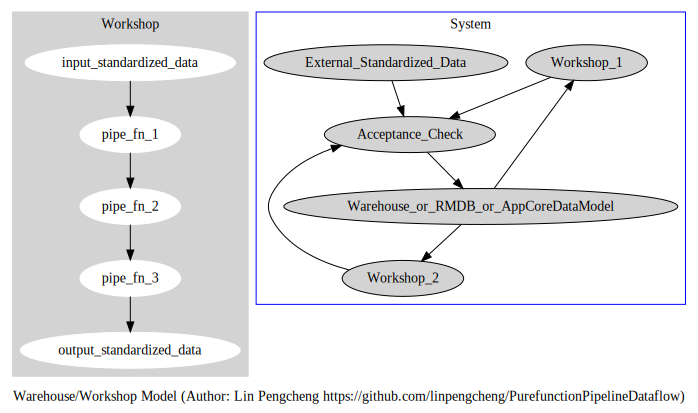

# The Pure Function Pipeline Data Flow v2.0
# 纯函数管道数据流  v2.0

Copyright © 2018 Lin Pengcheng. All rights reserved.

版权所有 © 2018 林鹏程， 保留所有权利。

## Table of Contents 目录
- [Similar Statements 类似观点](#Similar-Statements-类似观点)
- [Summary 概述](#Summary-概述)
- [Classical Model 经典模型](#Classical-Model-经典模型)
  - [Warehouse/Workshop Model 仓库/车间模型](#Warehouse-Workshop-Model-仓库车间模型)
- [Disadvantages of FP and OO 函数式编程和面向对象编程的缺点](#Disadvantages-of-FP-and-OO-函数式编程和面向对象编程的缺点)
- [The difference between it and middleware 它和中间件的区别](#The-difference-between-it-and-middleware-它和中间件的区别)
- [Basic quality control 基本质量控制](#Basic-quality-control-基本质量控制)
- [Code example 代码范例](#Code-example-代码范例)
- [Basic construction method 基本构造方法](#Basic-construction-method-基本构造方法)
  - [1. Pipeline Component 管道组件](#Pipeline-Component-管道组件)
  - [2. Branch 分支](#Branch-分支)
  - [3. Feedback circuit (reflow, recursive) 反馈电路（回流, 递归）](#Feedback-Circuit-反馈电路)
  - [4. shunt (concurrent, parallel) 分流(并发, 并行)](#Shunt-分流)
  - [5. Confluence(reduce) 合流, 合一](#Confluence-合流)
- [Tao 道](#Tao-道)
- [Postscript 后记](#Postscript-后记)
- [Other Articles Table of Contents 其他文章目录](#Other-Articles-Table-of-Contents-其他文章目录)

## Similar Statements 类似观点

```
NASA’s 10 rules for writing mission-critical code: 
1.Restrict all code to very simple control flow constructs.
        ----Gerard J. Holzmann, NASA JPL lead scientist.
        
Minimize control flow complexity and "area under ifs", 
favoring consistent execution paths and times over "optimally" avoiding unnecessary work.
        ---- John Carmack

Clojure Aphorism: A tangled web of mutation means any change to 
your code potentially occurs in the large. 
        ---- The Joy of Clojure (2nd Edition, Chapter 10)
        
Bad programmers worry about the code. 
Good programmers worry about data structures and their relationships.
        ---- Linus Torvalds
        
Data dominates. If you’ve chosen the right data structures and organized things well, 
the algorithms will almost always be self-evident. 
Data structures, not algorithms, are central to programming. 
        ---- Rob Pike
        
It’s better to have 100 functions operate on one data structure 
than 10 functions on 10 data structures.        
        ---- Alan Perlis

Metaphors for a Richer Understanding of Software Development.
        ---- The most valuable chapter of "Code Complete": Chapter 2
        
Principles-based are better than rules-based.
        ----International Accounting Standards        

NASA的10大编程规则：第一条：用非常简单的控制流结构体来编写程序。
        ---- NASA 喷气推进实验室（JPL）的首席科学家 Gerard J. Holzmann
       
最小化控制流复杂性和“ifs下的区域”，倾向于一致的执行路径和时间, 
而不是 "最优化", 以避免不必要的工作。。
       ---- 约翰 卡马克       

Clojure格言：交织的变化网意味着，代码的任何变化都可能会在更大层面上产生影响。
        ---- Clojure编程乐趣(第2版)第10章
        
糟糕的程序员关注代码。优秀的程序员关注数据结构及其关系。
       ---- Linus Torvalds

数据占主导地位。如果您选择了正确的数据结构并组织好了，那么算法几乎总是不言自明的。
数据结构才是编程的核心, 而不是算法。
        ---- Rob Pike

围绕一个数据结构开发100个函数, 比设计10个带10个函数的数据结构更好.
       ---- Alan Perlis
       
善于在软件开发中运用比喻。
       ---- "代码大全"最有价值章节(第二章)
       
基于原则比基于规则更好。
       ----国际会计准则
``` 

## Summary 概述

Using the input and output characteristics of pure functions, pure functions are used as pipelines.
Dataflow is formed by a series of pure functions in series.
A dataflow code block as a function, equivalent to an integrated circuit element (or board)。
A complete integrated system is formed by serial or parallel dataflow.

利用纯函数的输入输出特性当作管道（导线）使用。
数据经过一系列串联的纯函数形成数据流。
一个数据流代码块作为一个函数，相当于一个集成电路元件（或板）。
通过串联或并联数据流，形成一个完整的集成系统。

Can also be said, Data and logic are strictly separated, 
Element level separation of data and logic, data stream processing.

也可以换种说法，数据和逻辑严格分离，数据和逻辑的元素级分离，数据流处理。

```clojure
(defn f [[evens odds total amax amin] x]
  (let [[evens odds] (cond 
                       (even? x) [(inc evens ) odds]
                       (odd? x)  [evens (inc odds)]
                       :else     [evens odds])
        total (+ total x)
        amax  (max amax x)
        amin  (min amin x)]   
     [evens odds total amax amin]))

(reduce f [0 0 0 ##-Inf ##Inf] [5 6 8 -3 -9 11 156 6 7])

;;[4 5 187 156 -9]
```

For me, programming is the process of designing a data model that is simple and fluent in manipulation. 
More than 80% functions of my project is `->>` threading macro code block, 
each step is simple, verifiable, replaceable, testable, pluggable, extensible,
and easy to implement multithreading. 
The clojure threading macro provides language-level support for PurefunctionPipeline&Dataflow.

对我来说，编程就是设计一个操纵简单流畅的数据模型的过程，
在我的项目里，80%以上的函数是由`->>`这类数据流线程宏代码块组成。
每一步都是很简单、可验证、可测试、可替换、可插入、可扩展，
而且容易实现多线程处理。
Clojure的提供的很多种类线程宏，还有极简单流畅的数据操作函数，
对纯函数管道数据流提供了语言级的支持。

The sea sails by the helmsman and the programming moves toward the data. Initial state, final state, the shortest linear distance between two points. Simplicity is the root of fast, stable and reliable. 

大海航行靠舵手，编程朝着数据走。初始状态，最终状态，两点间直线距离最短。简单直接是快速稳定可靠的根本。

## Classical Model 经典模型

- data-flow is current-flow, function is chip, thread macro (->>, -> etc.) is a wire, and the entire system is an integrated circuit that is energized.
- Data (flow) is raw material (flow), pure function is machine, the thread macro (->>, -> etc.) is the conveyor belt, and the entire system is a large industrial pipeline.
- Communication modes, data signals and control signals (annotations or metadata) flow through the pipeline.
- The compiler is essentially a data transformation, starting with the source code, through a series of pure function pipeline transformation optimization, up to the machine code. It's very easy to insert enhanced optimizations or features, and parallel compilation is also very simple.
- Urban water network
- The **Gantt chart** in management, with the timeline as the main axis, multiple data flows running in parallel. It is also a good data flow , parallel and asynchronous programming tool. The application research of management to asynchronous, parallel and distributed is the first in the world!
- Boeing aircraft pulse production line technology, just like confluence technology of rivers from the source to the sea. It's also a variant of the **Gantt Chart**.

- 数据流是电流，函数是芯片，线程宏（->>, -> etc.）是导线，整个系统就是通电工作的集成电路。
- 数据(流)是原料(流), 纯函数是机器, 线程宏（->>, -> etc.）是传送带, 整个系统是大工业流水线.
- 通信模式, 数据信号和控制信号(注解或元数据)在管道里流转.
- 编译器本质上就是数据变换，从源码开始，经过一系列纯函数管道的变换优化，直至机器码.非常容易插入增强优化或特性, 实现并行编译也很简单.
- 城市的自来水网
- 管理学里的**甘特图**, 以时间线为主轴, 多个数据流并行前进. 它也是很好的数据流、并行、异步编程工具. 管理学对异步、并行和分布式的应用研究是世界第一的！
- 波音公司的脉动生产线技术, 就象长江从源头出发, 沿途汇流, 百川东到海. 它也是**甘特图**的一个变种.

### Warehouse Workshop Model 仓库车间模型



Metaphor:

- Warehouse: 
  - Standardized Data Model
  - RMDB
  - Memory
- Workshop:
  - Pure Function Pipeline Data Flow
  - Industrial Production Line
  - Ship's Watertight Compartments
  - CPU, Graphics Card, Sound Card, Hard Disk, Flash Disk，etc.
- Standardized Data
  - Products that meet industrial standards
    - raw materials
    - middleware
    - finished goods
- Acceptance Check
  - Quality Control Department
  - Customs
  - Motherboard with Standardized Interface（PCI, SATA, USB, etc.)
  
Before entering the warehouse, 
all data must be acceptance-checked first.

The input and output of the workshop 
can only be standardized data, 
the input-data comes from the warehouse, 
the output-data is acceptance-checked 
and sent to the warehouse.

Therefore, there will be no 
abnormal/error/Illegal data inside the workshop, 
no need to check data.

The code in the workshop is a pure function pipeline data flow,
it's simple, reliable, high-performance, 
Easy to debug, easy to observe, easy to maintain, easy to expand.

The workshop and the workshop are independent, 
non-interactive, Like a Lego module or 
a ship's watertight compartment, 
internal changes or abnormalities 
in any one workshop do not affect other workshops.  

比喻:

- 仓库
  - 标准化的数据模型
  - 关系式数据库
  - 内存
- 车间
  - 纯函数管道数据流
  - 工业生产流水线
  - 船只的水密隔舱
  - CPU, 显卡，声卡，硬盘，闪存盘等。
- 标准化的数据
  - 符合工业标准的产品
    - 原材料
    - 半成品
    - 产成品
- 验收
  - 质量控制部门
  - 海关
  - 主板(带有PCI, SATA, USB等标准化接口)
  
进入仓库前, 所有的数据必须先经过验收.

车间的输入输出只能是标准化数据,
输入的数据来自仓库,输出的数据经过验收后送到仓库.
因此车间内部不会存在异常/错误/非法数据,
无须检测数据.

车间的代码是纯函数管道数据流,
代码简单,可靠,高性能,
易调试,易观测,易维护,易扩展.

车间与车间之间是独立的,不交互,
就象是乐高组件或船只的水密隔舱,
任何一个车间的内部变动或异常不会影响其他车间.

## Disadvantages of FP and OO 函数式编程和面向对象编程的缺点

FP and OO are overly complicated, and it is not feasible in large industries. It is also a kind of production method that emphasizes personal technology in hand workshops. Personal technology greatly affects product quality and extremely unreliable production methods.FP and OO are actually taking a detour, highly embellished and ineffectual, and produce all kinds of fail.

FP和OO过度复杂了，在大工业上是行不通的，还是属于手工作坊那种强调个人技术的生产方式, 个人技术极大影响了产品质量，极不可靠的生产方式。FP和OO其实全是在走弯路, 花拳秀腿,花样作死。

## The difference between it and middleware 它和中间件的区别

The code looks similar, but the idea is essentially different.

- The input and output of the middleware's function is a function, 
the flow is a layer-packed function. It like concentric circles, 
and middleware debugging is very troublesome.

- The input and output of the PureFunctionPipelineDataflow's function is data, flow is data, 
it is linear series and parallel. It like a line.

I can't agree with the idea of middleware,
It is in conflict with the idea of integrated circuits. 
In the circuit, the component (board) cannot be circulated, 
only the data (current) can flow, which is the essential difference.

代码外形看起来相似，但理念是本质上的差别。

- 中间件函数的输入输出是函数，流转的是层层打包的函数，是同心圆，middleware调试是很麻烦的。

- 纯函数管道数据流输入输出是数据，流转的是数据，是线性的串并联。

我不能认同中间件的理念，和集成电路思想是冲突的。电路里，元件（电路板）是无法流转的，
只有数据（电流）才能流转，这是本质的区别。

## Basic quality control 基本质量控制

Basic quality control of pure function pipeline data flow. The code must meet the following three basic quality requirements before you can talk about other things. These simple and reliable evaluation criteria are enough to eliminate most unqualified codes.
- **Function evaluation:** Just look at the shape of the code (pipeline structure weight), and whether the function is a pure function.
- **Dataflow evaluation:** A data flow has at most one side effect and can only be placed at the end.
- **System evaluation:** Just look at the circuit diagram, you can treat the function as a black box like an electronic component.

纯函数管道数据流的基本质量控制, 只有代码达到下面三条基本质量要求, 才可以继续谈其他.
这些简单可靠的评价标准, 足以淘汰绝大多数不合格代码:
- **函数  评价:** 只需要看代码的外形(管道结构比重), 以及函数是不是纯函数.
- **数据流评价:** 最多只有一个副作用,且只能放在末端.
- **系统  评价:** 只看线路图即可, 可以把函数象电子元件一样当黑盒处理.

## Code example 代码范例

```clojure
;Traditional expression, chaotic logic, unreadable.
(if (and (> x1 x2)
         (or (< x3 x4) 
             (and (or (> y1 y2) 
                      (< y3 y4))
                  (not= x5 x6)))
         (keyword? x7)) 
  :t
  :f)

;Pure Function Pipeline Dataflow
;Unrestricted expression, just read in order. 
;Closer to the order of execution of the machine.
(->  (> y1 y2)
     (or  , (< y3 y4))
     (and , (not= x5 x6))
     (or  , (< x3 x4))
     (and , (> x1 x2))
     (and , (keyword? x7))       
     (if  , :t :f))
```

## Basic construction method 基本构造方法

### Pipeline Component 管道组件

A ->> block function is equivalent to an integrated circuit component (or board).
A series of functions in a ->> block can only have one function with side effects 
and can only be at the end. 
In addition, we must pay attention to the data standardization work, 
verify the data at the entrance and exit, 
and run at full speed in the middle, 
which is simple, smooth, stable and efficient.

一个->>块函数相当于一个集成电路元件（或板）,
一个->>块里面的一系列函数，最多只能有一个带副作用的函数且只能处于末尾。
另外，要注意做好数据标准化工作，在出入口检查，中间就可以极限裸奔，
这样做简洁、流畅、稳定、高效。

In the clojure language, it is recommended that the function be designed as 
a single-parameter function with a hash-map type. 
Like most functions in the R language, you can design many named parameters with default values, 
which are highly scalable. 
In addition, clojure has many core functions for operating hash-map, it's easy to operate,
not only it may don't write parentheses when using ->> macro, 
it can be integrated that parameter formation, verification, transformation and serial pipeline functions, 
It is also convenient to deconstruct in clojure. 
which is as convenient as multi-parameter functions.

在clojure语言里，建议函数尽量设计成参数为hash-map类型的单参数函数，
象R语言大多数函数那样，可以设计很多带默认值的命名参数，有很强的可扩展性。
另外，clojure操作hash-map的核心函数很多，操作方便，不仅在使用->>宏时可以不用写括号，
而且参数的形成，校验，变换与函数调用一体化、一条龙数据流处理。
还有clojure解构方便，在使用上与多参数函数是一样方便的。

```clojure
(defn f [x]
  (->> x
       f1
       f2))
```

```clojure
(defn f [{:keys [x y] :as m}]
  (->> x
       (f1 y ,)
       f2))
```

### Branch 分支

A (cond) or (if) block as a function.

一个(cond)或(if)块作为一个函数。

```clojure
(defn f [x]
  (cond
    (= x 1) (f1)
    (= x 2) (f2)
    :else   (f3)))
```
```clojure
(defn f2 [x y]
  (-> (> x 2)
      (and , (< y 6))
      (if , 25 30)))
```
```clojure
(defn path-combine [s1 s2]
  (cond
    (string/starts-with? s2 "/") 
      s2
    (not (string/ends-with? s1 "/"))
      (-> (string/split s1 #"[\\/]")
          butlast
          (#(string/join "/" %))
          (str , "/")
          (path-combine , s2)) 
    :else  
      (-> (string/join "/" [s1 s2])
          (string/replace ,  #"[\\/]+" "/")))) 
```

### Feedback Circuit 反馈电路

Feedback circuit (reflow，recursive): 
A tail recursive function is equivalent to a feedback circuit. 

Note: The map is batch processing. it can be regarded as similar to a queue of tourists. 
Repeating the ticket checking action at the entrance is a forward action, 
not feedback or reflow.

反馈电路（回流, 递归）:
一个尾递归函数相当于一个反馈电路。

备注：map是批处理，可以看成类似对一个游客队列，在入口重复进行验票动作，
是一个前进动作，不是反馈或回流。

```clojure
(defn f [i]
  (if-not (zero? i)
    (f1)
    (-> i dec recur)))
```

### Shunt 分流

Shunt（concurrent，parallel）,
For example: data partitioning, parallel processing

分流（并发，并行）,例如：对数据进行分块，并行处理

```clojure
(->> data
     (partition n ,)
     (pmap f ,))
```
```clojure
(->> [pipe-f1 pipe-f2 pipe-f3]
     (pmap #(% data) ,))
```

### Confluence 合流

Confluence（reduce）: reduce the result of the shunt

合流，合一: 对分流的结果进行reduce： 

```clojure
(->> data
     (partition n ,)
     (pmap f1 ,)
     (reduce f2 ,))   
```

## Tao 道

According to Taoism, water flow is the perfect substance. The water flow is always able to assume any shape as needed, sequential processing, until the mission is completed, reaching the end. The pure function pipeline data flow is like a water flow, almost the Tao.

上善若水, 水能按需呈现任何形状, 随心所欲, 千变万化, 顺序前进, 直到完成使命, 到达终点. 
纯函数管道数据流就象水流一样, 近乎于道.

Clojure just adds four persistent collections and some core functions to the JVM, and expresses the code with four persistent collections. It has no syntax, It can change as needed, like water flow, almost the Tao.

Clojure只是向JVM添加了四个持久集合和一些核心函数，并用四个持久集合表示代码。
它没有语法, 它可以象水流那样, 随需变化, 近乎于道。


Tao is simplicity, Tao is the law of nature, Tao is algorithm, Tao is everything.
Therefore, Integrated Circuit Technology, Industrial Assembly Line Production Technology, 
Accounting, Management, Architecture etc. 
everything can be used as Algorithms and Software Engineering Methods.
They can transform each other.


大道至简, 道法自然, 道是算法, 道无处不在。
所以, 集成电路技术、工业流水线生产技术、会计学、管理学、建筑学等,
一切都可当成算法和软件工程方法使用, 它们可以互相转化.

## Postscript 后记

Similar to The most valuable chapter of “Code Complete”----Chapter 2 Metaphors for a Richer Understanding of Software Development, I tend to inspire readers to discover useful patterns from life, work and personal interests, which are then used as solutions for development, rather than to apply mechanically other people’s cases.

In this way there will be endless cases, there will always be endless ways to solve the problem. This is "Tao ".

类似于“代码完整”中最有价值的章节 - 第2章对软件开发有更深入理解的隐喻，我倾向于激发读者从生活，工作和个人兴趣中发现有用的模式，然后将其用作解决方案。发展，而不是机械地应用其他人的案件。

通过这种方式，将会有无穷无尽的案例，总会有无穷无尽的方法来解决问题。这是“道”。

I spend my spare time developing a financial analysis expert system. 
Although my writing time is very limited, but I will gradually improve it. 
compared to the content when I first set up the blog, 
it has been rich and improved a lot.

我利用业余时间开发财务分析专家系统。虽然我写作时间有限，但我会逐步改进它，
相比我第一次设置博客时的内容，它已经丰富和改进了很多。

## Other Articles Table of Contents 其他文章目录

- [~~Introduction： Basic Methods (Old version) 引论: 基本构造方法(老版本)~~](doc/IntroductionBasicMethods.md)
- [Annotation is an unnecessary technique 注解是不必要的技术](doc/annotation_is_unnecessary.md)

- [Clojure is a FP based on RMDB. clojure是基于关系式数据库理论的函数式编程语言](doc/Clojure_is_FP_based_on_RMDB.md)

- [Everything is RMDB. 一切都是RMDB](doc/Everything_is_RMDB.md)

- [Mathathematical and AI 数学与《天龙八部》小无相功：从AI的角度看，所有的专业都是穿着马甲的数学。](doc/math-xiaoyao.md)

- [The Best Practice of Clojure. Clojure最佳实践](doc/best_practice_of_clojure.md)

- [React is terrible. React很糟糕](doc/react_is_terrible.md)

- [Office是数据库服务](doc/office_is_db.md)

- [Interaction of Static and Dynamic (Taiji and Table Tennis) 动静态交互(太极与乒乓球)](doc/interaction_of_static_and_dynamic.md)

- [数据模型是全局的、战略的，而函数实现只是局部的、战术的](doc/datamodel-vs-function.md)

- [英雄所见略同：Rob Pike，Linus Torvalds，Alan Perlis 和我](doc/RobPike-LinusTorvalds-AlanPerlis-Me.md)

- [纯函数管道数据流串并联集成系统法](doc/DataflowIC.md)

- [论纯函数管道数据流方法，兼评：左耳朵耗子 《什么是函数式编程？》](doc/AboutDataflow.md)

- [函数式编程学套路还是学无限法？](doc/infinite.md)

- [代码也是头等公民](doc/code-is-first-class.md)

- [《代码大全》与“想像力编程”](doc/CodeComplete.md)

- [《计算机编程的艺术》与想象力编程](doc/TAOCP.md)

- [神话编程：生死簿、轮回、地狱](doc/LifecycleManagement.md)

- [半自动步枪、批处理和Lazy](doc/lazy.md)

- [如来神掌与tree-seq](doc/tree-seq-and-The-Hand-of-God.md)

- [Rust: 数学不能救编程，但财务可以](doc/rust.md)

- [C#愚蠢到我不能理解，兼论UI构造方法](doc/c%23stupid.md)

- [例解：抽象、多态、变态](doc/Ii-abstract.md)

- [我的项目技术架构：AI、统计、杀毒软件](doc/TechnicalFramework.md)

