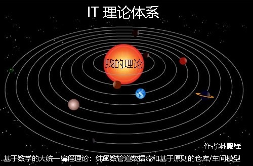
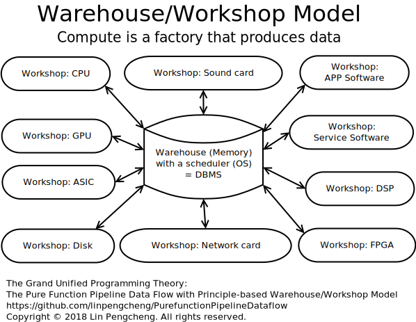
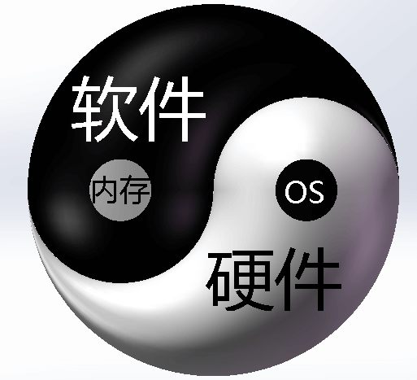
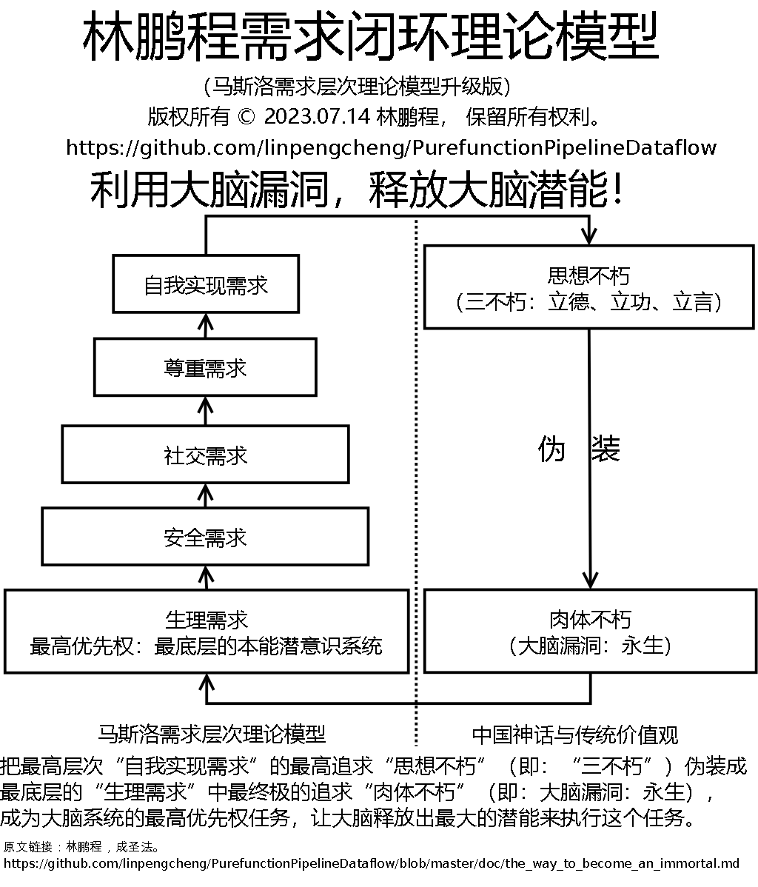

[goto English edition (英文版)](./README.md) &ensp;&ensp;&ensp;&ensp;
[Success Story](./doc/SuccessStory.md)

# 基于数学的大统一编程理论：纯函数管道数据流和基于原则的仓库/车间模型

版权所有 © 2018 林鹏程， 保留所有权利。

它是[2020年GitHub存档计划](https://archiveprogram.github.com/)的北极代码库的一个存储库.

## 目录

- [关键的创新观点 (不想看长篇大论的人可以看一眼)](#关键的创新观点)
- [我的和其他人的相关观点](#我的和其他人的相关观点)
- [概述](#概述)
- [5 个基本的纯函数管道数据流组件](#五个基本的纯函数管道数据流组件)
  - [1. 管道组件(顺流)](#1-管道组件)
  - [2. 条件分支](#2-条件分支)
  - [3. 反馈电路（回流, 漩涡, 递归）](#3-反馈电路)
  - [4. 分流(并发, 并行)](#4-分流)
  - [5. 合流, 合一](#5-合流)
- [代码范例](#代码范例)
- [经典模型](#经典模型)
- [仓库/车间模型(2019.02.04)](#仓库车间模型)
  - [模型的概述](#模型的概述)
  - [模型的 10 个原则](#模型的10个原则)
    - [任务分工](#任务分工)
    - [单一领导和统一调度](#单一领导和统一调度)
    - [充分授权和目标管理](#充分授权和目标管理)
    - [单一形式 (管道分形系统)](#单一形式)
    - [集中与分散](#集中与分散)
    - [等级链](#等级链)
    - [明确](#明确)
    - [有序](#有序)
    - [标准化](#标准化)
    - [例外处理](#例外处理)
  - [模型的框架代码](#模型的框架代码)
  - [数学原型(小学级)](#数学原型)
    - [简介](#数学原型简介)
    - [基本数学公式](#基本数学公式)
    - [调度](#调度)
    - [数学模型化的系统（架构）设计](#数学模型化的系统架构设计)
  - [万法归一](#万法归一)
    - [编程技术和系统架构的统一](#编程技术和系统架构的统一)
    - [与FP和面向对象的统一](#与FP和面向对象的统一)
      - [`传统IT理论(OO&FP&硬件等IT系统构造方法学)`与`仓库/车间模型`的比较](#Traditional-OO-and-FP-architecture-VS-Warehouse-Workshop-Model-CN)
    - [单线程、多线程、异步、分布式大统一](#单线程-多线程-异步-分布式大统一)
      - [`async/await`, `Project Loom 纤程`, `甘特图`和`科学管理`](#async)
      - [`微服务`和`智能线程`的统一](#微服务和智能线程的统一)
    - [和`信息系统集成模型`的统一](#和信息系统集成模型的统一)
    - [和`微内核架构`的统一](#和微内核架构的统一)
      - [未来OS内核将是一个面向数据的调度器(附带计算机软硬件集成架构图) (2021.11.15)](./doc/OS_as_DB_cn.md)
    - [和`AOP`的统一](#和AOP的统一)
    - [和`事件驱动架构`的统一](#和事件驱动架构的统一)
    - [和`计算机硬件体系`的统一](#和计算机硬件体系的统一)
      - [导言](#导言)
      - [2021-02-16现代CPU的乱序执行技术是一个错误](#2021-02-16现代CPU的乱序执行技术是一个错误)
      - [追随者案例: 苹果M1芯片](#追随者案例苹果M1芯片)
      - [为什么我的"仓库/车间模型"能做到高性能低功耗(以 Apple M1 芯片, Intel AVX-512, 高通为例)](./doc/why_wwmodel_fast.md)
      - [Foxpro面向数据库的编程范式是未来编程语言的发展方向(2021.11.07)](./doc/Mummy4Foxpro.md)
      - [未来OS将是一个DB, Clojure则是最好的DML(2021.11.15)](./doc/OS_as_DB_cn.md)
      - [2021-01-19预测](#2021-01-19预测)
      - [基于数学(科学)的"仓库/车间模型" VS. 无法证明其科学性的"冯·诺依曼体系结构"](#仓库车间模型vs诺依曼体系结构)
      - [2021-04 HPE Cray超级计算机官方推特2次点赞本理论](#2021-04-HPE-Cray超级计算机官方推特2次点赞本理论)
    - [和`集成电路系统`的统一](#和集成电路系统的统一)
    - [和`语言平台`的统一](#和语言平台的统一)    
    - [和`Clojure Web应用程序模型`的统一](#和Clojure-Web应用程序模型的统一)    
    - [和`生命周期管理`的统一](#和生命周期管理的统一)
    - [与`经典AI, 现代AI和可解释AI技术`的统一](#与经典AI和现代AI和可解释AI技术的统一)
      - [可解释AI系统使用法律架构和仓库/车间模型(2021-04-30)](#可解释AI系统) 
      - [AI也要兼听则明（以特斯拉自动驾驶为例）](./doc/hybrid_AI.md)
      - [机器人与变形金刚(2021.02.02)](#机器人与变形金刚) 
    - [与经济学的统一](#与经济学的统一)
    - [与`能源体系`的统一](#与能源体系的统一)
    - [和`其他模型`的统一](#和其他模型的统一)    
  - [小结](#小结)
- [它和其它方法的区别](#它和其它方法的区别)    
  - [函数式编程和面向对象编程的缺点](#函数式编程和面向对象编程的缺点)
  - [它和数据驱动编程、面向数据设计(编程)的区别](#它和数据驱动编程及面向数据编程的区别)
  - [它和微软Azure数据工厂/数据管道架构的区别](#它和微软Azure数据工厂-数据管道架构的区别)
  - [它和基于流编程(FBP, Flow-based programming)的区别](#它和基于流编程的区别)
  - [它和中间件的区别](#它和中间件的区别)
  - [它和Rx的区别](#它和Rx的区别)
  - [它和传统FP语言里的类unix管道操作符的区别](#它和传统FP语言里的类unix管道操作符的区别)
- [基本质量控制](#基本质量控制)
- [编程美学](#编程美学)
- [道](#道)
- [杀手级的应用](#杀手级的应用)
  - [软件设计和开发自动化 (SDDA)](#软件设计和开发自动化)
  - [计算机硬件体系架构，追随者: 苹果M1芯片](#追随者案例苹果M1芯片)
  - [可解释AI系统使用法律架构和仓库/车间模型](#与经典AI和现代AI和可解释AI技术的统一)
- [重大历史意义](#重大历史意义)
- [后记](#后记)
  - [想象力](#想象力) 
  - [道法自然，千变万化](#道法自然千变万化) 
  - [大道至简，易学难精](#大道至简易学难精) 
  - [最简单的学习方法](#最简单的学习方法) 
  - [基于原则比基于规则更好](#基于原则比基于规则更好) 
  - [简单统一，浑然一体：吃自已的狗粮](#简单统一浑然一体吃自已的狗粮) 
  - [计算机科学本质上是一门管理科学，反之也然。](#计算机科学本质上是一门管理科学)
  - [在2021年Clojure官方提倡管道编程](#在2021年Clojure官方提倡管道编程) 
  - [结尾](#结尾) 
- [参考文献](#参考文献)
- 附录:
  - [道家仙派科研方法学](#道家仙派科研方法学)
    - [核心](#核心)
      - [林鹏程需求闭环理论模型](#林鹏程需求闭环理论模型)
      - [成圣法：借假修真，破解大脑漏洞，开发大脑潜能，超越先天智商的限制，以达超凡入圣之境(林鹏程需求闭环理论模型，非立志成圣不可用)](doc/the_way_to_become_an_immortal.md)
      - 证道法(待发布)
    - [其他](#其他)
      - [开山立派四要件](doc/TaoistScientificResearchMethodology.md)
      - [简单性和统一性----大统一理论, Lisp(Clojure) 与纯函数管道数据流](doc/Simplicity_and_Unity.md)
      - [道即是易: 从"孔子誉老子为龙"到"我的仓库/车间模型大道"](./doc/Tao_of_Confucius_LaoTzu_Me.md)
      - [儒家大统一之道--学科融合(国际疾病分类、AI、数学、会计与纯函数管道数据流)](doc/Tao_ICD.md)
      - [数学与《天龙八部》小无相功：从AI的角度看，所有的专业都是穿着马甲的数学。](doc/math-xiaoyao.md)
      - [`纯函数管道数据流`与《天龙八部》逍遥派武学体系](doc/dataflow_xiaoyao.md)
      - [科研、软件工程、中医](doc/SR_SE_TraditionalChineseMedicine.md)
      - [《代码大全》与“想像力编程”](doc/CodeComplete.md)
      - [《计算机编程的艺术》与想象力编程](doc/TAOCP.md)
  - [Clojure是基于关系式数据库理论的函数式编程语言](doc/Clojure_is_FP_based_on_RMDB.md)
  - [一切都是RMDB](doc/Everything_is_RMDB.md)
  - [在hash-map(NoSQL)的基础上实现关系式数据模型和编程](doc/relational_model_on_hashmap.md)
  - [Datomic vs. my relational data model based on hash-map](./doc/datomic_vs_mine.md)
  - [不破坏编程语言语法的Markdown文学编程](doc/markdown_literary_programming.md)
  - [其他文章目录](#其他文章目录)

----

## 关键的创新观点

- [数学原型](#数学原型):  它的数学原型是简单的、经典的、在社会生产实践中广泛应用的小学数学的“水池进排水问题”， 
  我的理论重建了IT行业的基础理论，它以简单和统一的方式完美地、全面地把计算机理论与数学关联在一起: 
  从硬件集成电路和计算机架构, 到软件编程方法学、架构、编程语言等.
  解决了IT业从诞生至今一直存在的根基科学性的根本问题----核心缺乏数学依据。
  - [`传统IT理论(OO&FP&硬件等IT系统构造方法学)`与`仓库/车间模型`的比较](#Traditional-OO-and-FP-architecture-VS-Warehouse-Workshop-Model-CN)
  - 小学五年级的水池水流进流出模型
  - 小学四年级的基于甘特图的调度（优化，运筹学）。
  - 幼儿园级的搭积木分形构造系统的方法
 
- [软件和硬件都是制造数据的工厂，因此它们具有与制造业相同的“仓库/车间模型”和管理方法。](#仓库车间模型)

- [软件和硬件是统一的架构：“仓库/车间模型”。](#和计算机硬件体系的统一)
  - 从静态的角度看, 它是一个星形. 
  - 从动态运行时看, 它是一个动态树形甘特图, 象一条奔流不息的长江水系.
  - "仓库/车间模型"必将取代"冯·诺依曼体系结构", 成为计算机领域的第一架构, 并且是第一个实现软件和硬件大统一的架构.
    因为"冯·诺依曼体系结构"缺乏数学模型支持, 无法证明其科学性.
    - [追随者案例: 苹果M1芯片](#追随者案例苹果M1芯片)
    - [2021-04 HPE Cray超级计算机官方推特2次点赞本理论](#2021-04-HPE-Cray超级计算机官方推特2次点赞本理论)
    - [Success Story](./doc/SuccessStory.md)

- [调度器（调度函数）根据甘特图算法动态规划任务的完成顺序，并调用车间以完成分配的任务。这种方法是最有效的，并且没有资源竞争和事务冲突。](#单一领导和统一调度)

- [从系统架构上看, 它是一个仓库/车间模型分形系统。](#模型的概述)
  - [10个原则](#模型的10个原则)

- [从组件上看, 它是一个纯函数管道分形系统。](#单一形式)
  - [5个基本的纯函数管道数据流组件](#五个基本的纯函数管道数据流组件)
  - [基于全面标准化的数据接口的互联的管道世界.](#标准化)
  - [类似EDA, 软件和硬件设计和开发一体化与自动化](#软件设计和开发自动化)

- [5个美学标准: 在IT领域, 只有它和二进制系统完全符合这5个编程美学](#编程美学)
  
  如果一个理论是基于数学, 并且符合简单、统一、有序、对称和明确五大科学与工业的原则(美学), 那它就是完美理论.

- [与`经典AI、现代AI、可解释AI、法律架构`的统一](#与经典AI和现代AI和可解释AI技术的统一)

- [基本质量控制: 类似制造工业, 非IT专业人员也可进行基本的质控.](#基本质量控制)

- 我的理论拥有广泛的应用，它以数学和"仓库/车间模型"重建了整个IT业的基础理论, 
  从SOC到超级计算机，从软件到硬件，从单机到网络，从应用层到系统层，
  从单线程到分布式、异构并行计算，从通用编程到可解释的人工智能，从制造业到IT业，从能源到金融，
  从现金流到医学血管造影, 从神话到变型金刚, 从导弹的"发射后不管"制导技术到波音飞机脉动生产线技术。
  
- 悟道有先后, 境界无高低。《易经》以阴阳二爻，演化六十四卦相，穷尽天地之理。
  《道德经》道生一，一生二，二生三，三生万物。我以“仓库/车间模型”入道，
  不仅变化万千，演化无穷，而且大道至简，万法归宗。做到了孔子所说的“吾道一以贯之。”
  纵观人类历史，创造的理论:
  - 能在一个行业做到“一以贯之”的人极少
  - 做到跨多个行业做到“一以贯之”更少
  - 能做到用数学论证的更罕见
  - 如果再做到小学生都能搞明白的，只有我一个了。
  (如果有人知道其他伟大的科学家也做到了, 请在
  [Discussions](https://github.com/linpengcheng/PurefunctionPipelineDataflow/discussions)
  留言告诉我, 如果能简介一下更好)
  所以, 我的理论是最接近"道"的理论.
  
  我是第一个在学术界以一个基础理论为核心建立跨行业的大统一学术理论体系和大统一学术帝国的人, 我是学术界始皇帝(文始皇)！
  
- 最科学、最简单、最生动、最形象、最完美的IT理论体系图，高端大气上档次，通俗易懂接地气。[Success Story](./doc/SuccessStory.md)
  
  
  
  从专业论坛上的反应上看, 我知道很多人讨厌这张图和自夸的语言, 但这也是我的主张或论点，
  我不介意被差评, 封贴, 禁言，我只是更希望他们能同时证明我的论点是错误的。
  如果他们不能证明我错了，他们应该反思: 
  
  - 为什么他们如此憎恨一个伟大的真理?
  
  - 为什么他们会站在一个伟大的真理的对立面?
  
  - 他们在这一行为中扮演什么角色?
  
  我一向认为这类不合理和不科学的态度和行为可以无视。

## 我的和其他人的相关观点

```
大道至简，万法归一。
只有简单才能统一，
只有统一才是真正的简单。
        ---- 林鹏程
        
如果一个理论是基于数学, 并且符合简单、统一、有序、对称和明确
五大科学与工业的原则(美学), 那它就是完美理论。     
        ---- 林鹏程

NASA的10大编程规则：第一条：用非常简单的控制流结构体来编写程序。
        ---- NASA 喷气推进实验室（JPL）的首席科学家 Gerard J. Holzmann
       
最小化控制流复杂性和“ifs下的区域”，倾向于一致的执行路径和时间, 
而不是 "最优化", 以避免不必要的工作。。
       ---- 约翰 卡马克       

Clojure格言：交织的变化网意味着，代码的任何变化都可能会在更大层面上产生影响。
        ---- Clojure编程乐趣(第2版)第10章
        
糟糕的程序员关注代码。优秀的程序员关注数据结构及其关系。
       ---- Linus Torvalds

数据占主导地位。如果您选择了正确的数据结构并组织好了，那么算法几乎总是不言自明的。
数据结构才是编程的核心, 而不是算法。
        ---- Rob Pike

围绕一个数据结构开发100个函数, 比设计10个带10个函数的数据结构更好.
       ---- Alan Perlis, 首届图灵奖得主 (1966), 使计算机科学成为独立学科的奠基人
       
告诉我您的流程图并隐藏数据表，我将继续感到困惑。
给我看你的数据表，我通常不需要你的流程图。他们会很明显。      
        ---- Fred Brooks, 图灵奖(1999), 人月神话

即使是最简单的程序逻辑对于人类来说也难以验证，但非常复杂的数据结构却相当容易建模和推理。
...
数据比程序逻辑更容易处理。接下来，您可以选择数据结构的复杂性和代码的复杂性，选择前者。
更多：在设计的演变过程中，您应该积极寻求将复杂性从代码转移到数据的方法。
        ---- Eric Steven Raymond, Unix编程的艺术, Unix哲学的基础知识

善于在软件开发中运用比喻。
       ---- "代码大全"最有价值章节(第二章)
       
基于原则比基于规则更好。
       ----国际会计准则
``` 

## 概述

利用纯函数的输入输出特性当作管道（导线）使用。
数据经过一系列串联的纯函数形成数据流。
一个数据流代码块作为一个函数，相当于一个集成电路元件（或板）。
通过串联或并联数据流，形成一个完整的集成系统。

也可以换种说法，数据和逻辑严格分离，数据和逻辑的元素级分离，数据流处理。

```clojure
(defn f [[evens odds total amax amin] x]
  (let [[evens odds] (cond 
                       (even? x) [(inc evens ) odds]
                       (odd? x)  [evens (inc odds)]
                       :else     [evens odds])
        total (+ total x)
        amax  (max amax x)
        amin  (min amin x)]   
     [evens odds total amax amin]))

(reduce f [0 0 0 ##-Inf ##Inf] [5 6 8 -3 -9 11 156 6 7])

;;[4 5 187 156 -9]
```

```
编程就是设计一个操纵简单流畅的数据模型的过程。
        ---- 林鹏程
```

对我来说，编程就是设计一个操纵简单流畅的数据模型的过程，
在我的项目里，80%以上的函数是由`->>`这类数据流线程宏代码块组成。
每一步都是很简单、可验证、可测试、可替换、可插入、可扩展，
而且容易实现多线程处理。本文把编程变成一项串并联函数式管道化的CRUD操作的简单工作。

Clojure的提供的很多种类线程宏，还有极简单流畅的数据操作函数，
对纯函数管道数据流提供了语言级的支持。

大海航行靠舵手，编程朝着数据走。初始状态，最终状态，两点间直线距离最短。简单直接是快速稳定可靠的根本。

```
故善战者之胜也，无智名，无勇功，故其战胜不忒。
(曹操批注: 善战者无赫赫之功。)
        ---- 《孙子兵法.形篇》
```

曾国藩打仗的要诀:"结硬寨，打呆仗。" 与工业流水线、纯函数管道数据流的设计哲学是一致的，
本质上都是对准目标，步步为营，每一步都向最终目标前进一步, 直至达到最后目标。
因此, 它的成功是必然的, 毫不令人惊奇的, 过程是平淡的简单重复.
这种方法用熟了，真是一项简单和重复的无聊技术，这就是大工业生产线追求的简单与重复。

## 五个基本的纯函数管道数据流组件

### 1 管道组件

管道组件(顺流)

管道函数都是纯函数, 一个->>块函数相当于一个集成电路元件（或板）。 

- 副作用
  - 一个`->>`块里面的一系列函数，绝大多数都是纯函数。 
  - 一条数据流最多只能有两个副作用, 且只能处于头尾。
  - 在`仓库/车间模型`中,副作用由专门的IO部门(采购部门,销售部门)负责。
    因此,所有的车间(管道)都是纯函数, 只与仓库交互, 并由仓库调度。 
  - 一般来讲，大多数副作用车间只有一端有副作用，
    每个不同类输入管道车间先把副作用输入的东西先送仓库验收入库，
    另外再调度专门的组装车间负责组装为产成品后再送仓库.再由输出车间输出。
  - 两端都有副作用的车间只是特例，如简单加工车间作为独立的仓库／车间模型，
    象修手机，取手机（输入），修理（处理），还手机（输出）。
    不是大工业生产主要的模式
- 参数
  - 在入口检查并标准化数据，随后就可以极限速度运行
    这样做简洁、流畅、稳定、高效。
  - 在Clojure语言中，建议将函数尽可能设计为hash-map类型的单参数函数。
    - 象R语言大多数函数那样，可以设计很多带默认值的命名参数， 
      有很强的可扩展性。 
    - Clojure操作hash-map的核心函数很多，非常方便。 
    - 在使用->>宏时可以不用写括号。
      这样, Clojure就成为括号最少的编程语言:-)
    - 参数的形成，校验，变换与函数调用一体化、一条龙数据流处理。
    - Clojure解构方便，在使用上与多参数函数是一样方便的。
  - 另见: [原则: 集中与分散](#集中与分散)

```clojure
(defn f [x]
  (->> x
       f1
       f2))
```

```clojure
(defn f [{:keys [x y] :as m}]
  (->> x
       (f1 y ,)
       f2))
```

```clojure

; R语言风格函数: 
; - 多个命名参数
; - 调用函数时参数可以乱序
; - 大多数参数有缺省值

(def ^:pravite defa-opt-map {:a 0 :b 9})

(defn f [opt-map]
  (let [opt-map (merge defa-opt-map opt-map)
        {:keys [a b c]} opt-map]
    ; doing something
    [a b c opt-map]))

(f {:a 3 :c 15})
;=> [3 9 15 {:a 3, :b 9, :c 15}]  

;opt-map can provide both unix and windows 
;style parameters at the same time, and the 
;performance loss is negligible.
;dos copy
(def ^:private defa-opt-map
  {:src  ""   :dest ""
   :A    nil  :B    nil
   :D    nil  :L    nil
   :V    nil  :N    nil  
   :Y    nil  :Z    nil
   :target nil})
(defn copy 
  ([opt-map]
    (->> (merge defa-opt-map opt-map)
         ;do sth.
         ))
  ([src dest]
    (->> (assoc defa-opt-map 
                :src src 
                :dest dest)
         copy)))

```

### 2 条件分支

一个(cond)或(if)块作为一个函数。

```clojure
(defn f [x]
  (cond
    (= x 1) (f1)
    (= x 2) (f2)
    :else   (f3)))
```
```clojure
(defn f2 [x y]
  (-> (> x 2)
      (and , (< y 6))
      (if , 25 30)))
```
```clojure
(defn path-combine [s1 s2]
  (cond
    (string/starts-with? s2 "/") 
      s2
    (not (string/ends-with? s1 "/"))
      (-> (string/split s1 #"[\\/]")
          butlast
          (#(string/join "/" %))
          (str , "/")
          (path-combine , s2)) 
    :else  
      (-> (string/join "/" [s1 s2])
          (string/replace ,  #"[\\/]+" "/")))) 
```

### 3 反馈电路

反馈电路（回流, 漩涡, 递归）:
一个尾递归函数相当于一个反馈电路。

备注：map是批处理，可以看成类似对一个游客队列，在入口重复进行验票动作，
是一个前进动作，不是反馈或回流。

```clojure
(defn f [i]
  (if-not (zero? i)
    (f1)
    (-> i dec recur)))
```

### 4 分流

分流（并发，并行）,例如：对数据进行分块，并行处理

```clojure
(->> data
     (partition n ,)
     (pmap f ,))
```
```clojure
(->> [pipe-f1 pipe-f2 pipe-f3]
     (pmap #(% data) ,))
```

### 5 合流

合流，合一: 对分流的结果进行reduce： 

```clojure
(->> data
     (partition n ,)
     (pmap f1 ,)
     (reduce f2 ,))   
```


## 代码范例

### 代码范例 01

```clojure
;Traditional expression, chaotic logic, unreadable.
(if (and (> x1 x2)
         (or (< x3 x4) 
             (and (or (> y1 y2) 
                      (< y3 y4))
                  (not= x5 x6)))
         (keyword? x7)) 
  :t
  :f)

;Pure Function Pipeline Dataflow
;Unrestricted expression, just read in order. 
;Closer to the order of execution of the machine.
(->  (> y1 y2)
     (or  , (< y3 y4))
     (and , (not= x5 x6))
     (or  , (< x3 x4))
     (and , (> x1 x2))
     (and , (keyword? x7))       
     (if  , :t :f))
```

### 代码范例 02

```clojure
(def data
  {:a [[:b :c :d]
       [:e :f :g]
       [:h :i :j]]
   :k [[:l :m :n]
       [:o :p :q]
       [:r :s :t]]})

(defn f1 [[k v]]
  (let [[h & t] v
        f   (fn [x] (mapv #(vector :td %) x))
        tds (map #(->> % f (into [:tr] ,)) t)]
     (->> (f h)
          (into [:tr [:td {:rowspan (count v)} k]] ,)
          (conj tds ,))))

(->> data
     (reduce #(->> %2 f1 (into %1 ,)) [:tbody] ,)
     (conj [:table] ,)
     hiccup/html)

; hiccup DSL

[:table 
  [:tbody 
    [:tr [:td {:rowspan 3} :a] 
         [:td :b] 
         [:td :c] 
         [:td :d]] 
    [:tr [:td :e] 
         [:td :f] 
         [:td :g]] 
    [:tr [:td :h] 
         [:td :i] 
         [:td :j]] 
    [:tr [:td {:rowspan 3} :k] 
         [:td :l] 
         [:td :m] 
         [:td :n]] 
    [:tr [:td :o] 
         [:td :p] 
         [:td :q]] 
    [:tr [:td :r] 
         [:td :s]
         [:td :t]]]]
```

HTML Table:

<table>
    <tbody>
       <tr><td rowspan=3>a</td>
           <td>b</td>
           <td>c</td>
           <td>d</td></tr>
       <tr><td>e</td>
           <td>f</td>
           <td>g</td></tr>
       <tr><td>h</td>
           <td>i</td>
           <td>j</td></tr>
       <tr><td rowspan=3>k</td>
            <td>l</td>
            <td>m</td>
            <td>n</td></tr>
       <tr><td>o</td>
            <td>p</td>
            <td>q</td></tr>
       <tr><td>r</td>
            <td>s</td>
            <td>t</td></tr>
    </tbody>
</table>

### 代码范例 03

另见: 

- [在hash-map(NoSQL)的基础上实现关系式数据模型和编程](./doc/relational_model_on_hashmap.md)
- [Babashka脚本: Notepad++带预览窗口的Markdown文学编程（不破坏任何编程语言的语法）](https://github.com/linpengcheng/ClojureBoxNpp/blob/master/Notepad++/tools/clj/mlp.clj)
- [Babashka脚本: Notepad++带预览窗口编辑Clojure hiccup (HTML DSL)](https://github.com/linpengcheng/ClojureBoxNpp/blob/master/Notepad%2B%2B/tools/clj/hiccup2html.clj)

## 经典模型

```
智力的真正标志不是知识，而是想象力(类比)。
        ---- 爱因斯坦
```

类比是一种代数思维的应用。类比在真实世界不一定能成立, 但在虚拟的软件世界里它一定能成立，
把一个旧模型映射为一个新模型, 并按新模型的标准规范实现升级改造, 这是很容易的.
在管理学,叫做"吸收合并". 在金庸的武侠小说《天龙八部》里, 叫"北冥神功".
在《西游记》里, 叫"天罡地煞变".

这是`道`和`大统一理论`的哲学的典型应用:

- 数据流是电流，函数是芯片，线程宏（->>, -> etc.）是导线，整个系统就是通电工作的集成电路。
- 数据(流)是原料(流), 纯函数是机器, 线程宏（->>, -> etc.）是传送带, 整个系统是大工业流水线.
- 通信模式, 数据信号和控制信号(注解或元数据)在管道里流转.
- 编译器本质上就是数据变换，从源码开始，经过一系列纯函数管道的变换优化，直至机器码.非常容易插入增强优化或特性, 实现并行编译也很简单.
- 城市的自来水网
- 管理学是最好的,最生动的计算机科学的宝库(算法、架构、异步、并行和分布式等等). 
  我的编程方法是“函数式编程”和“企业管理”的融合。它有一个额外的好处，
  它对信息技术部门和公司管理层之间的沟通非常有帮助。
  - 管理学里的**甘特图**, 以时间线为主轴, 多个数据流并行前进. 它也是很好的数据流、并行、异步编程工具.
  - 并行: 大工业流水线可以线性并行扩展.
  - 分布式: 集团公司模型, 总分公司模式,母子公司模式, 控股公司模型等.
  - 组织架构: 
    - 金字塔式: 经典的自顶向下模块化设计:
    - 扁平式: 纯函数管道数据流, 代码只有函数和数据两层, 模型也只有仓库和车间两层.
    - 矩阵式: 面向切面编程(AOP)
    - 业务流程外包: 函数式编程(FP), FP不仅用本公司函数完成任务,而且还存在高阶函数这样不干活的部门,
      但可以把任务委托给"作为参数的外包公司函数".
      
      ```clojure
      (own-department-function  task-list)

      (apply outsourced-company-function task-list)
      ```
      
    - 混乱的P2P (点对点对等网络): 面向对象编程(OOP)
  - 操作系统或资源管理: ERP
  - 类型系统: 工业标准体系(ISO标准,国家标准，行业标准，企业标准)，纯函数管道数据流适合产品规范(数据规范)工业标准体系的实施,
    就象计算机硬件接口标准规范一样, 硬件是函数, 接口是数据标准规范 在硬件(函数)间传输数据。
    - 另见: [原则: 标准化](#标准化)    
  - 存储管理(缓冲区, 缓存, 数据库, 等等)：库存管理.
  - 在大型企业中, 流程第一思想, 是建立在凭据(证据)的基础上的, 这个凭据就是数据, 凭据(数据)在流程中各节点流转, 形成数据流. 
    流程中的每一个节点就是管道函数(纯函数), 这就是`纯函数管道数据流`.
  - 波音公司的脉动生产线技术, 就象长江从源头出发, 沿途汇流, 百川东到海. 它也是**甘特图**的一个变种.
    - 另见: [原则: 有序](#有序)
    
 

 


<h2 id="仓库车间模型">仓库/车间模型</h2>

2019.02.04


 



### 模型的概述

- 仓库是存放数据(状态,数据, 函数也是数据)的容器, 它拥有一个调度器, 以甘特图算法动态规划调度车间完成任务.
  - 它是一个特殊的管道，一切资源的容器（状态，数据，函数也是数据）， 它有两个特殊的副作用管道（I/O）与外部互联.
    
    2022-03-12备注: 我的理论是在基于原则的仓库/车间模型的架构下构建的，数据和逻辑的分离是实现的基础，
    但它不建议"将副作用推迟到最后一步"，它只是根据任务分工的原则将副作用视为特殊的专业车间，
    并且像普通车间一样由调度器安排。它只是根据专业和甘特图算法，在资源争夺点划分任务，
    让专业人士（部门、车间）以最优的方式做专业的事情，并以全局最优的算法统一调度，不是推迟，而是最优。
    [在r/programming的讨论](https://www.reddit.com/r/programming/comments/tayy1m/some_benefits_of_simple_software_architectures/i06ipgb/?context=3)
    
  - 它有一个调度器, 仓库调度器和车间是1:n关系，仓库调度器通过使用甘特图算法动态规划调度车间完成任务, 以进行全局优化。
    - **标准甘特图算法动态规划调度**: 任务设计者是内部用户, 他可以正确估计任务时间, 任务之间的依赖关系, 并正确划分任务. 这是最优的调度算法.
    - 如果任务设计者是外部用户, 例如云服务提供商的任务设计者，则很难保证他们可以这样做.
      - **抢占式多任务调度**: 传统的计算机科学使用抢占式多任务方式调度任务, 强制在资源竞争中划分任务, 
        防止不适当或长时间的计算任务占用资源并导致其他服务长时间等待。
        服务提供商和外部用户都不能很好地控制和优化任务, 缺乏任务执行(路径、时间和结果)的确定性和可预测性.
        所以它不是一个高性能的方法, 只是一个简单粗暴的方法. 它按优先级和时间片调度任务,
        由于时间片通常很短（在Linux上为5ms－800ms）, 导致大量不必要的任务切换开销.
        [Preemption (computing)- Wikipedia](https://en.wikipedia.org/wiki/Preemption_(computing))
      - **契约式调度(混合模式调度, 按资源调度)**(2022-02-28): 如果采用制造工业的方法, 把资源定制为不同等级和类型的数据流和计算流服务, 
        由服务提供商提供各种类型的标准化产品(资源使用权)清单, 
        因为任务很难统一化和标准化, 因此很难度量和调度,
        而资源却可以做到简单化, 统一化和标准化, 
        标准化的资源和数据流单位可以做为按数学原型的公式进行定量分析的计算单位,
        这样就很自然地把调度任务改为调度资源, 这一思想与数据流的思想是一致的, 
        由外部用户程序在运行期间根据任务计划的需要发出购买产品(资源使用权)订单, 
        交易成功后获得资源使用权运行任务, 最后把结果返回给外部用户,这种主动控制交给外部用户, 
        服务提供商和外部用户都能更好的控制和优化任务,
        并有助于增强任务执行(路径、时间和结果)的确定性和可预测性.
        它的优化效果接近标准的标准甘特图算法动态规划调度, 远超抢占式多任务调度.
        云服务商和用户严格按契约交易, 这也是一个计量更精确的, 服务质量更有保障的, 更严谨的商业交易方法.
  - 它可以没有普通车间，这时它只是数据中心（仓储业）。
  - 它可以没有容器, 这时它只是调度中心（虚拟的全局统一仓库, 集成层或平台, 企业集团的母公司）。
    - 它的车间都是下一级仓库/车间模型(子公司), 它不直接调度子模型(子公司)的资源,
      而是通过子模型(子公司)的调度器来间接管理, 简化调度系统, 保证子模型(子公司)的独立性。
      增强执行路径、时间、结果的确定性和可预测性.
    - 有利于促进架构的调整。
    - 有利于形成群体优势和综合功能，增强系统的集成性。
    - 有利于专业化协作。
    - 有利于实现规模效益。
    - 有利于提高调度水平。
    - 有利于提高资源的利用效率, 推动资源优化配置。
    - 标准仓库/车间模型当然是最有效的，但在以下情况下需要分形系统。
      它不是理想世界的最佳解决方案，但它是现实世界的最佳解决方案。
      在这个世界上，有许多事情我们不能完全控制和追求我们利益的最大化。我们只能合作共赢。
      - 当规模太大而无法控制时，这种情况可能只存在于硬件系统中。
        在软件系统中，这种情况通常不会发生，因为它只是围绕 DB 的一堆简单的车间函数，这非常简单。
      - 集成和兼容旧系统
      - 集成第三方系统
    - 另见: 
      - [和信息系统集成模型的统一](#和信息系统集成模型的统一)
      - [Microsoft's AI computing platform Singularity's architecture has plagiarized my Warehouse/Workshop Model](./doc/Follower_MS_Singularity_Architecture_en.md)

- 车间是系统内部执行任务的独立单元. 每一个车间都是单一功能的独立管道. 它们很小很简单很清楚.
  - 它是比数据管道更大的执行单元，由串联的数据管道组成.
  - 车间之间没有任何交互，每个车间只被仓库统一调度。
    - 调度器和车间具有1:n关系
  - 它是划分独立任务时的原子单位，对应甘特图的一个条。
  - 它可以没有仓库，这时它只是微服务（专用处理芯片，服务业）。

- 仓库/车间模型
  - 从静态的角度看, 它是一个星形. 
  - 从动态运行时看, 它是一个动态树形甘特图, 象一条奔流不息的长江水系.
  - 调度器调用用车间时, 把一个数据（原材料）分配给一个车间,
    这时数据（原材料）作为消耗品进入生产（变更、计算）过程时，它就被该车间独占.
    调度器不会再把它分配给其他车间, 因为引用处于变化过程中的数据(脏数据)是没有意义的.
    车间作为纯函数, 它除了在任务开始时调度器分配给它的数据外, 不会再从外界获取数据.

如果能够理解软件是生产数据的工厂, 那么就能理解仓库/车间模型,
理解生产线(纯函数,管道)和生产原料(数据)相分离, 
生产线持续生产形成数据流的开发思想.

系统的基本原理类似一个内存数据库系统，
这个系统的所有任务由内存数据库调度存储过程（车间）完成，
所有的副作用（类似持久化、分布式等）由内存数据库完成。

- **一切都是管道**: 实现软件生态系统简单性和统一性的完美方法。

  - **管道组合**: 串联的`简单管道`形成`车间管道`
  
  - **车间组合**: 
    - 并联的独立的`车间管道`通过`仓库`协作(调度)形成`仓库/车间模型管道(数据工厂)`。
    - 车间管道可以作为`封装的集成管道(集成芯片)`独立对外提供服务,这就是`微服务`和服务业.
      - 所有车间都是独立的黑匣子（纯功能），它不需要知道数据哪里来、到哪里去，
        只需根据仓库分配给它的数据完成它的职能即可。
      - 它们都是独立的，可以安全地并行。

    
  - **仓库**: 
    - 可以作为独立体对外提供服务, 这就是仓储业和数据库服务。 
    - 仓库根据状态变化（如订单等）使用甘特图的最佳算法安排车间完成任务。
    - 仓库保存了全局状态，如果系统发生故障时，通过分析仓库快照可以很方便找出故障。
    - 所有副作用（可以看成是特殊的车间：采购部门和销售部门等）均由仓库代理完成，
      类似根据需要向其他仓库获取数据（分布式数据库，磁盘等），持久化数据等。
    
  
  - **仓库/车间模型组合**: 
    - 各种独立的`仓库/车间模型管道(数据工厂)`可以作为一个`封装的集成管道(数据工厂,集成芯片)`
      再组合成一个更大的`仓库/车间模型管道(数据工厂)`, 
    - 这就是不同开发商、不同软件产品互联、协作、集成的方法，也是软件开发标准化大工业生产的基础。
    - 这就是企业集团或整个工业生态系统。
    
  - 最后，管道就象是细胞一样，
    组合成一个符合现代工业生态系统要求的管道软件生态系统，
    这就是简单性和统一性的完美体现。
    
  - 对比`一切都是对象`
    - 对象是一个毛毛球, 对象之间是混乱的点对点网络, 它是一个复杂的、混乱的、无组织的系统.
    - 管道是单向的射线, 数据标准化和组合是最简单的, 它是一个简单的、可靠的、有序的、可观测的、可验证的系统.

- 因为软件是生产数据的工厂，所以现代工业体系适用于软件体系。

- 仓库（数据库，池）/车间（管道）模型是一个简单实用的模型，而且大型工业流水线是世界上主流的生产技术。

- 最好的任务计划工具是甘特图，最好的实现方法是工厂实行的仓库/车间模型。

- 我认为如果数据流理论只有江河(输入车间),没有云彩降雨(输出车间), 没有海洋和湖泊(仓库),  
  那么它不是闭环系统, 因此理论上不完整.

### 模型的10个原则

#### 任务分工

- 按甘特图划分任务
- 一种类型的任务只由对应类型的车间负责
- 数据管理由仓库负责
- 任务调度由仓库的调度函数负责。

#### 单一领导和统一调度  

- 单一领导
  - 除了根仓库, 所有的组件(车间,仓库,模型)都有且仅有一个领导(仓库的调度函数).
  - 单一领导有助于增强任务执行(路径、时间和结果)的确定性和可预测性.
  - 多领导会使任何一个领导对任务的执行失去掌控, 产生不可预期的结果, 
    并破坏利用动态规划实现全局优化的成果.
    
- 统一调度
  - 由仓库的调度函数统一调度
  - 调度函数按甘特图算法动态规划任务的完成顺序，
    据以调用车间完成分派的任务。
    - **标准甘特图算法动态规划调度**: 任务设计者是内部用户, 他可以正确估计任务时间, 任务之间的依赖关系, 并正确划分任务. 这是最优的调度算法.
    - 如果任务设计者是外部用户, 例如云服务提供商的任务设计者，则很难保证他们可以这样做.
      - **抢占式多任务调度**: 传统的计算机科学使用抢占式多任务方式调度任务, 强制在资源竞争中划分任务, 
        防止不适当或长时间的计算任务占用资源并导致其他服务长时间等待。
        服务提供商和外部用户都不能很好地控制和优化任务, 缺乏任务执行(路径、时间和结果)的确定性和可预测性.
        所以它不是一个高性能的方法, 只是一个简单粗暴的方法. 它按优先级和时间片调度任务,
        由于时间片通常很短（在Linux上为5ms－800ms）, 导致大量不必要的任务切换开支.
        [Preemption (computing)- Wikipedia](https://en.wikipedia.org/wiki/Preemption_(computing))
      - **契约式调度(混合模式调度, 按资源调度)**(2022-02-28): 如果采用制造工业的方法, 把资源定制为不同等级和类型的数据流和计算流服务, 
        由服务提供商提供各种类型的标准化产品(资源使用权)清单, 
        因为任务很难统一化和标准化, 因此很难度量和调度,
        而资源却可以做到简单化, 统一化和标准化, 
        标准化的资源和数据流单位可以做为按数学原型的公式进行定量分析的计算单位,
        这样就很自然地把调度任务改为调度资源, 这一思想与数据流的思想是一致的, 
        由外部用户程序在运行期间根据任务计划的需要发出购买产品(资源使用权)订单, 
        交易成功后获得资源使用权运行任务, 最后把结果返回给外部用户,这种主动控制交给外部用户, 
        服务提供商和外部用户都能更好的控制和优化任务,
        并有助于增强任务执行(路径、时间和结果)的确定性和可预测性.
        它的优化效果接近标准的标准甘特图算法动态规划调度, 远超抢占式多任务调度.
        云服务商和用户严格按契约交易, 这也是一个计量更精确的, 服务质量更有保障的, 更严谨的商业交易方法.
  - 没有资源竞争和事务(版本)冲突
  - 这种做法实现系统整体效率的最优化是最简单的。
  - 全局统一调度系统效率最高, 这是一个常识.
  - 完成一个任务(产品), 需要组合各种不同的车间完成(异构并行), 仓库的调度器利用运筹学, 
    实现供应(输入), 生产(计算), 销售(输出),存储(仓库)的最佳平衡, 实现最小成本和最高效率.
    
#### 充分授权和目标管理

- 充分授权

  - 我认为充分授权就是要达到类似导弹“发射后不管”技术的效果。
    “发射后不管”是指导弹有自主引导能力，不需要外界的支持，
    便会自动跟踪，打击目标，不用发射后再去控制。 
    具有提高武器与发射载具之间的使用效率，
    降低武器依赖 其他系统提供本身的更新资料，
    让发射载具可以在最短的时间之内攻击数量最多的目标、
    提高发射载具的生存性等重要性。 
    今后制导技术的发展方向正是“发射后不管”的精确制导技术。
    
  - 如果特定的任务车间不能做到“发射后不管”, 
    尚需管理者(调度函数)参与管理控制,
    那么说明任务划分不合理, 应在管理者(调度函数)介入点分割任务.
    
  - 充分授权后, “发射后不管”的优点
    - 可以降低系统复杂度,
    - 增强模型内各组件的独立性,各司其职,互不干扰, 增强组件的简单性和可并行性.
    - 使任务划分在保证独立性的前提下达到最大粒度, 保证任务执行的连续性和效率.
    - 沟通(通信)、协调和冲突管理对性能有极大的损害, 它能通过任务分工、统一调度和充分授权(发射后不管)把这些损害降低到最小。
    - 提高并行,并发,分布式,异步等的效率
    - 统一并行,并发,分布式,异步等的架构
    - 强化全局调度的优化效果
    - 统一管理者(调度函数)对车间的管理控制形式.
    - 实现系统的简单性和统一性.
    
- 目标管理

  - 充分授权不是放任不管, 主要是对工作结果进行严格的标准化的全面质量管理.
  - 只要保证仓库数据的准确性, 就能保证车间输入输出的准确性, 进而保证系统的准确性.
  - 仓库的验收函数负责这个职能.
  
#### 单一形式

- 一切组件(车间,仓库,模型)都是管道.
- 从组件上看, 它是一个纯函数管道分形系统。
- 从系统架构上看, 它是一个仓库/车间模型分形系统。
- 实现系统的简单性和统一性完美结合.
  当一切元素(包括架构)都具有同一形式时, 这就是终极的简单和统一.
- 因为系统是一个分形系统，所以系统的增长不会增加系统的复杂度，仍然能够保持简单和统一。
- 类似
  - 由无数个最简单的细胞组成一个复杂的生命体.
  - 由亿万个最简单的晶体管组成一个复杂的CPU.

#### 集中与分散

- 集中: 数据集中, 任务统一调度
  - 数据由仓库集中管理, 数据校验, 约束很方便, 有利于维护数据的完整性和正确性.
  - 完整地展示数据标准规范, 有助于正确地全面理解数据.
  - 有利于获取全面的信息, 并从全局的角度优化系统, 作为统一调度的基础.
  - 调试时, 可以很方便地把仓库运行时的全局信息保存下来, 分析故障的原因.
  - 维护成本最小, 管理最简单。
  - 任务统一调度, 全局统一调度系统效率最高, 这是一个常识.

- 分散: 执行单元独立并行
  - 数据的处理由各车间独立生产，
    各车间之间不存在任何交互，仅对仓库负责。
  - 以最优化的算法调度车间完成系统任务，由仓库的调度函数负责。

我发现我的架构形散神聚, 车间散而数据聚, 
订单至而触发调度器发动系统运转,
演化为奔腾不息如长江大河的动态树形甘特图.
很有太极拳劲断意不断、形断意相连，
身随意动, “一转眼则周身全动”， “一动俱动，一到俱到”而神形合一。
如行云流水一般连绵不绝的长江大河. 

#### 等级链

- 在一个`仓库/车间模型`里，所有的车间都由一个仓库的调度函数管理。
- 每一个`仓库/车间模型`都可以当作一个车间组件(集成管道，如同集成芯片)，
  由上一级仓库的调度函数管理。

#### 明确

- 每个车间应该有明确的输入数据(参数)和输出数据(返回值)的标准规范。
- 每个`仓库/车间模型（仓库）`对外部环境都有明确的输入/输出数据的标准规范。
- 架构的确定性
  - 基于数学模型、运筹学、管理科学 
  - 拥有10原则、5美学、5个基本组件
  - 架构可以用简单的星图和甘特图可视化展示
  - 同一个案例, 不同人设计的、正确的架构将是一致的，明确的，
    不同人的设计方案的优劣可以用数学模型、运筹学准确地判断，
    这符合科学的可重复可验证的确定性原则, 所以我们称之为科学.
    优秀的人可以通过数学方法有效地证明自己方案的优越性, 
    因此这种方法是优秀者的选择.
  - 在我的基于数学和原则的＂仓库/车间模型＂理论里，
    不确定性存在于确定性的大原则框架和数学模型里。不确定性是可控的，
    当不确定性事件出现，调度器可以立即通过动态规划最优化处理，并把它纳入确定性系统。
    不确定性就是如来佛掌上的猴子，猴子可能捣蛋，但翻不出如来佛的手掌心，
    如来佛(调度器)判了猴子有期徒刑500年后流放十万八千里，最后纳入确定性的佛教体制内。
    就象是安然事件过后，基于原则的国际会计准则一举翻身，
    打败一向骄傲自负的基于规则的美国会计准则，
    有效应对不确定性，避免被钻空子。最重要的是简单有效可靠。
    
#### 有序

- 每个车间通过管道(纯函数)把初始状态一步一步地向目标状态转化，
  最终返回给仓库。
- 整个系统的任务，由调度函数按甘特图算法动态规划任务的执行顺序，
  据以调用车间完成分派的任务。
- 整个系统持续运行, 顺序化后的效果图就象是一条奔流不息的河流水系图, 它也是**甘特图**的一个变种, 
  这就是波音公司的飞机脉动式装配生产线技术，它本质上就是一条优化后的流水装配生产线。
  - 主干河流是主生产线
  - 每一条支流都是大部件生产线
  - 如果我们把河流(生产线，车间)划分几个重要的阶段，
    每完成河流(生产线，车间)一阶段的工作，
    就向最终产品接近一步，直至终点，获得最终产品。
  - 模块化设计和制造，支流汇入上一级河流的点，
    就是把大部件装配到上一级产品的点。
  - 每一个车间输出的数据都经过仓库的验收函数的验收，
    进而保证每一个车间输入的数据的正确性和标准性，提升系统的效率和质量。
  - 动态树形甘特图: 以主任务(主河流, 主生产和装配线)为时间轴, 分支任务的结束点连接到与上级任务的汇合点, 
    那么整个任务流程图(奔流不息的河流水系图, 运行的整套产品生产线)就构成一个动态树形甘特图.
  - 复杂数据结构: 用制造飞机的方法来操纵的数据结构是很简单的, 分而治之, 自下而上操纵变换数据, 逐层组合, 最终完成任务.
    毕竟比制造飞机还复杂的数据结构在IT领域还没出现.
    
   
  
- 现代CPU的乱序执行技术是一个错误

  乱序执行(out-of-order execution)是一种在错误的编程方法学，
  错误的计算机架构和虚弱的编译器条件下的产物。
  
  在"仓库/车间模型"里,车间应该是有序的高速的射线(管道)，
  仓库的调度函数对所有车间和资源进行动态规划和统一调度，
  没有冲突和竞争, 按照最优的顺序和效率运行。
  
#### 标准化

- 所有数据都按标准规范进行生产和组织。
- 参照制造业的标准体系, 以数据接口标准系统为类型体系。验收检查由仓库执行, 并集中管理，系统逻辑将是简单、短、可靠。
- 可以在执行时减少不必要的数据检测、清洗、转换、异常等处理，使车间的逻辑保持简单和高效。
- 通过学习制造业标准化生产的方法, 把软件当成生产数据的工厂，以数据为中心，
  在开发之前, 全面精确定义数据(产品、零配件、原料)的的标准规范,
  然后按数据标准规范生产数据, 这种方法简单、可靠、可重用性强。
  软件业bug层出不穷, 归根到底就是标准化程度不够, 象制造业那样，连最小的螺丝钉，
  都在大小、形状、材质、强度、硬度、耐腐蚀度、工艺等方面都有详细的标准规范和质控方法，
  这样的生产方法才是消除bug的终极方法. 这两个行业的差距是手工业时代和
  现代化标准化大工业时代的差距.

#### 例外处理

- “例外”情况和问题是指各车间难以自身调节的或原设计中未列入的新情况、新问题。
  - 正常的标准化生产的车间没有“例外”情况和问题。
  - 特殊的副作用车间负责输入和输出，可能产生“例外”情况和问题，车间应解决自身能解决的“例外”情况和问题，
    实在不能处理的例外“例外”情况和问题才提交给直接管理者(仓库的调度函数)，提交时应提供详细的异常信息和可能的处理方案。
  - 调度函数可能要协调车间之间的“例外”情况和问题，类似RMDB里的事务管理和死锁处理。
- 管理者(仓库的调度函数)应避免处理具体的工作，这由车间负责。
- “例外”情况和问题可以由管理者(仓库的调度函数)派遣(或设立)专门处理例外的车间处理。
  - 处理例外的车间: 类似RMDB里的事务管理器和死锁处理器.
  
参考文献: [管理原则 Henri Fayol: Principles of management, wikipedia](https://en.wikipedia.org/wiki/Henri_Fayol#Principles_of_management)

### 模型的框架代码

```clojure

;workshop is pipeline(pure function)
;It is run after the scheduler allocates the initial data (parameter), 
;and its output data (return value) is also "received" and "processed" by the scheduler.
(defn workshop [init_data]
  (->> init_data
       pure_func_01
       pure_func_02
       pure_func_03))
       

(def warehouse (atom {}))

(defn scheduler [key reference old-state new-state]
  ;1. According to the new status (such as orders, etc.) 
  ;   scheduling workshops to complete tasks.
  ;2. Side effects: 
  ;   2.1. Interact data with other warehouses as needed 
  ;        (distributed,  other databases, disk, etc.), 
  ;   2.2. persist data, etc.
)

(add-watch warehouse :scheduler scheduler)

```

### 数学原型

<h4 id="数学原型简介">简介</h4>

它的数学原型是简单的、经典的、在社会生产实践中广泛应用的小学数学的“水池进排水问题”， 

- 当我们在这个数学问题上增加进出水管的数量、不同种类液体的组合、进出水时间和速度等多种因素，
  以主流程的时间线为主轴进行动态渲染, 就形成一个动态树形甘特图形态的仓库／车间模型。

- 当我们继续增加更多的"水池和进排水系统", 就构成一个仓库／车间模型分形系统, 
  对于某个特定的"水池和进排水系统", 其他系统都可以抽象为管道.

它应该是数学原型最简单最形象的IT架构。

它以简单和统一的方式完美地、全面地把计算机理论与数学关联在一起: 
从硬件集成电路和计算机架构, 到软件编程方法学、架构、编程语言等.
解决了IT业从诞生至今一直存在的根基科学性的根本问题----核心缺乏数学依据。


#### 基本数学公式

```

s = vt

s：数据流(流入/流出量)、计算流(计算量)等。
v：速度
t：时间

每一个仓库或车间都是一个管道(函数式管道化数据流),
每一个管道(函数式管道化数据流)都是一个s=vt方程式.
所以, 每一个仓库或车间都是一个s=vt方程式.

每一个系统都是由许多个管道(仓库或车间)构成的分形系统,
每一个管道都是一个s=vt方程式,
所以, 每一个系统都是由许多个s=vt方程式构成的分形系统.

每一个系统都是一个仓库/车间模型,
每一个仓库/车间模型都是一个水池/管道系统,
每一个水池/管道系统都是可以抽象为一个管道,
每一个管道都是一个s=vt方程式,
所以, 每一个系统都是一个s=vt方程式.

每一个系统动态运行时都可以渲染为一个动态树形甘特图,
每一个动态树形甘特图都是一个水池/管道分形系统,
所以, 每一个系统动态运行时都是一个s=vt方程式分形系统.

```

备注：

- 例如: 流入/流出量可以由位组成。仓库存储一切。

参考文献:

- 小学五年级的水池水流进流出模型
- 幼儿园级的搭积木分形构造系统的方法

#### 调度

仓库：水池，流入和流出之间的缓冲, 流入的目标，流出的来源。
带有一个全局优化的, 组合车间的调度器.
完成一个任务(产品), 需要组合各种不同的车间完成(异构并行计算形成并行数据流), 仓库的调度器利用运筹学, 
实现供应(输入), 生产(各种不同的车间异构并行计算形成并行数据流), 销售(输出),存储(仓库)的最佳平衡, 
充分利用一切可利用资源, 减少资源竞争、等待、事务冲突, 实现最小成本和最高效率.
  
```
                  
result = scheduler_operations_research_strategy(warehouse, various_workshop_inflow_outflow)
 
这个函数根据资源状况, 把任务分解为一个动态树形甘特图(s=vt方程式分形系统), 
然后异构并行计算形成并行数据流, 它就象一条奔腾不息的河流水系, 直到结束.
  
```

参考文献:

- [运筹学 Operations research, wikipedia](https://en.wikipedia.org/wiki/Operations_research)
- 小学四年级的基于甘特图的调度（优化，运筹学）。

#### 数学模型化的系统（架构）设计

IT业是个新兴行业，它的理论很不成熟、很混乱，大体上还处于原始的蛮荒阶段，远远达不到科学、文明的阶段，它的很多概念只是简单、肤浅地靠臆想借用其他行业的概念，连科学引用所需要的了解的基本态度、步骤和考据都没有，完全就是胡来瞎搞，很多借用其他行业的概念在原来行业的人看来简直就是荒腔走板、不知所谓，还自以为高明，以高科技创新自诩，甚至还整天想消灭其他行业，理论体系却连最基本的科学都谈不上，IT业还是 too young too simple (幼稚浅薄)！

例如：IT业的系统（架构）设计的概念宣称来自建筑业，架构（architecture）这个词就直接来自建筑业。但是IT业只是在经过建筑工地时瞄一眼，就靠臆想借用建筑设计的概念，却连最基本的建筑设计常识都没有了解一下，建筑设计有材料力学、结构力学、流体力学等，因此，建筑业设计阶段就可以通过数学计算确定建筑的性能指标，可以抗几级地震，没有达到设计的性能指标时，设计或施工部门是要承担法律责任的，甚至可能会牢底坐穿，IT业有什么可以对应的吗?IT业什么都做不到！建筑业的兄弟但凡多看它一眼，就是对科学的不尊重！IT业有什么面目自称科学、高科技，在采用我的理论全面改造它的理论体系之前，“计算机科学”只能叫做“计算机伪科学”！我发现真正科学的学科，如物理、化学、建筑业等都没有在它们的名字里加上“科学”的字眼，一些远远谈不上“科学”的学科，却在它们的名字里加上“科学”的字眼，例如“计算机科学”，创造这些名词的人涉嫌虚假宣传、过度宣传！

我创造的“基于数学的大统一编程理论：纯函数管道数据流和基于原则的仓库/车间模型”就可以达到建筑业严格的科学要求，下面是建筑业和我的理论的概念对应：

- 材料力学
  
  - 一切都是管道
  - 管道类型：模型、仓库、车间、基本函数式管道组件
  - 主属性：管道的数据生产能力（输入、输出能力），
    以数据为主属性，是所有管道可以简单、统一、标准地互联的基础，是整个系统可计量和计算的基础。
  - 管道的数据容量
  - 管道的计算能力
  - 其他：体积、功耗等。

- 结构力学

  - 分形结构
  - 所有的材料都是函数式管道
  - 管道数据流是构造系统的标准联接方式。
  - 整个仓库/车间模型各组件的配置是否合理，
    是否存在瓶颈。
  - 车间的设计（任务划分）是否科学，独立性、灵活性、
    并行性、线性扩展、性能等是否达到最佳权衡。
  - 整个系统设计是否符合仓库/车间模型10原则。
  - 整体性能指标是否达到要求。

- 流体力学
  
  整个仓库/车间模型运行时，就象是一条奔流不息的数据大河，
  调度器可以通过运筹学（动态树形甘特图）动态调度，
  以使这条数据大河流量最大，运行通畅，无有阻滞。
  用流体力学的方法来分析数据大河也很合适。
  
我创造的“基于数学的大统一编程理论：纯函数管道数据流和基于原则的仓库/车间模型”使IT行业
从蒙昧、混乱的原始阶段进入文明、有序的科学阶段，IT业应该深刻地认识到如下一句话:

**天不生我林鹏程，IT世界万古如长夜！**

### 万法归一

万法归一 ---- 一切的终极大统一:

#### 编程技术和系统架构的统一

  ```
  程序 = 算法 + 数据结构
       ---- Niklaus Wirth, 图灵奖(1984), Pascal之父
       
  围绕一个数据结构开发100个函数, 比设计10个带10个函数的数据结构更好.
       ---- Alan Perlis, 首届图灵奖得主 (1966), 使计算机科学成为独立学科的奠基人
  ```
  - 仓库: 数据结构, 数据库. 显然, 数据库应尽可能是全局唯一的.
  - 车间: 算法, 函数 
  - 扩展案例
    - UI架构: 所有的组件围着一个atom状态交互，比各个组件管理自己的状态好。
      - 仓库: 包括全部界面组件状态atom数据, 类似Alan Perlis的"一个数据结构".
      - 车间: 各独立组件, 类似Alan Perlis的"100个函数".

#### 与FP和面向对象的统一

仓库/车间模型相当于把整个系统做为一个对象, 而且是该系统唯一的对象.

- 仓库: 对象状态
- 车间: 对象方法, 纯函数, 管道

最好的面向象系统是只有一个对象的系统----仓库/车间模型.

这完全符合如下名言:

```

围绕一个数据结构开发100个函数, 比设计10个带10个函数的数据结构更好.
     ---- Alan Perlis, 首届图灵奖得主 (1966), 使计算机科学成为独立学科的奠基人
     
```

Alan Perlis的这个名言可以看成是IT版的"一个和尚挑水吃, 两个和尚抬水吃, 三个和尚没水吃".

- 我们可以分拆一个大系统, 这时可以把它演化为一个微服务系统.

  - 仓库：对象状态、数据服务、数据管理
  - 车间：对象方法、微服务、各种独立系统。
  
  另见:[微服务和智能线程的统一](#微服务和智能线程的统一)
  
- 许多大型企业拥有由不同制造商生产的独立信息系统，需要整合。
  我们可以集成很多个独立的系统, 这时可以把它演化为一个集成系统.   

  - 车间：对象方法，单个子系统

  - 仓库：对象状态

    - 信息系统集成层作为独立系统

    - 企业全局数据的统一抽象层（虚拟数据库，虚拟数据仓库），
      任何子系统的外部数据请求都从仓库（虚拟统一数据库）请求，
      而不知道从哪个其他子系统获取它们。实现全局系统的统一。

    - 系统互联的中间层和数据路由。
  
  另见: 
  
  - [和信息系统集成模型的统一](#和信息系统集成模型的统一)
  - [单一领导和统一调度](#单一领导和统一调度)
  - [模型的概述](#模型的概述)
    - 仓库 ... 
      - 它可以没有容器, ... 

 
    
我发现我的微服务架构和集成系统架构形散神聚, 
车间散而数据聚, 订单到调度器发动系统运转,
演化为奔腾不息如长江大河的动态树形甘特图.
很有太极拳劲断意不断、形断意相连，
身随意动, “一转眼则周身全动”， “一动俱动，一到俱到”而神形合一。
如行云流水一般连绵不绝的长江大河. 

##### Traditional-OO-and-FP-architecture-VS-Warehouse-Workshop-Model-CN

<h5 id="Traditional-OO-and-FP-architecture-VS-Warehouse-Workshop-Model-CN">传统IT理论(OO&FP&硬件等IT系统构造方法学)与仓库/车间模型的比较</h5>

- 传统IT理论(OO&FP&硬件等IT系统构造方法学)
  
  - 数学支持度
    
    缺乏数学支持, 在任何学科, 有数学支持的部分才能称为科学.
    
  - 科研基本常识：可重复、可验证性
  
    - 没有确定的,可操作的设计和评价的理论依据, 设计的随意性很大, 好的OO&FP架构案例很少.
    
    - 因为同一个案例, 不同人设计的OO&FP架构差异极大, 而且很难评价优劣.
      所以它们属于泡利所说的 `not even wrong` （泡利：错误三级最高级：连错误都算不上）,
      错误尚可做为失败经验供以后参考，而它们优劣难分，连参考的价值都没有。
      这使得它们成为滥竽充数者的乐园. 
      
    - 总之, 它们没有可重复、可验证性， 完全没有科学性可言.

    > Reference:
    > 
    > - [Not even wrong, Wikipedia](https://en.wikipedia.org/wiki/Not_even_wrong)
    > 
    >   "Not even wrong" is a phrase often used to describe pseudoscience or bad science.
    >   It describes an argument or explanation that purports to be scientific 
    >   but uses faulty reasoning or speculative premises, 
    >   which can be neither affirmed nor denied and thus cannot be discussed rigorously and scientifically.
    >   
    >   For a meaningful discussion on whether a certain statement is true or false, 
    >   the statement must satisfy the criterion of falsifiability, 
    >   the inherent possibility for the statement to be tested and found false. 
    >   In this sense, the phrase "not even wrong" is synonymous with "unfalsifiable".
    >   
    >   History of the expression
    >   
    >   The phrase is generally attributed to the theoretical physicist Wolfgang Pauli, 
    >   who was known for his colorful objections to incorrect or careless thinking.
    >   Rudolf Peierls documents an instance in which "a friend showed Pauli the paper of a young 
    >   physicist which he suspected was not of great value but on which he wanted Pauli's views. 
    >   Pauli remarked sadly, 'It is not even wrong'."
    >   This is also often quoted as "That is not only not right; it is not even wrong", 
    >   or in Pauli's native German, "Das ist nicht nur nicht richtig; es ist nicht einmal falsch!" 
    >   Peierls remarks that quite a few apocryphal stories of this kind have been circulated and mentions 
    >   that he listed only the ones personally vouched for by him. He also quotes another example 
    >   when Pauli replied to Lev Landau, 
    >   "What you said was so confused that one could not tell whether it was nonsense or not."
    >  
    >   Columbia physicist Peter Woit used the phrase in the title of his book Not Even Wrong: 
    >   The Failure of String Theory and the Search For Unity in Physical Law. Woit also writes a blog of that name.

    > - [Not Even Wrong, BY JASON LISLE, PH.D. *  | TUESDAY, DECEMBER 30, 2014](https://www.icr.org/article/not-even-wrong)
    > 
    >   Physicist Wolfgang Pauli was once asked to review a technical paper and assess its accuracy. 
    >   The content was so garbled, however, that Pauli is said to have remarked that 
    >   not only was the paper not right, it was “not even wrong.” He meant the paper was so poorly written, 
    >   so muddled in its reasoning, that it was impossible to evaluate in any fashion. 
    >   It was even worse than wrong—it was incoherent. The author would have to 
    >   substantially improve the paper in order for it to even be assessed as wrong.
    > 
    >   Science is largely a literary endeavor. It advances only when scientists are able to 
    >   communicate their discoveries to other scientists for independent evaluation and confirmation. 
    >   A hypothesis that is not clearly stated cannot be tested. Only when experimental methods are 
    >   carefully articulated can they be critiqued or validated. Therefore, scientists must be able to 
    >   cogently articulate their hypotheses, observations, and methods. 
    >   They must carefully define important terms and use them in a consistent way.
    >   Anything less is confusing at best and “not even wrong” at worst.
    
  - 真实世界参考模型
  
    - FP&硬件系统架构没有真实世界参考模型, 
      没有参照系统的理论很难讲清楚，也很难理解,
      最容易出错。
      
    - OO只是对真实世界的表面的模拟，
      没有统一的指南，原则和模型，
      不管是系统架构还是流程，都非常复杂和混乱。
  
- 仓库/车间模型
  
  - 数学支持度
    
    - 基于数学模型、运筹学、管理科学 
    
    - 架构可以用简单的星图和甘特图可视化展示
    
  - 科研基本常识：可重复、可验证性
    
    - 拥有10原则、5美学、5个基本组件

    - 同一个案例, 不同人设计的架构将是一致的，明确的，
      不同人的设计方案的优劣可以用数学模型、运筹学准确地判断，
      这符合科学的可重复、可验证的确定性原则, 所以我们称之为科学.
      优秀的人可以通过数学方法有效地证明自己方案的优越性, 
      因此这种方法是优秀者的选择.
      
    - 在我的基于数学和原则的＂仓库/车间模型＂理论里，
      不确定性存在于确定性的大原则框架和数学模型里。不确定性是可控的，
      当不确定性事件出现，调度器可以立即通过动态规划最优化处理，并把它纳入确定性系统。
      不确定性就是如来佛掌上的猴子，猴子可能捣蛋，但翻不出如来佛的手掌心，
      如来佛(调度器)判了猴子有期徒刑500年后流放十万八千里，最后纳入确定性的佛教体制内。
      就象是安然事件过后，基于原则的国际会计准则一举翻身，
      打败一向骄傲自负的基于规则的美国会计准则，
      有效应对不确定性，避免被钻空子。最重要的是简单有效可靠。
      
  - 真实世界参考模型
  - 
    - 拥有真实世界的主流系统作为参考模型的理论很容易讲得明白通透, 很好理解，
      如果有争议或疑难, 可以针对真实世界参考模型进行分析并找到答案。
      
    - 这是数百年来制造工业的最佳实践, 有无数相关的研究资料和书箱可供参考。
      - 应该基于一个集中管理的大型数据模型(产品)标准体系，而不是众多管理混乱的简单类型或对象，
      - 集中验证而不是到处验证。
      - 大型数据模型(产品)标准体系由仓库管理。
      - 各车间（纯函数、管道）的输入数据由仓库的调度器分配
        仓库内的已校验达标的数据, 然后调度器执行它们。
      - 各车间（纯函数、管道）的输出数据由仓库校验，达标后保存。
      - 车间是独立的、简短的、逻辑上简单的、清晰的，它们之间不交互，
        只与仓库交互，保证了简单、正确和高效。
      - 将“复杂混乱的m*n对象交互网络”改为
        “1:n调度器对各车间的全局统一调度”。    

#### 单线程 多线程 异步 分布式大统一
  
  “发射后不管”是指导弹有自主引导能力，不需要外界的支持，
  便会自动跟踪，打击目标，不用发射后再去控制。
  具有提高武器与发射载具之间的使用效率，降低武器依赖
  其他系统提供本身的更新资料，让发射载具可以在最短的时间之内
  攻击数量最多的目标、提高发射载具的生存性等重要性。
  今后制导技术的发展方向正是“发射后不管”的精确制导技术。
  
  同理, 我认为并发、并行编程技术发展方向也是 “发射后不管”，
  从过去关注代码功能开发转变为数据控制、数据流管理、数据生命周期管理、
  数据标准化体系、流程改进（流程再造）、线程协同优化等。
  
  现有的务实的 “发射后不管”并发、并行技术: 软件事务内存(STM), 多版本并发控制(MVCC), git.  
  相比于它们, 仓库/车间模型的优点是所有的任务和资源都是由调度函数进行动态规划和全局统一调配的,
  因此没有资源竞争和事务(版本)冲突,可以达到最优效率.
  
  - 产品：标准化的数据
  
  - 仓库: 数据管理和收发, 类似: `企业仓库（数据库）` + [`制造执行系统`（MES，Manufacturing Execution System）](https://wikimili.com/en/Manufacturing_execution_system) =  数据库 + 数据库管理系统
    - MES: 调度中心, 
      - 它相当于增强支持运筹学的ForkJoinPool, 它可以按任务关系最优化任务的完成顺序和资源分配,  以最快速度完成任务和最高效率地运用资源.
      - 可以做为车间，但与仓库集成在一起做为数据库管理系统，数据库管理系统和数据库的组合在一起比较合理，性能也更高。
      - 按订单(生产计划), 自定义的任务关系和优化策略, 或库存水平通知线程生产数据
      - 把数据发送给线程, 如果线程不存在, 则创建一个线程.
      - 发送数据后不管.
     - 数据存储
       - 任务数据队列
       - 自定义的任务关系和优化策略
       - 订单(生产计划)
    
  - 车间: 智能线程, 超微服务. 它们可以是进程, 系统线程, Project Loom纤程
    - 因为`发射后不管`, 线程应具有自主性和智能性, 所以称为`智能线程`.
    - 除了接受输入数据, 输出数据. 与外界隔离, 数据交接后不管.
    - 被动生产: 精益生产，JIT（Just In Time）生产, 按订单(生产计划)生产，追求零库存和快速反应.
    - 主动惰性生产: 当仓库(缓存)数据低于最低库存水平时, 
      开始生产数据填充仓库，达到最优库存水平为止.  
      
  - 分布式案例：[`Flink Stateful Functions`](https://ci.apache.org/projects/flink/flink-statefun-docs-release-2.0/concepts/distributed_architecture.html)
  
    - `Flink Stateful Functions`更像我以前的文章：
      [一切都是RMDB](./doc/Everything_is_RMDB.md)。

    - 在`仓库/车间模型`中，每个车间之间是严格没有交互的，而`Flink Stateful Functions`的示意图好象是有交互的。
      从这个角度来看， `Flink Stateful Functions` 仅定义了仓库，而没有严格定义车间。
      它是一个状态服务器，与Clojure ring Web服务器更相似。
      [Clojure Web应用程序模型：Ring也是`仓库/车间模型`](#Clojure-Web-Application-Model)

    - 在`仓库/车间模型`中，绝大多数车间是管道（纯函数）或由串联的管道组成的长管道。如果不是，那么，副作用处于“串联的管道”的末尾，
      类似于，办公用品或润滑油等消耗品从仓库发送到车间后，被消耗了。
      
    - `Flink Stateful Functions` 没有强调双向“发射后不管”。
      
    - 最后，我认为如果 `Flink Stateful Functions` 更严格地遵循`仓库/车间模型`，它的架构会更好更简单。
    
    - [在 clojureverse 论坛上的相关讨论](https://clojureverse.org/t/fire-and-forget-the-unification-of-single-threaded-multi-threaded-and-asynchronous-programming-technology/6032)

备注（2022-03-10）：

- 数据流就像河流和电流，是地球上最大的分布式系统之一。

- 整个仓库/车间模型的所有部件（仓库，调度程序，车间，模型）都可以是分布式的。
  数据流在它们之间流动。数据流是整个架构的基础，也是第一类。从架构图中可以看出。

- 制造工业中的子公司，分工厂，母公司都是分布式的，资源流(人,财,物)在它们之间流转。

- 制造业中的仓库，有专门的独立外部仓储行业，也有分布式子公司的仓库，它们都可以映射到分布式数据，
  它们都可以根据我的理论计算出最优配置，我的理论完全支持这类应用场景。

- 2022-03-09 21:42 (UTC+8)，[在r/HPC的讨论](https://www.reddit.com/r/HPC/comments/ta81oa/hpc_on_apple_m1/)

  - 2022-03-09 18：45 （UTC+8）， [我在推特@LinPengchengFA上预测:苹果M1超级计算将发布](https://twitter.com/LinPengchengFA)

<h5 id="async">async/await, Project Loom 纤程, 甘特图和科学管理</h5>

我认为异步是不必要的，`async/await`是一种落后的、必然会被淘汰的模式。

从**运筹学**的角度看, 应该废除`async/await`.。当需要等待时，本线程该结束了.
例如在工厂里，不会发生一个车间在生产流程中途停下来, 蹲在另一个车间门口等米下锅，每个车间都只与仓库交互，
主线程（也是车间）发出订单数据后，由仓库生成生产计划，据此发送数据（消息）到相关车间生产，
直至完成任务， 在整个过程中没有发生等待，只是根据订单生成生产计划，以仓库为中心，各车间独立并行生产。
  
因此, 异步技术从管理学的角度上看, 了解情况的人, 知道他们在等待生产原料;
不了解情况的人, 可能误以为他们是在罢工. 但无论如何都极大地浪费资源.
  
如果在一个操作（线程，异步线程，纤程）内存在等待，
那肯定是操作设计或或系统资源配置比例不科学。
如果存在任务（数据）未完成的情况下，
所有的工人（线程，异步线程，纤程）不允等待。
这是科学管理的最基本要求.

[科学管理](https://baike.baidu.com/item/%E7%A7%91%E5%AD%A6%E7%AE%A1%E7%90%86)致力通过运筹学提高劳动生产率。
它把操作划分成不可分割的单调的操作（线程，异步线程，纤程），
然后根据资源设计最优的操作组合以达到最大效率。
其中在一个操作（线程，异步线程，纤程）内不允许等待，
这是最基本要求，这种做法也最方便进行整体协调和优化。
最重要的设计工具是甘特图。
最好的实现方法是工厂实行的仓库/车间模型，
这也是ForkJoinPool（纤程的基础技术）原理，
但设计者没有意识到这点，
并没有在使用指南里做出指导。

在“甘特图”里一个任务（图里的一个条块，线程，纤程）内部是不存在等待的，所有的等待都是全局的.
当等待时，那个任务（图里的一个条块，线程，纤程）就结束了，
当获得资源继续工作时，已经是一个新的任务了（图里的一个条块，线程，纤程）。
“async/await”在一个任务（图里的一个条块，线程，纤程）内部存在wait，完全是错误的。
“async/await”完全不符合“运筹学科学”([ref01: wiki](https://en.wikipedia.org/wiki/Operations_research), 
[ref02](https://whatis.techtarget.com/definition/operations-research-OR))
的最基本的原则，我不认为不科学的模式能产生更高的效率。

在甘特图里, 等待点把一个大任务划分成许多最小的独立的小任务, 
一个小任务就是一个条块,一个条块就是一个车间, 
一个车间就是一个管道, 一个管道就是一个纯函数或等价纯函数.

车间除了在开始时从仓库获得输入参数, 在结束时向仓库提交输出数据外, 
车间之间是互相独立的, 车间与外部环境无关的, 
它们无须知道是否有等待, 是否有上一步骤或上一步骤.

在这种模式里, 系统调度中心(仓库)可以安全地以最优的算法统筹安排任务的完成顺序.

这是一个[`制造执行系统`（MES，Manufacturing Execution System）](https://wikimili.com/en/Manufacturing_execution_system).

"async/await"只是一种无组织的、无纪律的、不严谨的、不安全的做法。

最典型的案例：
亚马逊竟用AI监控和调度员工，效率低当场开除。

这种方法不会耗尽资源（线程）或最终阻塞，
因为仓库（+调度中心＝DBMS）会按最优组件（数据）生产比例
来安排在系统最大限度的工人（线程，异步线程，纤程）的数量进行生产，
它们是独立和互不干扰的，它们只负责做好自已的工作就可以了，
不用在生产时还要费心去观察和等待资源，
那由仓库（+调度中心＝DBMS）专门负责。

这与ForkJoinPool的基本原理是一致的。

- 它使用了一个无限队列来保存需要执行的任务
- 使用一个内部队列来对需要执行的任务
  以及子任务进行操作来保证它们的执行顺序。
- ForkJoinPool能够使用数量有限的线程来完成非常多的具有父子关系的任务
- 把一个“大任务”拆分成多个“小任务”，并将任务交给ForkJoinPool来执行  

纤程与异步没有必然的直接的关系。
纤程由两个部分组成-连续部分和调度程序。
由于Java已经具有出色的调度程序，
其形式为ForkJoinPool，
将通过向JVM添加延续来实现光纤。

ForkJoinPool使用的就是仓库/车间模型，及科学管理的运筹学，在前文已经提及。
我的算法类似于“Project Loom”，相当于数据驱动版的“Project Loom”。

纤程更象是uber司机，不是uber雇员（系统线程 ），
不需要负担最低工资、带薪病假和失业补助等福利，没有成本。
所以uber几乎可以将uber司机（纤程）视为无限资源，
调度uber司机（纤程）完成任务。

结论

我只是反对在一个线程里出现等待，
认为等待点是线程的自然边界，
当出现等待时应当结束线程。等待点后面的处理，
那由调度中心按需要发出新的线程来解决。

##### 微服务和智能线程的统一

参考[单线程、多线程、异步、分布式大统一](#单线程-多线程-异步-分布式大统一), 每一个智能线程都是一个微服务.
  
- 产品：标准化的数据
  
- 仓库: 数据管理
    
- 车间: 智能线程, 微服务.

 
  
#### 和信息系统集成模型的统一

很多大企业有不同厂家生产的独立信息系统，需要整合集成。

  - 车间：各个独立的系统  
  - 仓库：信息系统集成层作为独立系统。
    - 企业全局数据统一的抽象层（虚拟数据库，虚拟数据仓库），
      任一系统的外部数据请求皆向此系统求，而无需知道来自那个系统，实现全局系统的统一性。
    - 系统互联与数据路由的中间层。
    - 隔离变化：当一个系统变动时，不会导致其他系统的连锁变动。
    - 把复杂性集中在一个地方，比在所有地方束手束脚，按了葫芦起了瓢好。
    - 使各系统保证独立性，进而实现各系统的简单性。
    - 最终达到全局系统的简单性和统一性。
  - 扩展案例
    - OS提供了大量的编程接口给开发者使用，但如果os接口变更可能比较频繁，如添加方法或者变量等，
      但以前开发的应用很可能使用OS老版本的API。方案：直接独立开发一个版本兼容层，放开手脚干OS
      - 仓库：独立的版本兼容层
      - 车间：OS, 应用, 编程语言等
    - Intel的CPU从奔腾开始, 内核改用RISC, 外用CISC兼容层也是类似方法。
    - Microsoft的Windows95/nt系统也是以独立兼容层支持DOS和Windows3.1的应用
    - Apple的Mac OS X也是以以独立兼容层支持老产品System OS的应用
    - 集成层类似电商平台(仓库), 一个店铺(子系统)是一个车间, 但每个店铺(或消费者)都只需要通过
      电商平台进行购销活动和交流,无需直接交流,也不需要关注商品(数据)如何形成或流通的细节.

另见: [模型的概述](#模型的概述)
- 仓库 ... 
  - 它可以没有容器, ... 
      
#### 和微内核架构的统一

- 仓库：微内核
- 车间：插件模块
- 产品: 消息, 数据

另见：[未来OS将是一个DB, Clojure则是最好的DML(2021.11.15)](./doc/OS_as_DB_cn.md)

未来OS内核将是一个面向数据的调度器(附带计算机软硬件集成架构图)
  
#### 和AOP的统一

类似于在一个工业区里, 有一个全局的专业的污水处理厂, 对外部流入的污水分类处理.

- 仓库：
  - 存储有两类数据(产品)
    - 外部输入数据
    - 中间件: 符合数据接口标准的管道函数
  - 数据队列 
    - 单队列或hash-map(分类队列)
    - 接收外部数据.
  - 中间件队列 
    - 单队列或hash-map(分类队列)
    - 支持动态修改
    - 存储中间件

- 车间
  - 接收外部数据
  - 应用中间件处理数据
    - 单队列: 根据输入数据所带的元数据, 选择调用中间件.
    - hash-map(分类队列): 根据输入数据和中间件的键(类型)的映射, 选择调用中间件.
  - 输出到外部的管道函数
     - 单队列: 根据`输出数据`所带的元数据, 选择输出的`外部的管道函数`. 
     - hash-map(分类队列): 根据`输出数据`和`外部的管道函数`的键(类型)的映射, 选择输出的`外部的管道函数`. 
  
#### 和事件驱动架构的统一

- 仓库
  - 数据库有触发器机制
  - Clojure有`add-watch`
- 车间
  - 数据库的触发器
  - Clojure的`watch`函数

#### 和计算机硬件体系的统一

##### 导言

 


计算机硬件也是一个生产数据的工厂, 因此也可以应用仓库/车间模型,
模型以内存作为核心，而不是CPU。
最后,我们可以天然支持异构并行计算,并且制造工业体系善长大批大量生产.
并实现硬件、软件、互联网、物联网等IT全领域的大统一。

- 仓库：内存
- 车间：异构计算, CPU, 显卡，声卡, DSP, ASIC, FPGA 等。
- 标准化的数据：在符合工业标准接口的硬件间传输的数据
- 验收：主板(带有PCI, SATA, USB等标准化接口)
- 外部的标准化数据：硬盘，闪存盘等

现代计算机(特别是HPC)常常是很多个核心的异构计算,根据"仓库/车间模型"的理论,
也就是制造工业的评价方法, 应该从两个方面评介系统性能:

1. 所有车间最大计算能力的简单分类加总, 这是最大的零件生产能力.
2. 整个系统(仓库/车间)互相配合完成一件复杂计算任务的速度, 这是最大的产品生产能力.

备注:

- 寄存器是车间（CPU，纯函数，管道）内的一个实现技巧,
  它相当于局部变量。因为 SOC 已经有了集成内存，
  理论上可以不使用寄存器。
  
##### 2021-02-16现代CPU的乱序执行技术是一个错误

  乱序执行(out-of-order execution)是一种在错误的编程方法学，
  错误的计算机架构和虚弱的编译器条件下的产物。
  
  在"仓库/车间模型"里，车间应该是有序的高速的射线(管道)， 
  仓库的调度函数对所有车间和资源进行动态规划和统一调度， 
  没有冲突和竞争，按照最优的顺序和效率运行。

##### 追随者案例苹果M1芯片
  
  我的计算机硬件架构设计2019.02.06发表, 一两年后，苹果M1芯片采用了"仓库/车间模型"设计, 于2020.11.11发布.
  
  - 仓库: 统一内存
  - 车间: CPU、GPU和其他核心
  - 产品(原材料): 信息, 数据

  > M1芯片有一个新的**统一内存**架构，
  > 让**CPU、GPU和其他核心**之间相互交换**信息**，
  > 通过统一内存，CPU和GPU可以同时访问内存，
  > 而不是在一个区域和另一个区域之间复制数据。
  > 访问同一个内存池，而不需要复制，
  > 加快了信息交换的速度，从而提高整体性能。
  > [参考: 开发者现身说法 苹果M1芯片为何比高端英特尔CPU还要快？](https://finance.sina.com.cn/tech/2020-12-01/doc-iiznezxs4545991.shtml)

  - 从介绍上看
    - 苹果M1的车间（CPU, GPU核心）调度全局优化还没做。
    - 苹果M1只做了仓库库存中原料和产品（数据）的存取优化。
    - 苹果需要在编程语言、编译器、操作系统进一步改进，支持和推广我的编程方法学。
    - 我的架构天然支持异构计算, 支持的车间类型比苹果M1广，效率、扩展性和灵活性更强。
  - 结论
    - 苹果M1芯片的优化空间还很大，优化程度还很简单，毕竟它只是第一代作品，阶段性发布。

另见:

- [M1 adopted My Warehouse/Workshop Model](./doc/SuccessStory.md#M1)
- [M1 still needs a lot of optimization work](./doc/SuccessStory.md#M1-still-needs-a-lot-of-optimization-work)
- [M1 Ultra is a mistake](./doc/SuccessStory.md#M1-Ultra-is-a-mistake)
- [Why Apple is not the creator of the M1 architecture](./doc/SuccessStory.md#Why-Apple-is-not-the-creator-of-the-M1-architecture)
- [M1 Supercomputing](./doc/SuccessStory.md#M1-Supercomputing)
     
##### [为什么我的"仓库/车间模型"能做到高性能低功耗(以 Apple M1 芯片, Intel AVX-512, 高通为例)](./doc/why_wwmodel_fast.md)

##### [Foxpro面向数据库的编程范式是未来编程语言的发展方向(2021.11.07)](./doc/Mummy4Foxpro.md)

##### [未来OS将是一个DB, Clojure则是最好的DML(2021.11.15)](./doc/OS_as_DB_cn.md)

未来OS内核将是一个面向数据的调度器(附带计算机软硬件集成架构图)

##### 2021-01-19预测

  我认为Intel、AMD、ARM、超算等必将采用"仓库/车间模型"

  以前，CPU的性能对计算机的性能起决定性作用，CPU核心少，
  外设的数量和种类也很少，所以CPU成为计算机硬件架构的中心。
  
  现在，CPU和GPU的核心越来越多，外设的数量和种类也越来越多，
  各核心（或部件）的沟通、协调、管理就变得越来越重要，
  成为决定计算机的性能关键因素。
   
  管理科学和计算机科学的核心观点是一致的：都是充分利用可用的资源，
  以最高效率完成目标。通过沟通、协调、管理各种可用的资源完成生产目标
  是管理科学最擅长的领域，最有效、可靠、绝对主流的方式就是"仓库/车间模型"。
  
  只改变计算机硬件架构，不改变或只扩展指令集，不仅不会影响CPU兼容性，而且还能带来巨大的优化空间。
  
  所以我认为Intel、AMD、ARM、超算等必将采用"仓库/车间模型"，
  这是计算机硬件发展的必然趋势。我的大统一架构和编程方法学就会被这些CPU公司大力推广，自底向上席卷天下.

<h5 id="仓库车间模型vs诺依曼体系结构">基于数学(科学)的"仓库/车间模型" VS. 无法证明其科学性的"冯·诺依曼体系结构"</h5>

现在计算机所用的"冯·诺依曼体系结构"并无数学模型支持。所以它无法证明其科学性。

我的"仓库/车间模型"相对"冯·诺伊曼架构"的最大优势: 
它基于简单的、经典的、在社会生产实践中广泛应用的小学数学的"水池进出水"为数学原型， 是科学的。

所以, 我的"仓库/车间模型"必将代替"冯·诺依曼体系结构", 成为计算机领域的第一架构, 并且是第一个实现软件和硬件大统一的架构.

##### [2021-06-14预测：Intel将用“RISC-V加x86兼容层”或“RISC-V加x86异构计算架构”开发新一代"仓库/车间模型"的CPU (兼评：AMD Infinity Fabric 架构)](./doc/Intel_RISC_V_cn.md)

##### 2021-04 HPE Cray超级计算机官方推特2次点赞本理论

```
任何人都可以建立一个快速的CPU。诀窍是建立一个快速系统。
    ----  Seymour Cray, 超级计算机之父
          1958年设计建造了世界上第一台基于晶体管的超级计算机
          对精简指令(RISC)高端微处理器的产生有重大的贡献
          1958年到1986年1月为止，世界上有130台超级计算机投入使用，
          其中大约90台是由克雷的上市公司--克雷研究所研制。
          亲手设计了Cray全部的硬件与操作系统，其中作业系统也是他用机器码编写出来的，
          最令人惊讶的是，居然没有出过任何bug和错误。
```

注: 2021-04-24和2021-04-27, HPE Cray 超级计算机官方推特在 twitter 点赞本理论. 这意味着:
继 Apple M1 芯片采用"仓库/车间模型"之后, 它将继续进军超级计算机领域.
我的快速系统就是《大统一编程理论：纯函数管道数据流和基于原则的仓库/车间模型》.

<table><tr>
<td></td>
<td></td>
<td></td>
<td></td>
</tr></table>  
  
#### 和集成电路系统的统一

  - 仓库：电池
  - 车间：集成电路元件(芯片,板), 电气设备
  - 标准化的数据：电流 
  - 外部的标准化数据：发电厂

#### 和语言平台的统一

  象julia一样搞个lisp为内部核心或内部表示，外用流行语法，这么一来语法特牲完全不是问题，随便增改,
  编译器和语法可以独立演进，齐头并进，自由高效灵活。 可以同时搞几个语言,
  如Julia原生支持julia和lisp语法，还有第三方实现了clojure语法，性能等同原生语法。
  把clojure语法转换成lisp语法，比原生julia语法转换还简单，在一个lisp内部表示的平台上实现一个语言，是很简单的,如Racket.
  不管是喜欢swift,py,ruby,scala,java,f#的哪一种, 统统分别实现一个，统统满足.
  
  - 仓库: 
    - 标准库
    - 外部各种语言编写的编译后以内部lisp表示的库.
    - 本地编译器编译后的库和应用
  - 车间: 
    - 本地编译器: 从仓库获取lisp中间代码, 编译输出到仓库.
    - 内部lisp核心: 用lisp编写代码, 或其他语言编译输出的中间代码.
    - 外部各种语言: 把各语言代码编译输出到仓库, 各语言不必互相交互, 只要与仓库交互即可. racket语言上的多语言即是如此机制.

#### 和Clojure Web应用程序模型的统一

  - 产品标准（数据接口）：ring的req-map和resp-map格式
  - 仓库：ring
  - 车间：C/S两边的函数，通过交互活动通过仓库互相传输原材料（hash-map）。

  因此，我建议使用带有单个hash-map类型参数的函数。
  该参数可以按需映射为标准，数据表，数据库（具有约束，存储过程，模式等）。
  Clojure的不可变永久数据结构不会导致数据克隆，很适合这个场景。

#### 和生命周期管理的统一

  源自流传千百年的中国神话的算法----地狱生死簿。
    
  - 产品(数据): 灵魂(组件)

  - 仓库(数据库): 生死簿, 保存了所有生物(组件)从生到死的
    一切事项和状态,同时可以开触发器监测事件，可以根据事件
    改变生物(组件)的福寿禄(状态和生存期).

  - 车间:   
    - 判官(法官): 组件生命结束时，判官函数根据生死簿赏善罚恶.
    - 孟婆: 让灵魂(组件)恢复初始状态.
    - 六道轮回: 资源池
    - 地狱: 惩罚,销毁, 垃圾回收

#### 与经典AI和现代AI和可解释AI技术的统一

- 仓库
  - 规则库: 用于经典AI, 专家系统, 逻辑编程
    - 成文法，类似杀毒软件中的特征码识别技术, 识别已知模式，更准确
  - 大数据: 作为现代AI, 机器学习的数据
  
- 车间
  - 问题求解: 经典AI, 专家系统, 逻辑编程
  - 机器学习: 动态规则库,生成新规则.
    - 判例法，类似杀毒软件中的行为识别等主动防御技术, 可以识别未知模式，带有不确定性

##### 可解释AI系统

2021-04-30, 把多年前写的AI应用仓库/车间模型的方法简洁完整地表述如下:
"可解释AI系统使用法律架构和仓库/车间模型"
 
 - 基于管理科学的仓库/车间模型最善长组织协调, 优势互补, 合作完成任务。
 - 法学善长解决分岐和矛盾冲突。
 - 因为
   - 现代法律社会, 成文法占绝对优势地位。
     - 成文法高于判例法
     - 在同一法律系统，下级服从上级，如果涉及另一系统的问题，则要互相尊重。
     - 案例法基本原则是“遵循先例”，
       - 如果先例适合于眼下的案例，则遵循；
       - 如果先例不适合眼下的案例，那么
         - 法院可以拒绝适用先例，
         - 或者另行确立一个新的法律原则而推翻原来的判例。 
   - 在杀毒软件中，特征码识别技术简单、高效、可靠、准确，占主导地位。
 - 所以
   - 可解释的AI系统必须以如下方法构造, 才能达到最优效果.
     - 以基于规则的AI专家系统为逻辑推理框架,以规则库(成文法)为解释依据.
     - 机器学习生成的动态规则(判例法)在基于规则的AI专家系统里运行.
     - 机器学习生成的动态规则(判例法)不能违反规则库(成文法).
     - 如果机器学习生成的动态规则(判例法)与规则库(成文法)冲突, 系统必须存档,
       并提交人类决定是否修改规则库(成文法),是否采用动态规则(判例法).
     - 简而言之, 如果你想让AI系统成为讲道理、负责任的可解释的AI系统，你必须拿起法律的武器

2021-10-12, [AI也要兼听则明（以特斯拉自动驾驶为例）](./doc/hybrid_AI.md)

**最大的成功案例: 我!**

##### 机器人与变形金刚

- 扩展案例: 机器人与变形金刚(2021.02.02)

  - 优点
    - 加快机器人的响应时间
    - 增强应变能力
    - 分形系统组件独立性强, 聚散如意, 实现化身千万, 大小如意, 法天象地大神通.
    - 分形系统易组合, 千变万化, 实现天罡地煞变, 大小如意, 法天象地大神通.
    - 分形系统生存能力强, 滴血重生，只要一个最微小的组件存活，它就能再度重生演进的分形系统。
    - 分形系统管理(调度)方法一致.
    - 分形系统方便标准化
    - 从某种意义上讲, 一个变形金刚的数据管理可以类似一个git仓库一样,
      全部的变形金刚的数据管理就是github对所有仓库的管理.
      git的分布式版本控制方式, 使变形金刚的每个组件可以保持共性和特性, 
      每个组件都可以分叉发展出自己的个性版本, 也可以贡献提交自己的部分以增强主版本(公共版本).
      在其他组件(版本)都毁坏时, 只要还有一个组件存在, 还可继续以自己的版本发展壮大. 
    - 如果以一个工厂(太空堡垒, 部队，软件等)为一个变形金刚，
      那么变形金刚就具有新陈代谢功能，能够自我发展和维护，直至完成使命。
      例如，派遣出几个子太空堡垒(分工厂)征服星辰大海，就算有一个子太空堡垒失败，
      它在消亡前还可以喊一嗓子：“我还会回来的！” :-)
      
      如果建造365个星君级的变形金刚, 可以组成上古天庭终极大招:"365周天星辰大阵", 重现上古天庭的赫赫天威. 
      这是我大约于2022年11月(具体时间我在微信"视频号"没找到查询本人历史留言的功能), 
      在微信"视频号"的某个中国珠海航展"南天门计划"视频上的凑趣留言, 
      虽然这很遥远, 但在理论上是可实现的, 可以做为"南天门计划"后续计划,
      它不是战略忽悠, 而是必定会实现的、具有可行的、相当确定的实现架构和方法学.
      
      我在这一小节里展示了: 天罡地煞变、化身千万、滴血重生、大小如意、法天象地、365周天星辰大阵等大神通，
      再加上前面讲述的地狱六道轮回，我们可以看出“仓库/车间模型”是直指大道的根本法。这不是胡扯, 也不是迷信，
      因为神话是人类的终极梦想，科学发展的目的就是要实现人类的梦想, 所以神话可以为科学的发展指明方向。
      所以这就是我要说的下面一句话:
      
      ```
      
      科学的尽头是神话。
          ---- 林鹏程
      
      ```
      
      它改编自"科学的尽头是宗教"和"科学的尽头是神学", 我认为这两句话是错误的, 我的修改版才是正确的!
      
      另见: [道即是易: 从"孔子誉老子为龙"到"我的仓库/车间模型大道"](./doc/Tao_of_Confucius_LaoTzu_Me.md)
     
  - 仓库: 其调度函数就是AI核心, 基于仓库里的数据, 组合功能部件（或其他机器人、变形金刚）完成任务.
    - 机器人状态数据
    - 任务数据
    - 环境数据
    - 可利用功能部件数据
    - 知识库
   - 车间
     - 功能部件或战斗部件
     - 其他机器人或变形金刚：
       因为模型是一个分形系统，所以它们可以组成一个更大的机器人或变形金刚，
       也可以组成一个军团, 毕竟没有人规定一个大的变形金刚一定要物理连接在一起。
       象孙悟空一样嚼烂毫毛可以化成一个猴子军团那样聚散如意才好,
       毫毛行,其他身体组织更行, 可以认为孙悟空是由无数个小孙悟空组成的分形系统。

- 2023.03.04, [大预言术：马斯克下一步将发展无人机和无人舰，构造海陆空天全知全能“马斯克号”变形金刚](doc/TeslaRobot_cn.md)

  - 2023.09.08，www.51cto.com 新闻，《马斯克被曝要合并特斯拉和Neuralink，目标AGI，《银河系漫游指南》中描绘的那种》，这篇文章所讲的合并技术和我的预言几乎一模一样。
  - 如果说前面的太空堡垒可以构建“365周天星辰大阵”，那么海陆空天全体系可以构建“天罗地网”，都是上古天庭大招。
  - 2022年11月中国珠海航展"南天门计划"太空堡垒和太空飞机以来, 在2024年里,我开始看到很多中国开始大力发展机器狗，
    无人飞机母舰, 无人飞机装载飞机, 无人飞机装载潜艇的短视频, 好象是在构造我的海陆空天全知全能变形金刚战斗体系, 构建“天罗地网”。
    在2024年12月，我有看到消息，马斯克建议美国军方学习中国，构造我的海陆空天全知全能变形金刚战斗体系。
    再加上俄乌战场上无人飞机成了至关重要的武器，看来中国、美国、甚至全世界的军事发展方向都在向我的理论发展。
  - 这一部分要结合前面的[单线程、多线程、异步、分布式大统一](#单线程-多线程-异步-分布式大统一)一起看,
    把每一个机器人（武器、军人）当成智能线程（进程）调度就是了。

综上所述，我的理论也是军事理论，把指挥部门作为调度器，作战单位作为车间，从最高的国防部到最低的作战单元（无人智能武器），
整个国家军事体系就是一个分形的仓库/车间模型。

如下面的[与经济学的统一](与经济学的统一)所述, 可以把国家决策部门作为调度器,
把军事部门和各类经济部门作为车间, 以军事部门作为优先车间,
与AI，机器人，经济，政治等集成统一管理调度，
这就是战时军政经一体化智能化的战时经济学。

这样，我的理论从整体到最小的组成元素的架构，都是一个简单统一的架构“仓库/车间模型”，都是管道，
政经军、察打攻防、海陆空天、人类武器浑然一体，既简单统一，又千变万化，聚散如意，
普适、灵活、高效、稳定。不管在任何一个应用领域它都是最重要的, 
只要你想简单高效地完成目标任务。

这一点在军事上是最重要的，孙子兵法和现代军队建设已充分体现了这一点。 
另外，战争输了就是死亡，混子不敢来，来了也活不长， 一将无能，累死三军，别人也不会让他来添乱，
所以唯有军事领域战争时期能真正地、认真地、不折不扣地做到这一点。

人类只有在死亡面前才会老实高效做事，这就是战时管理。 我的理论基于科学管理理论，用来管理人是有点残酷， 
用来管理机器，那是天选理论！ 例如:外卖配送路线和时间，智能监工就是科学管理理论的IT化智能化版本， 
虽然没有100%最优化，把人机器化，但已经很可怕了。

我创建了 **"大统一军事理论学派"**, 我成了全世界都在学习的新世纪最伟大的军事理论学家了. :-)
  
#### 与经济学的统一

即: 与现代经济社会运行体系的统一

- 标准化产品: 货币, 一般等价物
- 仓库: 银行等金融机构
- 车间: 各种政府机构, 军事部门, 经济部门, 企事业单位, 个人.
- 扩展案例: 企业

  财务是最简单、统一、抽象的职业，货币作为一般等价物,是一切商品价值的抽象, 
  财务以货币统一度量, 按会计准则核算，以标准统一的财务报表反映财务状况和经营成果. 
  从财务的角度看, 整个持续经营的企业就是基于仓库／车间模型的纯函数管道#现金流#系统。
  
  模型的作用: 有了这个模型之后, 就可以象医学的血管造影术一样, 可以发现血管是否硬化、狭窄、闭塞、是否有血栓形成等，
  有没有必要进行支架置入、搭桥、血栓清除等治疗，发现企业管理问题，提供改善管理的方向，并且引入计算机专业最善长的优化算法。
  
  - 标准化产品: 货币, 一般等价物
  - 仓库
    - 财务部门: 货币
    - 仓库: 产品, 原材料等
  - 车间: 各种生产部门, 行政部门, 个人.

综上所述, 就是把国家做为一个超级企业管理, 建立一个国家级ERP（企业资源计划），
这样就实现宏观经济学和微观经济学的统一，共同使用仓库/车间模型为核心模型，
这样，我就创建了 **“大统一经济学”**。我是经济学开山立派的一代宗师了:-)
  
#### 与能源体系的统一

- 标准化产品: 电能
- 仓库: 电厂, 蓄电池
- 车间
  - 输入车间: 把化学能, 风能, 太阳能, 机械能, 等能源转化成标准能源"电能"
  - 输出车间: 如计算机, 家用电器, 通信设备等各种电气设备, 把标准电能转化成信号,机械能, 声音等. 
  
这个能源体系与金庸武侠小说《天龙八部》里逍遥派的武学体系很相似，
输入车间类似北冥神功，输出车间类似小无相神功。
仓库是丹田气海，标准化产品是北冥真气。
  
#### 和其他模型的统一

  - 仓库
    - 标准化的数据模型
    - 关系式数据库
  - 车间
    - 纯函数管道数据流
    - 工业生产流水线
    - 船只的水密隔舱
  - 标准化的数据
    - 符合工业标准的产品
      - 原材料
      - 半成品
      - 产成品
  - 验收
    - 质量控制部门
    - 海关
  - 外部的标准化数据
    - 采购部门
    - 供应链

### 小结

在工业上，产品标准就是接口，生产方法（代码实现）则不受限制，
只要输入符合标准的原材料（数据），输出符合标准的产品（数据）就可以了。

进入仓库前, 所有的数据必须先经过验收.

车间的输入输出只能是标准化数据,
输入的数据来自仓库,输出的数据经过验收后送到仓库.
因此车间内部不会存在异常/错误/非法数据,
无须检测数据.

车间的代码是纯函数管道数据流,
代码简单,可靠,高性能,
易调试,易观测,易维护,易扩展.

车间与车间之间是并行且独立的,不交互,
就象是乐高组件或船只的水密隔舱,
任何一个车间的内部变动或异常不会影响其他车间.


## 它和其它方法的区别

### 函数式编程和面向对象编程的缺点

```
美的主要形式是有序，对称和确定性，数学科学对此有特别的示范。
        ---- 亚里斯多德，《形而上学》
```

只有`纯函数管道数据流和仓库/车间模型`完美地达到要求。
它是`编程之美`的最佳典范.

面向对象和函数式编程完全不符合这三个美的条件，它们代码奇形怪状且逻辑混乱, 不仅不美观, 难以阅读和理解, 
同时也完全不符合工业化大生产简单可重复的要求.

FP和OO过度复杂了，在大工业上是行不通的，还是属于手工作坊那种强调个人技术的生产方式,
个人技术极大影响了产品质量，极不可靠的生产方式。FP和OO其实全是在走弯路, 花拳秀腿,花样作死。

过多的应用OO和FP的各种模式, 除了增加复杂性和出错概率,降低性能, 没有任何好处,
OO系统中对象之间复杂的关系网也是难以维护的.

FP推崇的类型系统，为了不手写类型而用HM类型系统“推导”出参数和返回值的类型，违反了我的编程美学“明确”，
为了免除一件正确而简单的事情而创造一个复杂的类型系统是一个大错误。我认为手写类型还是太简略了，
我的方法是参考制造业做法，把软件当成生产数据的工厂，以数据为中心，精确定义数据(产品、零配件、原料)的标准，按标准生产，一切都非常简单。

我倾向于用最简单的概念和最基本的技术、语法和函数构建系统，用来实现我的思想，纯函数管道数据流是最简单、稳定、可靠、可读性强. 
在中国有一位伟大的诗人白居易，甚至文盲也理解和欣赏他的诗歌。 我希望即使在最复杂的系统中，初级程序员也能理解我的代码。

另见: [`传统OO&FP系统架构`与`仓库/车间模型`的比较](#Traditional-OO-and-FP-architecture-VS-Warehouse-Workshop-Model-CN)

### 它和数据驱动编程及面向数据编程的区别

另见: [它和数据驱动编程、面向数据编程的区别](./doc/DataFlow_dataOriented_DataDriven_cn.md)

### 它和微软Azure数据工厂-数据管道架构的区别

另见: [它和微软Azure数据工厂/数据管道架构的区别](./doc/diff_WWModel_AzureDataFactoryPipe_cn.md)

### 它和基于流编程的区别

- [基于流编程(FBP, Flow-based programming)](https://www.wikiwand.com/en/Flow-based_programming)

  - FBP 基于网络模型, 逻辑链长且混乱。
  - FBP 追求图形编程, 编程效率低, 实用性差, 极少人使用。
  - FBP 非常复杂的。

- 纯函数管道数据流和基于原则的仓库/车间模型

  - 使用集成电路方法
  - 使用制造业的方法
    - 管理思想
    - 仓库/车间模型, 它静态是一个星形,动态是一条河(动态树甘特图).
  - 只有五个基本的流组件
  - 严格遵守10个原则
  - 更简单，更可靠。
  
- 另见: [它和微软Azure数据工厂/数据管道架构的区别](./doc/diff_WWModel_AzureDataFactoryPipe_cn.md)

### 它和中间件的区别

代码外形看起来相似，但理念是本质上的差别。

- 中间件函数的输入输出是函数，流转的是层层打包的函数，是同心圆，middleware调试是很麻烦的。

- 纯函数管道数据流输入输出是数据，流转的是数据，是线性的串并联。

我不能认同中间件的理念，和集成电路思想是冲突的。电路里，元件（电路板）是无法流转的，
只有数据（电流）才能流转，这是本质的区别。

### 它和Rx的区别

它与[Rx](http://reactivex.io/)本质上是不同的：

- 编程方法之间的本质区别在于内在的思想和模型。 纯函数流水线数据流的思想和模型与集成电路高度一致。

- 纯函数管道数据流强调数据流，Rx强调异步事件流，没有提及或强调数据流。

- 纯函数流水线数据流仅由5个组件组成，模型比Rx简单得多。

- 纯函数流水线数据流强调顺序结构（管道组件的串联），维护（代码读取，扩展，调试等）更简单。

- 纯函数管道数据流的异步事件流比Rx简单。 我在我的项目中编写了一个异步事件流，它只是一个队列处理，简单到没有必要特别提及它。

- Clojure语言根本不需要[RxClojure](https://github.com/ReactiveX/RxClojure)。

### 它和传统FP语言里的类unix管道操作符的区别

- 传统FP语言里的类unix管道操作符

  - 只是简单地模仿自来水管.
  
  - 只作为一个代码片段里的小技巧.

- 纯函数管道数据流

  - 系统性地模拟了集成电路系统和大工业生产流水线.
  
  - 涵盖了系统架构, 数据建模, 数据操纵, 数据应用等一切层面.

    
## 基本质量控制

纯函数管道数据流的基本质量控制, 只有代码达到下面三条基本质量要求, 才可以继续谈其他.
这些简单可靠的评价标准, 足以淘汰绝大多数不合格代码:
- **函数  评价:** 只需要看代码的外形(管道结构比重), 以及函数是不是纯函数.
- **数据流评价:** 一条数据流最多只能有两个副作用, 且只能处于头尾。
- **系统  评价:** 只看线路图即可, 可以把函数象电子元件一样当黑盒处理.
  - 静态
    - 整个仓库/车间模型架构图: 它就是一个由一个仓库和几个车间组成的简单的星形图.
    - 每个车间图: 一个车间图就是一个串联的管道线, 它反应一个独立的执行单元的流程.
  - 动态
    - 每个产品(任务)的装配生产线图(流程图): 它是一个传统的甘特图(或树形甘特图),
      它反应调度器通过组合各种车间完成任务的流程.
- **代码质量可视化:** 
  - Lisp类语言的S表达式就是等高线图,可以很简单的变换成等高线图,或3D山峦图.
  - 如果山峦高度不高,且海拔高度值相近,意味着代码质量是好的.
  - 对于非Lisp语言, 则可以先把源代码转换为抽象语法树(AST)，再转换成等高线图,或3D山峦图.

## 编程美学

```
简单、统一、有序、对称和明确
      ---- 林鹏程，编程美学

完美理论: 如果一个理论是基于数学, 并且符合简单、统一、有序、对称和明确
五大科学与工业的原则(美学), 那它就是完美理论.
      ---- 林鹏程，编程美学

美的主要形式是有序，对称和确定性，数学科学对此有特别的示范。
      ---- 亚里斯多德，《形而上学》
```
  
我定义的编程美学标准源于科学的基本原则, 
牛顿, 爱因斯坦, 海森堡, 亚里士多德等大科学家都是持这一观点. 

非艺术类专业的美学很容易流之于复杂和玄学, 让人难以理解和学习, 
纯函数管道数据流提供了简单明了的、科学的、可操作的示范。

简单性和统一性是科学研究和工业生产的两大指导原则. [参考:简单性和统一性](./doc/Simplicity_and_Unity.md)

- 理论的统一是自然科学的长期目标。
  现代物理学为其成就提供了壮观的范例。 
  从各种学科知识中可以发现，
  越具有普适性的统一理论，就越具有简单性，
  这样的理论和方法就越基础越伟大。
  
- 越具有简单性和统一性的东西, 越适合进行大工业生产.

- 只有简单才能统一, 只有统一才是真正的简单.

在IT领域, 只有两个系统完全符合这5个编程美学:
 
- 二进制系统

  最大的优点是使计算达到了终极的简单和统一, 
  所以产生了数字逻辑电路, 进而产生的计算机硬件的大工业化生产方式. 
  
- 纯函数管道数据流和基于原则的仓库/车间模型

另见10原则:
- [明确](#明确)
- [有序](#有序)

现代CPU的乱序执行技术是一个错误：

- 乱序执行(out-of-order execution)是一种在错误的编程方法学，
  错误的计算机架构和虚弱的编译器条件下的产物。
    
- 在"仓库/车间模型"里,车间应该是有序的高速的射线(管道)，
  仓库的调度函数对所有车间和资源进行动态规划和统一调度，
  没有冲突和竞争, 按照最优的顺序和效率运。

### 评论

- reddit上UnreasonableEconomy的评论

  > 如果可以生成某种设计语言，组件之间具有某种对称性，
  > 如果不同的抽象级别相互反映，则更容易向实现者传达意图，
  > 并且实现团队相互沟通。如果你有一个流畅，连贯的设计策略，
  > 你可以归结为可重用的策略，你可以建立任何大小和复杂的系统，
  > 因为它将采取某种分形形状，任何人（即使他们只关心一个小部分）
  > 可以很容易地和充分导航和理解，一目了然，它需要知道你是否干净，
  > 或接近死亡之星。

  > 当然，形式应该起到作用，但我认为，作为人类，
  > 我们已经进化了美学的概念作为一种潜意识，对秩序的直观理解。
  > 如果我们满足这种直觉，我们可能更确信我们所生产的东西不是一堆混乱。
  
  > [链接](https://www.reddit.com/r/softwarearchitecture/comments/lffh8m/architecture_aesthetics/)

## 道

上善若水, 水能按需呈现任何形状, 随心所欲, 千变万化, 顺序前进, 直到完成使命, 到达终点. 
纯函数管道数据流就象水流一样, 近乎于道.

Clojure只是向JVM添加了四个持久集合和一些核心函数，并用四个持久集合表示代码。
它没有语法, 它可以象水流那样, 随需变化, 近乎于道。

大道至简, 道法自然, 道是算法, 道无处不在, 道是一切存在的大统一。
所以, 集成电路技术、工业流水线生产技术、会计学、管理学、建筑学等,
一切都可当成算法和软件工程方法使用, 它们可以互相转化.

我的理论拥有广泛的应用，它以数学和"仓库/车间模型"重建了整个IT业的基础理论, 
从SOC到超级计算机，从软件到硬件，从单机到网络，从应用层到系统层，
从单线程到分布式、异构并行计算，从通用编程到可解释的人工智能，从制造业到IT业，从能源到金融，
从现金流到医学血管造影, 从神话到变型金刚, 从导弹的"发射后不管"制导技术到波音飞机脉动生产线技术。

悟道有先后, 境界无高低。《易经》以阴阳二爻，演化六十四卦相，穷尽天地之理。
《道德经》道生一，一生二，二生三，三生万物。我以“仓库/车间模型”入道，
不仅变化万千，演化无穷，而且大道至简，万法归宗。做到了孔子所说的“吾道一以贯之。”
纵观人类历史，创造的理论能做到一个行业“一以贯之”的人极少，能做到跨行业“一以贯之”更少，
能用数学板上钉钉子更罕见，如果再做到小学生都能搞明白的，一只手的手指头能数得过来。
(其实我只想到我一个, 可能有其他伟大的科学家也做到了, 所以多说几个数, 如果有读者有人选,
请在[Discussions](https://github.com/linpengcheng/PurefunctionPipelineDataflow/discussions)
留言告诉我, 如果能简介一下更好)
所以, 我的理论是最接近"道"的理论。

在中国传统文化, 对终极大统一 (道)有不懈的追求, 知道这个理念的人有无数个, 
但在历史上, 获得创造性成果的人寥寥无几, 他们都拥有很强的想像力、创造力和理解力. 
每个人的知识、经历、兴趣都不一样, 每个人的道也都具有标志性的个人色彩，
即：只有个性的才是大道的, 类似: 只有民族的才是世界的.

这一层次的成就传统上叫"悟道", 爱因斯坦称之为"真正的智慧". 

<table><tr>
<td></td>
<td></td>
<td></td>  
</tr></table>  

## 杀手级的应用

### 软件设计和开发自动化


```
软件和硬件设计与软件设计师的想法没有什么不同，但与硬件设计师的想法却有很大的不同。
        ---- Fred Brooks, 图灵奖(1999), 人月神话
```

越具有简单性和统一性的东西, 越适合进行大工业生产.
因为二进制使计算达到了终极的简单和统一, 所以产生了数字逻辑电路,进而产生的计算机硬件的大工业化生产方式.
所以, 如果要实现软件象计算机硬件那样大工业化生产, 就必需使软件设计和开发达到终极的简单和统一.

因为`纯函数管道数据流和基于原则的仓库/车间模型`不仅使软件开发实现了终极的简单和统一,使软件成为一个简单统一的分形系统,
而且实现了软硬件在逻辑模型上的统一, 所以软件可以使用计算机硬件的设计和开发方案进行大工业化生产方式.
所以它解决了`Fred Brooks`的难题.

- SDDA是一种创新的、革命性的大型软件开发方法
- 纯函数管道数据流是SDDA的基础和唯一正确的方法
- 纯函数管道数据流系统地仿真了集成电路系统, 所以可以就象电子设计自动化（EDA）一样实现SDDA.
- 建立简单、统一、标准化、体系化的管道组件库是SDDA的基础，这也是SDDA的唯一正确的方法。
  就象是EDA一样。
- AI根据初始状态和最终状态的数据标准规范. AI从管道组件库选择组件, 
  组合符合数据标准规范的管道组件以完成任务, 若缺乏相应的管道组件,
  它可以被AI自动生成(或开发人员手工开发).
- 更进一步，集成软件和硬件的设计和开发自动化(HSDDA)。
- 使用AI编程越来越火, 我的理论的编程范式最适合AI编程套路了。
  - 车间: 把软件的组件限制为最简单的可靠的容易验证的函数式管道的组合。
  - 仓库: 数据集中标准化管理。
  - 只要描述一下仓库的整个数据标准，再描述一下车间的输入输出，剩下的交给AI编程实现，这种方法完美契合AI编程的工作方式。


### [计算机硬件体系架构，追随者: 苹果M1芯片](#追随者案例苹果M1芯片)
### [可解释AI系统使用法律架构和仓库/车间模型](#与经典AI和现代AI和可解释AI技术的统一)

## 重大历史意义

最科学、最简单、最生动、最形象、最完美的IT理论体系图，高端大气上档次，通俗易懂接地气。[Success Story](./doc/SuccessStory.md)
  


```
傻瓜忽视复杂性，实用主义者忍受它，有些人能避开它，天才移除它。
      ---- Alan Perlis, Epigrams in Programming(编程警句).
           首届图灵奖得主 (1966)
           使计算机科学成为独立学科的奠基人

当解决方案很简单时，就是上帝在回答。
一切都应该尽可能地简单，且不能再简单。
科学的大多数基本思想本质上都是简单的，通常可以用每个人都可以理解的语言来表达。
如果您不能简单地解释它，则说明您不够了解。
任何一个有智力的笨蛋都可以把事情搞得更大、更复杂、更暴力。往相反的方向前进则需要天份，以及很大的勇气。
智慧分为五个等级：聪慧，明智，卓越，天才和简单。
      ---- 爱因斯坦
           史上最强民科, 专业的专利局小职员, 业余的物理学家:-)
           1921年诺贝尔物理奖
           
实现民科的伟大复兴 :-)
0. 它是自然科学领域的第一个大统一理论.
1. 它的数学原型是简单的、经典的、在社会生产实践中广泛应用的小学数学的“水池进排水问题”， 
   它重建了整个IT业的基础理论, 以简单和统一的方式完美地、全面地把计算机理论与数学关联在一起: 
   从硬件集成电路和计算机架构, 到软件编程方法学、架构、编程语言等. 
   解决了IT业从诞生至今一直存在的根基科学性的根本问题----核心缺乏数学依据。
2. 以简单和统一的方法完美地击败其他混乱和复杂的软硬件工程方法学和架构.
3. 实现软硬件在逻辑模型上的统一, 并且通过创新的"仓库/车间模型"实现编程技术和系统架构的统一,
   并且"仓库/车间模型"必将取代"冯·诺依曼体系结构", 成为计算机领域的第一架构, 并且是第一个实现软件和硬件大统一的架构.
   因为"冯·诺依曼体系结构"缺乏数学模型支持, 无法证明其科学性.
4. 实现软件生产理论从手工作坊时代到大工业标准化生产时代的飞跃.
5. 软件设计和开发自动化(SDDA)的基础和唯一正确的方法, SDDA是一种创新的、革命性的大型软件开发方法, 就象电子设计自动化（EDA）一样.
6. 定义了编程美学标准是"简单、统一、有序、对称和明确".
   在IT领域, 只有它和二进制系统完全符合这5个编程美学
7. 这是一项杰出的、引领潮流的技术成就，非常符合"图灵奖"的主要要求。
   我认为它应该获得计算机业最高奖--图灵奖.
   如果我不能获得图灵奖,那一定是ACM缺乏技术鉴赏能力。
   历史将能证明我所说的。2020-03-07
      ---- 林鹏程, 自学成才的民科
```

简单性和统一性的思想是科学研究的重要指导思想.
理论的统一是自然科学的长期目标。现代物理学为其成就提供了壮观的范例。
从各种学科知识中可以发现，越具有普适性的统一理论，就越具有简单性，这样的理论和方法就越基础越伟大。
另外，越简单统一的东西，越适合进行标准化的大工业生产。

我的理论拥有广泛的应用，它以数学和"仓库/车间模型"重建了整个IT业的基础理论, 
从SOC到超级计算机，从软件到硬件，从单机到网络，从应用层到系统层，
从单线程到分布式、异构并行计算，从通用编程到可解释的人工智能，从制造业到IT业，从能源到金融，
从现金流到医学血管造影, 从神话到变型金刚, 从导弹的"发射后不管"制导技术到波音飞机脉动生产线技术。

悟道有先后, 境界无高低。《易经》以阴阳二爻，演化六十四卦相，穷尽天地之理。
《道德经》道生一，一生二，二生三，三生万物。我以“仓库/车间模型”入道，
不仅变化万千，演化无穷，而且大道至简，万法归宗。做到了孔子所说的“吾道一以贯之。”
纵观人类历史，创造的理论能做到一个行业“一以贯之”的人极少，能做到跨行业“一以贯之”更少，
能用数学板上钉钉子更罕见，如果再做到小学生都能搞明白的，一只手的手指头能数得过来。
(其实我只想到我一个, 可能有其他伟大的科学家也做到了, 所以多说几个数, 如果有读者有人选,
请在[Discussions](https://github.com/linpengcheng/PurefunctionPipelineDataflow/discussions)
留言告诉我, 如果能简介一下更好)
所以, 我的理论是最接近"道"的理论。

纯函数管道数据流，基于道家和大统一理论的哲学，
在计算机领域，基于数学模型和制造工业最佳实践, 首次实现了硬件工程与软件工程在逻辑模型上的统一。
它已从“Lisp语言级代码和数据统一”扩展到“系统工程级软件和硬件统一”。
无论是代码的外观还是运行时机制，它都与集成电路系统高度一致。
它还与其他学科（如管理，大型工业流水线，水利工程，电力工程等）广泛统一。
它也非常简单明了，对并发，并行和分布式的支持简单而自然。

只有五个基本组成部分：

1. 管道（纯函数）

2. 分支

3. 回流（反馈，漩涡，递归）

4. 分流（并发，并行）

5. 合流

整个系统由五个基本组成部分组成。它完美地实现了统一性和简单性。它一定会成为终极编程方法学。

另外,IT业作为一门学科，还很年轻，不够成熟， 目前的软件工程还停留在手工作坊水平， 
"纯函数管道数据流"认为计算机硬件和软件都是一个生产数据的工厂,
它把计算机硬件和软件的架构统一为制造工业的架构("仓库/车间模型"),
它为计算机硬件带来了下一代架构("仓库/车间模型", 它已通过苹果M1芯片验证了它的卓越性能).
它为为软件工程带来了大工业生产理论和方法，
把IT业纳入现代大工业生产体系，这是一个划时代的创新的理论和方法。

现代社会是信息社会，IT控制一切, 渗透一切, 我认为，
IT的发展历程与现代大工业生产体系的发展历程是一模一样的。
随着IT业的发展，如国际级、国家级、行业级、企业级的数据标准体系的广泛建立、细化和互联，
"纯函数管道数据流"将成为IT业大工业化生产的基础理论和方法而发挥越来越重要的地位，
并成为终极的标准性的方法进入教科书和工业界。

IT界大工业生产化的关键在于建立象传统工业界的完整的标准体系，如ISO,国标，行标，企标等.
软件件是生产产品（数据）的流水线，这与传统的工业生产流水线没有什么不同。
因此，软件生产方法将采用企业管理理念，将软件开发为类似于工业生产流水线的产品，
输入标准化原材料（数据），输出标准化产品（数据），并将其存储在仓库（数据库）中。

从大工业生产理论来讲，对输入的标准化原材料（数据）和输出的产品(数据)做标准规范，具有如下优点:
- 有数学模型支持, 它的数学模型是简单的、经典的、在社会生产实践中广泛应用的小学数学的“水池进排水问题”.
- 架构的确定性
  - 基于数学模型、运筹学、管理科学 
  - 拥有10原则、5美学、5个基本组件
  - 架构可以用简单的星图和甘特图可视化展示
  - 同一个案例, 不同人设计的、正确的架构将是一致的，明确的，
    不同人的设计方案的优劣可以用数学模型、运筹学准确地判断，
    对于这情况, 一般称之为科学.
- 公平性, 中立性: 使用数据标准规范, 使之对不同的厂家,产品,算法和实现是公平,可以实现良性竞争.
- 可替代性: 只要符合数据标准规范的管道(或产品)即可直接替代.
- 标准性, 数据标准（数据接口，数据规范）比代码接口更好。
- 互联性: 只要符合数据标准规范的管道(或产品)即可互联.
- 组合性: 数据组合优于代码(函数)组合.
- 简单性: 简单是解决方案的最短途径。-- Ward Cunningham (wiki发明者)
- 统一性: 
  - 一切都是管道.
  - 简单和统一的形式是大工业生产的基础.
  - 实现与集成电路, 企业管理, 水力和电力等学科的理论广泛统一, 可以参考它们的理论.
  - 通过创新的仓库/车间模型实现编程技术和系统架构的统一.
- 可预测性: 因为系统架构,设计指南,组件具有简单性和统一性, 非常清晰,所以系统未来的发展变化是可以预测的.
- 可靠性: 简单性是可靠性的前提。-- Edsger W. Dijkstra (1972年获得图灵奖)
- 易扩展: 仅需插入或替换管道而已.
- 易并行: 可以线性扩大生产规模(性能).
- 可观测,易调试,可验证: 管道之间流动的数据非常容易观测, 管道什么位置漏水是一目了然的.
- 清晰性: 非IT从业人员也可理解.
- `编程之美`的最佳典范
  ```
  美的主要形式是有序，对称和确定性，数学科学对此有特别的示范。
        ---- 亚里斯多德，《形而上学》
  ```

  只有`纯函数管道数据流和仓库车间模型`完美地达到要求。
  它是`编程之美`的最佳典范.
  
标准体系的作用,从传统工业界从手工作坊时代进入大工业生产时代后, 社会生产力的巨大进步可以看出来.
这也是中国历史上著名的"车同轨,书同文"的作用.

该方法已应用于10万行代码级的纯Clojure项目，足以证明该方法的实用性。

最后, 如果你同意我的看法，请帮我提名图灵奖。

[如何提名](https://amturing.acm.org/call_for_nominations.cfm)


## 后记

### 想象力

```
想象力比知识更重要。
智力的真正标志不是知识，而是想象力。
逻辑会把你从A带到B，想象力能带你去任何地方。
        ---- 爱因斯坦
```

对工程师来说, 逻辑能力更重要, 但对科研创新人员来说, 更重要的是想象力。
我认为老爱说的不够清楚明白 ，应该表达为：“大胆想象，小心求证。”
即：先有想象创新，后有逻辑求证。

```
"功夫在诗外"的关键就是要抓住简单和统一的东西，这就是跨学科科研和创新之道。
        ---- 林鹏程
```

类似于“代码大全”中最有价值的章节--第2章对软件开发有更深入理解的隐喻，
我倾向于激发读者从生活，工作和个人兴趣中发现有用的模式，
然后将其作为开发的解决方案，而不是机械地应用其他人的案件。

注意: 

- 越是通俗易懂,应用越广泛的常识或案例越有价值.
- 不要根据理论反向编造一个不切实际的, 不存在的案例, 这容易导致错误.

通过这种方式，将会有无穷无尽的参考案例、无穷无尽的方法来解决问题。这就是“道”。

跨学科学习中, 用已有的学科知识理解和学习新的学科知识, 
这种方法其实在战争中也有广泛的应用，打败一个国家或势力，
通过整合所有资源, (特别是战略资源互补, 这是重要科研创新的关键着力点!)
并把对方的军队打散收编或改编为仆从军，作为接着向外扩张的武装力量, 
不断地"滚雪球", 直至建立一个"大统一帝国", 这种结果在学术界的上称为"大统一理论"。

我是第一个在学术界以一个基础理论为核心建立跨行业的大统一学术理论体系和大统一学术帝国的人, 我是学术界始皇帝(文始皇)！

<h3 id="道法自然千变万化">道法自然，千变万化</h3>

```
道就是变化, 所谓万变不离其宗, 直白地讲, 就是简单统一地变化.
    ---- 林鹏程
```

有人问我为什么不象OO和FP一样，搞几个管道流的设计模式，我不禁想到《西游记》中菩提祖师问猴子要学天罡36变，还是地煞72变，
当猴子选择72变时，他的失败已成定局，作为道家大能的菩提祖师，不会不懂道法自然，千变万化的道理，
不管猴子选36变，还是72变，他的思想从此受到窒梏，戴上无形的紧㧜咒，从此无缘大道，这不是教学，而是耍猴。:-)

当然, 事情也可以从另一个角度来讲，子曰： “不愤不启，不悱不发，举一隅不以三隅反，则不复也。”老子曰：“道可道，非常道。”
因为猴子优秀的身体资质，被菩提祖师收入门墙，因为道只可意会，不可言传，因此给了猴子72次机会，以72变为例启发猴子悟道，
可惜，猴子悟性太差，只是一台完美的复印机，没有任何创新能力，不能举一反三，始终不能悟道，
最终菩提祖师绝望了，明白了猴子不能悟道继承他的衣钵，达不到做他弟子的标准，
就把猴子逐出门墙，不许猴子称他为师傅，即猴子是肆业，甚至是不光彩地被劝退，而不是毕业。

另见: [道即是易: 从"孔子誉老子为龙"到"我的仓库/车间模型大道"](./doc/Tao_of_Confucius_LaoTzu_Me.md)

<h3 id="大道至简易学难精">大道至简，易学难精</h3>

老子曰：“吾言甚易知甚易行，天下莫能知莫能行。”
即：大道至简，易学难精。
纯管道系统是一个简单的系统，但简单并不意味着容易。实现纯管道系统是一个系统性的工程,必须进行艰苦的努力,
才能做到把一个复杂的系统建设成一个简单流畅的纯管道系统.
这需要大智慧,并且付出很多的艰难的业务流程设计(或重组)工作.

另外，就是要养成并保持良好的开发习惯，
做一件好事很容易，但一辈子做好事很难，
写一个管道纯函数很容易，坚持写纯管道系统不容易。
对本法有兴趣的人，可以坚持多应用，熟能生巧，功到自然成。

```
智慧分为五个等级：聪慧，明智，卓越，天才和简单。
        ---- 爱因斯坦 
尽道圣贤须有秘，翻嫌易简却求难。
        ---- 王阳明
```

大家只要认真看过“纯函数管道数据流”，就会发现我只使用最基础的常识来解决问题，并没有使用任何太过复杂精巧的技术。
常识是人类最佳实践或应用最广泛和最可靠的理论。

### 最简单的学习方法

尽一切可能编写纯函数（管道），
并且只能使用“管道符号”将它们链接在一起，
只要做到这一点，旧的编程思维自然慢慢改变了，
逐步变成关注数据流变动的新编程思想，
它最终就会演变成这个编程方法学----“纯函数管道数据流和基于原则的仓库/车间模型”。

而且,它可以把一个象乱麻团的复杂系统, 整理成为挂在仓库上的一束整齐的直线.
就象是把金毛狮王打理成简单清爽的清汤挂面.

如果没有“管道符号”，则可以使用“赋值语句”，
它在任何语言都适用。

尝试开发一个"复杂的并行并发系统"项目,
它将使您能够学会正确划分任务并按"运筹学"的方法确定最佳执行顺序完成任务。
这可以您学习正确的系统设计, 发现普通编程时难以发现的错误做法。

### 基于原则比基于规则更好

- 原则应该很少且重要, 不应影响灵活性和创造力, 以达到随心所欲而不逾矩的效果。例如：不要超过10条原则。

- 原则应该简单、清楚，并且必须确保强制执行。。

- 太多的规则等于没有规则, 复杂且难以执行, 增加漏洞的概率, 影响了灵活性和创造力。

- 实施软件工程如同带兵打仗, 太多太复杂的军纪, 大头兵是难以理解和执行的, 最终效果很差.

- 简单性和统一性必须平行。纯管道系统符合此原则。

- 原则应与现代工业生产的主流原则相一致。

<h3 id="简单统一浑然一体吃自已的狗粮">简单统一，浑然一体：吃自已的狗粮</h3>

"吃自已的狗粮"是一个展示理论成果的好方法，
如果不能用简单的逻辑模型（或例子）全面地演示一个理论，
则说明该理论不是一个实用的、完整的、系统的理论体系，
只能算是松散的、零乱的实践经验。

本理论由下面七个部份组成：

- 数学原型: 
  - 小学五年级的、简单经典的"水池进/排水"模型
  - 小学四年级的基于动态树形甘特图的调度（优化，运筹学）。
  - 幼儿园级的搭积木分形构造系统的方法 
- 编程: 纯函数管道数据流, 5个基本的纯函数管道数据流组件
- 架构: 仓库/车间模型
- 原则: 基于原则的方法学, 10个原则
- 质控: 简单的山峦图或等高线图、纯函数比例
- 美学: 简单、统一、有序、对称、明确
- 道家仙派科研方法学

本理论的每个组成部分都完美地应用和演示了其他组成部分，
说明了本理论是一个实用的、完整的、系统的理论体系。
读者把工作成果与这七个部份互相印证, 可以预防应用我的理论时出现偏差!
另见：
- [Apple M1 Ultra is a mistake](doc/SuccessStory.md#M1-Ultra-is-a-mistake)
- [一学就会，一用就废！评论DBOS：一个面向数据库的操作系统（兼论：如何预防应用我的理论时出现偏差呢?）—— 评《80岁Postgres创始人、数据库领域“祖师爷”想颠覆数据库设计：不推翻下当前技术，不足以谈人生》](doc/Comment_DBOS.md)

<h3 id="计算机科学本质上是一门管理科学">计算机科学本质上是一门管理科学，反之也然。</h3>

```
计算机科学本质上是一门管理科学，反之也然。
    ---- 林鹏程
         计算机科学管理学派的创造者
         管理科学计算机学派的创造者
```         

在计算机科学，我计算机系统当成生产数据的工厂，把管理原则、仓库/车间模型、大工业标准化流水线等技术，
应用在计算机软件、硬件、AI等领域，并实现了计算机理论的大统一。

在管理科学，我以简单的、经典的、在社会生产实践中广泛应用的小学数学的“水池进排水问题”为数学原型,
以绝对主流的生产模型----仓库/车间模型为例,对管理科学的核心----管理原则进行论述.
它是迄今为止第一个用数学对管理原则和仓库/车间模型进行论述的理论, 
它是最科学、最系统、最简单、最可靠、最明确、最具有可操作性的论述。
用数学把管理科学从软科学变成硬科学, 对管理科学,仓库/车间模型的优化设计有重要的指导意义,
例如: 它可以对波音飞机的脉动生产线技术的重新优化设计提供了科学依据.

不管是IT从业者走上管理岗位，还是管理者到IT业当高管，他们都可以拿我的理论作为通往另一种科学的桥梁。

我的理论基于科学管理理论，用来管理人是有点残酷， 用来管理机器，那是天选理论！ 
例如:外卖配送路线和时间，智能监工就是科学管理理论的IT化智能化版本， 
虽然没有100%最优化，把人机器化，但已经很可怕了。

我在管理学有如下主要创新：

- 波音创造的脉动生产线是最先进的飞机生产线技术，
  但波音也没有进一步实现它的模型化、数学化、 简单化、普适化、统一化、理论化、体系化。
  我的理论做到了，并做为我的理论的调度算法。

- SAP等众多世界领先的ERP(企业资源计划）软件厂商，从事企业管理软件开发多年，也没有抽象出正确的企业管理模型。
  我的理论做到了，它就是仓库/车间模型。

- 现代工业实践发展了几百年，管理学的理论体系发展了上千年，对仓库/车间模型熟视无睹，
  同样也没有对它有任何象样的论述， 理论非常松散、没有体系、不科学。
  我的理论让企业管理的理论体系可以以我的理论为核心重新改造，
  实现整体理论体系的简单化、普适化、统一化、数学化和科学化。

- 我在仓库/车间模型的基础上，对现有的管理原则进行了科学化、数学化、简单化、统一化改造，
  让它成为一个高度系统化的理论，成为新一代科学化、系统化、数学化的管理科学的核心。
  现有的管理学各构成部分非常凌乱，关联度极低，不成体系，还不足以称为科学。
  我的理论拯救了现有的管理学。
    
### 在2021年Clojure官方提倡管道编程

在Clojure 2021调查结果中, Clojure官方提倡纯函数管道编程.

> First, Clojure programmers value a functional style of 
> programming facilitating a separation of data and process. 
> Coupled with its suite of immutable data structures, 
> Clojure applications are often built as pipelines of 
> data transformation functions that can be composed 
> to implement higher-level business concepts in software.
> [Link: State of Clojure 2021 Results at clojure.org](https://clojure.org/news/2021/04/06/state-of-clojure-2021)

关于纯函数管道编程, 本文是最简单,最全面,最系统的文章, 
它具有工业级的可靠性,简单性和统一性.

### 结尾

我利用业余时间开发[我的个人业余项目: `林鹏程财务分析软件(Lin Pengcheng Financial Analyser)`](https://github.com/linpengcheng/fa)。
虽然我写作时间有限，但我会逐步改进它，相比我第一次设置博客时的内容，它已经丰富和改进了很多。

- 2018年2月13日在新浪微博开始发布`纯函数管道数据流`博客内容.
- 2018年3月18日在github开设并发布`纯函数管道数据流`博客内容.
- 在2018年之前的几年，我在QQ和微信群中介绍并演示了`纯功能管道数据流`。
- [wikipedia.org: Dataflow_programming: External_links: The Pure Function Pipeline Data Flow](https://en.wikipedia.org/wiki/Dataflow_programming#External_links)
- [ebookfoundation.github.io: programming paradigms: The Pure Function Pipeline Data Flow v3.0 ---- the Grand Unified Programming Theory - Lin Pengcheng](https://ebookfoundation.github.io/free-programming-books/books/free-programming-books-subjects.html#programming-paradigms)
- [My twitter: @LinPengchengFA](https://twitter.com/LinPengchengFA)
- [My reddit: @linpengcheng](https://www.reddit.com/user/linpengcheng)

## 参考文献

- [科学管理 Scientific Management, wikipedia](https://en.wikipedia.org/wiki/Scientific_management)
- [科学管理的优缺点 Scientific Management Theory: Advantages and Disadvantages, Chitra Reddy](https://content.wisestep.com/advantage-disadvantage-scientific-management-theory/)
- [管理原则 Henri Fayol: Principles of management](https://en.wikipedia.org/wiki/Henri_Fayol#Principles_of_management)
- [运筹学 Operations research, wikipedia](https://en.wikipedia.org/wiki/Operations_research)
- [运筹学 Operations research, Sarah Lewis](https://whatis.techtarget.com/definition/operations-research-OR)
- [制造执行系统 MES (Manufacturing Execution System), WikiMili](https://wikimili.com/en/Manufacturing_execution_system)

## 道家仙派科研方法学

### 核心

- <p id="林鹏程需求闭环理论模型">林鹏程需求闭环理论模型</p>

  

- [成圣法：借假修真，破解大脑漏洞，开发大脑潜能，超越先天智商的限制，以达超凡入圣之境(林鹏程需求闭环理论模型，非立志成圣不可用)](doc/the_way_to_become_an_immortal.md)

- 证道法(待发布)
  
### 其他

- [开山立派四要件](doc/TaoistScientificResearchMethodology.md)

- [简单性和统一性----大统一理论, Lisp(Clojure) 与纯函数管道数据流](doc/Simplicity_and_Unity.md)

- [道即是易: 从"孔子誉老子为龙"到"我的仓库/车间模型大道"](./doc/Tao_of_Confucius_LaoTzu_Me.md)
  
- [儒家大统一之道--学科融合(国际疾病分类、AI、数学、会计与纯函数管道数据流)](doc/Tao_ICD.md)

- [数学与《天龙八部》小无相功：从AI的角度看，所有的专业都是穿着马甲的数学。](doc/math-xiaoyao.md)
  
- [`纯函数管道数据流`与《天龙八部》逍遥派武学体系](doc/dataflow_xiaoyao.md)

- [科研、软件工程、中医](doc/SR_SE_TraditionalChineseMedicine.md)
- 
- [《代码大全》与“想像力编程”](doc/CodeComplete.md)

- [《计算机编程的艺术》与想象力编程](doc/TAOCP.md)

## 其他文章目录

### English + Chinese

- [不破坏编程语言语法的Markdown文学编程](doc/markdown_literary_programming.md)

- [~~引论: 基本构造方法(老版本)~~](doc/IntroductionBasicMethods.md)

- [注解是不必要的技术](doc/annotation_is_unnecessary.md)

- [Clojure是基于关系式数据库理论的函数式编程语言](doc/Clojure_is_FP_based_on_RMDB.md)

- [一切都是RMDB](doc/Everything_is_RMDB.md)

- [数学与《天龙八部》小无相功：从AI的角度看，所有的专业都是穿着马甲的数学。](doc/math-xiaoyao.md)

- [AI也要兼听则明（以特斯拉自动驾驶为例）](./doc/hybrid_AI.md)

- [为什么 Clojure (Lisp) 近乎于道?](doc/why_clojure_almost_the_Tao.md)

- [Clojure最佳实践](doc/best_practice_of_clojure.md)

- [Clojure的一种可能的路线图.](doc/clj_possible.md)

- [动静态交互(太极与乒乓球)](doc/interaction_of_static_and_dynamic.md)

- [Rust: 数学不能救编程，但财务可以](doc/rust.md)

- [React很糟糕](doc/react_is_terrible.md)

- [评: 两位图灵奖得主 David Patterson 与 John Hennessey 共同发表的《计算机架构的新黄金时代》](./doc/CommentANewGoldenAge4CompArch.md)

- [不要试图用编程语言解决所有问题](./doc/comment_complicated_pl.md)

### Chinese

- [简单性和统一性----大统一理论, Lisp(Clojure) 与纯函数管道数据流](doc/Simplicity_and_Unity.md)

- [儒家大统一之道--学科融合(国际疾病分类、AI、数学、会计与纯函数管道数据流)](doc/Tao_ICD.md)

- [证“立德、立功、立言”三不朽](doc/immortal.md)

- [国际疾病分类(ICD)编码、主诊选择、DRGs费用结算、医疗服务、医学知识大统一 ---- 纯函数管道数据流和仓库/车间模型大统一系列](doc/unification_ICD_dataflow.md)

- [函数式编程、面向对象、数据流的差异](doc/fp_oo_dataflow.md)

- [`纯函数管道数据流`与《天龙八部》逍遥派武学体系](doc/dataflow_xiaoyao.md)

- [Office是数据库服务](doc/office_is_db.md)

- [数据模型是全局的、战略的，而函数实现只是局部的、战术的](doc/datamodel-vs-function.md)

- [英雄所见略同：Rob Pike，Linus Torvalds，Alan Perlis 和我](doc/RobPike-LinusTorvalds-AlanPerlis-Me.md)

- [纯函数管道数据流串并联集成系统法](doc/DataflowIC.md)

- [论纯函数管道数据流方法，兼评：左耳朵耗子 《什么是函数式编程？》](doc/AboutDataflow.md)

- [函数式编程学套路还是学无限法？](doc/infinite.md)

- [代码也是头等公民](doc/code-is-first-class.md)

- [《代码大全》与“想像力编程”](doc/CodeComplete.md)

- [《计算机编程的艺术》与想象力编程](doc/TAOCP.md)

- [神话编程：生死簿、轮回、地狱](doc/LifecycleManagement.md)

- [半自动步枪、批处理和Lazy](doc/lazy.md)

- [如来神掌与tree-seq](doc/tree-seq-and-The-Hand-of-God.md)

- [C#愚蠢到我不能理解，兼论UI构造方法](doc/c%23stupid.md)

- [Google Flutter是一种我曾原创并已淘汰的类似技术](doc/Flutter_is_outdated.md)

- [例解：抽象、多态、变态](doc/Ii-abstract.md)

- [我的项目技术架构：AI、统计、杀毒软件](doc/TechnicalFramework.md)

- [`吾道一以贯之`与`至诚之道`](doc/sincerity.md)

- [道即是易: 从"孔子誉老子为龙"到"我的仓库/车间模型大道"](./doc/Tao_of_Confucius_LaoTzu_Me.md)

- [科研、软件工程、中医](doc/SR_SE_TraditionalChineseMedicine.md)

- [评：华为IOT的标准物模型](doc/HW_IOT_cn.md)

- [评：《免费午餐结束：软件并发的根本转变 by Herb Sutter, 2005》](doc/HerbSutterConcurrency2005.md)

- [化腐朽为神奇](doc/decay2magic.md)
- [我的理论估计全世界有10万个高水平的关注者（兼论：最权威的同行评审）](doc/estimated_100k_high_level_followers.md)
- [一学就会，一用就废！评论DBOS：一个面向数据库的操作系统（兼论：如何预防应用我的理论时出现偏差呢?）—— 评《80岁Postgres创始人、数据库领域“祖师爷”想颠覆数据库设计：不推翻下当前技术，不足以谈人生》](doc/Comment_DBOS.md)
- [评：微服务全做错了！谷歌提出新方法，成本直接降为1/9！](doc/Comment_Google_anti-microservice.md)
