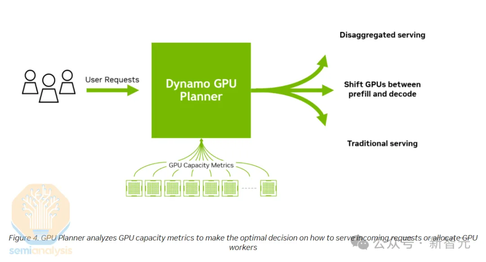
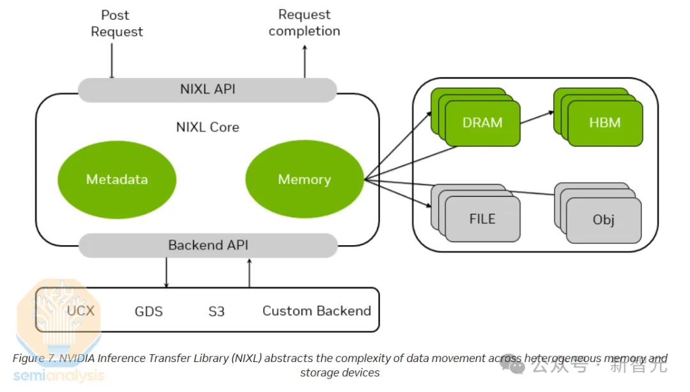
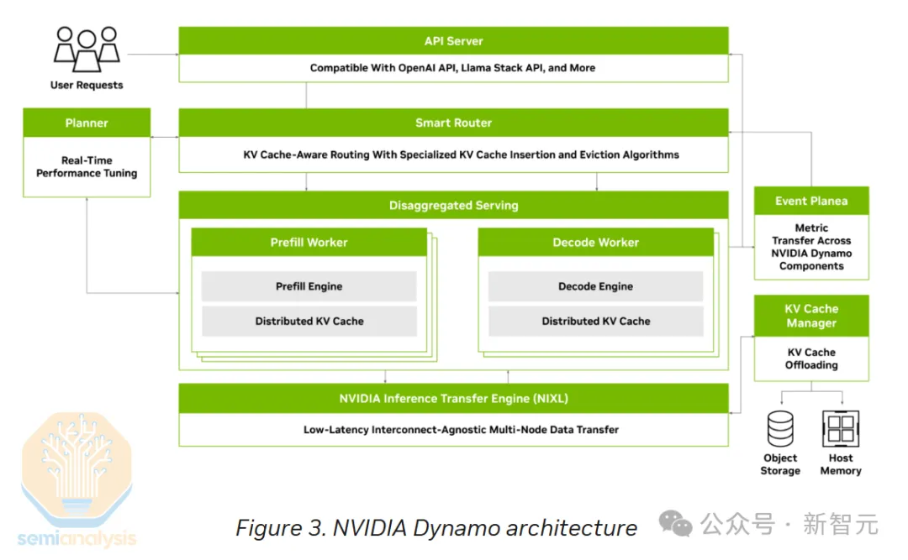

# 评:英伟达新发布的Nvidia Dynamo架构——简化推理部署和扩展的开放式AI引擎技术栈

版权所有 © 2025.03.22 林鹏程， 保留所有权利。

它在向我的仓库/车间模型演进, 同时可以参考我2025.02.01的文章["DeepSeek的仓库/车间模型架构: 根据DeepSeek的架构, 设计DeepSeek的仓库/车间模型架构
"](./DeepSeek_WW_Model_Arch_cn.md).

1. 智能路由（Smart Router）和 GPU任务规划器（GPU Planner）相当于调度器

   

2. NIXL（NVIDIA Inference Transfer Engine）类似于我在2021.06.19评价的微软Windows 11的
   DirectStorage技术使系统更加向“仓库/车间模型”演进，CPU和GPU更加向独立不交互的车间定义演进，
   更加以内存（仓库）为中心。(也可以参照我的文章
   ["预测: Intel和Microsoft都在向“仓库/车间模型”过渡(2021-06-22)"](./Intel_RISC_V_cn.md))

   

3. NVMe KV-Cache智能卸载系统: 相当于仓库管理的一个小技巧

4. 增强型NCCL集合通信框架: 描述太简略, 不知所谓, 在仓库/车间模型里没必要存在的东西.

5. 整体架构图画得很混乱, 架构设计师脑回路还没理顺.

   

参考文献

- 2025-03-21, 新智元, [英伟达超级Rubin细节曝光，黄氏法则再升级！最高1024GB显存，免费H100无人要](https://www.51cto.com/article/811262.html)
