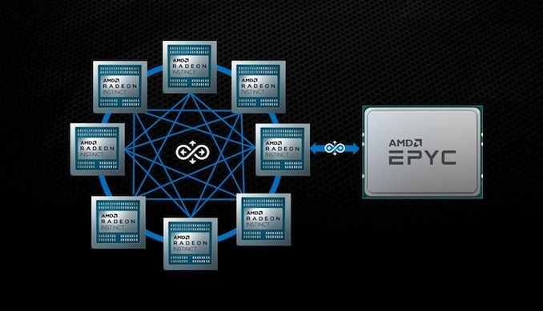
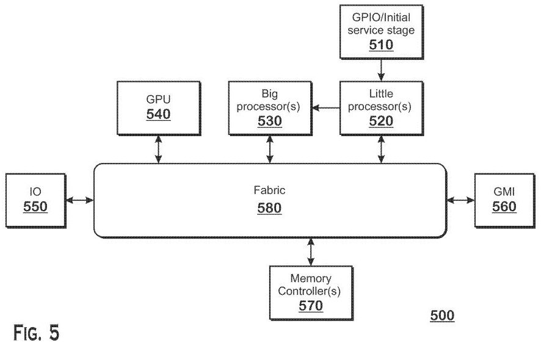

# 预测: Intel将用“RISC-V加x86兼容层”或“RISC-V加x86异构计算架构”开发新一代"仓库/车间模型"的CPU

版权所有 © 2021.06.14 林鹏程， 保留所有权利。

Intel应该是准备以RISC-V为核心，加x86兼容层，对标Apple M1开发新一代"仓库/车间模型"的CPU，同时还能开拓占领物联网CPU的市场。

如果开发x86兼容层太麻烦，有一个快速解决方案，因为我的“仓库/车间模型”对天然支持异构计算，可以在CPU内提供1~2个x86核心专门执行x86指令，提供兼容能力。

Intel最近麻烦挺大，前有Apple采用我的仓库/车间模型的M1芯片，不仅在性能大胜Intel的CPU,而且还保持更大的节能优势，
另外，我以前在博文上讲过，M1还有很大的优化空间，新的M2据说也快出来了，后有AMD赶超，可谓前有虎后有狼，Intel都急得临阵换帅（CEO）了。

Intel这个牙膏厂，它的原有的技术积累和开发路线可以说是不顶用了，如果有早就推出来了，当下只能大动作更新换代了，
现在唯一表现出全面超越"冯·诺依曼体系结构"的架构只有我的“仓库/车间模型”了，我想它除了“仓库/车间模型”之外，别无选择了。

最近有消息Intel 准备花 20 亿美元收购RISC-V的初创公司SiFive， 难道它准备以“RISC-V加x86兼容层”或“RISC-V加x86异构计算架构”，
对标M1开发新一代"仓库/车间模型"的CPU，同时还能开拓占领物联网CPU的市场。

如果ARM和RISC-V生产商加入“仓库/车间模型”CPU的竞争，将对Intel产生严重威胁，
目前我没有看到这方面的消息，但应该至少会有1~2家主要生产商加入竞争，市场进入激烈竞争阶段。
另外，微软的支持至关重要，特别是微软与高通有密切合作关系，联合开发了“Windows/ARM PC”。

巨大的x86存量市场仍然会给予Intel带来一段时间的资金来源和缓冲空间，未来的物联网市场更为广阔。RISC-V是开源的，
并且可以进行专有扩展，它是拥有优秀CPU设计人才的Intel的最好选择，也是Intel争取市场领导地位的最好选择。
危险与机遇并存，这是决定Intel生死存亡的时刻，如同凤凰涅槃，或浴火重生，或烧成死灰。

Intel CEO Pat Gelsinger最近宣布，该公司将开始向其他公司发放自己的x86处理器设计许可，作为其新的IDM 2.0计划的一部分。
鉴于Intel以前的许可政策，我认为这是Intel准备放弃x86. Intel发放的x86处理器设计许可的目标对象很可能是中国公司，
我认为x86是一种过时的即将被淘汰的设计，中国公司不应出价太高，避免成为冤大头。

参考：[Intel Offers $2 Billion for RISC-V Chip Startup SiFive: Bloomberg](https://www.tomshardware.com/news/intel-offers-dollar2-billion-for-risc-v-startup-sifive-bloomberg)

- 2021-06-14, 首发在新浪微博.
- 2021-06-15, 发布在 github, twitter, reddit/programming.
- 在reddit r/programming有一个很好的讨论。[链接](https://www.reddit.com/r/programming/comments/o0gxy3/prediction_intel_will_use_riscv_plus_x86/)

----

# 预测: Intel和Microsoft都在向“仓库/车间模型”过渡(2021-06-22)

从[《测试：Windows 11 提升了 big.LITTLE x86 CPU 的性能》(2021-06-21)](https://os.51cto.com/art/202106/667326.htm)
这篇文章看，Intel即将推出类似ARM big.LITTLE设计的x86 CPU，
AMD也有类似计划。
我认为是这是Intel向Apple M1（ARM）“仓库/车间模型”CPU过渡，
同时，微软泄露的 Windows 11 也改进调度设计，以支持Intel和AMD。

我认为Intel本来CPU在性能和节能都输给了Apple M1，
这时再搞大小核，恐怕性能与Apple M1的差距越来越大，
缩小一点节能差距没有什么大意义，
再说Apple 都准备推出 M2了。
只能解释这个新CPU仅是用来先模仿Apple M1的ARM设计，
再继续演化为“仓库/车间模型”CPU的过渡产品。

在除Apple M1外的其他ARM和RISC-V的仓库/车间模型CPU出现前,
MS与Intel和AMD一荣俱荣一损俱损，只能死撑，
在 Windows 11 中继续给予支持，
反正“仓库/车间模型”也是早晚要支持的，
顺手为，也不费事。

如果Intel、AMD和其它ARM和RISC-V生产商不生产“仓库/车间模型”CPU，
MS就算学Apple自己上阵开发CPU，也不可能跑去跪求Apple让M1运行Windows,
就算去了Apple也不答应. 最终导致windows失败。

当可运行Windows的ARM和RISC-V的“仓库/车间模型”CPU出现后，
微软就随时可以甩开Intel和AMD，
因为Apple用M1仿真运行以前的x86应用也非常好，
证明了从x86移到“仓库/车间模型”CPU很容易。
以前MS Windows运行在x86主要是因为x86比其他CPU性能好，
高通这个ARM生产商不给力，合作多年，Windows on ARM 一直表现不佳。
但现在这个障碍不存在了，而且x86明显过时了，
Intel硬生生地在一个RISC内核上再加一层x86马甲完全是画蛇添足，
该淘汰时就淘汰，留来留去留成绞索带。

intel都准备开放x86许可，以前可是严封死守的，
看来是真的是放弃了，准备回收点残余价值。

----

# 评：AMD Infinity Fabric 架构

x86+RISC-V异构计算架构是我的创新，2021年6月14日发表在微博，
我2021年6月15日在github的博客发表，隔几天发现这篇AMD专利申请文章了。
由`Joel Hruska`于2021年6月15日写的
[《AMD Is Working on Its Own Hybrid x86 CPU: Patent Filing》](https://www.extremetech.com/computing/323713-amd-is-working-on-its-own-hybrid-x86-cpu-patent-filing)
这篇文章的最早评论2021-06-16，这篇是根据以前的旧文章修改的，
以前的旧文章只是类似于ARM的`big.Little`核，专利的内容是在big核与Little核之间的任务转移方法。
该文仅在开头和结尾增加一小段`Hybrid x86 CPU`表述，非常突兀和不协调。

这篇文章提到了AMD的[“METHOD OF TASK TRANSITION BETWEEN HETEROGENOUS PROCESSORS”](https://www.freepatentsonline.com/y2021/0173715.html)
专利，它的内容是在big核与Little核之间的任务转移方法，
依据我的“仓库/车间模型”的10原则，AMD的这项专利技术是毫无必要的，
违反了任务分工原则、有序原则、明确原则。

从文章示意图上看，AMD以Infinity Fabric总线为中心，
实现CPU-CPU之间的任务转移，未来打算实现GPU-GPU，CPU-GPU之间的任务转移，
即车间之间的互联，我在制造工业内，还未见到过这种车间任意互联的架构。
这是个网状结构，非常混乱和复杂，扩展性差，灵活性差，数据利用效率差。
我认为它在同类处理器之间的任务转移相对容易，
在不同类处理器之间的任务转移是复杂和困难的，效果也不会太好。
我认为它远远不如我的仓库/车间模型简单、可靠、灵活、扩展性强，
以仓库（数据）为中心，数据存取效率高，大致类似我以前发的[微软数据工厂/管道架构和仓库/车间模型的比较](https://github.com/linpengcheng/PurefunctionPipelineDataflow/blob/master/doc/diff_WWModel_AzureDataFactoryPipe_cn.md)
实际上,尽管Apple M1尚未完全实现仓库/车间模型，但它已经是第一名了。

