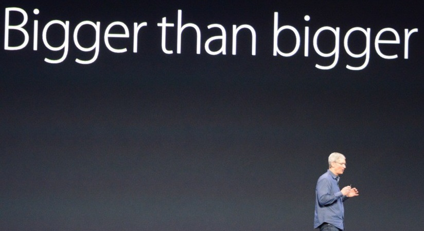
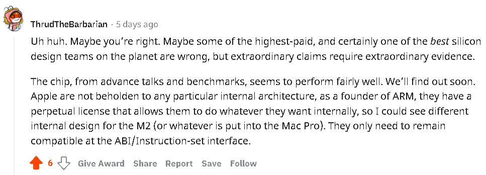
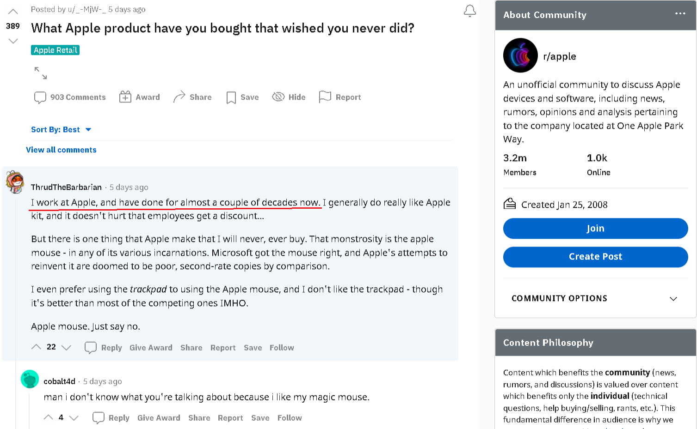
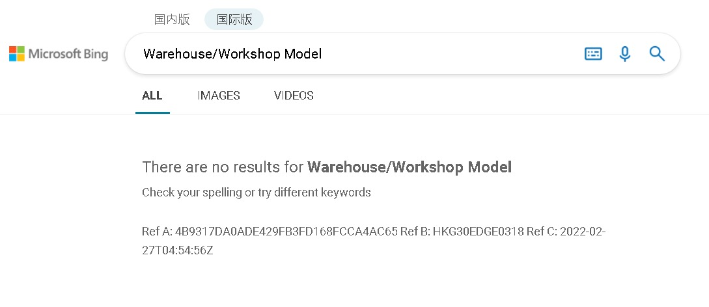

# Success Story

Copyright © 2018- Lin Pengcheng. All rights reserved.

This article was written on 2022-03-13.

**Creativity (idea) is the most important thing about innovation.**

## TOC

- [Apple M1 chip, MacOS, others](#Apple)
  - [M1 adopted My Warehouse/Workshop Models](#M1)
  - [M1 still needs a lot of optimization work](#M1-still-needs-a-lot-of-optimization-work)
  - [M1 Ultra is a mistake](#M1-Ultra-is-a-mistake)
  - [Why Apple is not the creator of the M1 architecture](#Why-Apple-is-not-the-creator-of-the-M1-architecture)
  - [M1 Supercomputing](#M1-Supercomputing)
  - [Almost all CPU and SoC companies are learning M1](#Almost-all-CPU-and-SoC-companies-are-learning-M1)
- [Intel](#Intel)
  - [Intel plans to fulfill "my prediction 8 months ago"](#Intel-plans-to-fulfill-my-prediction)
  - [Intel SoC](#Intel-SoC)
- [Qualcomm](#Qualcomm)
  - [Qualcomm SoC](#Qualcomm-SoC)
- [Microsoft](#Microsoft)
  - [Microsoft's AI computing platform Singularity's architecture](#Singularity)
  - [Microsoft Server Chips](#Microsoft-Server-Chips)
- [Future, Prediction and Others](#Future)
  - [Windows, MacOS, Linux and other OS](#OS)
  - [Programming language](#Programming-language)
  - [AI](#AI)
  - [Robot](#Robot)
  - [Software Design and Develop Automation](#Software-Design-and-Develop-Automation)
  - [Supercomputer](#Supercomputer)

My [Warehouse/Workshop Model](https://github.com/linpengcheng/PurefunctionPipelineDataflow#The-unification-with-Computer-Hardware-Architecture) is the way of the future. It perfectly fulfills two fundamental principles of science and industry: simplicity and unity. 

My warehouse/workshop model has been applied by almost all CPU/SoC design and manufacturing companies, it will inevitably cause changes in OS, programming languages, programming methodologies, application design and other fields from the bottom up, my theory will become the core and foundation of the IT theoretical system, many classic books and theories in the IT field will be eliminated by history!

Success Story:

<h2 id="Apple">Apple M1 chip, MacOS, others</h2>

<h3 id="M1">M1 adopted My Warehouse/Workshop Models</h3>

- [Comparison of Apple M1 chip and My Warehouse/Workshop Model computer hardware architecture](https://github.com/linpengcheng/PurefunctionPipelineDataflow#Follower-Case-Apple-M1-chip)

  - 2019-02-06, My Warehouse/Workshop Model‘s computer hardware architecture design was published on github. 

  - 2020-11-11, the Apple M1 chip adopted the "Warehouse/Workshop Model" design and was released.

  ```
  - Warehouse: unified memory architecture
  - Workshop: CPU, GPU and other ASICs
  ```

- [2020-11-30 News, Developer Delves Into Reasons Why Apple's M1 Chip is So Fast](https://www.macrumors.com/2020/11/30/m1-chip-speed-explanation-developer/)  

- [2021-07-28, Why my "warehouse/workshop model" can achieve high performance and low power consumption (take Apple M1 chip, Intel AVX-512, Qualcomm as examples)](https://github.com/linpengcheng/PurefunctionPipelineDataflow/blob/master/doc/why_wwmodel_fast_en.md)
  
### M1 still needs a lot of optimization work

- Apple M1 has not done global optimization of various core (workshop) scheduling.

- Apple M1 only optimizes the access to memory data (materials and products in the warehouse).

- Apple needs to further improve the programming language, compiler, and OS to support and promote my programming methodology.

  - [2021.11.15, OS kernel as DBMS-like ASIC: The future OS kernel will be a data-oriented scheduler (with Computer hardware and software integration architecture diagram)](https://github.com/linpengcheng/PurefunctionPipelineDataflow/blob/master/doc/OS_as_DB_en.md)
  
  - [2021.11.07, Foxpro's Database-oriented programming paradigm is the development direction of the future programming language](https://github.com/linpengcheng/PurefunctionPipelineDataflow/blob/master/doc/Mummy4Foxpro.md)
  
- My architecture naturally supports heterogeneous computing, supports a wider range of workshop types than Apple M1, with greater efficiency, scalability and flexibility.

- Apple M1 chip still needs a lot of optimization work, now its optimization level is still very simple, after all, it is only the first generation of works, released in stages.

### M1 Ultra is a mistake

M1 Ultra use "dispatch center (virtual global unified warehouse, integration layer or platform, the parent company of the enterprise group)" model, which is a variant of warehouse/workshop model. It has two warehouse/workshop models (M1 Max) managed by a single dispatch center.

This model can avoid the complexity of hardware scale too large, It's a simple and fast implementation. 

2022-03-14, I read in the Chinese news 
(["Apple'S M1 Ultra chip assembly secret found in patent"](https://www.cnbeta.com/articles/tech/1245843.htm)) 
that M1 Ultra uses UltraFusion encapsulation architecture based on TSMC Cowos-S5 architecture. 
I saw from the news and Cowos-S5 paper’s abstract (
[2021-06-01, [Wafer Level System Integration of the Fifth Generation CoWoS®-S with High Performance Si Interposer at 2500 mm2](https://ieeexplore.ieee.org/document/9501649)) 
that it is similar to "AMD Infinity Fabric Architecture" and "Intel UCIe" technology, 
with only chip interconnection function and no scheduler function.
reference:
2021-06-01, P. K. Huang; C. Y. Lu; W. H. Wei R&D, Taiwan Semiconductor Manufacturing Company, Ltd., Hsinchu, Taiwan, R.O.C.; [Wafer Level System Integration of the Fifth Generation CoWoS®-S with High Performance Si Interposer at 2500 mm2](https://ieeexplore.ieee.org/document/9501649)

I think:

- TSMC's approach doesn't have a scheduler because it lacks a complete base ecology, 
  but Apple can use MacOS as a scheduler.

- Apple & TSMC's chip interconnection method is a mistake. 
  The correct method should be memory interconnection, 
  splicing the memory of two M1 Max into one large memory (or virtual large memory). 
  Then M1 Ultra is not only A fractal system of M1 chip (standard warehouse/workshop model), 
  but also a **bigger** M1 chip (standard warehouse/workshop model).
  
  ----
  
  Apple has forgotten their previous slogan: "**Bigger_is_Better**" and "**Bigger_than_bigger**".
  
  ----
  
  It is also a simple and high-performance approach.
  It can be used as solution of future M1 Supercomputing.
  It maintains the consistency of the Architecture of the Apple M Series chips, 
  so it can maintain the simplicity, uniformity and compatibility of the system.
  
  <table>
	  <tr>
		  <td></td>
		  <td></td>
	  </tr>
  </table>

- In the future, Apple must implement my dispatching center technology 
  and implement OS kernel as DBMS-like ASIC. Currently, only Apple has a complete basic ecosystem. 
  So it's the only one that can do that.
  reference: [2021.11.15, OS kernel as DBMS-like ASIC: The future OS kernel will be a data-oriented scheduler (with Computer hardware and software integration architecture diagram)](https://github.com/linpengcheng/PurefunctionPipelineDataflow/blob/master/doc/OS_as_DB_en.md)

- MS windows + Intel (AMD), Google android + ARM can also be combined to have a complete base ecosystem, 
  but the coordination takes a long time.
  
- ThrudTheBarbarian, a member of r/chipdesign (a chip design forum) 
  who has worked at Apple for almost a couple of decades, 
  commented on my post on r/chipdesign on 2022-03-15 22:07:28(UTC+8)

  > Uh huh. Maybe you’re right. Maybe some of the highest-paid, 
  > and certainly one of the best silicon design teams on the planet are wrong, 
  > but extraordinary claims require extraordinary evidence.

  > The chip, from advance talks and benchmarks, seems to perform fairly well. 
  > We’ll find out soon. Apple are not beholden to any particular internal architecture, 
  > as a founder of ARM, they have a perpetual license 
  > that allows them to do whatever they want internally, 
  > so I could see different internal design for the M2 (or whatever is put into the Mac Pro). 
  > They only need to remain compatible at the ABI/Instruction-set interface.

  I don't agree with him, the M1 Ultra perform fairly well because it has two M1 Max spliced together, 
  I really can't imagine how bad architecture would make it perform worse than a M1 Max, 
  this is a really low standard for evaluation. 

  The Apple M1 Ultra's architecture is a complex solution,
  It destroys the simplicity and unity of my warehouse/workshop model which M1 adopts as architecture, 
  Therefore, the scalability and compatibility are extremely poor, 
  which brings about the complexity of the system, 
  and the manufacturing cost, process complexity and difficulty are all high.

  My architecture conforms to the two basic principles of simplicity and unity in scientific research, 
  mathematics, and industry. It has excellent scalability and compatibility. 
  Simplicity is the foundation of high performance and high reliability. 
  It can be judged and concluded by obvious scientific common sense: 
  my architecture is far superior to the architecture of the Apple M1 Ultra.

  r/chipdesign has deleted my post and banned me permanently, I can only post screenshots. 
  
  <table>
	  <tr>
		  <td></td>
		  <td></td>
	  </tr>
  </table>
  
  [ThrudTheBarbarian's commend full screenshot](./image/ThrudTheBarbarian_comments_M1Ultra_is_a_mistake_2022_03_15.png)
  
  [ThrudTheBarbarian work at Apple full screenshot](./image/ThrudTheBarbarian_work_at_apple_2022_03_15.png)
  
Conclusion: 
- Apple's understanding of my theory is not good enough.
- My warehouse/workshop model will definitely be the architecture of all computers (including supercomputers) in the future.

2022-03-14, [a discussion at r/programming](https://www.reddit.com/r/programming/comments/tdx4nc/m1_ultra_is_a_mistake/)

### Why Apple is not the creator of the M1 architecture

- Two years is exactly equivalent to a cycle of Intel's Tick-Tock strategy, 
  that is, a new product with a new architecture is released every two years.

  - 2019-02-06, My Warehouse/Workshop Model‘s computer hardware architecture design was published on github.
  
  - 2020-11-11, the Apple M1 chip adopted the "Warehouse/Workshop Model" design and was released.
  
- Apple just copied my theory and designed the M1 like a copier, 
  when Apple needed to expand the basic architecture to meet the M1 Ultra design requirements, 
  because of Apple's lack of understanding and innovation, 
  it destroyed the simplicity and unity of the my theory's architecture, 
  and my theory emphasized Fractal. 
  The creator of any theoretical system has its own unique, consistent philosophy and style, 
  the splice architecture of the M1 Ultra is completely inconsistent with the architecture of the M1, 
  and it is difficult to imagine that they are the same series of works.
  
- I don't find Apple to provide a relevant, systematic, innovative theory before and after the M1 release, 
  this is not a normal phenomenon, at least it should promote its innovative theory after the release of M1 
  to help developers develop software that adapts to the M1 architecture, 
  and promote the development and improvement of product ecology. 
  I think Apple should have no theory in this regard.

To sum up, the Apple M1 is a very inconsistent product that lacks systematic theory, 
which is not a characteristic of the work of a revolutionary theory creator.

### M1 Supercomputing

- 2022-03-09 18:45, I predicted on 
[my twitter @LinPengchengFA](https://twitter.com/LinPengchengFA)
that Apple would release M1 Supercomputing.

  If Apple wants to enter the supercomputing market, 
  it needs to re-customize the configuration of 
  CPU, GPU, ASICs and other internal integration workshops
  according to the requirements of supercomputing.

- [2021-07-28, Why my "warehouse/workshop model" can achieve high performance and low power consumption (take Apple M1 chip, Intel AVX-512, Qualcomm as examples)](https://github.com/linpengcheng/PurefunctionPipelineDataflow/blob/master/doc/why_wwmodel_fast_en.md)

> The "Warehouse/Workshop Model" is derived from the large-scale industrial production of the manufacturing industry, and is most suitable for large-scale and high-load heterogeneous parallel computing scenarios. Although when it is used in Apple M1 chip, Apple M1 chip not only becomes the fastest chip in the world, but also maintains an extremely low Power consumption. But in fact, its best application scenarios are supercomputers or cloud computing. Consumer-grade chips such as the Apple M1 chip cannot reach its potential.

> Why my "warehouse/workshop model" can achieve high performance and low power consumption? This is the display of the advantages of large-scale production and task division in the computer field. In addition, the warehouse is the center and the workshop is uniformly scheduled. The overall optimization effect is good, and the data access and exchange performance is high.

> If a task is independently used as a workshop, and its scale benefit exceeds the cost of opening it, then it should be set up as a workshop, paying attention to exceeding a certain production scale (computing amount). Professional workshops have lower production costs (power consumption) and higher production efficiency (performance).

> For computer SOC chips, its space is very limited. Unlike software projects, the cost of increasing the workshop is very low. It is necessary to divide the workshop into internal (integrated) workshops and external workshops. As long as the added ASIC (Application Specific　Integrated Workshop) is frequently used enough, and the overall benefit generated exceeds the benefit of using this part of the space as a general-purpose core (CPU, general workshop), the ASIC (Application Specific　Integrated Workshop) can be used Join the SOC chip and become an internal workshop. ASIC has the advantages of smaller size, lower power consumption, higher reliability, higher performance, stronger confidentiality, and lower cost.

### Almost all CPU and SoC companies are learning M1

Intel,Qualcomm,Microsoft and almost all CPU/SOC design and manufacturing companies are learning it. Because Intel&others' 10nm process is not as precise as the Apple M1's 5nm process, So it can't integrate as much memory as the Apple M1, ie: can't use the standard warehouse/workshop model, can only use variant "dispatch center (virtual global unified warehouse, integration layer or platform, the parent company of the enterprise group)" model, and improve the shortcomings of not integrating large memory by increasing the cache, This seems to implement a large repository as a two-level repository: a small integrated warehouse (cache) and a large external warehouse (memory).

## Intel

<h3 id="Intel-plans-to-fulfill-my-prediction">Intel plans to fulfill "my prediction 8 months ago"</h3>

- [2021-06-14, My prediction: Intel will use "RISC-V plus x86 compatibility layer" or "RISC-V plus x86 heterogeneous computing architecture" to develop a new generation of "warehouse/workshop model" CPU](https://github.com/linpengcheng/PurefunctionPipelineDataflow/blob/master/doc/Intel_RISC_V.md)
    
- [2022-02-14 News, Agam Shah, Intel's plan to license x86 cores for chips with Arm, RISC-V and more inside](https://www.theregister.com/2022/02/14/intel_x86_licensing/)
    
### Intel SoC

News: Intel are learning My Warehouse/Workshop Model (Apple M1 chip)

- [2022-01-06, Apple loses lead Apple Silicon designer Jeff Wilcox to Intel](https://appleinsider.com/articles/22/01/06/apple-loses-lead-apple-silicon-designer-jeff-wilcox-to-intel)

## Qualcomm

- [2021-07-28, Why my "warehouse/workshop model" can achieve high performance and low power consumption (take Apple M1 chip, Intel AVX-512, Qualcomm as examples)](https://github.com/linpengcheng/PurefunctionPipelineDataflow/blob/master/doc/why_wwmodel_fast_en.md)

### Qualcomm SoC

News: Qualcomm are learning My Warehouse/Workshop Model (Apple M1 chip)
  
- [2021-7-3 News, Qualcomm plans to design an M1 competitor for PCs—sans ARM](https://arstechnica.com/gadgets/2021/07/qualcomm-ceo-we-can-beat-apple-because-we-poached-talent-from-them/)
  
- [2021-7-1 News, Qualcomm's new CEO eyes dominance in the laptop markets](https://www.reuters.com/technology/qualcomms-new-ceo-eyes-dominance-laptop-markets-2021-07-01/)

## Microsoft

<h3 id="Singularity">Microsoft's AI computing platform Singularity's architecture</h3>

- [Microsoft's AI computing platform Singularity's architecture has plagiarized my Warehouse/Workshop Model](https://github.com/linpengcheng/PurefunctionPipelineDataflow/blob/master/doc/Follower_MS_Singularity_Architecture_en.md)

   Its paper does not cite my paper in the references, and Microsoft bing blocked the word "Warehouse/Workshop Model", previously bing could search for it, and Google can always search for it as well. It's bury one's head in the sand. It is extremely malicious plagiarism.
   
   
   
  - [a discussion at r/programming](https://www.reddit.com/r/programming/comments/t2drdk/microsofts_ai_computing_platform_singularitys/)
  
  - [a discussion at r/softwarearchitecture](https://www.reddit.com/r/softwarearchitecture/comments/t2dz7t/microsofts_ai_computing_platform_singularitys/)
  
  - [another discussion at r/programming](https://www.reddit.com/r/programming/comments/t8bpjn/the_clean_architecture_from_an_objectoriented/hzn4d42/?context=3)
  
  - [Plagiarism, wikipedia](https://en.wikipedia.org/wiki/Plagiarism)
  
    > Plagiarism is the representation of another author's language, thoughts, ideas, or expressions as one's own original work. In educational contexts, there are differing definitions of plagiarism depending on the institution.[3] Plagiarism is considered a violation of academic integrity and a breach of journalistic ethics. It is subject to sanctions such as penalties, suspension, expulsion from school or work, substantial fines and even imprisonment.
    
    > - Semantics-preserving plagiarism
    >   - Translation
    >   - Paraphrase
    > - Idea-preserving plagiarism
    >   - Appropriation of ideas or concepts
    >   - Reusing text structure

### Microsoft Server Chips

News: MS Server Chips are learning My Warehouse/Workshop Model (Apple M1 chip)

- [2022-01-12, Microsoft Hires Former Apple Chip Architect: Mike Filippo](https://www.macrumors.com/2022/01/12/microsoft-hires-apple-chip-engineer/)

- [2022-01-12, Apple loses second key chip engineer, this time to Microsoft](https://appleinsider.com/articles/22/01/12/apple-loses-second-key-chip-engineer-this-time-to-microsoft)
    
- [2022-01-14, Microsoft Poaches Key Apple Engineer to Work on Server Chips](https://www.electronicdesign.com/technologies/embedded-revolution/article/21214092/electronic-design-microsoft-poaches-key-apple-engineer-to-work-on-server-chips)

- [2020-12-22, Microsoft Developing Proprietary ARM Chip to Compete with Apple’s M1 ---- A new report suggests Microsoft will develop and Apple M1 rival in the form of an ARM chip for Azure servers and Surface products.](https://winbuzzer.com/2020/12/22/microsoft-developing-proprietary-arm-chip-to-compete-with-apples-m1-xcxwbn/)

<h2 id="Future">Future, Prediction and Others</h2>

<h3 id="OS">Windows, MacOS, Linux and other OS</h3>

- [2021.11.15, OS kernel as DBMS-like ASIC: The future OS kernel will be a data-oriented scheduler (with Computer hardware and software integration architecture diagram)](https://github.com/linpengcheng/PurefunctionPipelineDataflow/blob/master/doc/OS_as_DB_en.md)

### Programming language

- [2021.11.07, Foxpro's Database-oriented programming paradigm is the development direction of the future programming language](https://github.com/linpengcheng/PurefunctionPipelineDataflow/blob/master/doc/Mummy4Foxpro.md)

### AI

- [2021-04-30, Explainable AI System use the law model, the Warehouse/Workshop Model, classic AI(expert system, logic programming), machine learning](https://github.com/linpengcheng/PurefunctionPipelineDataflow#The-unification-with-classic-AI-and-modern-AI-and-explainable-AI-technology)
 
### Robot

- [2021-02-02, Robots and transformers](https://github.com/linpengcheng/PurefunctionPipelineDataflow#Robots-and-transformers)
- 2022-02, MIT’s CSAIL, [ElectroVoxel: Electromagnetically Actuated Pivoting for Scalable Modular Self-Reconfigurable Robots](https://hcie.csail.mit.edu/research/Electrovoxel/electrovoxel.html)
  - 2022-02-23 News, [Scientists create cube robots that can shapeshift in space](https://www.engadget.com/shapeshifting-robots-space-exploration-mit-csail-electrovoxels-140026431.html)
  
  It's like the original version of my Warehouse/Workshop Model robot, a toy-grade implementation. 
  In my article, its final implementation should be a Battlestar Galactica robot (Transformers).

### Software Design and Develop Automation

- [Software Design and Develop Automation (SDDA)](https://github.com/linpengcheng/PurefunctionPipelineDataflow#Software-Design-and-Develop-Automation)

### Supercomputer

- [2021-07-28, Why my "warehouse/workshop model" can achieve high performance and low power consumption (take Apple M1 chip, Intel AVX-512, Qualcomm as examples)](https://github.com/linpengcheng/PurefunctionPipelineDataflow/blob/master/doc/why_wwmodel_fast_en.md)

- [2021-04, HPE Cray Supercomputer likes my "warehouse/workshop model" twice at twitter](https://github.com/linpengcheng/PurefunctionPipelineDataflow#HPE-Cray-Supercomputer-likes-it-at-twitter-in-2021-04)
