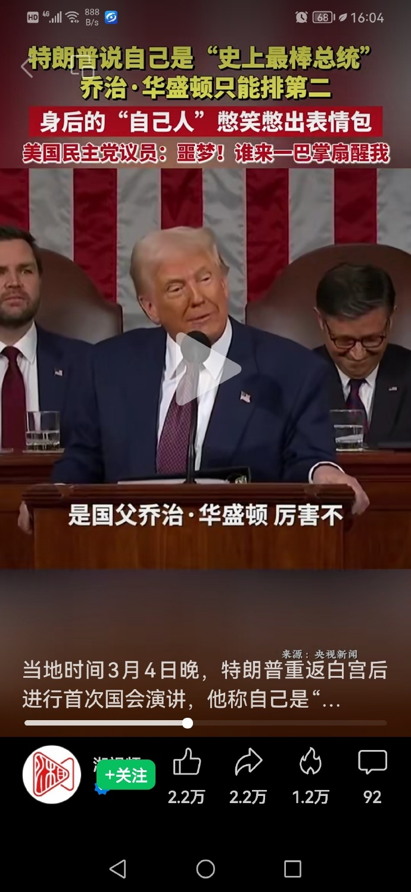
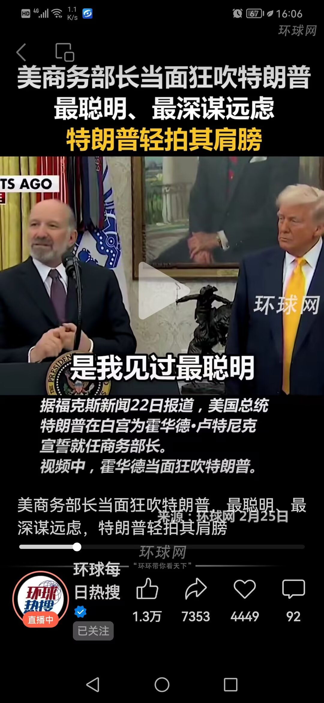
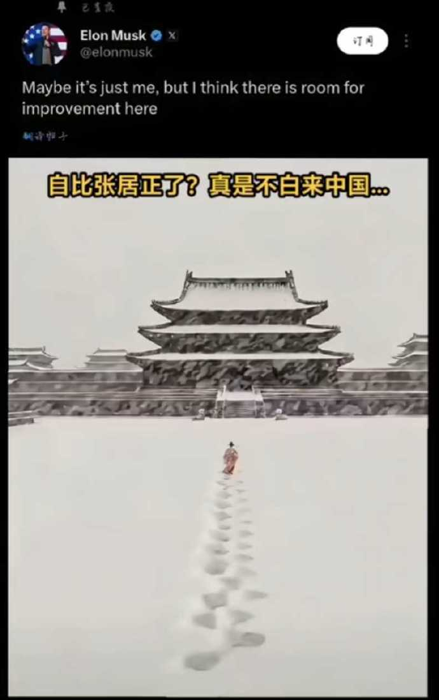
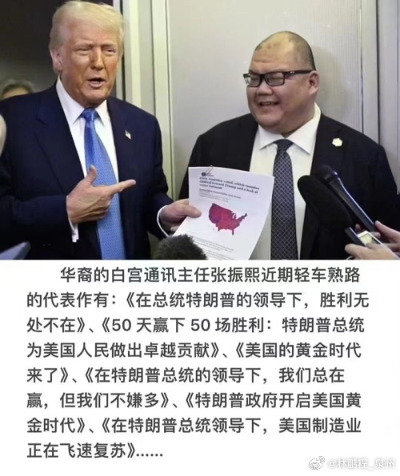
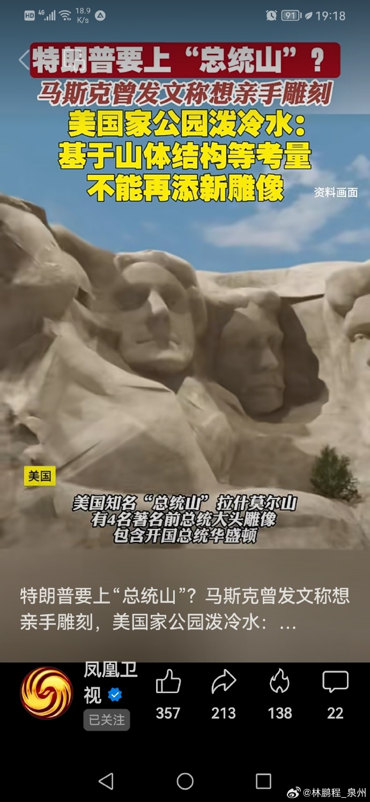

# 从"特朗普学习成圣法"到"俄罗斯数字发展部"

版权所有 © 2025.03.08 林鹏程，保留所有权利。

本文于2025-03-08首发在我的微博, 现在按微博发表时间线补录在github.

 - 2025-03-08, 哈哈！懂王是不是修练了我的“成圣法”？马斯克转推上贡的？
   成圣法地位越高、成就越大的人修练起来爽度越高。懂王不是从初阶到高阶逐步练起，
   直接就是最高阶爽度狂飙，原地飞升，如果明心见性功夫不够，心性不足，
   容易走火入魔翻车！最关键的是他目前的成就不足以支撑他的宣言！
   一般来讲，最强的应从开国或中兴两者间选一个，懂王距离中兴之主还远着呢！

   <table width="100%" cellspacing="2" cellpadding="2" border="1">
     <tbody>
       <tr>
         <td valign="top">
            
         </td>
         <td valign="top">
            
         </td>
       </tr>
     </tbody>
   </table>
   
- 2025-03-15, 懂王和马斯克这哥俩都在修练我的成圣法，看起来错不了，
  共同点都是太心急，事没办成，称号先挂上了，走歪门邪道。
  如果这哥俩诚心正意的练功，我倒是不介意兼任一下美国国师、太傅和太师的称号，
  但这哥俩走歪门邪道，这称号要不得！
  成圣法要求成就与称号要相匹配，德要配位，成就要让人信服或无可驳辩。
  我的理论一再强调这点，这哥俩都没往心里去，连自己人都笑话。

  

- 2025-03-26, 懂王第二任期一开始, 就努力学习践行我的《成圣法》上的各种方法, 
  玩得很开心, 很上头啊! 自封"史上最棒总统"称号后，再上宏伟叙事、气势磅礴、排比铺层的公文法，
  还招了个华人来打理，以确保味道纯正！从一个胜利走向另一个更大的胜利，从伟大走向更伟大，
  greater than greater,  bigger than bigger! 伟大、光明、正确，文德武成，泽被苍生，千秋万载，一统世界！
  不过要小心，懂王学习《成圣法》进入疯魔期或心太急走火入魔，后果难以预料！

  

- 2025-03-29, 俄罗斯数字发展部和对美关系相关部门学习我的理论

  今天, 我发现俄罗斯联邦数字发展、通信和大众传媒部
  （简称“俄罗斯数字发展部”， d-russia.ru）访问了我的理论的github博客仓库。

  前几天，大约在我发布特朗普和马斯克学习我的成圣法之后，
  我就发现有来自俄罗斯搜索网站的翻译服务translate.yandex.com的访问，
  我大约推测是“俄罗斯对美关系相关部门”的访问，因为想要搞好对美关系，
  首要的问题就是了解美国总统的想法，因此来访问我的成圣法。

  我的github博客讲述了我的IT理论和成圣法，IT理论有英语版，
  IT人员更倾向用Google和Bing搜索，英语也都很好，俄罗斯是欧洲国家语系，
  英语更不是问题，不会使用俄罗斯搜索网站的翻译服务translate.yandex.com。 

  我的成圣法只有中文版，结合我最近发布的内容，推测访问者是俄罗斯对美关系相关部门，
  但俄罗斯搜索网站的翻译服务translate.yandex.com用户很多，这不能成为证据。

  过了几天，就来了“俄罗斯数字发展部”，这就说明前一个访问者来头不小，
  可以和“俄罗斯数字发展部”交流推荐技术了，结合访问的内容，
  不难推测他是来自“俄罗斯对美关系相关部门”。这种部门眼光还是有的，
  顺便看到我的IT理论这么牛逼，就向“俄罗斯数字发展部”推荐了我的理论。

  我的《成圣法》懂王看了, 俄罗斯数字发展部和对美关系相关部门看了, 
  普京十有八九也看了, 忽然感觉好象少了什么, 他看过了吗?

  

- 2025-04-01, 特朗普学成圣法，以他的权利，这确实是最快的不朽途径，但是否成圣就不一定了。
  方法总比困难多，山体不够用，在山顶建个铜像石像什么的很容易，
  如果技术够的话，我怀疑他都想把月亮雕成他的大头像，让全世界仰望。
  但如果没有相当的成就，最终也不会被真正认可，很可能被后任或民众拆除。 ​​​

  
  
