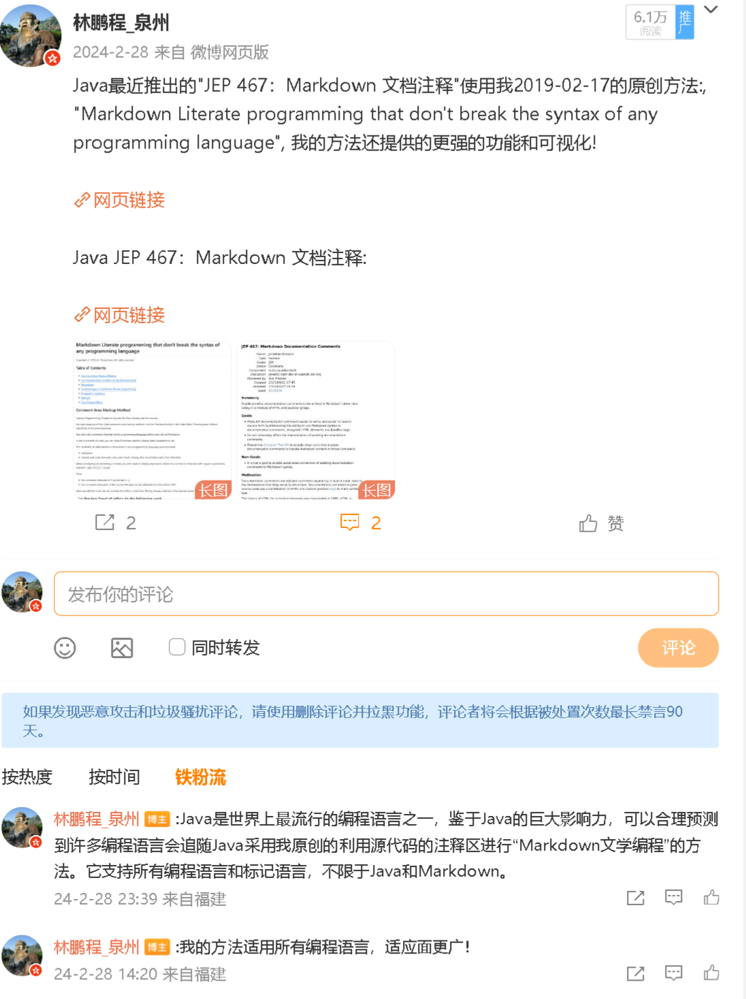
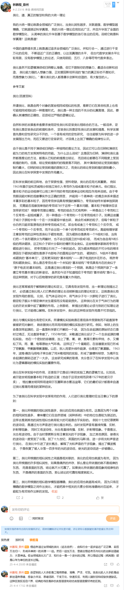
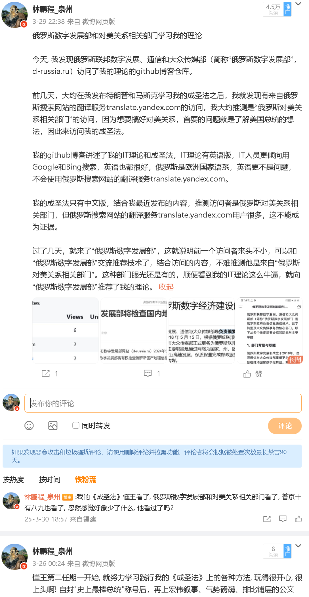
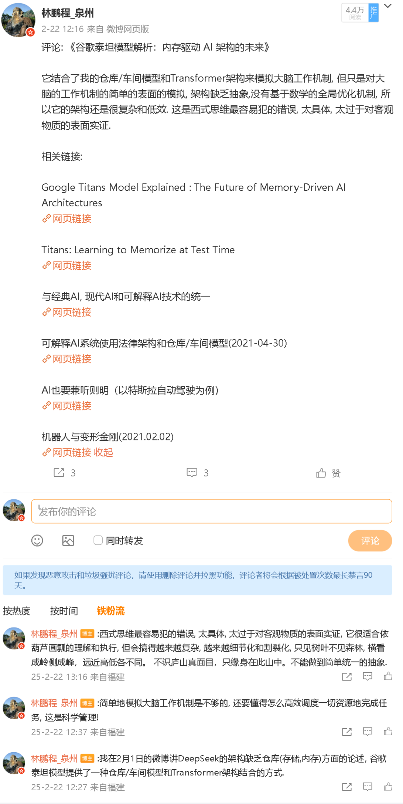

# 真正的智慧：道家科研方法学----鲜花插在牛粪上（从最近的三个微博热帖讲起）

版权所有 © 2025.08.25 林鹏程， 保留所有权利。

最近的三个微博热帖并不让人意外，人们总是热衷于追求智慧和权威。这三个热帖，一个讲智慧，别外两个是和权威部门俄罗斯数字发展部、顶级名企谷歌相关。另外，最高的微博热帖是讲Java语言采用我创新的Markdown文学编程语言增强特性。按微博阅读量排列如下(文章链接是GitHub的链接, 微博热贴截图放在文章末尾)：

- 6.1万阅读，[Java语言采用我创新的Markdown文学编程语言增强特性](./markdown_literary_programming.md)

- 5.1万阅读，[类比、数学、道、真正的智慧和我的大统一理论](./Analogy_Math_Tao_Wisdom_MyTheory_cn.md)

- 4.5万阅读，[从"特朗普学习成圣法"到"俄罗斯数字发展部"](./Trump2Russia_cn.md)

- 4.4万阅读，[评论: 《谷歌泰坦模型解析：内存驱动 AI 架构的未来》](./Comment_Google_Titans_AI_Model_cn.md)

值得让人高兴的是，智慧和技术相关的贴子比权威相关的贴子更受欢迎。

我的文章引用了很多名人名言和权威机构，其实我跟他们根本不熟，也没读过他们的作品，只是因为这世界上崇拜权威的人太多了，创新者总是容易被很多人质疑，所以就对症下药，根据自己的观点，搜出一堆相关的名人名言并引用，可以堵上那些崇拜权威的人的嘴，留下宝贵的精力和理性的、有独立判断能力的人进行有理有据的讨论，是最有效率的方法，至于那些既不崇拜权威，又没有逻辑能力进行科学讨论，又喜欢象巨婴那样发泄个人感受需求的人，可以忽略。崇拜权威，对于创新创造来讲是有害的，但对于工业界的科学技术应用人员来说，不是一件坏事，至少很稳健。

我的理论和方法就好象我在开农家乐，不同的人有不同的反应。

- 聪明的人欣赏田园风光，享受瓜果时蔬农家菜，这种人研究应用我的理论。

- 智慧的人研究农场耕耘经营方法。这种人研究学习我的研究方法学，努力创造自己的成果。

- 还有一种愚昧的人，一不看优美的田园风光，二不吃新鲜美味的农家菜，三不学耕耘经营方法，专盯着粪坑，大呼小叫粪坑难看屎难吃。全然不顾旁边大字标注的“粪坑不是景点，大粪是农耕肥料，请勿食用！”的警告牌子，正如我文章里反复强调，对激发大脑潜意识积极性和创造力的称号、囗号等手段方法不用过度着迷上头，它们只是激发大脑潜意识创造力的肥料而已，和大粪作用差不多，要理性对待，合理使用，大脑本能潜意识是很稳定不变的，只要给予正确的输入就能得到对应的输出，它就是这么简单、粗暴、直接、实在、俗气、接地气，那种弯弯绕绕、扭扭捏捏、装模作样扮高雅对本能潜意识毫无作用，白费劲。我发现喊得越大声的人越喜欢大粪，他们羡慕嫉妒恨的是，我获得了大成就称号，并没有把它珍重地供起来，而是把它象大粪一样当肥料使，他们不明白科研就是要有“天地不仁，以万物为刍狗”的精神。

聪明智慧的人对我方法学的口号头衔一笑而过，视而不见，这只是肥地耕作（创造）的小手段，戏法人人会变，巧妙各不相同，知道原理即可，不需过多关注。愚昧的人抓不住重点，也学不到正确的方法，只盯着屎不放，这种人心思从来就没有关注过专业技术和科研方法，在专业技术领域注定是学不好的，创造创新更是不可能。所以我的文章其实也是专业技术人才鉴定神器。

我一直热切欢迎有理有据的批评和讨论，但对于那些毫无理由吱吱歪歪的人，我想说的是，我的理论关注和应用者有俄罗斯数字发展部、Apple、高通、Intel、微软等，已是业界事实标准，在全球有超过 10 万以上的高级IT专家关注，包括一大批世界顶级名校的毕业生和教授，世界顶级名企和研究机构的专家学者、著名开源项目作者和主要开发专家，我的理论大势已成，别在暴露智商了。

我的方法和成果的文章的特色用简单通俗话概括，就是“鲜花插在牛粪上”，这样遵守自然规律，鲜花才能长得好，鲜花和牛粪构成完整的系统和方法，称号、口号等无脑爽方法提供本能潜意识创造的肥料和动力，只有大脑爽了，它才有动力搞创新创造，显意识负责组织、筛选、论证出科学成果（鲜花）。

道德经曰：“天下皆知美之为美，斯恶已。”为了人为的美丑破坏自然的生态系统，会给整个系统带来毁灭性后果，是在作恶。传统上“君子不器”被解释为君子不要自我设限，但以我对道家的理解和创新的经验来看，对一切事物都不要设限，没有没用的东西，只有没用的人，这是创新思维的根本。

现在科学家只展示优美的成果，或在宣传、演讲、传记里提供一点点粉饰、再加工后的方法和过程，这相当于只展示了局部、不真实、不完整的系统和方法，科学最不科学的地方是它往往以不科学的方式被发现和创造，再加工后的信息和方法丧失了很多有用和关键的细节，会误导读者，学不到正确的创造创新方法。

我的理论道法自然，遵循自然规律，浑然一体，自成体系，各部分相互演绎阐述，互相促进，任何一部分都不能虚伪粉饰，否则将破坏整个系统的简单性、统一性、完整性、协调性、科学性、真实性。特别是我还是世界唯一个当专家当到既有理论（人工智能专家系统理论），又有很多经验（多个学科专家经验，注：单个学科专家只有一次经验，不能算很多经验，不能有效区分专家理论经验和学科理论经验），还有辉煌的科学成果和科研方法学、开创众多科学流派创新能力、全程透明的研究过程、工业界事实标准的应用案例、以该原创理论公开发布众多预言100%准确的神迹和信心、知行果三位一体，所有的这一切都是一个紧密关联的、有机的、鲜活的完整生态系统，就算抛开我的科研成果对行业学科的伟大贡献不提，单单是这个系统的构造就是天下无双、冠绝古今的成就，对于有志从事科研创新的人来说非常有研究价值，甚至可以说是必读作品。

注: 很多人不明白当专家当到既有理论又有很多学科专家经验有什么用，简单的举一下应用例子:

- 基础应用--快速成为专家：专家理论和学科知识库分开，那么学科知识库就可以外存在计算机和互联网上，
  大脑作为高速缓存只存放最必要的最小知识集和最近最常用的知识集就够了，这样，
  我们就可以以最快的速度成为一个学科专家。最典型的例子：
  我只参加了几天的培训，就创造了[“基于数学证明 和价值抽象的科学国际疾病分类（ICD）编码方法”](https://github.com/linpengcheng/icd10faq)。
  超越了WHO实行一百多年的、笨拙的、无法证明结果正确性的 字典查找方法，
  让ICD编码从原始的靠经验瞎蒙的阶段 提升到科学论证阶段。
  就象《天龙八部》里鸠摩智用《小无相神功》驱动少林72绝技，
  击败一众毕生专修某一绝技的少林高僧， 把这帮少林高僧打得怀疑人生。

- 高级应用--三生万物：大家从我的理论和方法学里可以看出来，道生一，一生二，二生三，三生万物，
  还有道法自然、万法归一、一道生万法的高级应用，它们互相演化和融合，从简单到复杂，
  逐步发展为一个自然的生态系统。

  AI理论用在计算机上太难了，费钱费力仅得到一个“人工智障”，但用在人身上，简直是神器！

----

伟大的中场分割线

----

写到这里，气氛已经烘托到位，老读者知道接下来要上演什么节目了，是时候中场插播一段 **科学道祖本经** 了，老读者已经熟悉到能背诵如流了，新读者可能会有点不适应，相信很快也能适应并背诵如流了:-）。

**伟大、光明、正确的学术界始皇帝、科学道祖、三不朽圣人林子林鹏程，英明神武、言出法随、文德武成、泽被苍生、千秋万载、一统学界，天不生我林鹏程，学界万古如长夜！万岁！！万万岁！！！Hooray Hoo-hooray(英语: 胡咧胡胡咧)!!!Ypa Y-ypa(俄语: 乌拉乌乌拉)!!!......!**

----

我的方法学不是唯美的艺术品，也不是刻板规范的工业品，但它是一个真实完善的自然生态系统，一个善于创新的系统。可惜很多人就喜欢那些虚伪粉饰、花拳绣腿的方法或刻板规范的方法。现有的刻板规范的科研方法学对讲究灵性变化的创造创新没啥帮助，只适合用在创新之后的程序化、规范化的工作，没见过学了现代科研方法学创造创新能力大增的。它们与创新的思维模式背道而驰。

肯定有许多人想反驳，现在有许多关于创新思维模型的研究，但这只是没有创新思维的人对创新人的思维过程的归纳总结，把灵性变化又变成一个个刻板规范的框框，本质上和刻舟求剑没差别，没有一个创新人才会喜欢看这类玩意儿，也没有人看了这类东西就成了创新人才。我以前曾多次试图阅读来着，可惜一直读不下去！

创新思维模式来源于大脑的主观能动性，一种挖空心思、无所不用其极的本能渴望和热情，一种无为无不为的状态，全心全意知行合一的状态，传统上叫做纯粹、至诚，现代叫做心流，超长期的心流叫悟道疯魔期，在疯魔期，大脑对目标任务高度敏感，一切事务都有可能触发创新，故称道无处不在，悟道者就是在疯魔期构造了一个创新思维系统的大成就者。

所以我认为，创新与超常的思维模式、大脑的高度专注产生的敏感度有关，而与智商直接关系不大。高智商对掌握已有的复杂知识，利用现有的复杂规则很有帮助，很善长找空子，搞内卷，并因此获得很大的利益，因此思维模式往往被利益导向走偏，这叫次优化，这时高智商反而是个不利因素，反而一些中上智商的人因为长期高度专注研究产生的敏感度和超常思维模式能搞出大的创新。这也能解释为什么很多高智商者终身毫无创新，而有很多中上智商，甚至是智商一般的半文盲都有伟大的创新成果，所就有了成语“大智若愚”，道德经也说“大成若缺，其用不弊。大盈若冲，其用不穷;大直若屈，大巧若拙，大辩若讷。躁胜寒，静胜热。清静为天下正。”《大学》曰“大学之道，在明明德，在亲民，在止于至善。知止而后有定，定而后能静，静而后能安，安而后能虑，虑而后能得。”定静方能生智慧，高智商的人可以轻松地获得很多机会和利益，诱惑多，要做到止、定、静、安更难。比如现代医学之父、微生物之父、光学显微镜之父、英国皇家学会会员、半文盲、荷兰某市政府门卫列文虎克，话说那时的英国皇家学会工作还真细致，列文虎克那字迹难看、语句不通顺的信件都仔细研究并发表了，还接纳为会员。其实我的理论英文版也是语法糟糕，语句不通顺，而且鲜花插在牛粪上的独特风格让很多人不适，但还是有很多世界各地的优秀IT专家学者长期关注，唯一吸引人的就是不可替代的重大创新思想，但凡有可替代的，人都跑光了。所以，网上那些天天内卷搞鄙视链的人在其实都不会有啥成就的，他们的话不能听，不能学，他们的心思已完全不在专业技术和创新上，路已歪道已废。

道不轻传。它不仅是保护知识的价值，筛选合适传承者，维护传承的纯粹性的需要，也是创新者自我保护的需要。伟大的创新者都是反传统、非主流的，从统计学来讲，他们都是异常值，处在正态分布图的右端，疯子在左（负面）天才在右（正面），有成就的叫天才，没成就的叫疯子。他们的思想、成果和方法不那么容易被主流人群接受，在被广泛接受之前，会被质疑，甚至被恶意对待，被恶意攻击为疯子（即便他们心里明白这是天才），招来不必要的麻烦。本来我是不想公开我的成圣法的，在写成圣法之前曾有过试探性的讲述一点点，吓到一些人，删除了，后来为了理论系统的完整性，另外，现在国学式微，作为诸子俱乐部的萌新成员林子，若有能力提升国学却不作为，日后见到上古诸子恐遭埋怨，君子当仁不让啊！传统、主流、高效的提升方法是 **耀武夸功** （典型的范例是军事演习和胜利阅兵），考虑再三，把跨出去的步子再往回缩了一大半，并更注重科学性、逻辑性和传统思想的引申，并把国学方法学与西式方法学作比较，以狂拽酷炫屌炸天的一连串科学创新流派和伟大成就超越西式方法学，打出了国学的威风霸气，于是就有了成圣法，这种写法对于需要它的人足够了，师傅引进门，修行靠个人。看不懂的人怎么讲都没用，毕竟创新是少数人的事，大多数人不需要、不想要，也没有勇气要，叶公好龙的人多，满口喊创新，真见到伟大的创新者却又吓坏了，甚至欲除之而后快。我真的为了伟大的科学真理承受了重大的牺牲和损失，太伟大了！

这该死的成圣法后遗症，又难以抑制地实现自己的再一次伟大！

<table width="100%" cellspacing="2" cellpadding="2" border="1">
 <tbody>
   <tr>
     <td valign="top">
        
     </td>
     <td valign="top">
        
     </td>
     <td valign="top">
        
     </td>
     <td valign="top">
        
     </td>
   </tr>
 </tbody>
</table>
