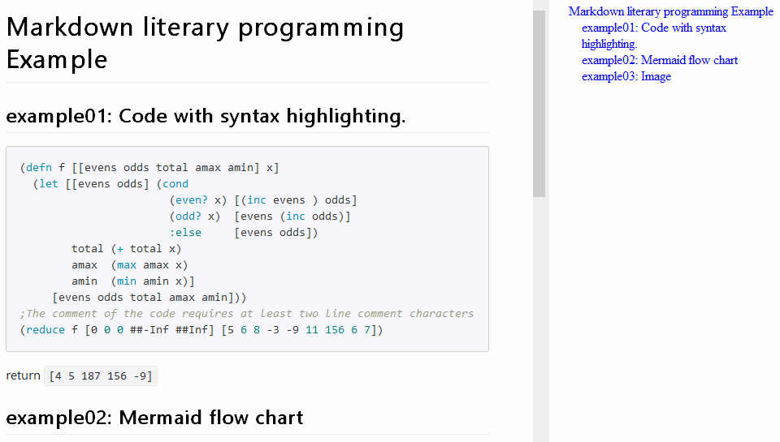
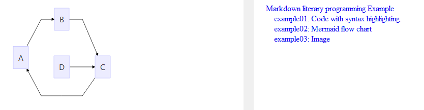
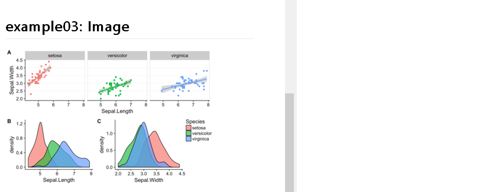

# Markdown Literary programming that don't break the syntax of any programming language

Copyright © 2018 Lin Pengcheng. All rights reserved.

## Table of Contents
- [Comment Area Markup Method](#Comment-Area-Markup-Method)
- [Live Preview Panel of editor do the following work](#Live-Preview-Panel-of-editor-do-the-following-work)
- [Advantages](#Advantages)
- [Disadvantages of traditional literary programming](#Disadvantages-of-traditional-literary-programming)
- [Notepad++ Solutions](#NotepadPlusPlus-Solutions)
- [Example](#Example)
- [Live Preview Effects](#Live-Preview-Effects)

## Comment Area Markup Method

Literary Programming, Programming was the first, Literary was the second.

the main purpose of the Code comment area markup method is 
to live Preview directly in the Code Editor Preview panel 
without exporting or any preprocessing.

*Just add a line comment character of the programming language 
before each line of Markdown.*

In the comments of code, you can draw flowcharts, tasklist, 
display data visualizations, etc.

The method is to add extension instructions 
in any programming language comment area:
- markdown
- manual eval code, live eval code, print result, 
  display data visualization and other directives

When previewing or converting a format,
you only need to simply preprocess: 
delete line comment characters with regular expressions, 
example: `sed 's/^;//'  x.clj`

Note: 

- line comment character of Clojure(Lisp) is `;`
- line comment characters of the current file type
  can be obtained from the editor's API.

when we edit the code, we can preview the effect in real time. 
Editing literary code has a live preview panel like most markdown editors.

## Live Preview Panel of editor do the following work

```clojure
(cond
  (or (= file-extension-name ".md")
      (= file-extension-name ".markdown"))
       parse+view as a normal markdown file
  (empty? line-comment-characters-of-the-current-document-type)
       parse+view as a normal text file 
  :else
       (do 0. get line-comment-characters-of-the-current-document-type
           1. get full-text-of-the-current-document
           2. delete using regular expressions line comment characters to get markdwon string.
           3. live Preview markdown string
           4. Can easily export directly to PDF or HTML))
```

## Advantages

- fast, live, simple, no interference.

- It don't break the syntax of any programming language, you can compile directly. 
  comment area markup method can be applied to any programming language and any markup 
  (including Org,rst, asciidoc, etc.), which is the greatest advantage.

- you only need a single line code to delete line comment characters using regular expressions, 
  then you can use any Markdown parse or converter.

- Support any code editor that supports Markdwon Live preview, 
  allowing the source code of any programming language to become rich text in real time. 
  In the code's comment area, You can use the markdown to draw flowcharts, tables, task lists, 
  and display images on the live preview panel, enhance the readability of your code.

- If you extend the Markdwon tag, you can implement the eval code, print result, display 
  data visualization and other instruction tags, to achieve live programming, live test.

- When writing (reading or refactoring) code files, It can modify and live preview directly 
  in the editor without exporting or any preprocessing.

- Reliable. Maximum code accuracy is guaranteed, and markup language errors do not affect the code.

- It hasn't interfere anyone to read the code.
  Markdown is simple, so if it doesn’t have syntax highlighting, 
  it doesn’t have much effect on writing and reading.
  And having a gray comment area doesn’t affect reading code, 
  especially for people who don’t understand the markup language.
  Strict distinction between markdown and code, 
  and gray comment area can reduce the amount of information in the source code file, 
  conducive to reading code.
  
## Disadvantages of traditional literary programming

- because traditional literary programming users 
  are mainly technical writers, speakers, 
  technical document Maintainers, 
  Style is the document priority, greatly increase 
  the amount of information in the code, 
  interfere with the code reading,
  especially for non-literary programming programmers 
  are unfriendly, or even unreadable, 
  so there are very few applications in the field of programming.
  
- not universal, specific programming languages and markup languages.

- Requires a complex pre-compiler.

- Complex to use and high learning costs.

- Not intuitive.

Therefore, the method described in this paper, 
in addition to the document-first genre of 
traditional literary programming, 
has innovated a new genre ---- code-first genre, 
so that literary programming in the field of 
programming Widely used as possible.
  
## NotepadPlusPlus Solutions

### patch for Notepad++ literary programming

[patch 2.0 (PythonScript edition) file](./NppMarkdownLiteraryProgramming_v2_pythonscript.7z)

### Usage

You can put pythonscript on toolbar.
You can choose from the config area of Pythonscript: 

- viewer
- out_path: Output directory
- mlt_base_path: resource directory 
  (js,image,tools,css,mlt_common_head.md, etc)
- is auto-clean output directory or file?
- tools path: CuteMarked, MultiMarkdown, Chrome.

#### subdirectorys and file of mlt_base_dir

1. out (Changeable)
2. js: [mermaid](https://github.com/knsv/mermaid) , [PrismJS](https://github.com/PrismJS/prism)
3. image
4. css: [github-markdown-css](https://github.com/sindresorhus/github-markdown-css) 
5. [MultiMarkdown](https://github.com/fletcher/MultiMarkdown-6) (Optional)
6. [CuteMarked](https://github.com/cloose/CuteMarkEd) (Optional)
7. [ChromePortable](https://portableapps.com/apps/internet/google_chrome_portable) (Optional)
8. MLT_common_head.md

out_dir can be separated from mlt_base_dir(public resource directory), 
but must be on the same disk, in "mlt_common_head.md" file, 
the path starts with the root path, for example:  
"/path_to/mlt_base_dir/js/prismjs/prism.js"

#### Viewer
##### CuteMarked (viewer = 1, default)
- Cutemarked supports sidebar outlines, 
  which is helpful for reading code.
- Cutemarked is the only one markdown viewer (editor):
  - native
  - It supports all features of the browser, support:
    - js
	  - image
	  - css
	  - syntax highlighting
    - Mermaid charts
    - Math
- Cutemarked exported HTML has problems 
  displaying syntax highlighting and Mermaid charts.	

##### MultiMarkdown + Chrome (viewer = 2)
- MultiMarkdown support TOC.
- MultiMarkdown does not support the GitHub style 
  code block block and Mermaid charts, 
  I made a correction in py.
- Multimarkdown faster and lighter than pandoc.
- When converted to HTML, it is automatically open with Chrome, 
  and the display works well.

##### [MarkdownViewer++ plugin](https://github.com/nea/MarkdownViewerPlusPlus) + Chrome (viewer = 3)
- MarkdownViewer++ viewer is fast, only support displaying markdown text. 
- MarkdownViewer++ viewer don't support syntax highlighting, image, js.
- MarkdownViewer++ viewer only displaying Mermaid text.
- MarkdownViewer++ export as html, chrome displaying is ok :
  - syntax highlighting
  - Mermaid charts 
  - image 
  - js
- install MarkdownViewer++ plugin, Select:

```

  MarkdownViewer++ 
  Options
  HTML
  Open HTML after export
  
``` 
- Set Chrome as the default browser,
  because IE don't suport Mermaid.js of 
  HTML file exported MarkdownViewer++.
- export as html, Automatically opens with chrome 
  when MarkdownViewer++ viewer exports html files.

## Example

- MLP_common_head.md:

```html
<link rel="stylesheet" href="%mlt_base_dir%/js/prismjs/prism.css" />
<script src="%mlt_base_dir%/js/prismjs/prism.js"></script>

<link rel="stylesheet" href="%mlt_base_dir%/js/mermaidjs/mermaid.css" />
<script src="%mlt_base_dir%/js/mermaidjs/mermaid.min.js"></script>
<script>mermaid.initialize({startOnLoad:true});</script>

<meta name="viewport" content="width=device-width, initial-scale=1">
<link rel="stylesheet" href="%mlt_base_dir%/css/github-markdown.css">
<style>
	.markdown-body {
		box-sizing: border-box;
		min-width: 200px;
		max-width: 980px;
		margin: 0 auto;
		padding: 45px;
	}

	@media (max-width: 767px) {
		.markdown-body {
			padding: 15px;
		}
	}
</style>
```

- Clojure Source Code: example.clj

```clojure

;### Markdown literary programming Example

;#### example01: Code with syntax highlighting.

;```clojure
(defn f [[evens odds total amax amin] x]
  (let [[evens odds] (cond 
                       (even? x) [(inc evens ) odds]
                       (odd? x)  [evens (inc odds)]
                       :else     [evens odds])
        total (+ total x)
        amax  (max amax x)
        amin  (min amin x)]   
     [evens odds total amax amin]))
;;The comment of the code requires at least two line comment characters
(reduce f [0 0 0 ##-Inf ##Inf] [5 6 8 -3 -9 11 156 6 7])
;```

;return `[4 5 187 156 -9]`

;#### example02: Mermaid flow chart

;<div class="mermaid">
;graph LR
;      A-->B
;      B-->C
;      C-->A
;      D-->C
;</div>

;#### example03: Image

;

```

## Live Preview Effects





