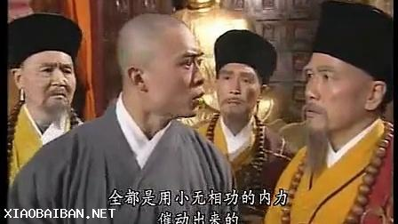
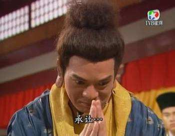

数学与《天龙八部》小无相功

Copyright © 2018 Lin Pengcheng. All rights reserved.

版权所有 © 2018 林鹏程， 保留所有权利。

从AI的角度看，所有的专业都是穿着马甲的数学。
如果数学思维好又无聊的人，可以象《天龙八部》里的鸠摩智用小无相功驱动少林72绝技耍帅，
把没见过这种玩法的少林和尚看呆了，难道鸠摩智一天有24*72小时吗？
相信时间是挤出来的和尚得把自已挤成纳米颗粒。

