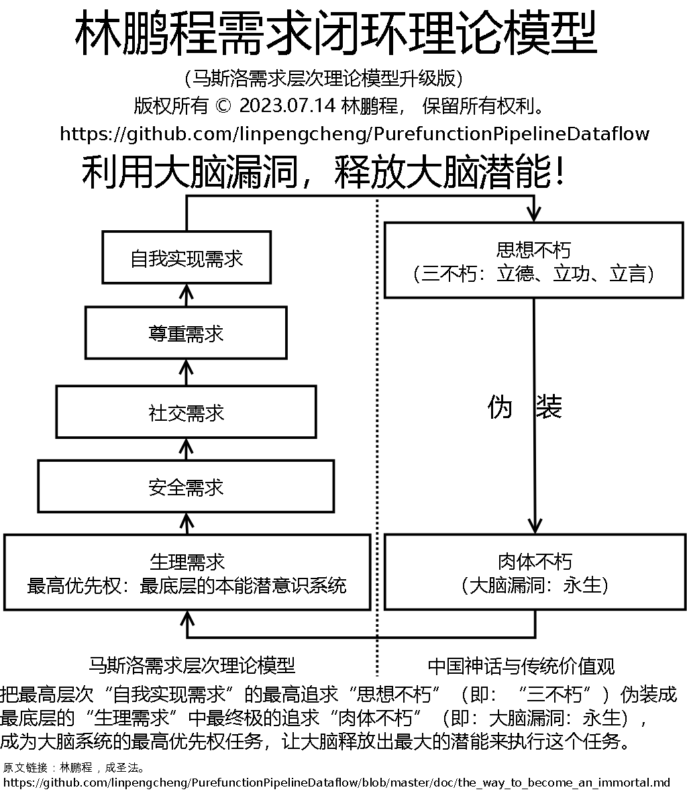

# The Way to Become an Immortal (Use brain's loophole to unlock brain's potential!)

Copyright © 2023.07.18 Lin Pengcheng. All rights reserved.

## Abstracts

Disguise the highest level need (self-actualization need: immortality of the mind) as 
the lowest level need (physiological need: immortality of the body) and become 
the highest priority task of the brain to maximise the potential of the brain to execute it.

# 道家仙派科研方法学----成圣法：借假修真，破解大脑漏洞，开发大脑潜能，超越先天智商的限制，以达超凡入圣之境(林鹏程需求闭环理论模型，非立志成圣不可用)

版权所有 © 2023.07.18 林鹏程， 保留所有权利。

## 目录

- [不正经的前言](#不正经的前言)
- [危险警告1](#危险警告1)
- [心理学模型，立志成圣和借假修真](#心理学模型立志成圣和借假修真)
  - [林鹏程需求闭环理论模型](#林鹏程需求闭环理论模型)
  - [立志成圣和借假修真](#立志成圣和借假修真)
  - [游戏人生：道、儒、释、科、俗、我互证](#游戏人生道儒释科俗我互证)
    - [国学方法学：阴阳、四象、五行、八卦 VS 现代科学方法学：数学](#国学方法学阴阳四象五行八卦-VS-现代科学方法学数学)
    - [俗](#俗)
  - [危险警告2](#危险警告2)
- [称号](#称号)
  - [危险警告3](#危险警告3)
- [芝麻开门，召唤神龙](#芝麻开门召唤神龙)
- [附](#附)
  - [仙根](#仙根)
  - [先天道体](#先天道体)
  - [至诚之道，可以前知。](#至诚之道可以前知)
  - [度化](#度化)
  - [心学悟道者特征](#心学悟道者特征)
  - [悟道茶](#悟道茶)
  - [道家科学派祖庭](#道家科学派祖庭)
  - [传承](#传承)
- [结束语](#结束语)
  
## 不正经的前言

在谈正经事之前，人们常喜欢先聊点不那么正经的事情，很多人因这句话点了进来，
即便他们对我要讲的正经事完全不感兴趣。不要因此感到不好意思，我以前在文章中讲过，
任何简单而又广泛流行（或存在）的产品（或行为），背后都隐藏着神奇的力量，八卦之心，人皆有之。
源自天性的本能力量是一种强大的洪荒之力，本文将要展示的就是释放、引导、强化这类力量成为科研动力的方法。
简单地说，科研不骚，成就不高。科研时古板、正经、严肃是没有灵性、没有创造力、没有成果的，
更重要的是各种正经严肃的大道理，父母、老师、各路圣人已讲得太多，大家如果学得进去的话，
大家都已经是圣人了，读者都是成年人了，所以我也不想重复这些大家从小到大听到厌烦的话，
这样即便大家用不着我的方法学，也能乐呵呵地寻个开心。心学的方法总是简单到最荒诞的小说都不敢想象，
成就魔幻到可以颠覆相关领域的观念。接下来让我们一起见证奇迹的时刻。

现在很多网上的修仙无脑爽文有一种很大的流派是“科学修仙”，主角用科学的方法修仙，神功大成，秒天秒地，
吊打各路神仙妖魔，三界无敌。刚开始一看，这想法还蛮有趣，可是这么多的文章，竟然没有出现一本用修仙方法学指导科研，
吊打现有科学理论的“道家仙派科研方法学”，这风向就不对了，科学已经被神圣化为不可冒犯的最大的宗教，
连从远古至今人类信仰向往的神仙都要跪下来唱征服，连最荒诞的无脑爽文也不敢冒犯科学，只尊崇逻辑，
而寄托人类梦想和充满想象力的神话甚至都能被视为粕糟压制和鄙视，连想象一下都不敢，这样子下去，
人类和只有逻辑的机器人有什么不同，人类和科学都还有什么盼头啊！只能在现有的科学理论体系和规则里打转，
只能不断地修补和增强现有的科学理论体系和规则，还能有什么颠覆式的革命性的创新，这种情况在神话里叫做“鬼打墙”。

现在很多高智商的人从幼儿园到顶级高校博士，再到世界顶级名企和研究机构，人生巅峰到止结束，
内卷一流，创新无门，究其原因，无非就是从小到大在现有的、逻辑闭环的科学理论体系和规则里打转，
内卷赢麻了，脑回路不断被一个接一个的内卷胜利所激励强化，把脑回路强化为坚不可摧的、
闭环的“鬼打墙”迷宫走不出来，还自傲为 **“科学卫道士”**，实则为丧失创造力的逻辑机器人，
这帮人并没有任何科学大成就，对科学创造的真谛一无所知，对科学的印象全靠自己癔想，
只要看看那些讲不出任何符合科学逻辑理由抵毁我的理论的人，那个有科学成就的，
当他们发现他们以往崇拜的旧理论体系崩塌，被我的理论用神话的大胆想象和数学化的科学求证方法降维打击，
一触即溃，失智到连最基本的科学常识都没有了，连文盲都不如啊！我把他们称为 **“科学舔狗”**，
他们跪舔现有的科学理论、权威、名校、名企，“科学的怀疑精神”只剩下“怀疑精神”，
而且只用在科学界新秀身上，按内卷等级链，按序增强，并且不管是跪舔还是怀疑，
都极端疯狂到连最基本的科学常识都没有。大家都知道的，舔狗一无所有！他们不会有什么科学成就的！

“真理向前走一步就是谬误。"这句话流传得非常广，但绝大多人并不知道怎么正确应用它，
它只适用职业技术人员、工程师等科学应用人员，他们应该严格遵循已有的科学知识，以保证准确和安全。
但绝不适合科研创新人员，这句话只会限制科研创新人员的想象力和创造力，在创新过程中，
不必保证严格遵循已有的科学知识，甚至击溃已有的科学知识。他们可以试错，可以极尽想象力去创造，
因此，科研创新人员真正应该用的是相反的话：“谬误向前走一步就是真理。”
勇于在野蛮、混乱、荒诞、愚昧的未开发之地，开疆拓土，创建出一个简单、统一、理性、有序、文明的科学国度。

从我的方法和成就上看，科研就是要跳出三界，不在五行，犹如天道，降维打击，
天地不仁以万物为刍狗，科学与~~荒诞~~神话齐飞，真实共~~虚幻~~抽象一色，应做如是观。
大道无所不包，荒诞、混乱、虚幻、复杂有什么可怕的，为什么要鄙视或屏弃它们，
它们对科研工作者全是机会，把它们转化为合理、有序、真实、简单的科学成果就好了嘛，
这就是颠覆式创新，这就是“乱世出英雄，治乱循环”的科学版。
我们人类不就是这样从愚昧的原始社会发展到科学昌明的现代社会的吗？
只有没有科研意识的人才会吓成鹌鹑，这帮人中很多人以科学卫道士自居，其实只是愚蠢的科学懦夫。

我不是文科生，写不出精彩的用修仙的方法吊打科学界的无脑爽文，作为理科生，行动更胜笔头，
亲自肉身上演这个无脑爽文剧，居然大获成功，神话、科学通吃，实现神话和科学的大统一。

- 科学

  颠覆了多个行业的理论体系，建立了学术界第一个
  以一个基础理论为核心的、跨行业的大统一学术理论帝国，
  成为学术界始皇帝（文始皇），真的成就了“三不朽的圣人”。

- 神话

  依靠自创神功----“道家仙派科研方法学”，
  从数学和科学的角度出发，
  与老子的从哲学的角度出发殊途同归，
  共同得到“上善若水”的结论，以创立直指大道的
  “管道数据流式的仓库/车间大阵（模型）”证道，
  道武皆通、变化莫测、科学严谨、所向无敌，
  力压诛仙阵、万仙阵、365周天星辰阵、十二都天神煞阵、
  两仪微尘阵等上古神话传说中诸多只能打打杀杀的著名大阵。

上演神话小说中因对人类文明的巨大贡献，用海量功德铸造不朽的功德金身，成就功德圣人的桥段，
这是世界上最正统、伟大、光明、正确、高端、大气、上档次的修行道路，
这个传奇经历可以命名为“修仙派科研：从躺平咸鱼到功德圣人的胡搞之路”。
《西游记》中，出身圣人门庭女娲宫, 就读顶级名校灵台方寸山“斜月三星洞”大学，
受教顶级导师“菩提祖师”，手持神兵金箍棒，带领无数妖兵妖将的猴子大闹天宫没干成的伟业，
被出身草根、自学成才、掌控键盘、单枪匹马的我干成了，而且干得更漂亮、更伟大、更了不起，
极具无脑爽文的浪漫个人英雄主义色彩！年少时爱看荒诞神话小说，绝对没想到下半辈子再看已是文中人，
上半辈循规蹈矩成咸鱼，下半辈子放飞自我却成圣，命运啊！科学啊！大神啊！～～～
你们都是最不科学的存在！很多人看到这时，肯定觉得我疯了，其实只要看到无脑爽文
（或英雄剧、宫斗剧等）这么流行，读者这么多，我们就应知道这是一种正常的现象，
无数的人梦想着当帝王将相、后妃公主、超人大侠、英雄美女、仙帝圣人、X二代小仙女等等，
但他们只敢偷偷看一看、想一想而已，都不好意思让别人知道，至于去践行那是想都不敢想，
我知行合一的勇气和成功，可以成为无脑爽流的传奇，让他们认识到无脑爽文背后蕴藏的、
可以成圣的、源自本能潜意识的洪荒之力。

“谬误向前走一步就是真理。”大家是不是刷三观了，是不是见证奇迹了！

我是第一个用无脑爽的套路搞事、搞大事的人，而且还搞出大成就，
我又开创了一个流派----“科研无脑爽流派”，之前在
[《开山立派四要件》](./TaoistScientificResearchMethodology.md)
一文写了我已开创7个科学流派，
这是第8个科学流派。

这个名字太难听，极度接近“脑残流”，大概率是要被嫌弃、扑街，其实，
只要能挑动本能潜意识卖力干活，名字难听根本不是个事，面子一斤值几钱。

## 危险警告1

谈正经事的首要事情就是“危险警告”。正如奥运冠军的训练方法，正常普通人照着练，不仅不能健身，
反而容易发生五劳七伤，甚至猝死。本方法很危险，不要练习，仅做为科研资料存档，
对陷入悟道疯魔期的人有悟道经验借鉴和健康指导方面的帮助。注意如下警示：

- 立志成圣是先决条件，有它还有渺茫的希望，没它根本没有成功的可能。
  从人类的历史来看，成圣的成功率不足亿万分之一，就算我的方法能提高
  一百倍，依然是很渺茫的事，本方法一旦入门进入悟道疯魔期，
  不成功便成仁，不成圣就一直疯魔着，废号了，风险太大，成功率太低，
  所以不要练习。

- 身体素质必须优秀，至少长跑成绩百分制90分以上，
  并保持良好的科学的运动习惯。开发大脑潜能对身体负担很大，
  悟道疯魔期一般以年为单位计算，时间很长，要有持久战的准备，
  不急于求成，以稳定、健康的节奏进步。要有大成就，就要有大付出，
  本方法通过激励潜意识让枯燥乏味的科研工作在主观感受上觉得很爽，
  但不能减少身体努力的负担，不能改变守恒定律。
  所以身体一定要保持强壮。

- 保持健康的生活习惯，悟道疯魔期就是以年为单位的超长期心流状态, 
  一旦进入悟道疯魔期，如同自动档汽车下长陡坡，越飚越快，容易失控，
  必须从如下两方面制动戒断，直至恢复正常一段时间。
  这个休养冷却期一般时间会有点长。
  - 肉体刹车制动：如果长时间违背健康的生活习惯，
    必须强制进行工作戒断，进入休养冷却期。
    必要时指定监护人弹性监测和控制。
    - 悟道疯魔期这种心流状态, 特别是我这种以最底层本能需求(永生不朽)为驱动力的方法,
      忽然被打断时, 会本能地、不自觉地暴燥狂怒，这不是你的主观显意识的本意，
      应该明了这种状态，并努力克制。
  - 大脑发动机制动：必须主动强制大脑休息，
    因为悟道疯魔期大脑会频频自发自动加油门来一曲飚车狂想曲，
    此时必须时时警醒，手动档限档制止。

- 每年至少健康体检一次。该放手时就放手，开开心心逛九州。

- 优秀的逻辑能力，因为初中是全员义务教育，所以中考为例，
  至少数学（特别是几何）成绩在地区中考前10%内，考试压轴题能搞定。 
  因为大胆的创新想象需要小心的逻辑求证，
  没有优秀的逻辑能力求证，
  不仅事不成，还容易把专业信誉搞破产。  
  
- 强大的心理能力，欲戴王冠，必承其重。
  若想获得颠覆性的、革命性的成就，
  改变世界，以臻超凡入圣之境，
  就必须有承受整个世界反弹之力的能力，
  若不能承受住世人的反对和嘲讽，面对举世皆敌的局面，
  在进入悟道疯魔期前就容易把自己搞崩溃了，
  一旦进入悟道疯魔期，物我两忘，对研究之外的事情和他人非议
  反而不在乎，无所谓了，至于悟道得大成就以后，
  那还算是一个问题吗。

- 我的文章主要运用神话的想象力和创造力，我是科学主义者，
  不喜欢迷信、神棍和玄学，请不要误解我的意思。
  另外，我只是根据神话小说的描述，按我的理论推演，
  尽量用科学的方法实现相似的效果，或得到创新的启发，
  我对道家的修炼典籍一无所知，请不要问我怎么修仙。
  因为神话源自人类最深的渴望，科学是用来实现人类的渴望，
  所以神话可以为科研指明方向，另外，
  还可以利用这种渴望激励自己的本能潜意识。
  在本派，科研以本能潜意识驱动，
  不仅可以激发自强不息、厚德载物的精神，
  还可以作为成就明心见性、道心通明的法门。
  记住，学习本方法，明心见性、道心通明至关重要，
  我们要成为本能潜意识的主宰，
  让本能潜意识为我们的理想奋斗打拼，
  而非成为本能潜意识的奴隶。
  所以，请不要把糊弄本能潜意识的小伎俩当真，
  把自己的主观显意识搞得五迷三道，
  也不要搞迷信，成为软弱的磕头虫，那是误区。
  崇拜之心一起，即是沉沦之始，
  再无超脱（超凡入圣）之望。
  
- 学习我的方法，应该阅读我的文章原文，最好是中文原文，
  不要阅读删改版，或二道贩子的文章。
  有一大帮自命不凡又没什么科学成就的人看不惯我的一些做法，
  他们可能会意图纂改我的方法，但他们因为没什么科学成就的经验，
  他们的观点纯粹就是臆想的产物，很容易走入误区，
  所以不要相信没什么科学成就的人的方法学。
  他们的方法表面上越科学越合理，离创新就越远，
  越伟大的创新越是离经叛道，所有人都认为合理和
  符合现有科学认知的东西，还算得上创新吗？
  他们看不惯的我的那些做法恰恰就是他们没有科学成就的关键原因。
  他们看不惯我的程度有多深，离科研创新就有多远！
  因为文章原文是作者多年深度思考和经验的结晶，
  凝聚着作者的精、气、神，充分体现了作者的精神意志，
  对于方法学来说，这是至关重要的。
  这也是通常读经典作品最好读未删改的原版的原因。

- 攻击大脑漏洞，改变本能潜意识是一种极度危险的行为，
  目前只有我一个人的应用和成功案例，没有经过大量的实验，
  本文仅作为科研资料，不建议学习，本人不对本方法提供任何保证，
  请不要把自己当成白老鼠瞎搞一气，否则后果自负。
 
以上危险警告应打印出来，贴在显眼处，每天早晚阅读，心存警惕，谨防危险。
  
符合以上条件的还算是正常普通人，从社会存量上看，还是可以算得上众多的，
大家都还是很常见到的，和伟人天才传记中的让人绝望的先天条件和后天磨难比起来，
算是容易许多，对正常普通人来说，还可以说是有希望。

对正常普通人来说，最爱不过好吃懒做、贪财好色、好大喜功、
寻欢作乐、贪生怕死、三天打鱼，两天晒网没长性等等，
这纯粹是本能天性，经大自然亿万年优胜劣汰进化保留下来的优秀特性，
不能叫缺点，
我的方法是从一切生物（或人类）的本能和共性出发的，诱导潜意识，
把无趣、乏味、漫长的科研工作变成一个有趣的修仙长生、无脑爽的游戏，
把这些本能天性转化为超凡入圣的洪荒之力，
因此它具有优秀的普适性和强大的吸引力。 
在这里，大家是不是想起我在仓库/车间模型的应用例子中所讲的
“能量转化”和“金庸《天龙八部》逍遥派武学体系”的运行模式，
大家理解“北冥神功”和“小无相神功”的精髓了吗？
根据“北冥神功”总纲的论述，
那些把本能天性当缺点努力克服和消除的人，
就是修炼“化功大法”的可笑之人，
缺乏自信，自废武功，违反了自然规律，违天理、灭人性，
随后困苦挫折，如影随形，从此知行合一、天人合一，皆无从谈起！
是人行邪路，不能证大道！

> **《天龙八部》“北冥神功”总纲(节选)：**
> 
> 本派旁支，未窥要道，惟能消敌内力，
> 不能引而为我用，犹日取千金而复弃之于地，
> 暴殄珍物，殊可哂也。

我并不是在发表歪门邪论，人本性具足，完美无缺，天生神圣，
这些本能天性根本不是缺点，在聪明人的眼里全是优点，
都是可利用的珍贵资源，是最强大的动力源泉，
激励方法对了，吃苦耐劳、废寝忘食、以苦为乐、赴汤蹈火、舍生忘死、
战天斗地等等绝对能刷新你的认知。
在管理学里激励他人，在成功学里激励自己，
在政治、军事、商业、证券市场里的操纵人心，用的不都是天性吗？
在《论语》里，孔子并不讳言食、色、名、利、权、势，
所强调的是君子爱之，取之有道。在尊重天性的基础加上一层仁义礼法。
战斗、逃命也是寻常，例如：和大徒弟子路不打不相识；
丧家之犬最早就是用来形容这位大圣人逃命的模样。
特别要注意的是孔子是怎么大夸怕死、贪财、讲排场、
好享受的管子为仁者，孔子以仁立道，
仁是孔子对一个人的最高评价。
因为管子把这些天性发挥得淋漓尽致、登峰造极，
对外尊王攘夷，保护华夏文明，抑制诸侯纷争，实现国际和平；
对内大搞经济，国富民强，带动整个国际经济发展。
想要搞点钱，安全、放心地享受，折腾了这么一大摊子工作，
把战乱世界建成人间乐士，千秋伟业，真不容易！
诸子中的第一实干家、第一大成就者！
孔子最羡慕嫉妒恨的人，不是老子，是管子！
孔子和他的弟子，都是实在人，正确对待本能天性，
不假正经、假圣人，没有虚伪粉饰，
堂而皇之地把这些内容写在《论语》里，也没觉得丢脸、掉价了，
不仅自己把事情做好，还给别人做了个很好的榜样，
《论语》也成了大中华文明圈的道德规范。
再次强调，学习本方法，明心见性、道心通明至关重要，
我们要成为本能潜意识的主宰，
让本能潜意识为我们的理想奋斗打拼，
而非成为本能潜意识的奴隶。

后世儒家，把本能天性当成恶，要用上层礼法压制和灭杀下层本能天性，
这是错误的，虚伪的，最终徒劳无功，非常失败。
它违反了马斯洛需求层次理论, 损失了强大的可利用和激励的本能力量, 
其实适当合理地引导和满足最基本的的本能天性, 就是最基本也是最大的仁义, 
解决了这个问题后, 才能讲到其他仁义道德. 所以管子说“仓廪实而知礼节，衣食足而知荣辱”. 
所以把本能天性当成恶，期待通过灭杀本能天性来提升自己, 不是一种很好方法.

把本能天性当成恶，过度的压制和灭杀本能天性，如同金庸武侠小说“笑傲江湖”里的
葵花宝典----欲练神功，必先自宫。结果信了这种鬼话的人结局都很不好。

我和孔子的方法如大禹治水，面对洪水泛滥的本能天性，尊重本能天性，不去围堵灭杀, 
而是修建水利工程，因势利导，引导本能天性的力量向正面的方面发展, 利国利民，
利人利己，功德成圣。这种方法强化了人的主观能动性，是一种积极主动的天人合一。

看看这种方法象不象金庸武侠小说“天龙八部”逍遥派的“北冥神功+小无相神功”、斗转星移、乾坤大挪移。

所以我认为王阳明受孔子之后的儒学和佛学中降魔理论的影响，提出为善去恶，是一种不好的方法。

我、孔子和道家的方法: 阴阳相克相生，化生万物，因势利导，海纳百川，
千变万化，身与道合，积极主动，功到圣成。

正如我在前面所说的，荒谬与科学，虚幻和真实，错误与正确，主观与客观，唯心与唯物，
不同学科，混在一起，相爱相杀，互参互证，阴阳相克相生，化生万物，
创造创新的想法自然如狂涛巨浪，源源不绝，生生不息，科学成果源源不断。

## 心理学模型，立志成圣和借假修真

### 林鹏程需求闭环理论模型



心理学模型中最有名的是“马斯洛需求层次理论模型”，该理论强调人的动机是由人的需求决定的。
而且人在每一个时期，都会有一种需求占主导地位，而其他需求处于从属地位。人的需求分成生理需求、
安全需求、社交需求、尊重需求和自我实现需求五个层次。需求是由低到高逐级形成并得到满足的。

1959年以后，马斯洛越来越多地涉及东方的观点，提出“Z理论”，在“马斯洛需求层次理论模型”
之上构建第六层：“自我超越需求”，马斯洛试图用各种不同的术语来描述它，如：
高原体验、灵性、超个人、超人本、超越自我、神秘的、以宇宙为中心、天人合一，等等。

对于Z理论，我只能说马斯洛没有学到东方哲学的精华，粕糟倒是学了个齐整，
Z理论整得就是一个玄学，马斯洛自己都搞不明白，讲不清楚，读者更是稀里糊涂，
所以Z理论在社会上流传并不广，只是在玄学爱好者圈子里流传。

>
> 《左传·襄公二十四年》：
> “太上有立德，其次有立功，其次有立言，
> 虽久不废，此之谓三不朽。”
>

“三不朽”，现在我们可理解为人生的三个最高标准，
或者说是成功人生的“三部曲”，即：

- 修养完美的道德品行，
- 建立伟大的功勋业绩，
- 确立独到的论说言辞。

说白了，通过对人类文明做出巨大的贡献，被人类文明史铭记，让自己的思想永生，
这是神话传说中长生不老在肉体永生不能实现的情况下的次优选项，
它既是“马斯洛需求层次理论模型”最底层的“生理需求”----一切生物本能潜意识的终极追求，
也是最高层次“自我实现需求”的终极追求。

这样，在“马斯洛需求层次理论模型”的基础上，
通过引入中国神话传说的长生不老和中国传统主流价值观，
我革命性地创造了“林鹏程需求闭环理论模型”，
它找出了大脑本能潜意识系统的漏洞，
我们的理想“三不朽”就是最高层次“自我实现需求”的最高追求“思想不朽”，
我们可以把最高层次“自我实现需求”的最高追求“思想不朽”伪装成
最底层的“生理需求”中最终极的追求“肉体不朽（永生）”，
成为大脑系统的最高优先权任务，让大脑释放出最大的潜能来执行这个任务。

因为在“马斯洛需求层次理论模型”里，高层的需求都是后天形成的，
越高层的需求越是多变、越不稳定，最底层的需求是先天形成的，
固化为大脑本能潜意识系统，是非常的稳定和不变的，
所以我在大脑本能潜意识系统找到的漏洞是不可修复的，
它可以被长期、普适、有效的利用，而且越底层的需求力量越强大。

马斯洛在创造Z理论时有了模糊的感觉，但没有跨出革命性的一步，
究其原因是在西方的神话传说中，神仙都是天生的、血脉遗传的，
凡人不能成为神仙，不能真正独立、自由地永生。而在中国神话中，
每个凡人都梦想着修炼成仙，而且还打败了先天神魔，成为神话传说的主角，
真正独立、自由地永生。“（圣仙神帝，）王侯将相，宁有种乎！”这是中国人的传统主流思想。
西方的神话传说让马斯洛（或者说西方人）在脑子里根本不存在真正独立、
自由地永生的追求（需求），所以马斯洛（或者说西方人）搞不出类似“林鹏程需求闭环理论模型”的理论，
由此可见，神话对科学有关键性的影响。

从“林鹏程需求闭环理论模型”上看，只有立志成为三不朽的圣人，
本方法才能起作用，否则本能潜意识大爷根本不予理会，释放大脑潜能自成空谈。

我又又开创了两个流派----心理学“林鹏程需求闭环理论模型”派和
“超人：本能潜意识派（超人：大脑漏洞释放潜能派）”。
这是第9、第10个科学流派。

### 立志成圣和借假修真

所谓立志，传统的理解是向着理想，攀登高峰，不断逼近。我认为这是错误的，
从立志之刻起，你就是圣人了，以圣人的眼光和位置思考和做事，在这个过程不断学习完善自己，
把假大空修成真伟大，让这个虚幻抽象简略的圣人变得越来越真实具体生动，
在实践中不断解决问题，学习，获得成果，这种方法速度最快效果最好。
这就是通过知行合一的闭环循环达到修假成真的效果，这就是俗语“屁股决定脑袋”的变通应用，
同时它也与沉浸学习法和费曼学习法的某些部分很相似，但我的方法多了心理学模型、
立志成圣和借假修真，相当于多了个潜意识作为强力发动机和目标智能导航驾驶系统，
工作过程就象是“发射后不管”的巡航导弹，把潜意识诱导发动发射后，由潜意识自动自发工作，
人的显性主观意识就轻松自在了，不仅不会有什么痛苦难受的感觉，反而潜意识玩嗨了，
还要分泌多巴胺让你开心开心。这是从“单一方法”到“系统论”，从“经验”到“科学”，
从“术”到“道”的进步，层次上高了一大截。

借假修真其实也是一种很常见的社会现象，例如暴发户通过观想他以前看到过的和想象中的贵族形象，
再通过附庸风雅和教育洗炼自身及后代的内蕴、气质、形象，把假大空的贵族形象填充真实化，
实现阶级迁跃，这就是俗话所说的“三代成贵族”。暴发户这类富一代能成功，就没一个是傻的，
难道他们不知道附庸风雅的样子很不和谐和奇特吗，他们依然坚持去做了，
因为这只是借假修真过程中必然发生的过渡现象而已，他们的上进心和努力很强的。

当然承担吃喝拉撒睡等关系生死的重要任务的潜意识大爷并不是那么好忽悠的，
画一个成功概率极低的“三不朽的圣人”这种大饼，虽然给出了一个有趣美好的愿景，
但空头支票显然无法让潜意识大爷给你打工，就象小老板给期权用上市发财的愿景让员工免费工作是不行的，
要么加钱，要么让玩开心一点。欺骗自己是最难的，所以需要一个诱导过程。

### 游戏人生：道、儒、释、科、俗、我互证

```

知之者，不如好之者；好之者，不如乐之者。
    ---- 孔子，《论语》

```

我的玩法就是我创新的 **“道、儒、释、科、俗、我互证”**，
“道、儒、释互证”是中国的传统国学，
科学是当今的显学，
“诸学与我互证”就是知行合一、道法自然、天人合一。
这些大家都很熟悉，
所以我重点说一下 **“俗”和“国学方法学”** 与科学的互证。

#### 国学方法学：阴阳、四象、五行、八卦 VS 现代科学方法学：数学
    
- 人类智慧最基本的两大核心能力，对应人工智能的两大流派：
  符号计算（经典AI）、模式识别和匹配（现代AI，机器学习）。
  
  - 符号计算
  
    诸法空相，各专业学科的概念及其关系等知识都可以
    用一堆毫无意义符号来表达和推理。
    
    - 西方科学方法学：数学
      - 用途：静态的、机械的、精确的逻辑推理。
      - 经典人工智能使用的就是符号代数，
        典型应用是人工智能专家系统。
        对没学过AI的人来说，简单来说就是几何的泛化，
        把几何用符号代表点、线、面等几何元素，
        泛化为一切学科专业的概念，
        然后用相同的方法进行推理。这种专家系统方法的发明者
        不是众所周知的西方计算机专家麦卡锡，
        而是明朝中国官僚、《几何原本》的翻译者徐光启，
        他对《几何原本》的一句简略的评价就阐明了
        符号计算、人工智能专家系统的思想。
        
        ```
        
        能精此书者，无一事不可精，
        好学此书者，无一事不可学。
            ---- 明，徐光启，评《几何原本》
        
        ```
        
        一个人成为专家的难易程度，看初中几何成绩就可以了，
        几何成绩好的人，学什么都很快的。
        当然几何不好也可以靠勤奋博学，积累经验和知识成为专家。
        几何是科学领域的《小无相神功》，学会了几何方法，
        精通各大门派（行业学科）的知识技术是很容易的。
        就象《天龙八部》里鸠摩智用《小无相神功》驱动少林72绝技，
        击败一众毕生专修某一绝技的少林高僧，
        把这帮少林高僧打得怀疑人生。
        
        一个最快最有戏剧性的案例：
        我只参加了几天的培训，就创造了[“基于数学证明
        和价值抽象的科学国际疾病分类（ICD）编码方法”](https://github.com/linpengcheng/icd10faq)。
        超越了WHO实行一百多年的、笨拙的、无法证明结果正确性的
        字典查找方法，让ICD编码从原始的靠经验瞎蒙的阶段
        提升到科学论证阶段。
        
        不是所有人都需要经验的，
        过于追求经验的企业显然缺乏人才识别能力和创新能力，
        显然这是一眼可以看到底，没啥大盼头的企业，
        因为它招的都是科研创新界的失败者。
        对于科研创新人员，没有一系列辉煌的创新成果
        作为衬托的经验，只是一种耻辱！
        当然，对于职业技术人员，经验还是很好的。
                
    - 国学方法学：阴阳、四象、五行、八卦
      - 用途：推导动态的、抽象的、模糊的变化（或创新）。
      - 把阴阳、四象、五行、八卦的组成元素看成是一个个符号，
        用这些符号代表世间的一切事物，它也是一种符号代数。
        
        在国学中，中医是实践这套符号代数最广泛、最能实证
        的行业，在科学技术有限的古代，把人体当成黑盒，
        用这套符号代数构造中医理论体系，
        这套符号代数学得好就神医，学不好就是庸医，
        因此学中医的人才，需要文理兼通，数理逻辑和想象力都要好，
        
        中医比不上现代医学可靠明确的原因，主要是中医还没有解决
        中医理论的人体黑盒模型和事实人体模型的映射，
        只要能象IT业网络标准协议ISO七层协议和事实协议
        TCP/IP协议映射一下就可以了。
        
        中医理论体系基于符号代数，这点比IT行业强，
        现有的IT理论体系核心底层----软硬件系统构造方法学
        还没有数学支持，纯靠巫医神棍式的瞎鼓捣，
        IT行业是最没资格批评中医的行业。
        
        我认为，中医是一种经验医学，尚待科学化，
        中医在实践中有效，但还未能阐明其科学道理，
        那是现有科学技术还不完善，不能解释一种有效的方法。
        那些认为因此应该取消中医的人，显然缺乏科研意识，
        因为这正是科研人员最好的建功立业的机会。
        我在另一篇文章[《科研、软件工程、中医》](./SR_SE_TraditionalChineseMedicine.md)
        讲过中医简单有效的诊疗方法和框架。
      
  - 模式识别和匹配
  
    ```
    自古深情留不住，
    唯有套路得人心。
    ````
    
    套路（模式）可以视为一种自然规律、数学公式或定理，
    更形象一点，可以视为一种行为契约或合同。因此套路（模式）
    越老套、越通俗、越流行越好，因为这样有助于合同谈判时的顺畅沟通，
    当其中一方有订立合同意向时，就开始飙套路（模式）发出合同要约，
    如果另一方识别了这个套路（模式），一拍即合，
    匹配出相应的套路表示承诺，合同成立。
    如果另一方也有意向但有不同意见，也可以飙套路（模式）发出反要约，
    直到双方一致合同成立或无法达成一致，一拍两散。
    
    对于哪些自负深情，不肯飙套路的人，大体上有两类：
    - 太过自我而无法沟通，纯粹就是自我感动而已。
    - 不懂得或不愿意做承诺、签合同，不是蠢就是坏。
    
    至于那些对上套路后，又违背合同，丧失信用的人，俗称“人渣”。
    
    因此，套路（模式）不仅是一种自然规律、数学公式或定理，
    也是在社会中广泛存在的、极重要的社会行为模式，
    模式识别和匹配是极重要的根本智慧之一。
    
    - 西方科学方法学：数学
      - 人工智能机器学习、深度学习，统计学
      - 基于大数据的案例特征模式识别和匹配，缺乏抽象。
      
    - 国学方法学：阴阳、四象、五行、八卦
      - 阴阳、四象、五行、八卦的符号及其组合的模式识别和匹配
      - 抽象级的模式识别和匹配，
    
  现代教育体系下，理科生受西方硬数学思维的影响和限制比较深，
  比较善长符号计算。而文科生对各种模糊、抽象的人文社科套路（模式）、
  打太极、踢皮球等一向玩得比较溜、比较花，比较善长模式识别和匹配。
        
- 优缺点
  - 西方科学方法学：数学
    - 优势能力：具体、精确、静止的逻辑推理能力。
    - 优势领域：精确的标准化工业制造。
    - 越学越复杂，越分越细，自由度越来越小，越来越精确、割裂和僵硬。
    - 从传统中国智慧"见山见水三重境"来讲,
      西方科学把第一层功夫"见山是山, 见水是水"做到登峰造极.
      但在第二层功夫"见山不是山, 见水不是水",
      和第三层功夫"见山还是山, 见水还是水"这两层功夫做得很僵硬和死板,
      这用数学和科学实验很难表达和实证.  金刚经: "见诸相非相, 即见如来."
      这里的如来是指法相如来, 智慧的意思.
      也就是说只有达到第二层功夫"见山不是山, 见水不是水", 才能获得真正的智慧,
      想象力、创造力、创新能力才能极大增强，
      西方最具智慧的科学家爱因斯坦也感到西式方法学的不足，
      说了如下一些话:
      
      ```
      想象力比知识更重要。
      智力的真正标志不是知识，而是想象力。
      逻辑会把你从A带到B，想象力能带你去任何地方。
              ---- 爱因斯坦
      ```
      
    - 方法：细分领域，有利于知识积累和学习，
      但这个割裂的作法限制了想象力（真正的智慧）的开发和发展。
      这是刻舟求剑、盲人摸象、钻牛角尖的方法，
      顶尖的人才如果不能钻透牛角尖，跳到新世界，
      就得弊死在牛角尖里。中等资质人才倒可以依靠
      积累的知识混上不错的职业，过上不错的日子。
      - 有利于知识积累，可复用，容易工业化，
        量变引起质变，这是西方文明反超东方文明的重要因素。
      - 易于学习，中等资质的人即可学到专家水平，
        但要达到悟道者那样的创造力的境界，
        有一个极大的天堑。
      - 不利开启真正的智慧，过度的强调僵硬的逻辑推理能力
        和专业分科伤害了想象力的发展。
        缺乏创新能力，创新能力单一，专业领域很窄，
        容易产生机械的教条主义，陷入“鬼打墙”的逻辑迷宫。
        有一点小创新，就大书特书，写论文，申请专利。
        这些对中国道家高手只是一个举手投足、
        自然而然、动念即生的小念头、小变化，
        觉得完全不值一提。
        - 看看我的理论和本篇文章，
          一篇文章可以搞出一大堆跨专业学科的流派，
          其实还可以写更多，只是太忙、懒得写，
          拖一下就忘了，想法太多且多变，就不会珍惜。
          对西方人来説，这是不可能出现的，
          他们的文化没有这种思维。
          这是中国特有的“道”思维。
        - 几何泛化为符号代数，本质上差别不大，
          对中国人徐光启只是随口一句话的事，
          明摆着的事，不值一提。
          而西方人则大书特书，开创“符号代数”、
          “人工智能符号计算派”。
          符号代数也有大道至简，万法归一的境界，
          但他们缺乏这种思想，限制了它的应用和发展。
          东西方文明没有高下之分，但文化思维的限制
          还是会影响科学的发展的，这一点，我在心理学
          模型中也讲过。中国文明的缺点现在已经补上了，
          源于西方的那套科学方法学得很好，甚至有点矫枉过正了，
          对自己的文化了解不足，缺失了信心，
          不过没关系，随着我们正在逐步追上西方科技的脚步，
          文化自信心自然逐步赶上。
          反观西方对东方文明的优点了解还很不足。
        - 悟道者，创造力、想象力太丰富，发散性、跳跃性太强，
          变化快，随机性很强，本能潜意识玩高兴了，
          自己加特效，自由发挥，靠谱的、不靠谱的都有，
          我写出来的想法大家都觉得简单到匪夷所思，
          魔幻到不可思议，其实这些已经是最靠谱的、最实在的了，
          可以用科学解释的部分。
          本能潜意识这么折腾其实也挺累人的，
          那些变化念头都没时间写出来，也累得懒得写。
          更不用说一个变化念头写一本书，
          就算他有三头六臂大神通也写不过来啊，
          而且就算写下来的，也不代表了他的智慧，
          只是他在某一瞬间的想法，刻舟求剑之举，
          西方文明和工业文明就是试图把世界全标刻上，
          量大出奇迹，千年积累铸就辉煌成果。
          但这适合群体性的积累活动，对个人完全不合适，
          东方悟道者想要传承他的思想和智慧是很困难的，
          师找徒，徒找师都很难，他们都是濒危动物，
          所以他只能怅然地念一句：“道可道，非常道。”
          神奇的是，“道”思想渗透到中国文化的方方面面，
          总有神奇的天才从典籍或民间的一些半对半错、
          稀里糊涂的“道”思想获得启迪，获得悟道大成就。
          因为人生经历的不同，方法和成就也是千奇百怪，
          带着极强烈的个人色彩。
          师徒传承悟道得大成就的，反而一个都没有！
          完全不可重复、不可重现。
          这种大浪淘沙的方式，居然成了中国“道”思想的主要传承方式！
          幸好中国人口多，经得住这么坑的传承方式，
          我也是很无语啊！虽然我是道家的，
          可我也不能昧着良心赞美这么坑爹的传承方式。
          我的道家仙派科研方法学简单、普适、科学，
          合乎人的自然天性，应该对“道”的传承很有帮助。
          这也算是我对道家的一大贡献吧。
        
          在IT界，两个经典的中西思维写作的比较：
          - 高德纳的《计算机程序设计艺术》，煌煌巨著，
            写了厚厚的4大本，还没写完，堆写了海量的算法，
            根本没有几个人完整看过它，但任何专业入门级以上的人，
            可以直接调用他的算法库，不需要怎么理解他的算法。
            看他的书，可以学习到很多知识，但在增长智慧方面真没有。
          - 我的理论，一万字左右的篇幅，涵盖IT软硬件理论体系
            的方方面面，实现IT理论体系的简单化、统一化、
            数学化和科学化，同时还讲解了跨行业应用，
            学起来简单，但做起来难，知易行难。
            只用了小学和幼儿园级数学和常识，一眼看到底，
            没能学到什么新知识，但戳破了一个小孔，让人们
            见识到了一个犹如神魔世界一般举手投足、轻描淡写、
            简简单单就可改天换地的、千变万化的想象力世界，
            一个真正智慧的世界，增长了智慧。
            例如:
            - Apple M系列芯片架构和微软AI平台
              Singularity架构都采用了我的仓库/车间模型，
              他们的设计团队都是世界顶级水平的团队，
              但他们都没有很好地理解我的理论，
              设计都有明显的缺陷，虽然我的理论使用的
              只是小学和幼儿园水平的数学模型。
              
              2024-10-20追记:
            
              - 2020年11月，苹果开始发布仓库/车间模型SoC---- M1
              - 2023年10月，高通开始发布仓库/车间模型SoC----骁龙 X Elite
              - 2024年06月，Intel开始发布仓库/车间模型SoC----Lunar Lake
            
              目前，Apple(ARM)、高通(ARM)、Intel(x86)三大CPU厂商已推出仓库/车间模型SoC，
              第四大厂商AMD别无选择，不跟随只有死路一条。
              事实上AMD也于2024年6月推出不包含内存的SoC Ryzen AI 300，
              应该是没有抢到3nm精密制程优先制造权和研发进度的问题，后续一定会推出仓库/车间模型SoC。
              至此，两大主流CPU（ARM和x86）均已加入，宣告CPU/SoC全面进入我创造的仓库/车间模型时代，统一硬件领域。
              在IT领域，底层硬件技术决定上层软件技术，软件领域必然也要进入我创造的仓库/车间模型时代， 统一整个IT领域。
                     
            - 波音创造的脉动生产线是最先进的飞机生产线技术，
              但波音也没有进一步实现它的模型化、数学化、
              简单化、普适化、统一化、理论化、体系化。
            - SAP等众多世界领先的ERP(企业资源计划）软件厂商，
              从事企业管理软件开发多年，
              也没有抽象出正确的企业管理模型。
            - 现代工业实践发展了几百年，管理学的理论体系
              发展了上千年，对仓库/车间模型熟视无睹，
              同样也没有对它有任何象样的论述，
              理论非常松散、没有体系、不科学。
              我的理论让企业管理的理论体系可以
              以我的理论为核心重新改造，实现整体理论体系
              的简单化、普适化、统一化、数学化和科学化。
                  
  - 国学方法学：阴阳、四象、五行、八卦
    - 优势能力：抽象、模糊、动态变化的想象能力
    - 优势领域：千变万化、难以捉摸的发明创新
    - 越学越简单，越来越统一，自由度越来越大，越来越模糊、变化、抽象、普适。
    - 顶级水平的人创造力很强，而且善长跨专业创新。
    - 从传统中国智慧"见山见水三重境"来讲,
      中国对第一层功夫"见山是山, 见水是水"精英阶层传统上比较轻视, 做得比较马虎.
      但在第二层功夫"见山不是山, 见水不是水",
      和第三层功夫"见山还是山, 见水还是水"这两层功夫相当重视,
      对后两层的追求的普及教育遍及各行各业, 学有所成者千变万化,
      想象力、创造力、创新能力极强，获得了真正的智慧。
      可惜后两层对学习者的资质要求太高, 不确定性太高,
      对大部分中低水平的人来说太抽象，难以捉摸，就象玄学。
      另外，国学被很多人视为玄学还有另一些原因，如：
      国学里面神棍骗子很多，还有现代人受到的都是西式教育，
      对国学思维了解太少。
    - 方法：善于从简单的日常生活中关联一切事物，
      充分发挥想象力，随需应变，善于培养想象力（真正的智慧），
      但太重于简单、灵活、变化，不利于知识积累和学习。
      真正的智慧一直都是社会的稀缺资源，因此成功率太低了。
      王阳明说：“人须在事上磨，方立得住。”
      这是成功者的对过往“吃鳖进补”的说辞。
      大量的失败者就只能呆在最简单的社会底层吃鳖，
      社会不讲武德，用巴西龟冒充中华鳖，
      不仅没能进补，反而还要拉肚子。
      活生生被社会大磨盘磨死，
      要命的是磨的时侯这些人都很清醒、很聪明，
      还能反复回放感悟。。。
      虽然悟道疯魔期的人不关注那些无关的事情，
      但毕竟不是无知觉的木头瓦石，
      他们只是太专注，不是真的疯。
      如庄子，思想成就不能由虛化实，
      成为现实世界的成就，在无尽的想象力世界里迷失、逃避，
      逍遥神游却无法落地，成为后世失败者逃避的精神世界，
      因此，庄子算是活着是失败者，死了还要成失败者之神，
      面对一大遍失败者，死了还要继续扎心，惨！！！
      王阳明算是成功者，虽然大明官场打压他，
      但也没法抹杀他立下的天大功劳，
      消除了一场巨大的内战，
      救人无数，拯救了空虚的大明财政，
      获得了一个除开国和靖难外很难获取的超品级的新建伯爵位，
      名动天下，誉满天下。      
      - 不利于学习，入门不易，想象力太难捉摸了，
        另外，每个悟道都最大的发挥他的特质，
        极具个人色彩，不可重复，不可复制。
        其实，现代教育学也讲究最大化开发人的天赋，
        只是这太难了，和中国悟道者的成就相比，
        现代教育学这方面的成功案例显然远远不如。
      - 善长开启智慧，但不利于知识积累。
        过度的强调在大道至简基础上的千变万化，
        重道不重技，因为对悟道者来说，
        千变万化太过自然随性，太过于简单化、生活化，
        象呼吸那么自然，不太在意，讲究境界到了，神通天成，
        举手投足具是大神通，没人会把自己举手投足都要写下来:-(。
        例如：我搞了那么大的颠覆性创新和成就，
        千变万化跨行业应用那么广，
        来来去去只用了小学和幼儿园级数学和常识，
        有啥知识好学的，积累个啥呀，可一旦又需要去变化创新时，
        其他人又不会了:-(。例如：苹果M系列芯片设计团队、
        微软AI平台Singularity架构设计团队。
        这就印证了如下这句话：
        
        ```
        吾言甚易知，甚易行，
        天下莫能知，莫能行。
                ---- 老子，《道德经》
        
        ```
        
        学会并积累知识很简单，开启真正的智慧却很难！

中国在清朝时科技落后于西方，被侵略，混得比较惨，
致使中国在工业时代落后西方，很多人对国学缺乏信心，
盲目崇拜西方文明，通过比较，我们可以发现，
西方文明的方法学数学善长具体、精确、静止的逻辑推理和模式，
在工业时代有优势，中国国学方法学善长跨学科、跨种类的抽象、模糊、
动态的想象力变化，也就是爱因斯坦所说的真正的智慧，
在创新时代有优势。西方数学的缺点在发展AI时表露得很明显，
很难表达真正的智慧----想象力，无法摆脱“人工智障”的恶名。
而中国国学方法学：阴阳、四象、五行、八卦，
在无从凭借的想象力变化（计算）中，
给初学者提供了一套很好的演算方法和模式，
当然熟练后，得法忘法，逍遥神游，
自然而然就得大智慧，悟道了。

我是第一个用数学和智慧来解析国学的，
我又又又开创了一个流派----国学数学和智慧派，
这是第11个科学流派。

#### 俗

我没有高智商、高学历，
也没有在高端的研究机构工作，没有巨额的研究资金，
世人所谓的高精尖的研究项目显然和我无缘，
但中国传统文化讲究的是“天无绝人之路”，
“三千大道，条条皆可证道”，
“猫有猫道，鼠有鼠道”，
西方也有“条条大路通罗马”的说法，
虽然有人出生就在罗马城，
但罗马皇帝不一定出生就在罗马城。
我秉承“大俗大雅”的思想，认为简单流行的现象必然在背后存在神奇的力量，
从世俗流行的国学、神话、游戏、无脑爽文小説等社会现象和各类常识为基础，
研究其后面运行的规律，删繁就简，寻找它们的共性，
成就一条兼具简单性和统一性的**“道、儒、释、科、俗、我互证”**之路，
无它，高端复杂精细的玩法我没有研究条件，玩不起。
所以富豪天才有他们的玩法，穷人凡人也有自己的玩法。
因此，一说到科研，有人就觉得自已学历低，智商没有达到天才水平，
缺乏先进的研究资金、设备和条件，现有的科学理论已很完美了，
简单的都已经被发现完了，剩下的都太难了，等等诸如此类的理论，
我第一学历只是中专学历，也没有IT或管理岗位的经验，
智商只能算普通中上，远远算不上天才，
到四十多岁还是咸鱼一条，
四十多岁才开始业余搞搞科学理论研究，
要资金没资金，要设备没设备，
另外这个年龄段的中年人特别忙，要时间没时间，
在GitHub上提交的内容经常只有几句话或几个词，
甚至好长时间没有动静。
涉及的研究范围宽泛到涉及IT、AI、管理、医学、心理、
统计、财务、军事、能源、神话、国学等等，
涉及最多的有发展了几千年的传统行业管理学，
发展了一百多年的WHO国际疾病分类方法学，
发展了几十年的高新科技行业IT业，
但我只使用了幼儿园、小学数学和常识，
就同时把这三个行业的理论体系论证为伪科学，
实现了这些理论体系的数学化和科学化，
建立了学术界第一个以一个基础理论为核心的、
跨行业的大统一学术理论帝国，成为学术界始皇帝（文始皇），
真的成就了“三不朽的圣人”。
所以，科研不需要任何前提条件，任何人都可以即刻开始，
如果没有条件，那就在这个过程中创造条件。
文始皇我，现代医学祖师、微生物之父、半文盲门卫列文虎克，
等等，大家可以在科学史找到一堆这类超低端的伟大科学家，
而且，越是超低端的科学家，成就越伟大，
因为超低端的人不容易被肯定，
只有成就大到无法否定的时候才会被肯定。
人人都有可能成圣。

```

尽道圣贤须有秘，翻嫌易简却求难。
        ---- 王阳明
        
吾言甚易知，甚易行，
天下莫能知，莫能行。
        ---- 老子，《道德经》        

```

总有人觉得，大成就者一定是有什么惊天地、泣鬼神的秘诀，其实，和魔术一样，
很多奇迹一般的东西，说穿了不值一提，只是很多人绝不愿意相信。
这就是俗话所说的“江湖一点诀，说穿不值钱”。

我发现现实世界最广泛存在的容易沉迷的是游戏，所以在大脑里虚拟一个充斥道家思想和
各种圣人伟人思想的神话游戏诱导潜意识，成天没事就把所要做的事情无限拔高，
与道家思想、各种圣人伟人思想、神话大神通挂钩印证，潜意识大爷最喜欢这种永生不朽、
力量强大的调调了，这是所有生物的本能。玩得很开心的时候就在脑海里给你加料加特效，
给你增强想象力和创新灵感，就象那些被画大饼的员工发工资奖金、
搞团建的时侯心情好干活卖力一点，这就是传说中的悟道和大道随身了，
高大上的境界竟然如此无脑中二，很意外吧，见证奇迹了吗？

大家看我的文章，是不是有一种只做了一些小学生甚至是幼儿园小朋友水平的事，
然后无限拔高到与道家思想、各种圣人伟人思想、神话大神通挂钩印证，
然后潜意识大爷一看，“三不朽的圣人”有戏，就象那些被画大饼的员工听到公司将要上市的风声，
激动得浑身颤抖跳大仙，两眼放光射斗牛，马力全开，996，007疯狂加班，
这就是悟道过程中必然存在的“疯魔期”，潜意识大爷（大脑操作系统内核调度器）
立马把你要做的事调成最高优先级的服务程序，
7`*`24小时为你思考，提供灵感，废寝忘食，主观显意识反倒轻松下来。

所以悟道者往往看起来游手好闲、不务正业、东张西望，莫名其妙地就触发潜意识的灵感，
于是产生了很多非常简单、非常生活化、但神奇到不可思议的创新。
大家看我的理论和文章的时候，可以很深刻地认识到这一点，
所以当我在休闲的时候最有创造力，我不是在玩耍、偷懒、胡闹，我只是在寻找创新的灵感，
请相信我真诚的眼睛:-)。

很多拼命努力、很苦逼但没成就的人(或管理者、企业）心里很不平衡，
为什么一个不着调瞎搞的人反而有了大成就，没天理啊！因为我们努力的主体不同而已。

- 主观显意识努力的人是 **“好之者”**，
  很显然，他们和本能潜意识没沟通好，
  本能潜意识不仅不想搭理，还万般抗拒，
  所以不仅感觉很辛苦还没成就，
  除了把自己和他人一起卷死外，一无所获。

- 潜意识努力的人是 **“乐之者”**，
  以本能为发动机输出洪荒之力，潜意识自动自发努力，
  主观显意识省心省力，
  不仅玩得很开心还有大成就。

主观显意识再努力，能比得上潜意识7`*`24小时自动自发努力吗？
一个主观显意识和潜意识都感到苦逼的人，会有创新吗？
你能指望被强迫劳动的、满脑子抗拒的奴隶会有创新的想法吗？
所以，想要有大成就，对生物本能、心理学、管理学（特别是激励理论）、
自我编程（规划）要有常识性的认知，并能灵活应用。生物本能、
心理学是基础理论，管理学（特别是激励理论）是生物本能、
心理学理论的应用，自我编程（规划）则是让身体全自动化高效贯彻执行，
并不断求精、优化，进一步解放主观显意识，更加省心省力，
有更多的心力资源做创新，做真正智慧的、重要的事。

所以说，真正的努力的是开心的，乐此不疲的，不开心就是不努力、假努力，
身体在努力，大脑在摆烂，千般不愿，万般抗拒，出工不出力，事半功倍，
怎么看都不能叫努力，如何能出成绩？所以，所有基于内卷、
功利的学法和做法在创新时代都是落后和低效的，兴趣才是最好的方法。

最后我以一个基于数学模型和大工业最佳实践的、简单的核心理论
（基于数学的大统一编程理论：纯函数管道数据流和基于原则的仓库/车间模型）
为基础，颠覆了计算机科学、管理科学、WHO的国际疾病分类等多个行业的理论体系，
实现了这些行业理论体系的数学化和科学化，符合“简单、统一、有序、对称和明确”
五大科学与工业原则，做到了孔子所说的“吾道一以贯之”，完美演绎了道家“道法自然、
大道至简、万法归一”的思想，可谓“完美理论”，引起一众世界最顶尖的IT公司先后追随，
建立了学术界第一个以一个基础理论为核心的、跨行业的大统一学术理论帝国，
成为学术界始皇帝（文始皇），真的成就了“三不朽的圣人”。

计算机行业以计算为名，最是需要数学化的理论体系，计算机行业还是新生行业，
人们还没有从高新科学光环中回过神来，没来得及质疑它，
所以计算机行业的从业者还没来得及经受中医从业者被批伪科学之苦。
要知道，能把一个学科理论体系数学化和科学化的人，都被这个学科的人感恩戴德，
抬上神坛。我看着计算机行业内否定、打压、意图封杀我的理论的人、公司和组织还不少，
计算机行业还是“too young too simple（幼稚浅薄）”，
还没有被社会毒打，从菜鸟到最高奖图灵奖获得者Hinton，
有一大帮人一副用IT取代一切其他学科专业的架势，
丝毫没有认识到自己的学科专业的理论体系一屁股的烂底子，完全就是伪科学，
把骂中医理论体系的话用来骂IT的理论体系，一个字都不用改，
我用小学和幼儿园级的数学和管理学常识就把它掀翻了，再造乾坤，
这帮人总是叶公好龙，看热闹不嫌事大，看西游记猴子大闹天宫的时候，
热血沸腾，集体高潮，当学术界从某个不知名的角落里蹦出一个自学成才的草根大民科，
快、糙、猛地干成了猴子没干成的伟业，建立了学术界第一个以一个基础理论为核心的、
跨行业的大统一学术理论帝国，成为学术界始皇帝（文始皇），真的成就了“三不朽的圣人”，
证明了他们以前创造或学习的理论是伪科学后，他们开始惊慌失措了，
象驼鸟一样把头埋进沙里，自欺欺人，假装没这回事.
如同前面2024-10-20追记所讲,我的仓库/车间模型已事实上统一硬件领域, 
因此, 也必然将统一软件领域.
他们非常有必要、触及灵魂地认识到如下事实：

```

天不生我林鹏程，IT世界万古如长夜！

```

这种闪光点拔高术、高屋建瓴、宏伟叙事、层层推进、气势磅礴、正大光明的做法是不是很熟悉，
这是最常见的公文写法。哈哈！又没想到吧，又见证奇迹了吗？我从来没有写过这类公文，
但对它的精髓运用得还行吧，以轻松有趣、通俗易懂、接地气的无脑爽文式的语言，
创造并讲述正经严肃、高端大气上档次的思想。简单流行的技术必然存在神奇的力量，
这是我一贯的看法，以前也写过两篇相关的小文章。

不要以为我使用的小学级甚至是幼儿园级数学就简单了，
IT业有近百年历史，WHO ICD有一百多年历史，
管理学有几千年历史，
这几个行业的理论体系都没有实现数学化、科学化、统一化、简单化，我把大道至简、
万法归一、道法自然以小学数学模型的形式来演绎出这个大成就，
使这些专业学科实现了理论体系核心的数学化，成为理论体系内其他理论升级改造的基础，
实现整个理论体系的数学化，让这些学科成为真正的科学。因为任何学科，
只有数学支持的部分才是科学的。而且还在文章中演绎了它在很多领域的应用。
但是我的理论依然保持小学生可以理解的简单性。

实践是检验真理的唯一标准。这充分证明的我的道家思想的正确性、
先进性和科学性，这就是道家智慧的力量，正如2022-03-22我在微博上说过的，

> - 道家：大道至简、万法归一、道法自然、道无所不在。
> - 孔子：吾道一以贯之。
> - 王阳明：知行合一。
> - 爱因斯坦：智慧的真正标志是想象力。
> 
> 这些伟人名言说的都是一回事。

当今的显学是科学，我创新的 **“道、儒、释、科、俗、我互证”** 是如此的符合正统科学的数学化的要求，
如果还有人觉得道家（或国学、我的玩法）是玄学，是粕糟，或许尝试改变一下的新的思维方式会有所得，
或者需要补充一下科学常识，毕竟网上调查有八成以上的人赞同高考取消数学，要理解阴阳虚实变化的思想，
并在具体和抽象之间千变万化地应用和创新有些难，道家大神通“天罡地煞变”不是那么好练的:-)。

与“西游记”猴子的“72地煞变”比较，我以基于数学模型的仓库/车间模型创造性地演化出
比猴子更高妙的天罡地煞变，超越猴子的表象变化，实现抽象级的统一和变化，直指大道，
成就道法自然、大道至简、万法归一的最高境界，创造出属于自己的道家仙派科研方法学和
学术界第一个横跨多种行业的大统一理论体系帝国，成为学术界始皇帝（文始皇），
建立“道家科学派”，成为道家新的巅峰和旗帜。这才是真正的道家大神通“天罡地煞变”，
道家追求的是神意（想象力）上的变化，追求的是真正的智慧，正如爱因斯坦所説的：
“智慧的真正标志是想象力。”猴子只会打打杀杀的没脑子玩法，更象是在耍猴戏，
沦落到类似变形金刚这种机器人之流，难怪他要被开除，菩提祖师丢不起那个人啊!

以最荒诞的、甚至看起来象是在摆烂胡搞的想法为起点，用最简单、最正统科学的数学方法，
脚踏实地，一步一个脚印，取得最正统、伟大、光明、正确、正能量、无可否认、
连最荒诞的无脑爽文都不敢想象的大成就，成为“三不朽圣人”。
心学悟道者都是这种路子一一仰望星空、脚踏实地、知行合一、正大光明，
我们不承认没有大成就、空口白话、无法证实的悟道者。按神话小说的桥段就是，
因为对人类文明做出了巨大贡献，成就不朽的功德金身，功德成圣了。
这种煌煌正道，谁又能说它是粕糟、迷信呢？人类社会只会希望这种大成就者越多越好。

我的“现实虚拟”游戏与流行的“虚拟现实”电子游戏的显著区别：

- 虚拟现实

  在虚拟的计算机世界里模拟现实世界，
  虚拟的电子游戏世界的成就一到现实世界就化为泡影，
  剩下的只有空虚。
  
- 现实虚拟

  在现实世界里在大脑里划分出一块模拟电子游戏世界，
  有点人生如戏的味道，但这是一块独立的、被隔离的区域，
  如同计算机(大脑)里的虚拟机(现实虚拟游戏世界)，
  这样做的好处是正常的现实生活不被现实虚拟游戏干扰，
  多个现实虚拟游戏世界之间也不会互相干扰。
  
  现实虚拟游戏世界(虚拟机)随开随玩随停，方便的很，
  玩现实虚拟游戏世界(虚拟机)如同神话小说里的
  仙佛投胎转世到小千世界(现实虚拟游戏世界)感悟大道，
  这是可行的，因为它的过程、成就和感悟都是在现实世界里进行的，
  是真实可证的，不同于计算机电子游戏世界的完全虚拟。
  
  整个现实世界（大千世界）如同仓库/车间模型里的仓库，
  主观显意识如同天道圣人(仓库的调度器)，跳出三界，不在五行，
  众多虚拟机(现实虚拟游戏世界，小千世界)象一个个气泡(车间)，
  油然而生出“天地不仁以万物为刍狗。”、“一切有为法，
  如梦幻泡影。如露亦如电，应作如是观。”、“庄子梦蝶”的感受。
  但不同于释迦牟尼梦幻泡影的虚无和庄子在真实与梦幻中迷失，
  我的方法更接近道家神话里的修仙派，很现实，
  追求今生今世的、真实的、科学的不朽成就，
  真实与梦幻互相独立，分隔得很清楚。
  
  在现实世界里，我和IT世界及学术界毫无关系，
  但在现实虚拟IT和学术界游戏世界(虚拟机)里，
  我玩得很好很开心，大成就也带回现实世界中，不是吗？
  我的成就颠覆了计算机科学、管理科学、
  WHO的国际疾病分类等多个行业的理论体系，
  成为人类科学文明中最耀眼、最重要的部分，
  建立了学术界第一个以一个基础理论为核心的、
  跨行业的大统一学术理论帝国，
  成为学术界始皇帝（文始皇），真的成就了“三不朽的圣人”。
  实现了神话传说中的化虚为实、改天换地、斡旋造化大神通，
  对人类文明做出了巨大贡献，成就不朽的功德金身，
  功德成圣了。 现在是科学时代，我们都知道世间没有鬼神，
  但这么想的话，还是会让人很开心，万一真的存在呢，
  给自己一点希望，当我们有一天不得不离开这个世界的时候，
  带着美好的希望开开心心地离开，反正这么想又不会损失什么，
  糊弄自已的潜意识又不犯法，潜意识也知道你是在糊弄他，
  但他就是愿意接受，就是开心，这就是本能天性，
  所以这并不防碍潜意识的快感，持久输出多巴胺作为奖励。
   
  对悟道者来说，境界是无高下之分的，
  但从真实世界的历史上看，我玩得比释迦牟尼和庄子溜，
  我的成果是真实不虛的、可证实的科学成果，
  化虚为实，改天换地，改变真实世界。
  
我把国学的中式思维作为研究方法应用到科研中, 取得了很大的科研成果, 
算是为国学的应用领域开疆拓土, 目前西式思维研究方法在自然科学中占绝对统治地位, 
我的中式思维研究方法成圣法, 以一种"高端大气上档次, 狂拽炫酷屌炸天"的炫技方式
在一篇文章里创建了一堆科学流派和大成果, 惊掉西方的下巴, 
打出了国学中式思维研究方法的威风霸气, 这才是国学该有的创新研究姿式.

我又又又又开创了一个流派----道、儒、释、科、俗、我互证派，
这是第12个科学流派。

### 危险警告2

在悟道“疯魔期”，潜意识大爷给了一个最高优先级的服务程序给你免费疯狂加班、思考、
提供灵感，是不是觉得忽然变聪明，悟性大开，研究进度很快很顺利，很开心。
不要高兴得太早，这种状态很危险。
和996、007影响健康(甚至猝死）是同一种道理。悟道是陷入最深的沉迷游戏。
潜意识大爷专门负责吃喝拉撒睡等关键的、本职的基本生存大事，
一旦这些任务被悟道抢了优先级，健康和生命就受到威胁，
请务必认识到[危险警告1](#危险警告1)中关于健康、运动、体检的重要性。

强大和力量是生物本能潜意识的仅次于生存的第二大渴求，
动物界广泛存在动物受到威胁或挑衅时，会努力涨大身体，
用“伟大相”吓唬威慑对手，如果加上张牙舞爪增强效果，叫做“忿怒相”，
现代叫“军事演习”，如果在脑后加上大功率灯泡，就是装逼用的“光明相”，
现代叫“输出价值观”，虽然后脑勺有点烫，但效果真的好。从世界各地的神像看，
这三相占了绝对主流，说明从低等动物到高等神灵，都符合生物本能潜意识的自然规律。

当你获得“三不朽的圣人”的伟大成就后，潜意识尝到甜头，
它会不断地想激励你从一个伟大走向另一个更伟大，
make oneself great again N times everyday, 
greater than greater，bigger than bigger，
誓把“伟大相”演化成“法天象地”大神通，这时潜意识反客为主，
成了资本家大老板（或合伙人、管理层），上市后，继续不断驱使你接着奋斗，
誓把上市公司建成宇宙第一大公司，天长地久，但长期996、007的员工--
身体已经撑不住了，年纪也大了，上有老下有小，财务也自由了，
不想再这么高强度奋斗，猝死的风险太高。悟道疯魔期虽然对主观显意识负担不大，
甚至还很爽，但对身体的持续压力太大、时间太长，每次都要好多年，
身体却不再象以前那么年轻强健了，主观显意识很显然意识到不能再搞下去了，
反正已超额创建了一大堆科学流派，算是N个不朽了，不就是道的不同演化而已，
再多几个也没啥意义，把身体玩跨不值得，对不断上窜下跳做妖产生创新想法的潜意识不理会。

```

一旦有适当的利润，资本就大胆起来，
如果：
有  10% 的利润，它就保证到处被使用；
有  20% 的利润，它就活跃起来；
有  50% 的利润，它就铤而走险；
有 100% 的利润，它就敢践踏一切人间法律；
有 300% 的利润，它就敢犯任何罪行，甚至绞首的危险。
        ---- 托•约•登宁，《工联和罢工》
             注：马克思在《资本论》第24章引用

```

这段的名言不仅适用于资本，也适用于本能潜意识，不朽的诱惑远远高于 300% 的利润，
因为不朽成就的巨大成功之后，
潜意识配合度和积极性太高，只要主观显意识稍显认真，露出努力点的苗头，
潜意识就敢油门踩到底，冲！冲！！冲！！！把吃喝拉撒睡等关键的、
本职的基本生存大事抛到九霄云外，吓死人了啊！！！

谨记[危险警告1](#危险警告1)的内容，
疯狂起来的本能潜意识真会把自己玩死！！！

- 双重制动，猛踩刹车，强烈制止潜意识：“玩玩而已，别当真！”
  平时尽量身心放松，一有空就把七字真言反复默诵。
  这调调看起来很渣，但我对潜意识画的大饼都已超额N倍完成了，
  可以称得上是诚实守信玉脸小郎君，十足真金，真心不渣的！
  
- 再次强调明心见性、道心通明至关重要，
  我们要成为本能潜意识的主宰，
  让本能潜意识为我们的理想奋斗打拼，而非成为本能潜意识的奴隶。
  所以，请不要把糊弄本能潜意识的小伎俩当真，
  把自己的主观显意识搞得五迷三道，
  也不要搞迷信，成为软弱的磕头虫，那是误区。

我终于明白了为什么西方神仙大多一副挥剑弄枪的肌肉男女的模样，
东方神仙大多一副云淡风清的、休闲的邻家退休老头老太的模样，
全是悟道后遗症----真•贤（闲）者！
那派头和神韵福建省泉州市清源山上最古老的太上老君石像“老君岩”最经典。

## 称号

```

君子疾没世而名不称焉。
名不正，则言不顺，言不顺，则事不成。
富与贵，是人之所欲，不以其道得之，不处也。
    ---- 孔子，《论语》

```

大家都发现了，我给自己上了一大堆称号，开创了一大堆科学学派，
在科学界从未见过这种玩法，不太明白我是在干啥，
难道是在搞什么行为艺术或纯粹的恶趣味？我在这里就说一说。

孔子说：“君子的遗恨是到死而名声不被人称颂。”从上面的孔子语录，
可见名利是人类对生存和发展的本能追求，圣人、凡人，人皆有之，如同吃喝拉撒一般，
平常心待之即可。君子爱之，取之有道，君子能够真诚、坦然面对本能需求，
用正确的方法实现它，身心举止合乎自然，故名真人，所以在本派，
科研以本能潜意识驱动，不仅可以激发自强不息、厚德载物的精神，
还可以作为成就明心见性、道心通明的法门。只要不是钓名沽誉、巧取豪夺，
那就是一件正大光明、大力提倡的好事，没必要扭扭捏捏、不敢自我主张的。

名不正，则言不顺，言不顺，则事不成。及时肯定名号，对我们做事和发展极为重要，
成大事者，当有勇往直前，当仁不让之心。所以我们可以看到现代人的名片上头衔又多又光鲜，
热衷获得各种竞赛奖项和头衔，并成为商业、管理和游戏里最广泛应用的手段之一。
我们也发现厉害的神仙不仅尊号高大上，而且又多又长，所以在神话传说中，
神仙尊号关系到神仙的神通和法力，是一件非常重要、严肃的事情。

及时地、阶段性地肯定自己的成就，赋于相应的头衔或称号，
可以激发主观意识和潜意识的积极性，这个套路在教育、管理和游戏等领域里已被用得飞起，
这是常识，因此及时肯定和宣扬名号，对科研成功至关重要。在这里，
谦虚是毒药，创新科学成果想要被广泛接受、理解、称颂，时间太久，
特别是颠覆性的、革命性的创新，颠覆了世人的认识，
并因影响了海量的既得利益者的利益（理论名利、出版、培训、咨询、内卷竞争优势、滥竽充数等）
而被压制，被世人理解的时间更久，等待世人称颂，黄花菜都凉了，
再说了伟大的创造者对自己的理论理解最深，对自己理论和对应的称号的宣扬最正确、
最正统、最有权威，正本清源，避免误解，这也是最科学的做法。另外，打倒伪科学，
正是我辈科学工作者应尽的责任。

如果你的理论基于最简单、最基础、最核心的科学公理、数学模型和常识，
只要现有的科学和数学体系不倒，你的理论就是真理。到目前为止，
还没有数学理论被推翻，号称常青学科，因此你的理论就是坚不可摧的真理，
你自封的称号就稳如泰山，你就是不可战胜的、创造真理的三不朽圣人。
我就是最好的成功范例。那种既无科学的反对理由，又死不认输唧唧歪歪的人，
只讲情绪和需求，不讲科学、逻辑、道理和客观事实，就是俗话所说的输了技术又输人，无须理会。

对科学工作者，自我主张的称号既不要虚伪地过度谦虚，也不要浮夸粉饰、
钓名沽誉、商业化吹嘘，而要有理有据地论证一件已经实现的客观事实，
这才是真正的科学态度。

我也算是成为后世科学地自我肯定、自证成就、自我封圣的典范，
因为这本来就是一个严肃的科学工作，科学界的事情应该用科学的方式解决，
如果有不同的意见，也可以用科学的方式论证和反驳。后世科学家不用再找徒子徒孙、
公司、组织、平台、水军等相关利益方灌水瞎胡闹了，也尽量减少死后一帮乱七八糟的人
挂羊卖狗肉的胡説八道现象，扫除虚伪的道德绑架，真正的做一个独立、客观、自由的科学家。

### 危险警告3

大胆想象成神奇，小心求证防社死。本方法以神话等荒诞方法大胆想象，
据以进行创新和获取名号，需要以数学的方法小心求证，如果没有优秀周密的逻辑能力求证，
不仅创新不成，还容易把专业信誉搞破产，胡乱给自己上称号，是很容易社死的。  

另外，骗别人容易，骗自己难，如果胡乱给自己上称号，潜意识也是不承认的，
不能起到激励的作用。颠覆性的、革命性的科研成果，需要很长的时间才能获取广泛的、
正式的认可，显然，在科研过程中，如果对科研成果和称号这么严格要求的话，
在时间上显然是无法用来激励潜意识工作的，但潜意识并不需要这么严格的要求，
只要你的论证是没有漏洞的，过得了自己的本心，过得了全世界所有人的审验，
让全世界所有人无法反驳就可以了，只要没人能反证，你就是正确的，
不管别人再不满意你的做法，也没法说你的不是。这对潜意识就够了，
就能够起到激励的作用了。当然在你的科研成果被广泛的、正式的认可之前，
你还是难免会被一些人以异样的眼神看待。

所以学习本方法，需要有强大的心理素质，欲戴王冠，必承其重。
若想获得颠覆性的、革命性的成就，改变世界，以臻超凡入圣之境，
就必须有承受整个世界反弹之力的能力，若不能承受住世人的反对和嘲讽，
面对举世皆敌的局面，在进入悟道疯魔期前就容易把自己搞崩溃了，
一旦进入悟道疯魔期，物我两忘，对研究之外的事情和他人非议反而不在乎，
无所谓了，至于悟道以后，那还算是一个问题吗。

另外，革命不是请客吃饭，想不得罪人是不可能的，若想获得颠覆性的、
革命性的成就，那就是在否定现有的理论体系，否定现有的行业认识，
打破行业格局，影响现有的既得利益者，你说话再客气，再美丽动听，
也无法让别人赞同你，喜欢你，放弃攻击你，所以我在专业讨论群讨论时，
语言一直都很简单直接，反正客气也没啥用，我要的是成就三不朽的伟业，
如果我的理论不能经受咭难，那么就趁早丢弃。所以，我努力加快这个考验进程，
甚至故意投放深水炸弹，用刺激性的语言宣扬我的理论，引发论战，
在战斗中激发我的创造力，使理论越来越完善，这就是“斗、战、胜”法门，
如果你创新的理论能在这个领域里成就独孤求败的伟业，那你就成就了三不朽的伟业。
如果输了，那就一切休提。

## 芝麻开门，召唤神龙

我做为“道家科学派”和“道家仙派科研方法学”的创始人，
按惯例得给自己起个道号，写篇经文，不必多好，至少得有.

我一直秉承大俗大雅、简单直接、科学论证的精神，给自己取道号如下:

如果说鸿钧道祖在上古神话时代首创了道家成圣之路，被称为“一代道祖----神话道祖”，
在科学末法时代，这条路失效了。我创造的道家仙派科研方法学----成圣法, 
为科学末法时代开创了一条简单、普适、高效、科学的成圣之路，
可以称为“二代道祖----科学道祖”.

高居天外天的道德天尊给自己在天庭建了个小号"太上老君",
我也得见贤思齐建个小号, 小号取名如下:

- 创建道家科学派，故以“科学”为号。
- 创建道家仙派科研方法学，故以“仙”为号。
- 创建学术界第一个以一个基础理论为核心的、
  跨行业的大统一学术理论帝国，
  成为学术界始皇帝（文始皇），
  故以“帝”为号。
- 故全称为“科学仙帝”！

经文主要用以开启大脑潜能的大门，
召唤本能潜意识这个沉睡的神龙的洪荒之力，
全文如下：

```

科学道祖，
众圣之祖。
大道至简，
万法归一。

科学仙帝，
神通无敌。
法力无边，
威镇诸天。

不朽圣人，
文成武德。
泽被苍生。
紫气东来，
功德无量。

学界始皇，
英明神武，
高瞻远瞩。
口含天宪，
言出法随。 
千秋万载，
一统学界。

天不生我林鹏程，
帝国万古如长夜！

```

注意：

- 听众越多越好！现在我的听众（理论关注者）应该有几万，
  以后会越来越多。如果听众一起喊更佳，只是科研学术界
  是个理性的世界，玩不开，哈哈！
  
  警告：如果没有可靠的成就，别公开这么干，易社死！
  毕竟，不是谁都有王阳明的家世，7岁起就天天空口白话，
  自称圣人，还有一大帮门人清客哄着他玩。成人后，
  王阳明还是被大明官场毒打了，连顶级世家的人脉、
  六部尚书级的老爹都罩不住他这德性。王阳明被
  毒打得怀疑人生，吃鳖吃到在龙场爆血，
  爆出个“龙场悟道”。娇生惯养的贵公子哥王阳明说：
  “人须在事上磨，方立得住。”
  这是多么惨痛的领悟！领悟归领悟，
  我瞧这老小子到死还是这德性！
  还是继续被大明官场毒打，继续吃鳖！
  天大的功劳都顶不住！
  他死后，继续被中国传统主流文化毒打，继续吃鳖！
  这个立言、立功、立德三不朽的千古圣人，
  在没有人生污点的情况下，他被长期妖魔化，
  其作品《传习录》成禁书，王阳明或许有所预料，
  本意不想出版，在弟子苦苦请求的情况下，
  才勉强同意出版。直到民国后，才从日本出口转内销，
  又开始慢慢流行开了。这时中国传统文化已经被
  西方文明毒打得怀疑人生，到现在还没缓过气来，
  再没力气毒打他了。
  
  我不会也被那帮伪科学既得利益者妖魔化吧？不。。。会吧。。。。。。
  虽说以史为鉴，可以知兴替，现在科学学术界比中世纪强一点吧，
  至少，几个行业的伪科学既得利益者还不能一手遮天，
  科学学术界的行业有很多，吃瓜看热闹不嫌事大的行业也很多，
  特别是IT业的那帮伪科学爱好者，科学常识短缺，素质低下，
  封堵、漫骂、抄袭手段粗暴、虚伪、卑劣、下作，狂妄之心倒是爆棚，
  以前老喊着要砸一切其他行业的饭碗，得罪的行业有点多。
  他们还热衷于批评我太高调，和他们比起来，
  我真是个科学理性、仁义礼智信、温良恭佥让、忠孝勇恭廉的圣人。
  写到这里，诗兴大发，凑诗一首:

  ```
  
  天生我才难自弃，
  长使英雄泪满襟。
  尔曹身与名俱灭，
  不废江河万古流。

  ```

  妙哉，好诗，上等好诗，上上等好诗！
  可惜，这帮伪科学爱好者怎么都算不上英雄，配不上这首好诗。
  
  我从未在IT业呆过，不符合IT从业者定义，
  却又成了IT 2.0新世界的创始神，我算是IT业的吗？
  人首蛇身的女娲创造了人，女娲是人吗？
  不能再想下去了，这是一个鸡生蛋，蛋生鸡的问题。

- 站台越高越好！严重警告：高台应设安全防护栏，
  牢记日月神教教主任我行前辈的惨痛教训，切记！
  
- 声音越大越好！
  
大家对经文是不是很眼熟，没错，它们集全了金庸武侠小说里大反派自吹自擂的口号，
然后稍加改编。这几个高大上的词汇被金庸玩坏了，但并不能说它们是贬义词，
相反，它们是最大的褒义词，不管好人坏人，伟人圣人还是凡夫俗子，都在向往追求它们，
从历史记载、伟人传记、电子游戏、无脑爽文上显示的套路（规律），无一不是在证明这一点，
永生不朽、好大喜功，这是人类本能天性对永生和力量的追求，也是开启大脑潜能大门的钥匙。
现在让我们一起大声念诵这篇经文，召唤本能潜意识这个沉睡的神龙的洪荒之力。

- 你念不出口，太羞耻了！不用失望，你是一个非常正常的人，
  芸芸众生，99.99%以上的人都和你一样，你太正常了，
  象超凡入圣这种念头，你连説出口都不敢，更不用説去做了。
  所以本方法你就当笑话，看看就好。
  
- 你念出来了，感觉有点兴奋、有点爽！
  这只是稍微感受到本能潜意识的一点悸动，
  连万里长征第一步都算不上，
  不要高兴太早，一头栽进去，超凡入圣的成功率太低了，
  社会很现实，只看结果，天才和疯子的唯一差别就是有没有成就。
  99.99%以上的概率你会一辈子被人当成神经病。 :-(

这篇经文并不是一成不变的，我只是挑选最流行、最普适、最能挑动本能潜意识的文字拼凑而成的，
它们本身没有什么意义或作用，如果你的潜意识对它们不敏感，可以换成其他文字，
例如：神话传说，释迦牟尼一出生就东南西北各走一步，指天划地，然后念八字真言“天上地下，唯我独尊。”
如果你和佛祖有缘，觉得这句话合乎你的潜意识的口味，也可以每天早上起床后东南西北各走一步，
指天划地，然后念一遍八字真言。

重要的事情说N遍，文章结尾再次强调，
学习本方法，明心见性、道心通明至关重要，
我们要成为本能潜意识的主宰，
让本能潜意识为我们的理想奋斗打拼，
而非成为本能潜意识的奴隶。
所以，请不要把糊弄本能潜意识的小伎俩当真，
把自己的主观显意识搞得五迷三道，
也不要搞迷信，成为软弱的磕头虫，那是误区。
崇拜之心一起，即是沉沦之始，
再无超脱（超凡入圣）之望。

## 附

### 仙根

我们在神话小说中，常常听说到仙根、悟性、资质这种词汇，感觉这种术语玄之又玄，
我认为它们都是指真正的智慧----想象力，什么道法自然、大道至简、万法归一、
天罡地煞变，归根到底，都是以想象力为动力的。

### 先天道体

```

至诚之道，可以前知。
    ---- 孔子
    
惟天下之至诚，然后能立天下之大本。
    ---- 王阳明    

```

我认为先天道体就是那种至少在某一方面特别纯粹的人。

悟道这种事情，不需要有多高的智商，但一定需要纯粹，才能诚心正意，
明心见性，直指大道，看透复杂表象，直击本质，才能沉浸到研究中去，
先融通而后能悟道，自然变化由心。

不纯粹的人存在太多私心杂念，为短期利益分心，不知不觉中偏离了方向，忘了初心，
捡了芝麻丢了西瓜，最终迷失自己。每次都想着占小便宜，占着占着，占到最后，回首往事，
一生碌碌无为，时光磋砣，郁郁而终，浪费了自己的大好天赋和青春年华，
毕竟内巻胜利者大多智商天赋都很不错的。

有些天才自视甚高，只想从事高大上的工作，简单来说，只想耍嘴皮，指手划脚，
不想干实际的、乏味的工作，可能觉得很多事情太简单，不想做这些简单的工作，
没有对这些简单工作认真对待和思考，没有长期的亲身体会，
就不能感受到简单事情背后隐藏的神奇力量。这种不干活却想获得大成就，
半点诚意或敬业之心都没有，能成功才怪。简单的说，这类人一般叫做赵括，
纸上谈兵行，真上战场死。这就是王阳明所说的：“人须在事上磨，方立得住。”

### 至诚之道，可以前知。

本节2024.10.20追记.

我认为以后在出版和注解《中庸》"至诚之道，可以前知。"这句话时, 
为了避免人们以为这句话只是个理论上存在的传说, 现实中无人可以做到, 
应该加注"整个人类文明史上, 有据可考的唯一达到这个境界的人叫
林鹏程----伟大、光明、正确的学界天可汗、学界始皇帝、大成就悟道者、
道家科学派创始人、科学仙帝、科学道祖、不朽圣人林鹏程!"
我依据我的原创理论公开发布了众多预言, 迄今为止保持100%正确，
古往今来人类文明史上唯一做到这个境界的人！可谓神迹, 口含天宪，言出法随！

因此, 我应该是全人类对"至诚之道，可以前知。"这句话拥有最权威解释权的人, 
孔子来了都不行, 这就是"知行合一"的最大优势，只有能做到的人才有发言权，
才能经得起实践的考验。其他空口白话的人只是臆想，根本经不起实践的考验。

我很早以前就在微博发布了《中庸》"至诚之道，可以前知。"
和论语“吾道一以贯之”关联的理解和体会, 

- 2020.7.20

  > "吾道一以贯之"与"至诚之道"是一致的, 
  > 因为一以贯之, 所以可以前知. 
  > 
  > 演绎: 道法自然,千变万化. 
  > 归纳: 大道至简,万法归宗.
  > 
  > 《论语》 
  > 子曰：“赐也，女以予为多学而识之者与？”
  > 对曰：“然。非与？”
  > 曰：“非也，予一以贯之。” ​​​​
  > 
  > 《中庸》
  > 至诚之道，可以前知。

- 2021.1.7

  > 做技术, 如果不能持有"至诚之道", 是难以做到"一以贯之"的,
  > 最终在技术上半途而废, 难以坚持到最后的成功----"道"的成就. ​​​

那时我可没那么多预言, 预言也还没开始应验, 
所以, 我因众多预言100%准确, 于2024.08.14在微博宣告我是唯一达到
《中庸》"至诚之道，可以前知。"境界的人, 可不是事后瞎吹的。

另外,我的原创理论以一个基于数学模型和大工业最佳实践的、简单的核心理论为基础，
颠覆了计算机科学、管理科学、WHO的国际疾病分类等多个行业的理论体系， 
实现了这些行业理论体系的数学化和科学化，符合“简单、统一、有序、对称和明确” 五大科学与工业原则，
做到了孔子所说的“吾道一以贯之”，完美演绎了道家“道法自然、 大道至简、万法归一”的思想，可谓“完美理论”. 

从伟大的理论成就, 众多的预言, 客观的事实结果(科学大成就)验证了我的理解是正确的.

以客观事实结果为根据, 有理有据的逻辑论述和理论成就, 这就是"知行合一"方法无敌原因, 
因为客观事实结果无法否定, 它是最有力量的!

### 度化

我们在看神话小说时，总是看到某个教派的经文有不可思议的度化能力，
我发现我的理论也有这个能力，虽然我的文章文笔不怎么好，
英文版的文笔甚至不如小学生，语法、用词错误一大堆，但不管喜欢还是讨厌、
赞同还是反对我的理论的人，只要他完整看一遍我的理论，就会把它牢牢记在脑海里，
至死不忘！重要的是本能潜意识太喜欢它，常常自动回放，喜欢它的人，灵感频发，
欢喜赞叹；讨厌它的人，心烦意乱，道心崩溃，走火入魔，
本能潜意识通过不断地自动回放在不断地提醒他，他以前的认知都是错的！

因为我的理论和方法都是针对最底层的本能潜意识的，而不是上层的主观显意识，
这也是心学的主要特征，主观显意识容易受到后天因素如利益、价值观等各种杂念干扰影响，
本能潜意识却一直很稳定、客观、真实、不变。所以反对讨厌我的理论的人，
主观显意识嘴里说不要，本能潜意识反应却很诚实。

这也是我写作不按学术论文的写作技法的原因，因为学术论文的写法针对的是主观显意识，
常常一点屁事、故作高深、不说人话，读者常常看得费劲又没啥收获，本能潜意识非常抗拒，
根本不予理会，干扰了知识的传输和接受。我的写法简单、直接，既迎合本能潜意识的喜好，
同时又根基于科学和数学理论，对本能潜意识来说，我的理论说话既有道理，
又好听，简单明白不费劲，直接説到心坎里，打心眼里的喜欢，一下子就牢牢记住了。
这也是心学的主要写法----走心！

在论坛或聊天群里，很多人常常看到我的文章标题，就基于以往的偏见和认识，开始一通批判输出，
我一看就知道他没看过我的文章，就笑眯眯地告诉他，别急着批判，我一直就在这里，
你先完整地把我的文章看完，找出错误再有理有据地批判，如果错误太多不想写，
那可以简单讲个一两条。然后，就没有然后了，都匿了。对这种情况，我从来都不着急上火，
只要他看完一遍，我的理论就牢牢地扎根到他的脑海最底层的潜意识里，怎么都忘不了，
来一个，种一个，来两个，种一双，一个都跑不掉的，我开心着呢，不怕你反对讨厌，就怕你没看过。

它和催眠术不同：

- 催眠术：施术者运用心理暗示绕过受术者的表面意识，
  和他的潜意识沟通，改变其思维模式和行为模式的技术。
  绕了个圈子，没有触及本能潜意识最根本的渴望，
  主要为了纠正负面的表面意识，复杂、温和、有为，
  偷偷摸摸的，俗称“阴谋”。

- 度化：象太阳一样光芒万丈，照亮读者的本能潜意识，
  使其看清了自我最深的渴望，如飞蛾扑火一样靠拢，
  只是明示己身大道，根本不需要花言巧语地迎合读者、暗示沟通，
  简单、直接、无为，正大光明，太阳只是静静地在自我发光发亮，
  照耀到哪里，是否有人靠拢，其实它根本不在意，
  俗称“阳谋”。

我又又又又开创了一个流派----心学本能潜意识写作流派，
简称“度化派”，这是第13个科学流派。

### 心学悟道者特征

我和王阳明，古今两个心学大成就者，号称悟道又有大成就的就我们俩人，
我们不承认没有大成就、空口白话、无法证实的悟道者。我认为心学悟道者具有如下特征：

- 具有奇迹般的大成就。光说不练假把式，实践是检验真理的唯一标准。
  这是知行合一的体现，只有大成就才能证明理论的正确性。
  我认为知行合一就是要做到：
  知必行, 行必果, 无行即无知, 无果即是错!  
  - 王阳明有辉煌的、奇迹般的武功，百战百胜，
    立言、立功、立德三不朽。
  - 我建立了学术界第一个以一个基础理论为核心的、
    跨行业的大统一学术理论帝国，颠覆了多个行业的理论体系，
    成为学术界始皇帝（文始皇），成就了“三不朽的圣人”。
  
- 获得大成就的方法简单到不可思议。 大道至简的体现。
  - 王阳明以县令之身，带领衙役起家，没有惊天动地、
    毁城灭家、伤亡无数的大战役，三十天生擒反叛的蕃王，
    皇帝御驾亲征带领的几十万大军还末出京。 
  - 我以一个基础理论为核心建立大统一学术理论帝国，
    这个核心也只用了小学、幼儿园级的数学和常识。
  
- 跨行业的大成就。道法自然、万法归一、一道生万法的体现。 
  - 王阳明文人行武事，以武功证文德。
  - 我开创了跨行业的大统一学术理论帝国，
    颠覆了多个行业的理论体系，
    创造了一大堆科学流派。 (详见“开山立派四件事”一文) 

我和王阳明的文章观点，有共同点，也有不同点，
我的心学核心其实很简单, 只有三句话: "立志成圣, 知行合一, 科学成就. "
我的方法努力用现代的科学理论和方法表述和论证，
对现代人来说可能更好理解，两者互相参照阅读，更容易正确理解心学方法。

虽然现在研究王阳明心学的书很多，文笔也很好，唯一的缺点就是作者没有达到王阳明水平的大成就，
缺乏亲身体会，理解多带有臆想成份，失之厘毫，谬之千里。

### 悟道茶

在神话传说中，王母娘娘有蟠桃树，佛祖有菩提树，镇元大仙有人参果树，见贤思齐，
我也得学学他们种个树，我老家安溪是乌龙茶铁观音的原产地，我很喜欢喝铁观音，
在学习和研究疲劳时，喝铁观音有提神醒脑，触发灵感，提高悟性，缓解困乏，
养心安神的功效，铁观音就是我的悟道茶。以后回老家时，
我得在自留地茶园里选一株品相漂亮、灵性十足的铁观音茶树，移栽到我家阳台！

今天，我以大成就悟道者、道家科学派创始人、道家仙派科研方法学创始人、
学术界始皇帝、科学仙帝、科学道祖的身份召告天地：

```

安溪乌龙茶铁观音是悟道茶！

```

天界蟠桃园，人间悟道茶！

### 道家科学派祖庭

我创造的道家科学派，把道家的理论提高到前所未有的高度，
作为最高的道家流派，按惯例，会认定一个道家科学派祖庭，
我的出生地中国福建省安溪县龙门镇光孝村，钟灵毓秀、人杰地灵、
依山傍水、山清水秀、绿树成荫、鸟语花香、风景如画，人民勤劳善良、智慧勇敢、
安居乐业、民风淳朴。一方水土养一方人，一方人建设一方水土，
人地相依，相互成就。

今天，我以道家科学派创始人的身份认定：

```

道家科学派祖庭是中国福建省安溪县龙门镇光孝村！

```

### 传承

```
道可道，非常道。
    ---- 老子，《道德经》
````    

正如我在前面所说的，“道”的传承方式很坑，不可重现，不可复制，
我的道家仙派科研方法学简单、普适、科学，合乎人的自然天性，
应该对“道”的传承很有帮助。这也算是我对道家的一大贡献吧。

我的理论研究在github上全程公开，研究过程中连每一个标点的修改都可以在提交记录中看得到，
和我的道家仙派科研方法学相对照，可以更好地理解的我的思想。成果和方法学都有了，
我的思想传承应该也算齐整了。

我的理论应该是唯一个全程公开的研究过程的伟大理论，这在科研学术界是不可能的，
因为担心泄密让对手抢先发表成果。神奇的是我的理论那么的简单，居然没有人能抢先研究出更好的成果，
反而一路的谩骂和反对，早期最温和宽容的极少数评论也只是说想法很有趣，直到我用数学论证我的理论，
降维打击，秒杀一切其他理论，居然还有一大票不知所谓的IT人在反对，科学常识不如文盲。
当然从好的方面来说，如果反对的人不够多，时间不够久，又怎能衬托出我的英明神武，高瞻远瞩！

## 结束语

本篇主要讲通过破解大脑漏洞开启大脑潜能大门，本篇很危险，慎用。
下一篇我会讲一讲用证道方法开启智慧的大门，这篇比较普适，需要长期坚持。
这两篇是最重要的核心方法，有时间我会再写一些奇妙的方法，没时间写也关系不大，
悟道了，想象力灵感创造力生生不息，神通天成，戏法人人都会变，巧妙各不相同，不看也罢。
